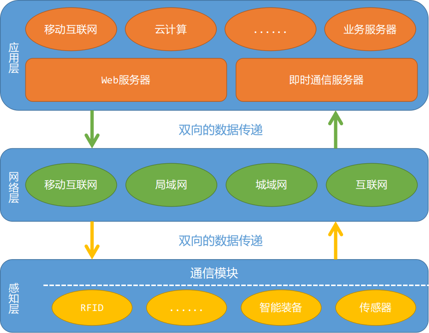

# 第一章：物联网背景下的PHP概况

毛主席在其《矛盾论：矛盾的特殊性》中说到针对问题不能“只见树木，不见森林”，头疼医头脚疼医脚。学习一项技术也是这样，需要充分了解这项技术所处的环境，以及应用场景，当前该技术最新的发展情况如何，有哪些已经是成熟的方法被广泛使用，以及这项技术的优缺点有哪些，只有这样全面的了解过后再深入的学习时就能够有的放矢、循序渐进的开展，并构建起自己完整的知识体系，从而为后续学习打下坚实的基础。不同于以往的小规模商业试用和科学研究，随着NB-IOT、LoRa等物联网技术在运营商和大型企业的推动下众多的物联网项目犹如雨后春笋般在国内落地开花，而PHP以其自身简单、易用、稳定，同时还具有成熟的生态环境等优势在物联网项目大量落地的今天也占得了一席之地。物联网项目不同于其他软件项目，它是大系统的集成，既包含了软件又包含了硬件，因此需要众多的技术相互配合才能完成。因此，本章首先想通过以构建一张完整的物联网技术架构，讲解PHP在其中是如何做到承上启下，然后以此为基础为各个功能子模块提供实现的解决思路，最后通过PHP局限性的说明给读者一个辩证的思路，从而在后续的项目开展中能够对技术的选择有清晰的认识。

#### 本章内容

> * 物联网系统的体系架构
> * 感知层的技术选择
> * 传输层的技术选择
> * 应用层的技术选择
> * PHP技术的局限性

## 1.1 物联网系统的体系架构

“物联网”这词语最初的时候是一个外来词汇，其完整的英文名叫“Internet Of Things”（简称：IOT），顾名思义就是很多物体连成的网络，所以叫做物联网。随着人工智能等技术在国家层面的大力扶持与推广，2018年下半年又出现了一个新的词汇——AIoT，即人工智能（AI）与物联网（IOT）相结合。虽然这几年各种新技术不断涌现，各个单独模块的具体实现上通过采用各种更为先进的技术进行不断改进，而物联网的基本体系架构依然没有发生根本性的改变，因此只要深入的了解物联网系统的体系架构和运作模式，读者就可以脱离纷繁复杂的技术局限，根据自身的技术特点和擅长把各类具体的实现手段进行自由组合，从而实现一个或简单或复杂的物联网系统。

要学习一个技术首先需要了解该技术最初时是用来解决什么问题，下面通过三个故事来讲述物联网的源起。

**1、故事一：** 1991年剑桥大学特洛伊计算机实验室的科学家们为了解决去楼下倒咖啡经常空手而归的问题，在楼下咖啡壶旁安装了一个摄像头，通过图像捕捉技术实时分析咖啡是否煮好，从而帮助实验室的科学家们可以随时监控咖啡的情况，而不用经常白跑一趟。到了1993年，这套咖啡监控系统被搬到的互联网，有近240万人点击浏览了这个监控网站，甚至有更多的人希望能亲眼目睹这个已经成为网红的“特洛伊咖啡壶”。虽然现在看来这是一个很小的项目，但可以说它包含了物联网体系架构中的大部分内容，而随后的不论市场开发还是基于应用都可以找到这个咖啡壶的影子。

**2、故事二：** 1995年微软的创始人比尔盖茨在他的新书《未来之路》中描述了物联网的基本雏形，即当时的互联网已经实现了计算机和计算机之间的联网，但是还没有实现万物互联的情况，但他相信随着技术的不断发展，未来一定可以实现。可以说比尔盖茨在他的这本预言书中所描绘的物联网情景正在被逐步实现。

**2、故事二：** 1998年英国工程师凯文·艾什顿发现宝洁公司的不少零售店的库存信息与销售状态不符，于是在宝洁公司的一次演讲中首次提出了“物联网”的概念。随后宝洁公司与MIT成立了自动识别研究中心，主要研究RFID技术以及智能包装系统。当时，艾什顿对物联网的定义相对也更具针对性，即把各类商品通过射频识别等技术与互联网相连接，从而实现智能识别与智能管理。而MIT的自动识别研究中心提出的物联网概念就相对宽泛，即在互联网的基础上，利用RFID、无线传感器网络、数据通信等技术，构造一个覆盖世界上万事万物的“物联网”，在这个网络中，物品之间能够彼此“交流”，而无需人为干预。

从上面三个故事不难看出，不论最初的特洛伊咖啡壶还是之后的MIT的自动识别研究中心，他们所构建的物联网都有一个相同的体系架构，即三层架构，分别是感知层、网络层和应用层，如图1-1所示，具体如下：

1、感知层：主要负责获取和控制各类传感器和智能设备的数据，如小到简单的温湿度传感器，大到复杂的智能设备，如机械臂等。这部分的实现主要通过各类智能硬件来完成，其本质就是在传统的嵌入式系统上再加上一个网络模块，从而实现网络通信，并且把以往保存在本地的设备运行过程数据，通过格式化的数据传递到远端服务器。

2、网络层：主要负责把感知层的数据上传给远端应用层，以及把应用层的计算结果下发至感知层。这部分可以根据具体需求的选择是采用广域网的方式（俗称“上云”）还是采用局域网的方式，所谓城域网其本质也是局域网的一种。局域网和和广域网除了本身设备的成本之外，在使用上广域网设备还需要向运营商支付一笔网络使用费，但网络的维护由各个运营商来完成，而局域网则不需要网络使用费，但是网络的持续维护需要项目建设方来完成。

3、应用层：可以说是这个物联网系统中的计算大脑，它把从感知层、用户操作等多方面收集到的数据进行计算、分类、统计、识别等一系列操作，并把一部分结果下发至感知层，从而实现这个物联网系统从底至上再到底的闭环。应用层所包含的技术最为复杂，也是延展性最大的部分，可以说所有和计算机相关的技术都能够应用到该部分中，小到一个设备管理系统，大到包括人工智能、移动互联网、机器人等应用。

如果再要把物联网进行形象的比如，那么就可以和人进行类比，感知层就相当于人体的各个运动部件和感觉器官，而网络层则是人体内的各个传导神经和中枢神经，网络层把从感觉器官获取的信息传递到后面的应用层，而应用层就是人体的大脑，用于对收集到的数据进行计算，并反馈到运动部件进行控制。

图1-1 物联网体系架构

## 1.2 感知层的技术选择

感知层的相关技术主要偏向于嵌入式系统与应用，要讲解这部分的技术可以从两个层面进行说明，分别是硬件层面和软件层面这两个方向进行，具体如下：

**1、硬件层面：** 根据不同的应用领域，硬件的选择大致可以分为两大类，分别是低频小数据量的信息采集与控制和高频大数据量的信息采集与控制。针对低频小数据量的信息采集与控制的这一类应用经常会采用ARM公司的Cortex-M系列相关内核的SOC芯片，其中最常用的内核为Cortex-M3和Cortex-M0。所谓SOC芯片就是片上系统，简单的理解就是在一个芯片内部集成的控制器、存储器、外围通信接口等众多内容，类似与一个完整的电脑主机，而ARM公司本身并不生产芯片，只设计相关的芯片内核，然后把这些设计的芯片内核授权给各个芯片生产商，各芯片厂商再根据所授权的IP进行例如存储器、外围通信的扩展与裁剪，最后生产出自己的芯片，所以在选择芯片时会发现即使是相同内核，如Cortex-M3，也会有众多的厂商生产应用于不同领域的各类芯片，类似于很多电脑主机，虽然都是相同的CPU，但有的内存大些，有的硬盘大些，形成中众多不同类型的电脑。目前，常见芯片厂商有意法半导体（STMicroelectronics）、恩智浦（NXP）、德州仪器（TI）等，这些公司的所生产的芯片都有各自的特点和应用领域，甚至在某些细分行业的设备研发和生产中由于一些芯片公司常年的深耕，慢慢形成了一定的行业规则，即只使其中一家或几家所生产的芯片。而针对高频大数据量的信息采集与控制就需要更具不同的应用场景，以及研发成本综合考虑是使用FPGA、GPU或Cortex-A相关芯片，然而往往为满足要求会采用多芯片的组合的解决方案来实现低成本、高性能，例如控制用Cortex-A或Cortex-M系列，而计算则使用FPGA或GPU等。此外，在研发硬件设备时还需要考虑后续的应用场景，以及是否需要出口到其他国家，因为很多场景的产品都有其国标，以及出口目标国的标准，产品必须符合这些标准才能够进行量产和售卖。

**2、软件层面：** 根据不同的需求，软件可以分为三大类，分别是无操作系统软件、实时操作系统（RTOS）软件和分时操作系统（OS）软件，其中无操作系统软件即裸机程序，这在Cortex-M系列芯片上使用的最为常见，它通过直接配置和读写寄存器就能很好的完成各项任务，包括传感器的读取，数据的收发等工作。而当任务要求具有较高响应或程序体量不断扩大时就需要考虑引入实时操作系统，该操作系统能够以足够快的速度处理各类请求，其处理的结果又能在规定的时间之内进行响应，同时还控制所有实时任务协调一致的运行。目前实时操作系统较为常用的有RTThread、FreeRTOS、UCOS-II/III等，其中RTThread是国人自主研发的嵌入式实时操作系统，并且经过近10年的发展，目前已经非常稳定，并且各类组件和文档都非常的丰富和完善，而FreeRTOS和UCOS-II/III则是在国际上使用非常多的操作系统，其中UCOS-II/III最早引入到国内，有专门的书籍讲解该操作系统的使用，但该操作系统只能用于学习和非盈利，如果商用就需要支付一定的费用，FreeRTOS则不同，不论商用还是学习都不收取任何的费用，但资料相对较少。有了操作系统还需要一个小屏幕进行人机交互，目前针对RTOS的UI库有三种，一种是由德国Segger开发的emWin，该库开发简单，但界面相对较老，属于Win95/98的风格，此外还有由Draupner Graphics开发的TochGFX，该UI库效果非常炫酷，但是开发难度较大，以及RTThread开发商自主研发的Persimmon（柿饼），该UI库开发简单，效果也相对现代。除了实时操作系统，另外一种就是分时操作系统，也是最常说的操作系统，嵌入式领域中针对民用的其实只有Linux一种选择，而军用和航空级的也还有一些其他选择，该操作系统通常都应用于Cortex-A系列的芯片上，用于处理如音视频或大数据量的网络通信等内容的处理。

## 1.3 传输层的技术选择

传输层的相关技术主要偏向用网络通信，要讲解这部分的技术可以从三个层面进行说明，分别是感知层的网络出口、网络通信、应用层的网络入口，具体如下：

**1、感知层的网络出口：** 目前感知层的网络通信按照研发方式的不同可以分为两种方式，第一种方式是购买现成的网络通信模块，通过主芯片的串行通信接口把要发送的数据发送给网络通信模块，由该模块进行数据的发送和接收，采用这种方式的优势是开发简单，周期也相对较短，当通信模块发生改变时几乎不需要修改任何程序就可以直接使用，但劣势也很明显，就是会增加设备的硬件成本。第二种方式是通过自行对协议栈软件进行研发和实现，常用的协议栈软件有Z-Stack、LwIP等，采用这种方式优点是硬件成本较低，并且可以进行深度定制，同时还可以可以充分利用网络芯片的其他硬件资源，同样劣势也很明显，即开发周期长，对研发人员有较高的要求，同时程序的稳定性也有待后续的验证。

**2、通信网络：** 目前通信网络的分类主要针对的是无线通信，而如果采用有线通信方式，那么通常需要使用RJ-45或者RS-485等方式连接至中心机房后再传递至云端。而无线通信则可以分为两大类，分别是广域网通信和局域网通信。其中如果采用广域网通信，那么理论上就有三种解决方案，即GSM、NB-IOT、eMTC，其中NB-IOT和eMTC都具有低功耗的特性，同时NB-IOT和eMTC可以直接在GSM网络进行建设，这也是运营商主推这些技术的原因，目前要使用该技术主要的方式是和各个本地运营商进行谈判，并购买相应的物联网卡，以及从运营商或者相关渠道购买通信模块，然后集成到自己的硬件中，然后通过AT指令就可以和服务器交互。目前各个运营商也都在实验多模通信方式，未来在一个基站上能够同时实现GSM、NB-IOT、eMTC通信，形象的比喻就是手机里的全网通。这里需要注意的是，很多基站为了保证数据通信的效率都会定期清除长时间没有数据交互的通道，因此采用GSM、NB-IOT或eMTC时需要定期发送心跳包，以保证数据链路的存在。而如果采用局域网方式那么就要根据通信范围的大小进行选择，例如通信范围为一个城市，那么可以采用LoRa通信技术来实现，通常来说低功耗一般很难覆盖远距离，而远距离一般都是功耗高，而LoRa最大特点就是在同样的功耗下传播距离是其他无线方式传的3-5倍。因为LoRa的传输距离是以公里为单位，因此通过少量的中继就可以覆盖很广的范围，而如果是通信范围是为一个区域，那么可以采用Zigbee或者蓝牙4.0+等方式来实现组网和数据通信，虽然采用这两个技术的模块单独一个只有几十米到几百米的通信距离，但是可以通过中继的方式实现无线的扩展。此外，对于局域网通信来说，不论是采用LoRa这样的远距离通信，还是Zigbee、蓝牙这样的短距离通信，要实现与服务器的交互都必须要通过一个网关来实现，这就要求开发人员对每个节点的分布和每个节点有单独的编号和统一的管理，以便在远端分辨出不同的设备。

**3、应用层的网络入口：** 数据一旦需要传递到远端服务器，那么就有两种方式可以选择，一种是HTTP通信，另外一种则是Socket通信。其中HTTP通信是一种短连接的通信方式，通信双方交互完数据后就会把数据链路断开，如果需要再次通信，那么就要与服务器重新链接，此外由于建立链接的过程需要经过多次握手通信，设备的功耗也相应提高，所以这种通信更适合不频繁的数据操作，例如用户交互等。要采用这种这种方式通常只需要架设Web服务器，如Apache或Nginx服务器，再配合本书后面讲的基于MVC架构的ThinkPHP软件库就可以实现。而Socket通信则是一种长连接的通信方式，通信双方的链路始终保持接通，方便了数据的实时传递，也免去了多次握手的情况，因此这种方式更适合对数据实时性要求较高或者要求低功耗的通信，其软件可以采用基于PHP的高性能异步通信解决方案，如Workerman和Swoole，其中Workerman的特点就是开发容易、能满足一般的开发需求，部署也相对简单，由于采用纯PHP进行开发，因此效率上略逊于Swoole，而Swoole采用纯C语言进行扩展，因此内存管理、通信协议、效率上略高于Workerman，但是开发相对复杂，周期也相应的有所增加。在实际的物联网项目开发中，HTTP和Socket都会同时用到，因此不论是HTTP服务器还是Socket的服务器都需要进部署才能满足各种网络通信。

## 1.4 应用层的技术选择

应用层的技术选择最为复杂，根据不同的需求可以说是千变万化，但总体上来说由三部分组成，分别是业务服务器、数据服务器，以及前端展示。其中业务服务器主要完成从Web服务器和Socket服务器传递来的数据进行计算和分析，以本书讲解的内容为基础，简单的构建就是把Socket服务器和ThinkPHP进行整合，并在其中完成相应的业务计算，以及数据反馈，而复杂构架则可以引入更多的分层服务器，从而实现更加复杂的内容。而对于数据库服务器来说，通常采用MySQL作为基础，如果项目的体量很大，以及要求响应速度较高，那么就可以再配合Hadoop等分布式的数据库，以及Redis这类内存数据库来提高相应速度。最后的前端展示，则是可以采用移动端与Web端来完成，其中移动端除了采用原生方式进行开发外，还可以采用目前最为流行的H5方式进行实现，其技术方案可以从Angular+Ionic、React Native、Weex中进行选择，而Web端的逻辑可以采用JQuery、Angular或Vue等方式来实现，而UI则有众多的选择，这里推荐Bootstrap、Amaze UI、NG-ZORRO或Element，这些都是较为现代的UI框架。

## 1.5 PHP技术的局限性

再好的东西只要寻找都能找出问题，就像PHP一样，经过20多年的发展与完善，使得它具有开发快速、配置简单、性能稳定、容易部署、生态完善等一系列优点，虽然不论何时都不断有人指出它的各种缺点，但依然阻止不了它成为Web领域中使用最为广泛的语言之一。但为了在进行技术选型时能否充分的辩证思维，也需要了解该技术的局限性，使得在项目实施时可以对对可能出现的问题和瓶颈也有一个合理的预判。PHP的诞生之初就已经决定这一门语言的局限应，即它所面向的技术领域就是Web应用，并且追求的是入门简单、快速开发，这些定位就决定的PHP具有如下三点问题：

1、页面级的资源回收：PHP属于脚本语言，采用的是解释运行机制。这种运行机制使得当PHP页面被解释并执行完成后所有的相关资源都会被回收。也就是说，PHP语言本身就不支持对象驻留等操作，因此不论变量是全局变量，还是静态成员，又或者是局部变量都会在页面执行完毕后被清空。

2、单线程、非异步的运行模式：由于历史和最初设计的原因使得该模式始终存在，因此PHP从根本上就无法应对成千上万大规模的并发请求。

3、共享的全局配置文件：这样的方式使得PHP在部署时无法进行个性化的配置和使用。

其实PHP还有很多其他问题，如函数命名不规范、安全机制相对欠缺等问题，但总体来说PHP作为一个快速验证市场或小规模应用的项目来说非常合适，同时完善的生态系统也为PHP提供许多经得起实验考验的框架，这些能否帮助开发人员快速的进行开发，减少开发中的问题，而对于大型项目来说PHP作为非核心的前端承载也非常合适。

## 1.6 小结

通过本章的学习，了解了PHP在物联网背景的应用场景和使用方式，并且深入了解了物联网中感知层、网络层以及应用层常用的技术。在本章中首先详细讲解了物联网的体系架构，以及该架构中各模块之间通信方式，其次详细了解感知层中硬件部分的基本选型方式和软件的开发模式，然后有了解了在传输层中常用的几种通信方式的特点，以及如何利用PHP实现这些数据的接收，接下来又讲解了应用层中使用的一般技术和几种常用的软件框架，最后讲了PHP技术的局限性来帮助读者能否辩证的看待问题。通过这些知识的学习读者基本可以对物联网中的各个模块的运行方式有了一个清晰的认识，由于物联网本身就是多种技术的组合，因此本章内容也只能起到引路的作用，就像提到的各种问题和各种框架，其实都可以通过其他方式进行弥补，以及替代，但所涉及的内容又会超出本章，甚至本书的内容，因此本章只能做到临渊羡鱼,不如退而结网。