# 第二章 Web服务器开发环境的搭建

古人有云：“不积跬步无以至千里，不积小流无以成江海”。软件开发也是这样，要运行一个复杂系统就必须要从一砖一瓦开始搭建起来。默认情况下计算机是无法识别PHP程序，因此想让计算机能够运行PHP程序，就需要在计算机上搭建一个PHP程序的运行环境，这个运行环境包括三个部分，分别为Web服务器、PHP解析器、数据库服务器，这三个部分有机的结合支撑了这个世界上所有的Web应用，包括网站、短链接的APP等，当然随着应用不断的复杂，这里面内容也会跟着发生巨大的变化，但概括来说整个系统运行分为以下六步，如图2-1所示，

第一步：用户通过HTTP向Web服务器发送请求，这个请求可以理解为在浏览器中输入一条网址。

第二步：Web服务器接收到请求后，就会去读取请求路径下的代码文件。

第三步：如果Web服务器发现代码为HTML这样的静态文件，那么就会直接解析，并且还给用户，如果发现代码文件不是静态文件，那么就会把该文件交给PHP解析器进行解析，同时等待PHP解析器把解析好的静态数据，并返回给Web服务器。

第四步：PHP解析器收到Web服务器提交的任务就会开始解析PHP文件，并把结果以静态数据的形式返回给Web服务器。

第五步：PHP解析器在解析的过程中很多时候会对数据库进行读写操作，从而使页面数据动态化，也就是为什么不同用户登陆到某个论坛显示的用户信息都是不同的。

第六步：当所有代码和数据都解析完成后PHP解析器会把这些数据变为静态数据返回给Web服务器，Web服务器在把数据返回给用户，从而看到的就是动态页面。

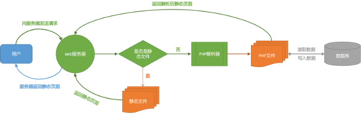

图2-1 Web服务器运行流程

目前世界上90%以上的Web服务器都是采用基于Linux操作系统，因此本书也是基于Linux的一个非常流程的发行版Ubuntu进行讲解，从而帮助读者可以快速的把书本内容应用于实际中。在Ubuntu系统中搭建完整的PHP开发环境的工具称之为LAMP，这里所说的LAMP不是一个工具，而是取四个工具名称的首字母的统称，这四个工具分别为Linux操作系统、Apache服务器、MySQL服务器、PHP，除了Linux操作系统，本章讲讲解在Ubuntu下如何安装另外三个工具。

#### 本章内容

> * Ubuntu下的Apache服务器的安装和使用
> * Ubuntu下的MySQL服务器，及管理工具的安装和使用
> * Ubuntu下的PHP的安装和使用

## 2.1 Apache服务器的安装和使用

目前被广泛使用的Web服务器有三种，分别是Apache、IIS、Nginx，虽然Apache已经有超过20年的历史，几乎可以说是伴随着Web发展一路走来，虽然在计算机领域里面20年可以算是老爷爷了，但是折不妨碍Apache成为Web服务器领域的领头羊，即使在今天有IIS和Nginx冲击的情况，依然不妨碍它成为全世界使用最为广泛的Web服务器，市场占有率超过50%。在国内如淘宝、优酷、新浪等知名网站都采用Apache或基于Apache的优化版作为其Web服务器，Apache的图标如图2-2所示。


图2-2 Apache的图标

### 2.1.1 Ubuntu下Apache服务器的安装

在Ubuntu下安装Apache服务器是非常简单的，因此在Ubuntu的软件源中已经包含了Apache服务器，所以只需要在终端里输入一条指令，并根据提示操作就可以完成Apache服务器的安装，当安装完服务器再在终端中执行`apache2 -v`，如果能返回Apache版本就说明安装成功，如图2-3所示，具体指令如下。

```bash
sudo apt-get install apache2
apache2 -v
```

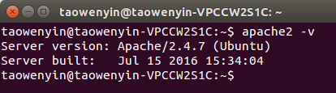

图2-3 Apache安装验证

当安装完Apache服务器时，读者可能会发现在终端里显示一个错误，如图2-4所示。这个错误的意思是没有给服务器指定域名，因此只需要在配置文件中为Apache服务器设置域名就可以，具体步骤如下。

第一步：在终端中执行下面的指令，将当前目录切换到`/etc/apache2`目录下。

```bash
cd /etc/apache2/
```

第二步：在终端中执行下面的指令，打开`apache2.conf`文件，并在最后添加`ServerName localhost:80`，如图2-5所示。

```bash
sudo gedit apache2.conf
```

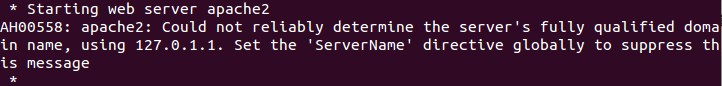

图2-4 安装Apache的错误

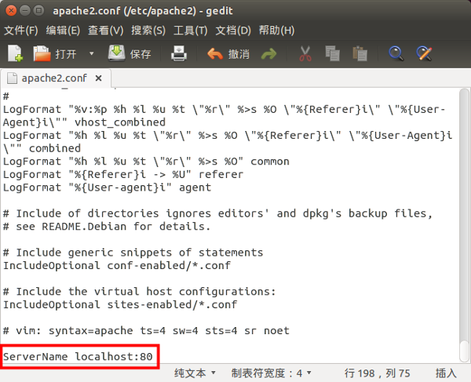

图2-5 为Apache设置ServerName

第三步：在终端中执行下面的指令来重启服务器，此时就不会看到错误产生。

```bash
sudo service apache2 restart
```

第四步：打开浏览器，在地址栏中输入`localhost`，如果看到Apache的主页，就表示安装完成，如图2-6所示。

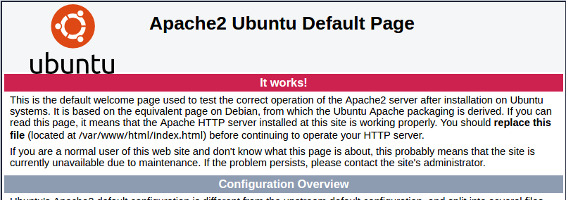

图2-6 验证Apache设置成功

### 2.1.2 Ubuntu下Apache服务器的设置

Apache服务器的主目录是经常要修改的内容，因此本节将讲述如何通过修改配置文件来实现Apache主目录位置的修改。Apache主目录位置的修改主要是修改`/etc/apache2`目录下面的`apache2.conf`文件和`sites-available/000-default.conf`文件。其中`apache2.conf`主要是修改主目录的位置，而`sites-available/000-default.conf`则是修改域名重定向时所进入的子目录，例如当前设置Apache主目录位置为`/var/www/`,而`000-default.conf`则设置`localhost`域名指向`/var/www/html`,那么当在浏览器中输入`localhost`时实际上读取的是`/var/www/html`下的文件，所以`000-default.conf`指定的目录一定是`apache2.conf`中主目录下的子目录。具体如下：

第一步：在终端中执行下面的命令打开，打开`/etc/apache2/apache2.conf`文件，并把164行中的`/var/www/`改成主目录的位置，然后保存并关闭。

```bash
sudo gedit /etc/apache2/apache2.conf
```

第二步：在终端中执行下面的命令打开，打开`/etc/apache2/sites-available/000-default.conf`文件，并把12行中的`/var/www/html`改成主目录下的子目录，当然也可以和主目录写的一样，那么此时就直接读取主目录下的文件，然后保存并关闭。

```bash
sudo gedit /etc/apache2/sites-available/000-default.conf
```

第三步：在终端中执行下面的命令重启Apache服务器，然后在浏览器中输入`localhost`就可以看到当前的目录已经切换到所指定的目录下。

```bash
sudo service apache2 restart
```

## 2.2 MySQL服务器的安装和使用

目前单机版的应用越来越少，即使是笔记本这类应用都已经从原来系统自带的笔记本变成如印象笔记、有道云笔记等类似的云笔记,而在游戏领域，原先的PlayStation和XBox上基本都是单机版的游戏，而最新的PS4和Xbox One上的游戏也由单机版向网络版发展的趋势，这些基于网络的应用都是通过有线或者无线的方式把数据存储在远端的服务器上，可以让用户随时随地的对数据进行增、删、改、查的操作，而保存这些数据的服务器就是数据库服务器，当然数据库的种类现在也非常多，有基于Key-Value数据类型的Redis数据库，有基于分布式文件存储的数据库MongoDB等，而本节讲述的是目前被广泛使用的关系型数据库MySQL，该数据库和Apache服务器一样，是开源、免费的软件，但他同样有着悠久的历史，并被一次次在大型系统中证明其高度的稳定和快速的性能，至于阿里巴巴在2016年8月9日云栖大会北京峰会上发布了基于MySQL开发了一个全新的分之AliSQL，用于进一步提升数据服务器的运营能力，MySQL的图标如图2-7所示。


图2-7 MySQL的图标

### 2.2.1 Ubuntu下MySQL服务器的安装

在Ubuntu下安装可以采用和Apache相同的方法，因为系统默认的软件源已经添加了MySQL的软件源，但该软件源中的MySQL并不是最新版的，因此本节采用从MySQL官网下载最新的软件源更新包，来更新系统自带的软件源，然后在通过命令行的方式进行安装。

进入MySQL软件源下载页面（http://dev.mysql.com/downloads/repo/apt/），在页面的最下方就是软件源的更新文件，如图2-8所示。要下载该软件源更新包需要先在MySQL官网进行注册账号，注册完成后就可以下载。

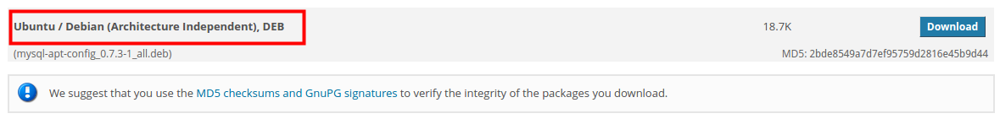

图2-8 MySQL源更新文件

下载下来后的文件是以`.deb`结尾的文件，该后缀名结尾的文件是Ubuntu下标准的安装包，类似于Windows下的`.msi`,因此只需要执行双击该文件就可以进行安装，安装的过程非常简单，只需要根据提示完成就可以，在安装过程中会弹出一个对话框用于设置MySQL的Repository，如图2-9所示，只需要在下拉列表中选择`OK`，然后根据提示点击`前进`就可以完成。当配置完成完后只需要在终端中执行更新软件源的指令，然后执行安装MySQL Server的指令就可以完成整个最新版MySQL数据库的安装，在MySQL数据库的安装过程中会要求输入MySQL的登陆密码，而用户名是默认的，为`root`，如图2-10所示，具体安装指令如下。

```bash
sudo apt-get update
sudo apt-get install mysql-server
```

安装完成后通过下面的三条终端指令可以检查MySQL Server的状态，同时还可以停止MySQL Server和启动MySQL Server，具体指令如下。

```bash
# 检查MySQL Server的状态
sudo service mysql status

# 停止MySQL Server
sudo service mysql stop

# 启动MySQL Server
sudo service mysql start
```

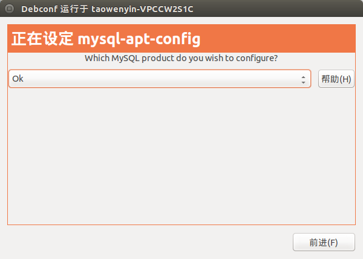

图2-9 MySQL源更新配置

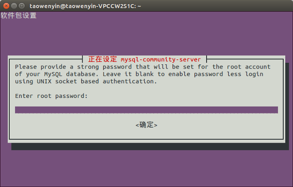

图2-10 MySQL登陆密码设置

### 2.2.2 MySQL管理工具MySQL Workbench的安装和使用

MySQL安装完成后，就可以在其中创建数据库、数据表，以及数据，当目前所有的操作都是基于命令行的方式，虽然这种方式很重要，熟练运用SQL语言是每个程序开发人员必备的素质，但是在实际的运营中，采用命令行的方式其效率就相对较低，因此需要一种GUI的方式来管理数据库，常用数据库管理软件有Navicat for MySQL和phpMyAdmin，其中Navicat for MySQL的性能和跨平台性确实能够很好的提高运营的效率，但是由于是收费软件，因此本文也不推荐，另外一款是phpMyAdmin是一款基于Web的MySQL管理工具，同时也是免费的，有兴趣的读者也可以尝试，而本文推荐的则是MySQL自己开发一款管理工具——MySQL Workbench，这款工具兼具了免费、高性能特点，可以和MySQL无缝对接。

MySQL Workbench的安装一定是在前面已经更新了软件源的基础上进行安装，虽然默认软件源中的包含了该软件，但是版本相对较老。MySQL Workbench的安装和MySQL Server的安装没有什么区别，也只需要在终端中输入下面的指令就可以完成。

```bash
sudo apt-get install mysql-workbench-community
```

安装完成，在软件列表就可以找MySQL Workbench的图标，如图2-11所示。点击该图标就可以打开该软件。首先进入MySQL Workbench的登陆界面，如图2-12所示。图中的标记1是系统自动创建的连接本地MySQL Server的快捷方式，但用户点击时就会弹出标记2的对话框，用于输入登陆的密码，当密码正确时就会进入MySQL的管理界面，此外标记3用于创建数据库的E-R图，同时还能通过E-R生成对应的SQL文件。当用户通过MySQL Workbench登陆数据库成功后，就可以看到图2-13的所示的主界面，在该界面中标记1是标签栏，用于切换不同的MySQL Server，标记2则是工具栏，可以用来打开数据库的SQL文件、创建数据库等功能，标记3用来查看该MySQL Server中包含哪些数据库、数据表，而标记4则是用于执行SQL语句，最后的标记5则显示查询结果的集合。


图2-11 MySQL Workbench的图标

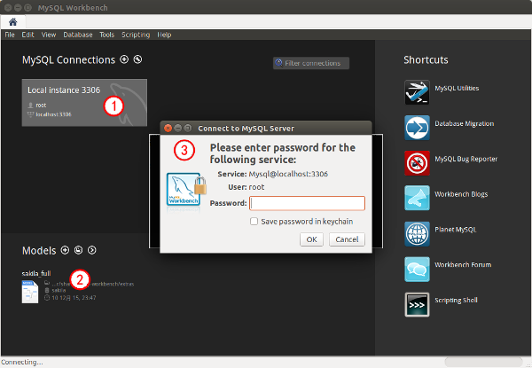

图2-12 MySQL Workbench的登陆界面

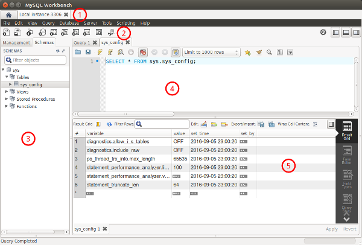

图2-13 MySQL Workbench的主界面

## 2.3 PHP运行库的安装和扩展

在讲如何安装PHP运行库之前先给各位读者讲讲为什么本书会选择以PHP为主要的编程语言，其实要实现动态网站，能用的解决方案还是非常多的，比如Python、Node.js、Ruby、Java、C#等都是非常好的选择，有的甚至在某些性能方便还超过了PHP，但是自从PHP在1994年被发明以来，经过了BBC、Facebook、百度、淘宝等大型网站的应用都充分证明的PHP的可靠性和稳定性，此外虽说PHP已经有20多年的历史，但是老而弥坚，2016年1月最新发布7.0版本性能是原先的一倍多，可见PHP团队的坚持和坚守，此外在20多年的历史中全世界又有数百万开发人员在利用PHP进行系统的开发，也因此产生了无数的第三方的标准库，供后来的开发人员使用，俗话说“大树底下好乘凉”，这句话用在PHP上面最为贴切，因为目前PHP所能解决的问题已经可以覆盖了大部分Web应用的需求，此外PHP的语法相对比较简单，且完全支持面向对象，经过这么多年其学习资料也相对丰富，使用的场景也非常广泛，因此除了可以应用于实际的项目开发中外，也是非常好的学习对象。

此外PHP其自身的特别也促使了PHP能否在20多年的发展中被世界所接受。首先，PHP对于数据库的支持非常好，能够被应用于几乎全部的数据库，所以可以很方便进行系统的部署。其次，PHP自身也是开源的软件,可以免费的获取并应用于商业应用，而不需要额外在付费,减低了开发的成本。最后，PHP是运行在Web Server上的脚本语言，只要服务器上安装的PHP脚本解析器就可以在任何平台上进行使用，如Linux、Windows等都可以运行，当然从目前的应用来说还是Linux上更多写。所以基于上面这些原因本书选择以PHP为主要开发语言，PHP的图标如图2-14所示。


图2-14 PHP的图标

### 2.3.1 Ubuntu下的PHP运行库的安装

PHP在作者执笔时，最新的版本是5.6，此时有读者会到官网上发现有7.X的版本，此版本和5.X是完全不同的版本，相互并不兼容，但是目前从使用情况来说还是5.X使用的更为广泛，因此采用5.6的版本，而如果使用系统默认的软件源安装的话，PHP的版本只有5.5，但是本书力求最新，因此使用和MySQL类似的策略，通过添加第三方软件源的方法来安装最新的PHP，要安装最新的PHP软件源只需要在终端中执行下面两条指令就可以完成软件源的添加和更新。

```bash
sudo add-apt-repository ppa:ondrej/php
sudo apt-get update
```

当PHP的软件更新完成后，需要在终端里输入一条指令，并根据提示操作就可以完成PHP运行环境的安装，同时还会为Apache Server添加PHP模块，因为默认情况Apache Server是不包含PHP模块，也就无法把`.php`文件交给PHP解析器进行解析，当安装完服务器再在终端中执行`php -v`，如果能返回PHP版本，如果版本号为5.6.X就说明安装成功，如图2-15所示，具体指令如下。

```bash
sudo apt-get install php5.6
php -v
```

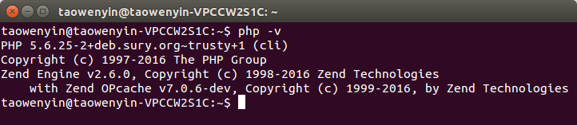

图2-14 PHP安装验证

### 2.3.2 常用的PHP运行库扩展程序

PHP的运行库扩展的目的是为了让PHP具有更加丰富的功能，在默认情况下安装的PHP只包含PHP的内核，即让服务器能够读取和解析PHP文件，但是此时的PHP连数据库都无法链接和读取，因为此时的PHP还不包括数据库的功能，因此需要为其添加扩展，而PHP功能的扩展采用插件式的方式，通过基于PHP内核的开发来完成，所以要让PHP能较为完整的服务于应用开发，那么就需要通过安装PHP扩展来完成。常见的扩展包括以下五种：

1. MySQL数据库扩展的安装。该扩展的作用顾名思义就是帮助PHP能够对MySQL数据库进行增、删、改、查的操作，具体指令如下：

```bash
sudo apt-get install php5.6-mysql
```

2. 字符串多编码扩展的安装。默认情况下PHP内部所支持的文本编码方式只有ISO-8859-*、EUC-JP、UTF-8，而采用其他编码方式的文本都没办法在PHP程序上正确显示，因此通过安装此编码让PHP更多的文本编码方式，如简体中文、繁体中文等，具体指令如下：

```bash
sudo apt-get install php5.6-mbstring
```

3. 加密和解密扩展的安装。在编写代码程序时，除了要保证代码的高性能之外，还有一点是非常重要的，那就是程序的安全性。除了PHP自带的几种加密函数外，还可以通过安装PHP加密扩展库Mcrypt来获取额外20多种的加密和解密的算法，具体指令如下：

```bash
sudo apt-get install php5.6-mcrypt
```

4. 图形扩展的安装。在使用论坛时很多时候需要输入验证码，单这个验证码是随机的，并不是实现安排好的图片，并且每张验证码的图片均不相同，即使内容相同，但背景或字母摆放的位置也不尽相同，此时就需要使用图形库来进行随机的绘制和显示，具体指令如下：

```bash
sudo apt-get install php5.6-gd
```

5. HTTP通信扩展的安装。在用PHP开发系统时，特别是微信系统，很多时候都需要使用HTTP和微信接口进行通信，但是默认情况下PHP是不支持HTTP通信，因此需要安装CURL扩展来帮助PHP实现HTTP通信，具体指令如下：

```bash
sudo apt-get install php5.6-curl
```

## 2.4 小结

通过本章的学习，了解了动态网站通信的基本过程，了解了常用LAMP系统的几个组成部分，同时还掌握了在Ubuntu系统下Apache服务器的安装和简单配置，及使用方法，此外掌握了如何在Ubuntu系统下安装MySQL数据库服务器，以及图形化数据库管理器MySQL Workbench的基本使用，最后还掌握了Ubuntu系统下PHP运行库的安装，以及常用扩展组件的作用及安装方法。在学完本章内容后，读者可以自行安装完整的LAMP系统，以供后续内容的使用。