# 第三章 几种常用的Web开发工具

古人有云：“工欲善其事，必先利其器”。只有装备了高等级的武器，那么上阵杀敌才能又快又准。学习PHP编程也是这样，虽然使用系统自带的记事本也可以进行编程，但是效率非常低，而且容易出错。所以本章将介绍几款常用PHP程序编辑和调试软件，熟练掌握这些软件的使用可以大幅提高编写程序的效率。

#### 本章内容

> * XDebug 开源的PHP调试工具的使用
> * Vistual Code 开源的跨平台程序编辑器的使用
> * Eclipse for PHP Developers 全能的程序编辑器的使用
> * Chrome DevTools 实用的HTML、CSS、JavaScript调试工具的使用

## 3.1 XDebug开源的PHP调试工具

在生活中如果做错了事可能经常是没办法挽回的，就像泼出去的水一样，但是在程序的世界就不一样了，我们可以通过调试工具来反复的验证我们的程序，直到它没有问题为止，而PHP的调试工具就是本节要讲述的XDebug。XDebug是一个开放源代码的PHP程序调试工具，可以用来跟踪，调试和分析PHP程序。要安装XDebug如果采用从源码编译的方式相对较为复杂，而且对于PHP开发人员来说也没有必要了解XDebug的编译方式和源码内容，因此本节采用通过命令行的方式来安装XDebug，XDebug的图标如图3-1所示。


图3-1 XDebug的图标

### 3.1.1 Linux下XDebug的安装

XDebug的安装不同于其他应用软件的安装可以通过APT进行，因为XDebug并不是一个应用程序，而只是PHP的扩展程序，因此就需要使用安装PHP扩库社区库的方式来进行安装。PHP扩库社区库的英文全程叫`The PHP Extension Community Library`（简称PECL），通过PECL可以很方便的安装XDebug。要安装PECL其实非常的简单，由于系统的软件源中已经包含了PECL，因此只需要执行`APT`执行就可以完成，当安装完成后在执行`PECL`执行安装XDebug就可以完成整个XDebug的安装，具体指令如下。

```bash
sudo apt-get install php-pear
sudo pecl install xdebug
```

但是在通过`PECL`安装XDebug时可能会出现错误，如图3-2所示。该错误的意思是因为缺少`phpize`这个程序，而`phpize`默认是不会在安装PHP的时候被安装的，因此需要单独安装该程序，`phpize`被包含在PHP开发版里面，所以需要通过下面指令安装PHP开发版即可同步安装`phpize`，然后再重新通过pecl重新安装XDebug就可以正常完成整个XDebug的安装，具体指令如下。

```bash
sudo apt-get install php5.6-dev
```

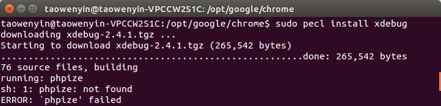

图3-2 XDebug的安装错误

### 3.1.2 Linux下XDebug的配置

当XDebug安装完成后，PECL会自动把XDebug的扩展文件`xdebug.so`放在`/usr/lib/php/20131226`目录下，但是此时PHP还无法使用XDebug，需要把扩展文件的路径配置到`php.ini`文件中，这里需要注意的是`php.ini`所在的目录是`etc`下，默认情况下普通用户是无法进行修改的，因此需要在用编辑工具修改`php.ini`文件的同时使用管理员权限打开该文件，具体执行如下：

```bash
cd /etc/php/5.6/apache2
sudo gedit php.ini
```

打开`php.ini`配置文件后，在文件的最下面添加如下XDebug的配置信息。

```ini
[Xdebug]
zend_extension="/usr/lib/php/20131226/xdebug.so"
```

此外还要在该配置信息中再添加七个常用的配置信息，通过这些配置信息的添加可以增强XDebug调试PHP的性能，具体如下：

1. 允许XDebug跟踪函数调用，具体配置信息如下：

```ini
xdebug.auto_trace=1
```

2. 允许XDebug跟踪函数参数，具体配置信息如下：

```ini
xdebug.collect_params=1
```

3. 允许XDebug跟踪函数返回值，具体配置信息如下：

```ini
xdebug.collect_return=1
```

4. 允许XDebug跟踪函数调用的信息输出文件目录，具体配置信息如下：

```ini
xdebug.trace_output_dir="自己指定输出目录"
```

5. 打开XDebug的性能分析器，具体配置信息如下：

```ini
xdebug.profiler_enable=1
```

6. XDebug的性能分析器的分析文件的存放位置

```ini
xdebug.profiler_output_dir="自己指定输出目录" 
```

## 3.2 Vistual Code开源的跨平台程序编辑器

2016年3月中旬Vistual Code（以下简称VSCode）发布了正式版本1.0，笔者用过很多的代码编辑软件，例如VIM、Emacs、Sublime Text、Atom等，但使用一圈下来从实用性、方便性、性能等方面来说笔者还是更加喜欢VSCode。VSCode是微软发布第一款能够运行在Windows、Linux、MAC上面的跨平台的程序编辑器，在过去微软的另一款集成开发环境（以下简称IDE）Vistual Studio只能运行在Windows，而无法在其他操作系统中运行，而现在微软把代码编辑功能从Vistual Studio中剥离，进而开发了VSCode，VSCode支持几乎所有的语言，并且可以通过的使用可以很方便的实现代码提示，VSCode的图标如图3-1所示。

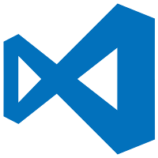

图3-1 VSCode的图标

### 3.2.1 Linux下Vistual Code的安装

进入VSCode的官网（https://code.visualstudio.com/），其会自动的识别当前系统的类型，例如笔者所使用的是Ubuntu，那么网站就会提供2中安装包，一个是基于Fedora的RPM包，还有一种是基于Ubuntu的DEB包，因此这里只需要把DEB包下载下来，并且执行下面的命令或者直接双击就就可以进行安装，如果使用命令行安装那么需要把package.deb换成下载后的文件名，如图3-2所示。当安装完成后就可以在系统的程序目录下找到Vistual Code。

```bash
sudo dpkg -i package.deb
```

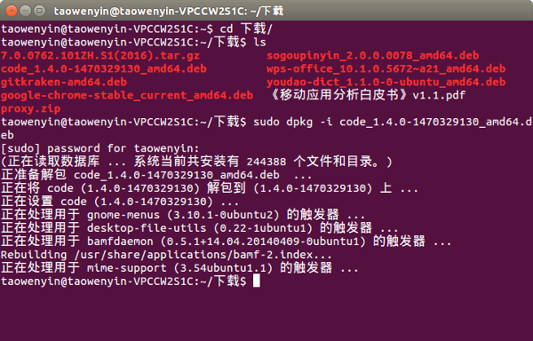

图3-2 执行命令行安装VSCode

### 3.2.2 Vistual Code中PHP相关插件的安装

VSCode之所以能在极短的时间内在GitHub上获得17000多Star，同时也得到了全世界程序员的认可，其中一个很重要的原因就是VSCode可以通过插件扩展的方式来支持任何的语言，并且每天有无数的程序员在为其添加新的功能，大到微软自己有独立的团队编写插件，小到有人专门为VSCode编写文件图标的插件，甚至国内的游戏制作团队Cocos也在为其编写开发插件，以适应Coscos2D-JS的开发。

目前原生的不安装任何插件的VSCode已经为开发人员提供了如代码高亮、括号匹配、代码智能提示，以及代码片段等功能，已经可以满足基本的开发需求，此外还可以通过插件扩展更多的功能。在这里本书推荐2个插件，如图3-3所示。一个是PHP Debug，可以让VSCode实现PHP代码的调试，另外一个是Crane-PHP Intellisense，可以让VSCode实现整个项目的代码智能感知，从提供更强大的代码提示。

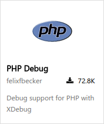 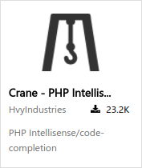

图3-3 2个PHP开发常用的插件

#### 1、PHP Debug插件的安装与使用

在Vistual Code中安装PHP Debug插件是非常简单的一件事，只需要通过以下八个步骤就可以完成。

第一步：保证你的电脑处于联网状态，这个非常重要，因为插件的安装其实是从网络上下载，再有VSCode自动安装完成。

第二步：在VSCode的配置文件中添加PHP的可执行路径，因为只有这样PHP Debug才能把PHP和XDebug进行链接，代码如下：

```json
// 指向可执行的 php。
"php.validate.executablePath": "/usr/bin/php"
```

第三步：安装XDebug，这个在本章的最后一节会进行详细的介绍，是真正用于PHP调试的工具，而我们的PHP Debug插件只是在VSCode和XDebug之间以建立一个沟通的桥梁。

第四步：在PHP的配置文件php.ini中添加XDebug的配置项，代码如下。其中`zend_extension`后面的地址需要读者根据自己的安装目录进行修改。

```ini
zend_extension=path/to/xdebug
```

第五步：在PHP的配置文件php.ini中打开PHP远程调试，配置代码如下所示。

```ini
[XDebug]
xdebug.remote_enable = 1
xdebug.remote_autostart = 1
```

第六步：重启你的Web服务器，如果你和笔者一样使用的是Linux操作系统，可以在终端中使用下面的代码进行服务器的重启。

```bash
service httpd restart
```

第七步：通过phpinfo()打印来验证你的配置是否正确，如果在打印结果的最下方出现如图3-4所示，那么就表示配置成功。

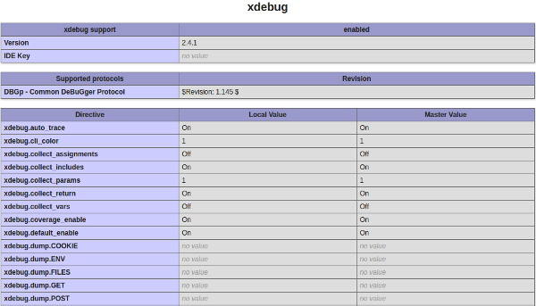

图3-4 XDebug的配置信息

第八步：这一步非常重要，用于安装VSCode插件，不过也非常的简单，只要按下键盘上的F1建，并在顶部的输入框中输入如下代码，等待几分钟，就可以完成了整个PHP Debug插件的安装，接下来就可以通过左侧导航栏中的“调试”界面进行代码的调试。

```bash
ext install php-debug
```

#### 2、Crane-PHP Intellisense插件的安装与使用

和安装安装PHP Debug插件一样，Crane-PHP Intellisense插件的安装也是非常简单的一件事，只需要通过一下七个步骤就可以完成。

第一步：在键盘上按下F1建，并在顶部的输入框中输入如下代码，等待几分钟，就可以完成了整个Crane-PHP Intellisense插件的安装。

```bash
ext install crane
```

第二步：使用VSCode打开一个PHP的项目。

第三步：检查右下角的状态栏是否有Crane状态，此时可以看到Crane检索的所有PHP文件，此时当调用类中方法时就会自动弹出方法名称，如图3-5所示。

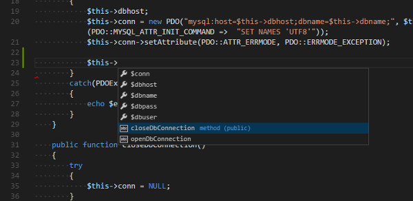

图3-5 Crane的使用

## 3.3 Eclipse for PHP Developers全能的程序编辑器

Eclipse和VSCode类似，也是一个基于插件的模式，且开放源代码程序编辑器，但由于其包含了软件开发所有需要几乎所有的功能，因此通常它为集成开发环境（简称：IDE）。Eclipse最初是在1999年由IBM发起，并和多家公司共同完成的用于开发另外一种编程语言——Java的工具，在当时市面上没有比较好的Java开发工具，相对来说只有Borland公司的JBuilder比较好用，但由于价格昂贵，不是一般程序员能够使用的，因此IBM在2001年的时候把Eclipse彻底开源，同时把该项目捐给了Eclipse基金会，用现在流行的语言说，Eclipse就是当时的爆款，而且是全球的爆款，其免费、开源、IBM做背书、由Java代码编写、平台的一致性等特点彻底俘获了所有程序员的心，目前Eclipse最新版为Eclipse Neon，其图标如图3-6所示。


图3-6 Eclipse的图标

随着Eclips的发展，已由原先开发Java发展到现在几乎可以开发任何的语言，如果说Vistual Studio是Windows平台下最好的集成开发环境，那么Eclipse就是在跨平台领域下最好的集成开发环境。不过和Vistual Studio一样，由于其功能非常的丰富，因此体积也越发的臃肿，其中许多的功能对于一个初学者来说还暂时用不到。在IBM开发Eclips时把Eclipse定义为一个程序框架，通过基于该框架的开发可以把Eclipse扩展到任意的编程语言，有的公司甚至基于Eclipse开发自己的IDE，如PHP中著名的公司Zend，该公司就是基于Eclipse开发了自己的集成开发环境Zend Studio，而我们这里所说的Eclipse for PHP Developers也是基于Eclipse开发的PHP插件，使得Eclipse可以支持PHP的开发，与Zend Studio不同的是Eclipse for PHP Developers是免费的，而且功能也能满足一般开发的需求。

### 3.3.1 Linux下Oracle Java的安装

由于Eclipse的使用需要依赖于Java，但Linux系统默认没有安装Java环境，因此在安装Eclipse for PHP Developers之前首先要把Java环境安装好。因为笔者使用的是目前非常流行的Linux发行版——Ubuntu系统，所以可以通过以下五个步骤就可以完成。

第一步：保证你的电脑处于联网状态，这个非常重要，因为软件的安装其实是从网络上下载，再由系统的软件管理器进行自动安装完成。

第二步：添加Oracle Java软件源。因为Ubuntu默认不包含Oracle Java的软件源，所以需要执行下面的命令来添加对应的软件源，结果如图3-7所示。

```bash
sudo add-apt-repository ppa:webupd8team/java
sudo apt-get update
```

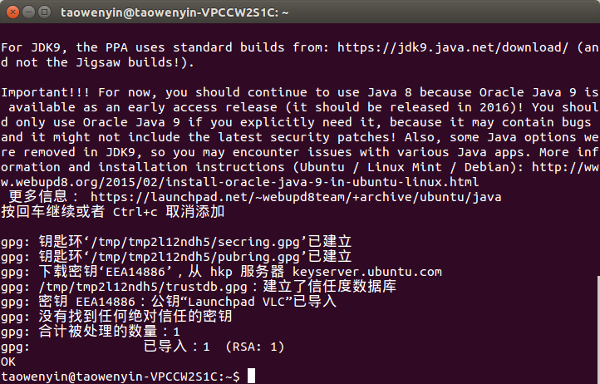

图3-7 Oracle Java软件源的添加

第三步：安装Oracle Java。添加完软件源后，安装Java是非常简单的一件事，只需要执行下面的命令就可以完成Oracle Java的下载与安装。

```bash
sudo apt-get install oracle-java8-installer
```

第四步：执行下面的命令把Java8设为默认Java环境

```bash
sudo apt-get install oracle-java8-set-default
```

第五步：在终端中输入`java`或`javac`，并且打印如图3-8所示的内容，则表示Java环境已经安装完成。

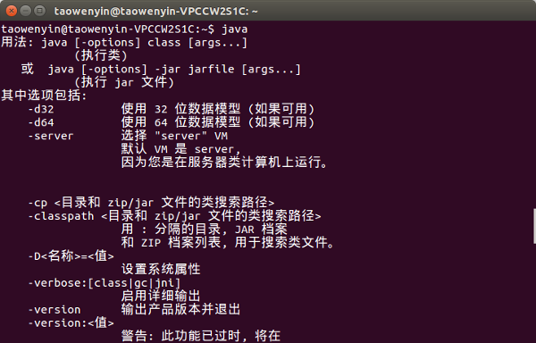 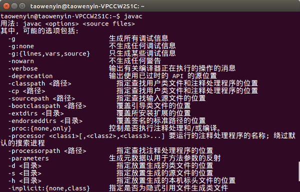

图3-8 验证Java安装完成

### 3.3.2 Linux下Eclipse for PHP Developers的安装

当进入Eclipse的官网（https://www.eclipse.org/downloads/），其会自动的识别当前系统的类型，例如笔者所使用的是Ubuntu，那么网站就会提供一个压缩包，在Neno版之前Eclipse官网都会直接提供针对不同开发语言的Eclipse程序件，但到了最新的Neno版，官网除了原先提供的内容外，还提供提供了一个集中的管理程序，本文就是通过这个管理程序来进行Eclipse for PHP Developers的安装，只需要以下几步就可以完成。

第一步：解压缩安装包eclipse-inst-linux64.tar.gz，并且双击执行eclipse-inst文件，弹出Eclipse安装包类型选择界面，如图3-9所示。

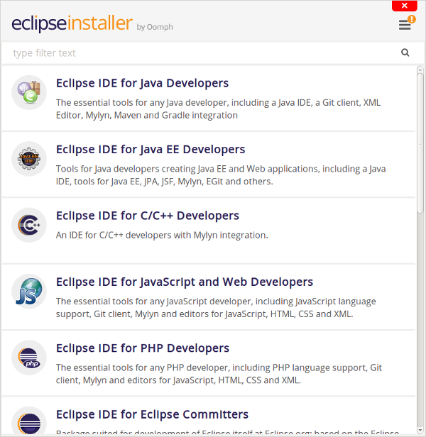

图3-9 Eclipse安装包类型选择界面

第二步：选择Eclipse for PHP Developers，设置安装路径，点击`INSTALL`进行安装，如图3-10所示。

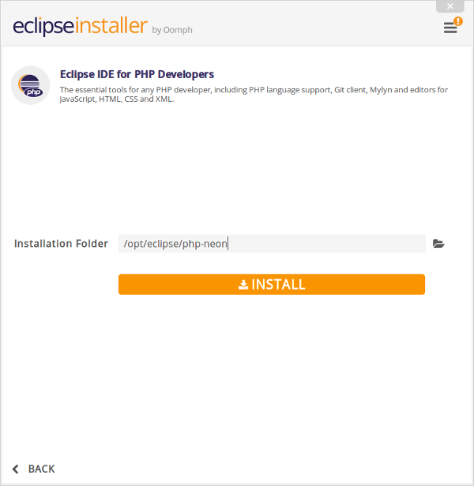

图3-10 安装路径选择界面

第三步：等待安装，当安装完成后，点击`LAUNCH`运行Eclipse for PHP Developers，如图3-11所示。

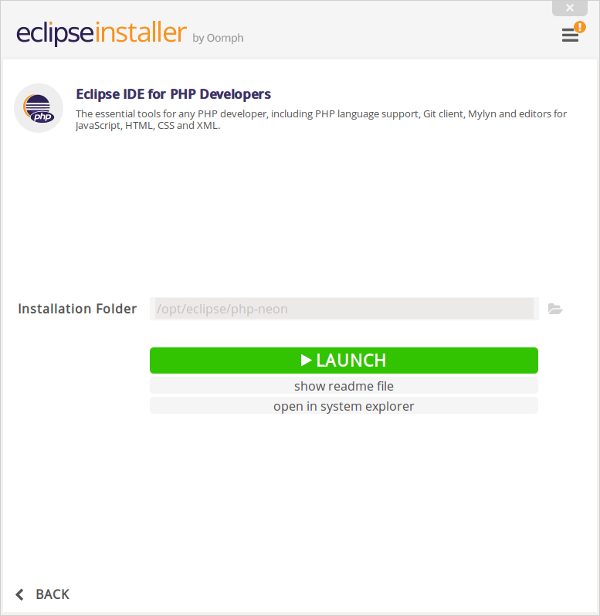

图3-11 安装完成择界面

第四步：设置Eclipse for PHP Developers的工作目录，这里需要注意的是要把Eclipse的工作目录设置在WebServer的www目录下，方便执行执行PHP程序，同时如果该工作目录以后不会再改动，那么可以把“Use this as the default and do not ask again”打勾，以后就不会弹出该界面，如图3-12所示。

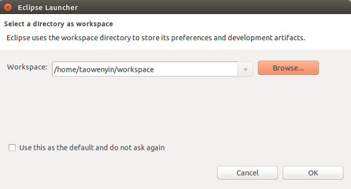

图3-12 工作目录配置

第五步：当设置完工作目录后，点击`OK`键就可以进入系统，此时可以通过点击菜单栏中的“File”->“New”->“PHP Project”创建PHP项目，如图3-13所示。

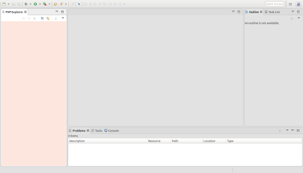

图3-13 Eclipse运行界面

## 3.4 Chrome DevTools实用的前端调试工具

以前听前辈们讲过这么一句话，世界上只有4种浏览器，分别是Trident、Webkit、Gecko、Presto，其实这些指的都不是浏览器，而是浏览器的内核，随着最新的Win10发布，在浏览器内核家族里又加入了Edge，但是除了Webkit之外其他内核都不是开源的，因此都只有个别浏览器在使用，而Webkit的代表浏览器就是Google的Chrome，同时该内核也是由Google开发的，随着Webkit内核的日渐成熟，国内的浏览器市场也是百花齐放，如360、搜狗、猎豹、QQ等知名厂商都采用了Webkit作为其浏览器的内核，因此可以说Webkit占据了国内浏览器的半壁江山，因此使用Webkit调试网页是可以说能代表最广大人民的利益，也因为这个原因本书的Web调试工具采用Webkit内置的调试工具Chrome DevTools。要使用Webkit内核的浏览器在Windows上有很多原则，如果360安全浏览器、猎豹等，但是在Linux上就只有Chrome这一个选择，因此在讲解Chrome DevTools之前首先要执行下面的指令来进行把Chrome下载，然后双击安装即可。

```bash
wget https://dl.google.com/linux/direct/google-chrome-stable_current_amd64.deb
```

安装好Chrome后打开Chrome DevTools有两种方式，一种是打开顶部菜单的`工具`，然后选择`开发者工具`，或者使用快捷键键`Ctrl+Shift+I`，打开后可以看到如图3-14的界面，一共有九大功能模块，其中最为常用的有六个，分别功能如下：

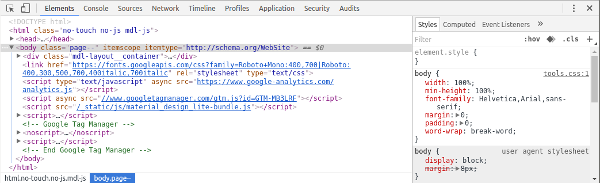

图3-14 Chrome DevTools运行界面

1. Elements：可以查看当前网页对应的HTML代码，通过在在该页面中编辑和修改页面元素的属性达到调试页面的效果，同时页面也会跟随代码的改变而改变，做到所见即所得的效果。

2. Console: 控制台工具，可以显示各种警告与错误信息，同时开发人员也可以通过该窗口进行信息打印，从而获取程序运行中的中间值。

3. Sources: 该页面主要用来对页面JavaScript的代码进行调试，该页面中可以实现对代码的暂停、单步调试、进入函数、跳出函数，以及查看临时和全局变量等。

4. Network：通过该页面可以查看当前页面从服务器端请求了哪些资源，这些资源的大小，以及所花费的时间，同时还能看到哪些资源是加载失败的，利用这些信息可以知道页面优化的方向。此外，该页面还可以查看HTTP的请求头和返回内容等。

5. Timeline：计算页面在从请求到展示整个过程中，每个行为所消耗的时间，例如计算CSS样式所需要的时间和执行JavaScript所花费的时间等。

6. Profiles：该页面是从整体上分析页面所消耗的时间，以及所占用的内存情况。

## 3.5 小结

通过本章的学习，了解Eclipse for PHP Developers开发工具的基本使用方法，同时也了解在进行Web应用开发是可以通过Chrome DevTools来进行页面的调试，此外掌握了如何在Ubuntu下进行XDebug的安装，以及基本配置方法，最后还掌握了如何在Ubuntu下安装VSCode，以及VSCode中插件的安装方法和两款用于调试和编辑PHP代码的插件，从而提高整个开发的效率。在学习完本章内容之后，读者可以自行安装XDebug、VSCode以及对应的插件，以供后续内容的使用。
