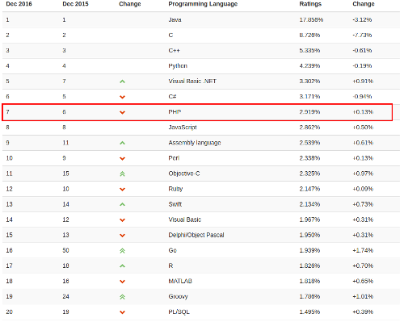
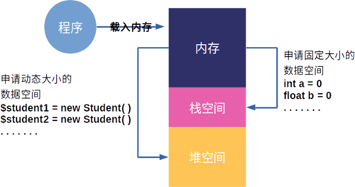
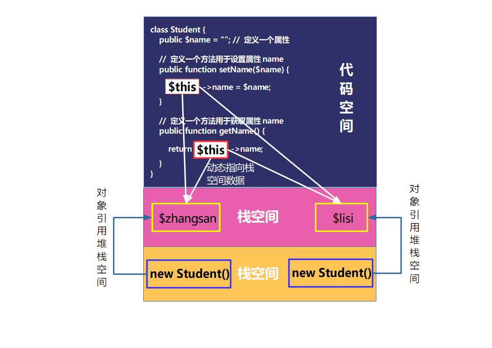
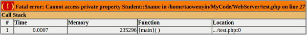
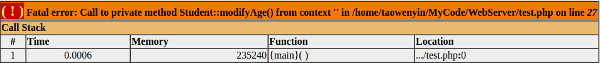
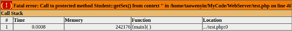
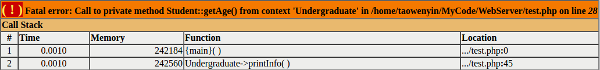
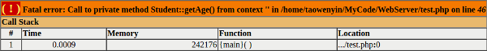

# 第四章 PHP的面向对象分析与设计

古人云：”仁者见仁，智者见智“，一件事或者一个物体从不同的角度进行观察就会得出不同的结果，但这些结果又必有其相关性和区别性，就像看张艺谋的《长城》，有人觉得好看，也有人觉得不好看。在程序设计中针对一个问题的解决思路也是有多种方法，本章讲述的是目前在高级语言中最为流行，也是应用最为广泛的程序设计方法，即面向对象的程序分析与设计方法，这个方法具有很强的普适性，它可以用不同的语言以不同的语法进行表现，却有着相同的内涵，在本章我们则依托PHP编程来进行讲解。

#### 本章内容

> * 面向对象的基本概念
> * 面向对象的构成与内存分配
> * 面向对象的$this和构造函数的分析
> * 面向对象中封装性的编程思想
> * 面向对象中继承性的编程思想
> * 面向对象中多态性的编程思想


## 4.1 面向对象的基本概念

到2016年距离PHP第一个版本的发布已经过去了22年，这22年中PHP由一个只是用来维护个人网页的工具发展到被Google、Facebook、Microsoft、阿里、腾讯等知名公司广泛使用的开发语言，并且在国际权威的开发语言排行榜TIOBE中始终排名在前十名，如图4-1所示的是2016年12月份的排名，目前PHP是排名在第六，可见其被应用的广泛程度。PHP目前有两个主要的分支，分别为PHP 5.x和PHP 7.x，而PHP 5.x是应用最为广泛的版本，许多第三方的框架都是基于该版本进行开发，其外在PHP 5.x中全面引入了面向对象的机制，并且保留了向下兼容的面向过程的函数，因此在本书中关于PHP的内容都是以PHP 5.x为基础上进行讲解。



图4-1 PHP语言排行榜

完整的面向对象通常包含三个层次的概念，即面向对象的分析（Object Oriented Analysis，OOA）、面向对象的设计（Object Oriented Design，OOD），以及面向对象的编程（Object Oriented Programming，OOP），其中面向对象的分析主要目的是找出要解决的问题中各个相对独立的对象，而面向对象的设计主要目的是找出这些独立对象之间关系，最终通过面向对象的编程把这些独立的对象和关系利用计算机语言进行实现，从而形成完整的系统。在这里读者一定要明白的是，面向对象并不是一门编程语言，而是一种编程思想，在面向对象的系统中每一个对象都能够对数据进行接收、处理和发送，从而使得整个软件系统的代码更加的简洁和更容易的维护，从而满足了软件设计的基本要求，即重用性、灵活性，以及扩展性。面向对象能够成为软件领域内最为热门的话题，主要原因是它符合我们看待事物的一般规律，例如我们从桌子上拿起一瓶饮料，我们做为一个独立的对象只需要伸手去拿即可，而不需要关心我们在拿饮料的过程中肌肉是如何传动的，能量是如何被消耗的等等一系列的问题，所以通过面向对象可以很好的把这些不需要关心的行为进行封装，让其内部进行，而不对外暴露。

因此在学习PHP的面向对象程序设计时除了要学习相关的语法外，更加重要的是要学习和思考面向对象的编程思想。起初在学习其相关语法时很多读者会觉得非常的简单，但是要深入的去思考为什么要这样设计，就像在本章开头所引用的那句古语”仁者见仁，智者见智“，运用面向对象的思想编程没有统一标准的答案，只有更好，没有最好，所以读者需要多思考、多练习。

### 4.1.1 理解类与对象

为了理解类和对象之间的关系，可以举一个通俗的例子，就好比在路上看到一只小狗，我们会叫他小狗，那么小狗就是一个类，因为世界上没有什么动物叫小狗，我们只是把有四个脚，并且会汪汪叫的动物称作小狗，但在我们眼前的这只小狗就是一个实实在在的动物，它是小狗这个概念具体化的产物，所以这个具体的小狗就是对象。因此可以知道所谓的类其实是把一系列具有相同属性、相同行为的对象进行抽象后形成的类。

因此在程序设计中类通常都是一个个独立的单元，这些单元有各自的属性，以及相应的行为，同时类也是符合这些特征的无数对象的高度抽象后的结果。类不存在于客观世界，而是存在与人们对于一个问题的思考和分类，也可以说类是人们所下的一个定义，例如我们说有四个脚，并且会汪汪叫的动物叫做小狗，我也可以说有四个脚，并且会汪汪叫的动物叫做猫，这些完全都有设计者来决定。

而对象与类恰恰相反，对象是在客观世界中实实在在存在的东西，客观的世界就是由无数个各种各样的对象组合起来的，这些对象又因为某种关系把他们联系在一起，比如家里领养了只小狗，那么本身没有任何关系的两个对象家庭成员和小狗，因为领养了这只小狗就产生了关系，领养是家庭成员的一个行为，而小狗则成了这个家庭中每个人的一个属性，所以可以认为对象是构成某个系统的基本单元，并且在对象内有一组相关的属性，以及可以操作的行为。

因此通过上面的介绍相信读者对于类和对象的关系有了一定的了解，虽然已无从考证为什么“class”会被翻译成“类”，但是笔者认为这个翻译是特别贴切的，因为“类”就相当于现实生活中把客观世界的各种东西进行分类，每个类型有自己的属性和行为，然后一个类型可以产生很多各实体，每个实体都是一个对象。

### 4.1.2 理解面向对象的程序设计

在PHP 5.x之前PHP并没有引入面向对象的概念，开发人员通过一个个的函数模块来构成整个交互系统，但是到了PHP 5.x这一切就发生了改变，因为在PHP 5.x中引入了面向对象编程的所有功能，同时还保持了原来的函数模块，保证了程序的兼容性，从此开发人员可以采用更加符合对客观世界理解的方式来进行开发和解决问题。

在面向对象的程序设计中，其相关语法并不是十分困难，甚至有C语言基础的读者会觉得它非常的简单，但是面向对象的程序设计的难点在于如何使用面向对象的思想来解决问题，例如要设计一个学生管理系统，那么首先要思考的不是这个系统有多少个学生、多少个班主任、多少个辅导员，因为这些内容都是不确定的，可能这个系统用在A学校就只有50个学生，而用在B学校就有100个学生，因此正确的思考应该是把整个系统进行分类，分成学生、班主任、辅导员，并且找出学生、班主任、辅导员这几个类别中每个类别应该有的行为，然后确定学生、班主任、辅导员之间的关系，例如每个学生都属于一个班级，每个班级都有一个班主任，若干个班级组成一个年级，每个年级都有一个辅导员，这样就可以把学生、班主任、辅导员之间的关系理清楚，然后在思考所对应的专业、学院和学校，以此类推就可以得到整个系统的体系结构。

从上面的分析不难看出使用面向对象编程思想编程时通常的思考方法是自顶向下的思考，也就是说先从整个系统进行整体划分，然后像剥洋葱皮一样一层层往下进行设计，直到最后一个部分，然全部划分完成后就是要确定这个模块之间的关系，以及模块与模块之间的数据是如何传递的、方向是什么等内容，从而构成了整个面向对象的系统。

## 4.2 面向对象的构成与内存分配

在程序开发中整形、浮点型、布尔型、双精度型都被成为基本数据类型，而数组和对象都被称为复合数据类型。虽然PHP是弱类型的语言，可以要求数组中的元素类型不相同，而不会像强类型的语言那样要求数组中每个元素的类型必须相同，但数组有个明显的不足就是无法为其添加行为，并且设定每个元素的访问权限，而这些功能则是类和对象所擅长的。在上一节本书讲解的面向对象的基本概念，本节将会讲述如何通过代码的方式创建一个类和一个对象。

### 4.2.1 类的声明

要声明一个类其实方法非常的简单，主需要在前面添加一个class关键字，后面跟着类名，最后用花括号括起来就可以，这里特别要说明的是类名和class之间一定要增加一个空格，具体代码如下：

```php
class 类名 {
    // 类的内容
}
```

在创建类是有一点需要特别的强调，就是关于类名的命名规则必须要要符合国际通行的管理，即如果该类名由一个单词构成，那么该单词必须是首字母大写，如果该类名由多个单词构成，那么每个单词的首字母都要大写，其他字母小写，同时要保证这个类名具有一定的意义，切记起一些没有意义的名称，例如AABB、ABCD等。

在类的内容中主要添加一些成员方法和成员属性，这个成员方法也就是函数，它主要表明这个类具有什么功能，而成员属性则表明这个类具有什么特质，例如要定义一个人这个类，那么姓名、年龄、性别就是人这个类的属性，而能够走路、能够跑步、能够拿东西就是人这个类的功能，这些东西都需要在类中进行定义，这里需要说明的是在类中定义的变量虽然可以不赋初值，但是给一个变量赋初值是一个很好的习惯，同时在方法名前添加限定符也是很好的习惯，可以明确该函数的权限。因此可以说所有的类都是由形形色色的属性和方法构成的，其能够实现的功能比数组多出许多，并且一个PHP程序可以声明无限多个类，只要系统需要，但在设计这些类时需要思考的关键是要把各种对象中所共性的进行抽象，从而得到了真正需要的类，具体代码如下：

```php
class 类名 {
    限定符 $属性名 = 初始值;
    ......

    限定符 function 方法名(参数列表) {
        // 函数体
    }
    ......
}
```

### 4.2.2 对象的实例化与内存分配

前面讲过类是许多个对象的高度抽象后的结果，因此一个类不仅仅表示一个对象，而是表示很多个对象，所以程序中不能直接对类进行操作，而是需要通过类的实例化后得到对象，然后调用对象中的各种方法，从而实现各种功能，这些方法也就是事先在类中已经定义好的方法。那么要实例化一个对象其实非常简单，只需要使用关键字new，然后后面加一个空格，空格之后跟上一个类名，最后紧跟一对小括号即可，如果此时在实例化一个对象时需要传递一些初始化参数，那么在类名之后的小括号中就需要传递一组初始化参数列表，具体代码如下：

```php
$对象名 = new 类名(); // 没有参数的情况
$对象名 = new 类名(参数列表); // 有参数的情况
```

其中“$对象名”表示通过某个类创建的对象名称，可以类比为变量名，只不过它表示的内容更加的复杂，而参数列表则是对象初始化的所需要的参数，例如创建一个Student对象时，可以传入如姓名、性别、年龄等初始化信息，从而创建出不同内容的对象。当类在创建对象时PHP会调用一个特殊的函数，即构造函数。构造函数的种类有两种，一种是默认的构造函数，当创建对象时如果它的参数列表为空，那么系统就会试图去调用默认的构造函数，因为默认的构造函数不需要传递任何的参数，通过内部的代码来实现对象的初始化，采用这种方法产生的对象均有相同的内容，而另一种就是自定义的构造函数，和默认的构造函数正好相反，创建对象时的参数列表不为空，当系统创建对象时，系统通过这些参数来初始化对象，对象通过这些参数来动态的生成其内容。这里需要特别说明的是在具体的程序开发中自定义构造函数一定是由开发人员自己来实现的，而默认的构造函数可以采用系统默认的方式，也可以由开发人员自己来实现，对于这部分内容在后续的章节中会进一步说明。

当一个类产生一个对象时，其实质是通过关键字new向操作系统发送申请空间的指令，因此每使用new一个对象就会在内容中获得一块内存空间，这些空间中存放了不同的内容，虽然这些对象的类型都是相同的，但是它们之间不存在任何的关系，因为在物理空间上就是分离的，就好比世界两端的人，虽然他们都是Person，但是从姓名、生活阅历、家庭来说它们是完全不同的，可以说是完全独立的两个人。所以，要完全理解并且熟练掌握对象的使用，除了要知道对象的基本使用方法还需要了解对象是如何在内存中进行创建和分配的，这样才能更加灵活的去使用对象。

在计算机中存储器不是指通常意义上的硬盘，而是指的内存，硬盘在计算机中只是相当于外部存储器，用来持久的保存数据，而计算机程序在运行时所有的数据都需要从硬盘中读取然后放入内存中进行计算，因此当内存较大时，就减少了计算机与硬盘进行数据交换的次数，也就提高了程序的运行速度。通常来说一个程序运行时所占用的内存空间会被划分为四个部分，分别为栈数据空间、堆数据空间、全局数据空间、程序代码空间，这四部分的作用分别如下：

* 栈数据空间：该部分数据空间相对较小，并且主要用于存放一些占用空间固定的数据，例如存放一些整型、浮点型等基本数据类型，因为数据的大小固定可以很方便的分配数据空间，所以计算机在设计该部分空间时把它设计成访问速度较快的空间，以便提高程序的效率，此外该空间还被用于存放一些临时的变量，当程序超出了临时变量的作用域时，该变量就会被销毁，所以栈空间一般被用于基本数据类型的交换，以及保存临时变量保存。
* 堆数据空间：区别于栈空间，堆空间主要用于为一些具有动态内存特性的数据分配存储空间，这些数据所占用的空间大小不固定，可能随着程序的运行进行所占用的空间增加或者减少，因此堆空间通常用于存储一些数据大小不固定，且占用较大空间的数据，例如像对象、数据这样数据都是存储在堆空间中。
* 全局数据空间：该空间相对较为简单，主要用于存储一些已经初始化完成的全局的静态变量。
* 代码空间：上面三种存储空间主要用于存储数据，而代码空间则主要存放由程序员编写的程序，这些程序不是编写的源程序文件，而是通过编译器或者解释器后产生的可执行文件，因为程序在运行时不能够被修改，所以这部分的空间具有只读的特性，而不能被写入。

从上面的解释可以知道，当PHP创建一个对象后，系统就会在内存的堆空间分配一部分容量用于存放该对象的数据，但为了提高整个系统的系统运行速度和安全性，避免对内存空间的随意修改，操作系统不允许运行的程序直接访问堆空间中数据，而是需要在栈空间中创建一个整数类型的变量，该变量就是通常所说的对象名，并且在该变量中存放着堆空间中对应对象的地址，然后通过对该变量所指向的堆空间地址中的数据进行操作，从而实现对象的操作。对象数据这样特殊的存储方式是因为栈空间的存取速度非常快，几乎具有和CPU寄存器一样的速度，但是栈空间具有存放数据必须大小固定的缺点，而堆空间却没有这样的要求，不过堆空间的速度相对较慢，因此对象数据的存储正式结合这两种存储方式的优点，既满足了速度要求，又满足了存储大小的要求，如图4-2所示的就是程序运行时的内存分配。



图4-2 堆栈内存的分布

在上图中把整个内存分为了三个部分，分别为内存、栈空间和堆空间。当程序运行时，操作系统会把要运行的程序全部载入到内存中，当程序遇到需要创建基本数据类型时，例如“int a = 0”和“float b = 0”时，程序就会通过操作系统向内存中的栈空间申请一块空间用来存放这些数据。而当程序遇到需要创建对象类型或者数组类型时，程序首先会通过new关键字来告诉操作系统当前程序需要在堆空间内申请一块内存空用来存放一些相对较大的数据，例如“new Student()”，此时每new一次就会在堆空间中申请一块内存空间，这些内存空间之间相互独立，当在堆中申请完空间后系统又会在栈空间申请一个内存空间，用来保存堆空间中的数据地址，例如“$student1 = new Student()”中的$student1就是用来存放这个地址的变量，这个地址的长度在32位的操作系统中是一个32位的整型，而如果在64位的操作系统中，则是一个64位的整型数据，最后操作系统把这个地址数据返回给程序，程序就可以根据这个地址对数据进行操作。

在程序中加、减、乘、除等操作实质上都是在栈空间中进行，例如“int a = 1; int b = 0; a = b”这样的操作，其本质是把在栈空间中b地址中的值赋值给a地址中的值，因为基本数据类型的数据就是存放在栈中，因此看到的现象就是数值的拷贝，但是对于类数据和数组数据这样的数据类型来说，栈空间存放的是数据在堆空间中存放的地址，因此如果直接在类对象或数组数据之间进行赋值，那么其本质是地址值的赋值，而不是数据内容的赋值，所以例如“Student student1 = new Student(); Student student2 = new Student(); student1 = student2”这样操作的结果是student2把其所指向的堆内存空间中的地址赋值给student1，使得student1和student2都指向了同一段的堆空间，此时对于这段堆内存来说就有两个变量来表示它，只要对其中一个变量进行操作，另外一个变量也可以得到操作后的结果，当然对于程序来说可以创建很多个指向相同堆空间的变量，这些变量称为别名，即虽然名字不相同，实质确实相同的东西。

## 4.3 面向对象的$this和构造函数的分析

当构建对象时传入一些参数作为对象初始化的依据，那么所得到对象的其内部会因为不同的参数而不尽相同，但是在调用对象方法时，只要对象的类型相同，其调用的函数就必定相同，此外当程序运行结束，或者对象的生命周期已经完成，这个时候就需要对对象进行销毁，本节的主要内容就是分析系统是如何实现动态对象方法的调用，以及对象在构造和销毁时的行为。

### 4.3.1 运行时对象属性与方法的动态访问

当一个类定义完成后，还可以在其中添加属性和方法，属性表示的就是类的特征，例如Student类的属性就可以包括姓名、年龄、性别等，而方法表示的就是类的行为，还以Student类来说就是读书、运动、恋爱等。当类产生对象以后就可以通过特殊运算符“->”进行访问，这些访问可以是对属性的赋值或者获取，也可以是执行某一个方法，具体代码如下：

```php
$对象名 = new 类名(参数列表); // 有参数的情况

$对象名->属性名 = 值; // 属性的赋值操作
$属性值 = $对象名->属性名; // 属性值的获取操作

$对象名->方法名(参数列表); // 执行类的某个方法或行为
```

下面通过一个实例来具体说明如何通过运算符“->”来实现对属性和方法的操作，首先定义了一个Student类，并为这个类添加一个“name”属性用于表示Student类的名字，然后定义一个“setName()”方法，该方法用于设置“name”属性的值，最后再定义一个"getName()"方法，通过该方法来获取“name”属性，当完成Student类定义后，通过关键字new在内存空间中创建了Student对象，然后就使用特殊运行算符“->”来设置和读取相关属性值，具体代码如下：

```php
class Student {
    public $name = ""; // 定义一个属性

    // 定义一个方法用于设置属性name
    public function setName($name) {
        $this->name = $name;
    }

    // 定义一个方法用于获取属性name
    public function getName() {
        return $this->name;
    }
}

// 产生$zhangsan对象
$zhangsan = new Student();
$zhangsan->setName("张三");
echo $zhangsan->name."<br />";
echo $zhangsan->getName();

// 产生$lisi对象
$lisi = new Student();
$lisi->setName("李四");
echo $lisi->name."<br />";
echo $lisi->getName();
```

*程序结果输出：*

```php
// 第一个输出的结果
张三
张三

// 第二个输出的结果
李四
李四
```

从上面的代码中可以了解到特殊运算“->”在实际代码编写中的使用方法。在上一节中讲到当对象在堆空间中被创建后，程序是不能够直接对其进行访问，必须要再在栈空间中创建一个变量，该变量保存了该对象在堆空间的地址，程序正是通过这个地址来完成对对象的操作，那么对于已经由类产生的对象来说要实现对属性和方法的操作只需要通过对象名的操作就可以完成，但很多时候除了外部的读取和访问外，在类的内部也需要进行先对属性进行一定的处理后再进行输出，例如女生都希望自己的一直保持年轻，所以别人在问自己年龄的时候可能会在实际的年龄上减少几岁，那么对于询问者来说所获取的年龄实际上是经过处理后的结果，而不是原本的值，因此在实际开发中类的属性经常需要被内部的其他成员函数进行访问和处理，然后再把处理后的结果进行返回。

在4.2节描述中讲到，通过new关键字产生的每个对象在堆空间中都具有相对独立的空间，但是其实现的代码却是相同的，即共用一份代码数据。从上面的例子中也不难看出，虽然都是Student类型，但是却创建了不同的对象，但是这些对象之间不存在任何的关系，那么要在对象内部正确的访问到相应属性，而不是李四的对象访问到张三的对象，或者张三的对象访问李四的对象，就需要有一个能够在运行时表示不同对象的引用，目前知道new关键字产生的对象名可以完成属性的读写，但是对象的内部是没有办法获取对象名，因此在PHP中提供了一个非常特殊的对象引用“$this指针”，这个引用代表了当前程序运行时的对象引用。在上面的例子中有两个对象，分别为$zhangsan和$lisi，那么对于对象$zhangsan来说$this就表示$zhangsan对象的引用，而对于对象$lisi来说$this就表示$lisi对象的引用，即在$zhangsan中$this指向和$zhangsan相同的内存空间，而在$lisi中$this指向和$lisi相同的内存空间，所以$this并不表示某一个特定的对象，而是表示这个对象本身的引用，如图4-3所示。



图4-3 $this指针的理解

### 4.3.2 构造函数和析构函数的运行分析

在上一节中创建了一个Student类，并在该类中添加了两个成员函数用于设置和获取Student类的名字，这一做法从语法上来说没有任何的问题，但是仔细琢磨就会发现有其不合理性。在本章的开头说过，面向对象的编程最大特点就是把现实生活中对问题的觉得方法映射到计算机中，并用计算机的语言进行表述，那么在现实生活中当学生对象创建后，他的name属性就应该存在，而不是在后续的工作中通过setName()函数进行赋予，就如一个新生进校以后他的名字是本身就存在的，而不是进校后老师给起的名字，所以name属性的值应该在创建这个对象时就赋予。同时当学生离开学校时，他在学校的学籍也会一同被注销一样，这些生活中的现象都告诉我们，对象中的有些东西应该是在对象产生时就已经有的，而有些东西则是随着对象的消失而自动消失的。因此在PHP中有两个非常特殊的函数来解决这个问题，一个叫构造函数，而另一个则叫析构函数。

这两个函数都和对象的整个生命周期息息相关，其中构造函数是是对象创建完成后第一个调用的函数，并且这个调用的过程是完全自动的。而析构函数则是在对象被系统销毁时最后一个被调用的函数，同样这个调用的过程是完全自动的。对于构造函数而言，其最主要的功能是在对象被使用前完成对象内部属性的初始化，例如上面的例子中学生对象被创建时就应该初始化内部的名字、性别等属性。而对于析构函数而言，其最主要的功能是完成对象销毁前最后的清理工作，如学生离校是把学籍从学校删除等工作。

1、构造函数的运行分析

在类中，构造函数是一个特殊的函数，当该函数没有在类中明确声明时，系统会自动为该类提供一个默认的构造函数，用于创建对象，但是这个构造函数没有任何的内容。而当开发人员在类中明确的添加了构造函数时，那么系统就不会自动为其添加一个默认的构造函数。构造函数在这个类的生命周期中只会被调用一次，即当开发人员通过new关键字创建对象时，系统就会调用开发人员所创建的构造函数。

这里要特别说明的是PHP和其他面向对象的开发语言，如Java、C++不同，在这些语言中可以为类中定义多个构造函数，并且通过函数重载的特性为不同输入参数提供不同的构造函数，但是由于PHP是弱类型的语言，从语法上来说PHP的变量可以表示任何的数据类型，因此PHP无法通过重载的形式为其通过多种构造函数，因此在PHP中构造函数只能有一个，并且名字是固定的，即__construct（注意：construct前面是两个英文的下划线），具体如法如下：

```php
class 类名 {
    public function __construct([参数列表]) {
        // 构造函数的方法体，可以实现对象属性的初始化工作
    }
}
```

那么，如果因为开发的需要必须要在实现构造函数的重载，也就可以通过默认参数的方式来间接地完成，即通过判断默认参数的方式来调用不同的函数实现，下面通过一个完善学生类来进行具体的说明，代码如下：

```php
class Student {

    private $name = null;
    private $age = null;
    private $sex = null;
    private $className = null;

    // 构造函数
    public function __construct($name, $age, $sex, $className = null) {
        $this->name = $name;
        $this->age = $age;
        $this->sex = $sex;
        if($className != null) {
            $this->className = $className;
        }
    }

    public function getStudentInfo() {
        if($this->className == null) {
            echo "学生名字：".$this->name.", 年龄：".$this->age.", 性别：".$this->sex;
        } else {
            echo "学生名字：".$this->name.", 年龄：".$this->age.", 性别：".$this->sex.", 班级：".$this->className;
        }
    }
}
```

*两种构造对象的方法：*

```php
// 传入三个参数来构造对象
$baseStudent = new Student("张三", 18, "男");
$baseStudent->getStudentInfo();

// 传入四个参数来构造对象
$advStudent = new Student("李四", 25, "男", "嵌入141");
$advStudent->getStudentInfo();
```

*程序结果输出：*

```php
// 传入三个参数的输出结果
学生名字：张三, 年龄：18, 性别：男

// 传入四个参数的输出结果
学生名字：李四, 年龄：25, 性别：男, 班级：嵌入141
```

从上面的例子可以看出，当构造函数中的参数没有默认值时，那么就必须要为该参数传值，而当构造函数的参数有默认值时，那么就可以不传参，PHP正是通过这个方法来实现不同构造函数的切换，同时再在构造函数的实现体中通过$this指针对象来为每一个通过new关键字创建的对象中的属性进行赋初值，从而实现不通过对象的初始化。

2、析构函数的运行分析

与构造函数相同，析构函数也是一个特殊的函数，并且是从PHP 5开始新添加的内容。主要负责对象在被销毁前执行一些特殊的操作，例如关闭数据库、释放数据等。PHP中的析构函数和构造函数一样，都由系统自动调用，开发者无法进行干预。前面讲了构造函数是在使用关键字new时系统首先调用的函数，那么对于析构函数而言系统则是通过判断该对象是否属于系统垃圾，如果是垃圾则会回收该对象，并且调用该对象的析构函数，这种方式就是PHP的垃圾回收机制。

要理解析构函数的运行就需要先理解PHP的垃圾回收机制，这种机制进过多次版本的更迭已经非常复杂，并且效率很高，在这里只做简单的讲解，想深入了解的垃圾回收机制的算法可以在网上找IBM工程师的一篇论文《Concurrent Cycle Collection in Reference Counted Systems》，其中深入讲解了一种垃圾回收的算法。PHP的垃圾回收简单来说就是“引用计数”（Reference Counting），即为每个内存中的对象分配一个计数器。当某一个对象被建立时，那么该对象的计数器就会初始化为1，因为此时一定会有一个变量来引用该对象，然后如果该对象又被新的变量引用，那么该对象的计数器就会增加1，以此类对，对象的计数器会随着引用的变量增多而增加。但如果引用该对象的变量被销毁时，那么该对象的计数器就会减1，这里要特别注意的是对象的销毁和变量的销毁是完全不一样的概念，因为变量的定义是在栈上，当该变量超过了它的作用域时就会被销毁，而对象是在堆上，是不会被销毁的。因此，当垃圾回收机制运作的时候，会检查所有对象的计数器，如果某个对象的计数器为0，那么就意味着没有任何变量在引用该对象，此时就把该对象视为系统垃圾，对其进行销毁，并回收这部分内容。

当系统要把对象销毁时，就会自动去调用对象的析构函数，如果开发人员没有添加自定义的析构函数，那么系统就会调用一个默认的析构函数，当然这个析构函数其实不做任何事情。要添加析构函数，其实和构造函数的方法非常类似，也是一个固定的名称，即__destruct（注意：destruct前面也是两个英文的下划线），这里要特别说明的是，析构函数是不带任何参数的，具体如法如下：

```php
class 类名 {
    public function __destruct() {
        // 析构函数的方法体，可以实现对象销毁前的清理工作
    }
}
```

下面再以学生类为例，添加相应的析构函数，具体代码如下：

```php
class Student {

    private $name = null;
    private $age = null;
    private $sex = null;
    private $className = null;

    // 构造函数
    public function __construct($name, $age, $sex, $className = null) {
        $this->name = $name;
        $this->age = $age;
        $this->sex = $sex;
        if($className != null) {
            $this->className = $className;
        }
    }

    public function getStudentInfo() {
        if($this->className == null) {
            echo "学生名字：".$this->name.", 年龄：".$this->age.", 性别：".$this->sex;
        } else {
            echo "学生名字：".$this->name.", 年龄：".$this->age.", 性别：".$this->sex.", 班级：".$this->className;
        }
    }

    // 析构函数
    public function __destruct() {
        echo $this->name."对象被销毁";
    }
}
```

*两种构造对象的方法：*

```php
// 创建好对象后，把变量赋值为null，断开与对象之间的引用
$baseStudent = new Student("张三", 18, "男");
$baseStudent = null; 

// 创建好对象后，由于程序执行完毕，所以系统清空所有资源
$advStudent = new Student("李四", 25, "男", "嵌入141");
```

*程序结果输出：*

```php
// 对象的计数器为0，系统进行回收和销毁
张三对象被销毁

// 系统清空资源，回收和销毁所有对象
李四对象被销毁
```

从上面的例子可以看出，不论是计数器减为0，还是资源被清空，系统都会把对象进行销毁，并且执行析构函数。在第一个例子中，当创建好“张三”对象是，该对象的计数器为1，因为有$baseStudent对其进行引用，但是后来$baseStudent被赋值为null，就会断开与原先对象之间的引用，此时就会把“张三”对象的计数器减1，此时该对象的计数器就为0，系统就会进行回收和销毁。而在第二例子中则是因为页面执行完毕，所以系统断开所有的引用，从而执行回收操作。

### 4.3.3 静态函数与静态变量的运行分析

从前面讲的内容来看，要创建一个对象的方法就是通过关键字new来实现，即通过在内存的堆中开辟一块空间，然后在内存的栈中申请一个整形的变量来存放该空间的地址，最后通过该变量来实现所有的操作。在这个看似没有问题的过程中却存在这么一个问题，即用户可以通过new关键字来创建无数个同一个类的对象，然后通过这些创建出来的对象分别访问数据，对于普通的实现来说，这一过程没有问题，但是对于一些高级的应用则不行，例如数据库访问、文件访问等具有单一数据源特性的访问中，最终的操作对象只有一个，如果有无数的对象对该单一数据源进行访问和修改就会造成数据源的不稳定和不可预见性，因此在这些应用中就不希望开发人员可以随意创建任意多个的对象，而是应该在任何情况下都只有唯一的一个对象对数据源进行操作，此时就需要用到PHP中另外一个非常重要的关键字static，该关键字应用场合不是很多，但是一旦用到却可以起到非同一般的效果。

在4.3.1中讲了计算机把内存分为堆和栈两个部分，分别用于存储大小可变的数据类型和大小固定的基本数据类型，其实在内存中还有一块区域，该区域称之为静态存储区域，该区域内的数据会在整个程序运行期间一直占用一部分的内存，并且其内存地址不会发生变化，直到程序结束后才把这部分内存释放和清空。在PHP中有两种静态的使用方法，即静态变量和静态函数。

1、静态变量的运行分析

在PHP中静态变量有三种应用场合，第一种是函数内部的静态变量，第二种是全局的静态变量，第三种则是静态的类属性。这三种应用场合除了静态全局变量外，其他两种都必须在变量的前面加上关键字static，具体代码如下：

```php
// 场景一：static静态局部变量
function static_local() {
    static $local = 0 ; // 初始化为0
    $local++;
    echo $local . '<br>';
}

// 场景二：static静态全局变量
function static_global() {
    global $glo; // 初始化为0
    $glo++;
    echo $glo . '<br>';
}

// 场景三：static静态类属性
class StaticProperty {
    static $count = 0;
 
    public function __construct() {
        self::$count++;
    }

    public function getCount() {
        return self::$count;
    }
}
```

由于静态变量的存储的区域是在静态存储区，并且内存地址不变，直到程序运行完毕，所以使得静态变量在程序运行的过程中始终存在，所以它不会随着变量所在的程序执行完毕就销毁，同时由于是变量，因此每次再次执行该函数时都会在上次一的基础上再次修改。在上面三个场景中场景一和场景二比较好理解，在场景一中，虽然$local变量在static_local函数内部，但是该变量是静态变量，因此每次调用static_local函数时都会把$local加1，但是又因为$local在static_local函数内部，因此出了static_local的作用域就没办法再次调用该变量，只能在static_local内部使用。在第二个场景中定义了$glo为全局变量，因为PHP中的全局变量，一定是静态变量，因此它和第一个场景中的变量有相同的性质，此外因为把$glo定义为全局变量，所以出了在static_global内部使用外，还可以在函数的外部使用该变量，具体的实现代码如下：

*两种场景函数调用的方法：*

```php
// 场景一：static静态局部变量
static_local();
static_local();
static_local();

// 场景二：static静态全局变量
static_global();
static_global();
static_global();
echo $glo;
```

*程序结果输出：*

```php
// 场景一：static静态局部变量
1
2
3

// 场景二：static静态全局变量
1
2
3
3
```

接下来重点要讲的是第三个场景，即把类的属性定义为静态变量。在这个场景下静态的属性已经不属于某一个对象，因为这些静态属性的存储位置不在对象的存储位置处，所以在调用该属性的方法和普通属性的方法不同，需要用到关键字self，通过"self::属性名"的方式来调用该变量，如场景三中所示的样子，具体实现代码如下：

*场景三的调用方法：*

```php
// 场景三：static静态类属性
$staticProperty1 = new StaticProperty();
$staticProperty2 = new StaticProperty();
$staticProperty3 = new StaticProperty();
echo "Count = ".$staticProperty3->getCount();
```

*程序结果输出：*

```php
// 场景三：static静态类属性
Count = 3
```

从上面的分析可以得到下面的结论，即把局部变量变为静态变量后改变的是它的存储方式，从堆栈空间变换到静态存储区，也就改变了它的生存期，使得在下一次调用的时候还可以保持原来的值，而不是初始化的值。

2、静态函数的运行分析

上面详细讲解了静态变量的一些特性和使用方法，接下来要讲的是静态函数的使用。静态函数和普通函数在创建时没有太大的区别，只是需要在函数的最前面加上关键字static即可，并且静态函数只能放在类中使用，而不能把普通函数设置为静态函数具体代码如下：

```php
class StaticProperty {
    static $count = 0;
 
    public function __construct() {
        self::$count++;
    }
    
    public static function getCount() {
        return self::$count;
    }
}
```

在实际的开发中，静态函数通常不会单独的存在，而是与普通的函数和变量共存，那么此时就特别要注意的是静态函数只能调用静态函数或者静态变量，而普通函数却能够调用静态函数和静态变量，这是因为当在类中定义了静态函数或静态变量后，系统运行时就会在内存的静态存储区内创建这些静态的函数或变量，而不用等到类的对象被创建。具体来说就是当普通的成员函数需要调用静态函数时，那么此时类的对象就已经被创建，当然也就能够调用早已在存储在静态区内的静态函数和静态变量，但是当静态函数要调用普通函数或者变量时，此时可能对象还没有在内存中创建，那么此时也就无法调用普通的函数和变量，所以为了避免这些不确定的操作，在PHP中就禁止静态函数调用普通的成员函数和变量。

除了在类的内部会调用静态函数和静态变量外，在具体开发时还经常会在类的外部调用静态函数或静态变量，此时要注意的是调用类的静态函数或静态变量不是用对象来调用，而是用类名进行调用，即“类名::静态函数名/静态变量”，具体代码如下：

```php
class StaticProperty {
    static $count = 0;
 
    public function __construct() {
        self::$count++;
    }
    
    // 静态函数
    public static function getCount() {
        return self::$count;
    }
}

// 类外部调用类的静态函数
echo "Count = ".StaticProperty::getCount();
```

*程序结果输出：*

```php
// 静态函数的结果
Count = 3
```

## 4.4 面向对象中封装性的编程思想

基于面向对象理念的编程语言种类几乎占据了目前整个可用编程语言数量的80%以上，能取得这么大的成功主要归功于这一类的编程语言能够极大的提高编程的生产效率，特变是Java、PHP、Python等，开发人员几乎不需要了解底层的运行方式，只需要了解哪些函数是用来干什么的，哪些函数和哪些函数组合可以完成什么功能即可，可以说是“拿来主义”在编程领域的最好体现。具有这一特性的其中一个原因就是面向对象的封装性，因为有了封装性，开发人员可以把自己开发好的程序变成一个个独立的小程序，随后的开发人员只需要了解这些小程序对外的接口是什么，而不需要了解内部的构造，这样就能节省开发人员大量的时间，并且屏蔽了开发中的许多细节问题，因此本节将详细参数在面向对象编程中的封装性的应用和编程理念。

### 4.4.1 封装性的基本含义

要能灵活的运用封装性进行编程，那么首先需要了解封装性的含义。所谓封装性就好比是一台手机，我们只要通过简单的触摸或者点击就可以思想打电话、发短信能操作，那么这里的封装性就有两个层面的意思，首先是从整体上来看，通过封装性可以把一个完整的实物联系到一起，变成一个不可分割的整体，其次再从内部细节来看，通过封装性可以把系统内部的各个模块进行划分，只保留对外的接口，而不展示内部所有的细节，使得整个系统都以各自的接口为基础进行交互，减少了各模块之间的耦合性，也便于后续进行单独模块的维护和升级。

其实利用C语言中的结构体也可以编写出具有类特性的对象，这一点在嵌入式系统中非常常用，但是由于C语言并不是面向对象的语言，因此不具有面向对象语言的封装性，程序编写时通常利用变量或者函数的命名规则来进行区分，但是这些造成了很多不可预见的安全隐患，例如对于用户的性别、年龄这些基本的属性是不可以随意更改的，如果更改了就可能在后续的数据检索中无法找到需要的信息。此外对于没有封装特性的对象来说除了随意调用属性会造成问题外，所以的调用方法也会破坏系统的完整性，例如用户要去提交一份完整的材料，那么需要经过领取材料、填写材料、提交材料这三个步骤，而如果用户只调用其中的任意一个单独的步骤，那么都没有实际的意义，因此通过封装性就可以把这三个步骤封装为一个步骤，从而来完成一项功能。

所以对于封装性而言，首先是防止开发人员随意的修改其内部重要的属性，其次避免开发人员在不了解情况的时候随意调用函数造成对象内部的混乱，从而是的程序能够结构化、模块化，大大降低开发难度和成本。

### 4.4.2 封装性关键字的使用方法

在PHP中和封装性相关的关键字一共有三个，分别是private、protect、public，通过这三个关键字就可以规定了某一个属性或者某一个方法它的被访问权限，具体如下：

* private关键字：表示该属性或者方法不能在外部被调用，即外部不可见，而在该类的继承类中也是可不见的，即不能在继承类中被调用，最后就是在该类的内部是可以被调用。
* protect关键字：表示该属性或者方法不能在外部被调用，即外部不可见，而在该类的继承类中却是可见的，即可以在继承类中被调用，最后就是在类的内部是可以被调用。
* public关键字：表示该属性或者方法能在外部被调用，即外部可见，而在该类的继承类中也是可见的，即可以在继承类中被调用，最后就是在类的内部是可以被调用。

从上面的描述不难看出，通过这些关键字就可以很好的定义哪些是可以在外部被调用的，而哪些只能在内部被调用，而又有哪些是只能在继承类中被调用的，这些定义和我们生活中真实的现象极为类似，例如在一个家庭中，爸爸要去买礼物给孩子，孩子负责收礼物，孩子也不会关心爸爸到哪里去买礼物，只要最终的礼物能让他开心就行，这就好比是孩子调用了爸爸的public函数去买礼物，那么爸爸根据实习情况调用private函数去买礼物，因为具体在哪里买也不需要孩子知道，等孩子长大了爸爸经常会调用protect函数来和儿子讲人生道理，这个道理只会在父子之间传递，爸爸不会把这些道理去和一个不相干的人说。因此从上面的例子也再次印证了本章开始说的，面向对象实际上就是把生活中实际处理问题的方法用计算机语言来表达，下面就通过一个实际的例子来说，具体代码如下：

```php
class Student {
    private $name = null;
    private $age = null;
    private $sex = null;

    // 构造函数
    public function __construct($name, $age, $sex) {
        $this->name = $name;
        $this->age = $age;
        $this->sex = $sex;
    }

    private function modifyAge() {
        $this->age -= 5;
    }

    public function getStudentInfo() {
        if($this->sex == "女") {
            $this->modifyAge();
        }
        echo "学生名字：".$this->name.", 年龄：".$this->age.", 性别：".$this->sex;
    }
}
```

在这个例子中Student类的属性全部定义为private，并且把构造函数也定义为了public，此外还定义了两个成员函数，一个为public，用于获取学生的信息，另一个为private，用于修改当前的年龄，接下来来看该类的实际调用，具体代码如下：

```php
// 调用私有的属性
$maleStudent = new Student('张三', 28, '男');
$maleStudent->name = '李四';

// 调用私有的方法
$maleStudent = new Student('张三', 28, '男');
$maleStudent->modifyAge();

// 调用公有的方法，并且创建一个张三对象
$maleStudent = new Student('张三', 28, '男');
$maleStudent->getStudentInfo();

// 调用公有的方法，并且创建一个小明对象
$femaleStudent = new Student('小明', 28, '女');
$femaleStudent->getStudentInfo();
```

*执行调用私有属性和方法的程序结果：*





*执行调用公有方法的程序结果：*

```php
学生名字：张三, 年龄：28, 性别：男
学生名字：小明, 年龄：23, 性别：女
```

从上面的程序结果不难看出，当对象访问私有属性时会触发程序的异常，导致程序无法正常执行，同样的当访问私有方法时也会出现异常，因此就可以验证不论是私有的属性还是私有的方法都不能在类的外部被调用。而当访问公有函数时就不会出现上面的异常，但是从上面调用公有方法的例子中可以看出，当学生的性别为女性时会调用一个私有的函数来修改年龄，这也符合实际的情况，通常女生都不愿意公布自己的年龄，所以把这个函数定位私有的，当必须要发布自己年龄时就在当前的年龄基础上减5，所以也可以得到结论，即在类的内部不论是公有函数还是私有函数都可以随意的调用，不收任何限制。所以在面向对象的程序设计中首先要设计好类中哪些是私有的，哪些是公有的，只有正确区分才能为后续的开发提供可扩展和可维护的支持。

### 4.4.3 单例模式的设计与意义

在4.3节的最后提出了一个问题，即在有些应用中特别是应用中，如数据库访问、文件访问等具有单一数据源特性的访问中，其操作对象只能有一个，而不允许系统有多个对象对其操作时，因此就不需要不论开发人员如何操作，其对象始终都只有一个，以避免多个对象造成的不稳定和不可预见性，本节就将讲述如何通过面向对象的封装性来解决这个问题。

要让一个类只能有一个对象，其核心就是不能让开发人员无限制的通过关键字new来调用构造函数，从而创建对象，但往往开发人员习惯性的就会通过new来创建对象，因此这个时候必须巧妙的利用其封装性来解决，即把类中的构造函数的权限改成private，使得后来的开发者无法通过new关键字进行构建，具体代码如下：

```php
class Singleton {
    private static $instance = null;

    private function __construct() {
        // 私有构造函数，避免多次创建
    }

    // 通过静态函数创建对象，并判断对象时候存在，如果存在就不创建，否则就创建
    public static function getInstance() {
        if(is_null(self::$instance)) {
            self::$instance = new Singleton();
        }

        return self::$instance;
    }
}
```

通过上面的代码不难看出，单例模式的核心就是构造函数的私有化，避免对象的多次创建，但是仅仅这样是不够的，因为对于开发者来说其关键是要能够获得该类的对象，只不过这个对象始终只有一份，而不是不能创建对象，那么有什么办法能够避开构造来调用类的函数了？就需要用到上一节中讲到的静态函数和静态变量，因为静态函数和静态变量是保存在内存的静态区域，并且只要程序一运行就会始终保持在内存中，另外其调用方法也是通过类名进行调用，而不是通过对象进行调用，这个特性正好符合单例模式的要求，所以需要在类中定义一个静态函数getInstance()，该静态函数能够返回该类的对象，又因为静态函数只能调用静态函数或者静态变量，因此在类中就需要有一个静态的变量来存在该类的对象，因此在该类的成员变量中就定义了一个静态变量叫$instance，又因为$instance是静态变量，所以它不会随着对象的消失而消失，会一直保存在内存中，也就意味着无论何时、何地都可以通过self::$instance来判断对象是否存在。

具体来说，在getInstance()函数内首先通过is_null()函数来判断$instance是否为null，如果为null，那么就说明该类的对象还没有被创建，就可以通过new关键字来创建，要特别说明的是，这里能通过new关键来创建的原因是该函数在类的内部，而不是外部，private函数只是对外不可见，在类内部则可以任意调用，所以可以通过new关键来创建该类的对象并返回，之后每次要得到对象时，只需要通过getInstance()函数即可，如果对象已经存在就直接返回，如果不存在，那么创建后再返回。单例模式在实际开发中使用的非常多，在这里读者需要特别注意和理解的是它的实现思想，因为在实际开发中，它的变种非常多。

## 4.5 面向对象中继承性的编程思想

除了封装性外，面向对象中的继承性也是其非常重要的设计，因为有了这一特性开发人员所编写出来的程序才能够被复用和扩展，从而大大提高编程编程的效率，避免开发人员不断重复造轮子的问题，同时通过继承性也可以帮助后续的开发人员在前人程序的基础上进行不断的扩展和完善，使得整个程序具有很强的扩展性，例如在目前非常流行的几款编辑软件，VSCode、VIM、Emacs，它们都是通过继承相应的接口来实现软件无限的扩展，从而具有非常丰富的功能，所以本节将详细讲解在面向对象编程中的继承性的应用和编程理念。

### 4.5.1 继承性的基本含义

所谓继承性，顾名思义就是在某一个类的基础上创建一个新的类，并且保留原来类的相关内容，例如成员函数、成员变量等，然后在其基础上进行扩展，添加新的函数和新的成员变量等，并且这个继承关系可以始终延续下去，从而形成更加丰富的继承形式。所以在开发时，通过称被继承的类为基类或者父类，而继承的类为派生类或者子类，因此继承也可以说是子类对父类的再扩展和再完善。

这里要特别说明的是，继承性在不同编程语言中表现有所差别，例如C++语言，虽然该语言是一个面向对象的语言，但是在实现继承时可以有一个或者多个基类，而像Java和PHP则不同，其实现继承时只能从一个基类继承，而不能有多个基类。在许多刚接触编程或者接触编程不久的开发人员会经常有一个疑惑，就是为什么Java和PHP这样相较于C++而言更加高级的语言会摒弃多继承，而选择单继承，因为多继承的好处显而易见，即可以让子类有更多的父类特性，但是多继承也有其很明显，并且非常致命的两个缺点，具体如下：

1、在多个父类中具有相同名字的成员变量，从而发生歧义。在实际开发中，很多时候是无法知道父类的源代码，也因此无法修改，而且即使知道也最好不要进行修改，就会带来一个不确定性，当多个父类中使用同一个成员变量名称时，子类的引用就会产生歧义，使得系统无法判断是引用的哪一个父类中的成员变量，从而引发错误，具体伪代码如下：

```php
class A {
    public $parentValue = 0;
}

class B {
    public $parentValue = 1;
}

class C 继承 A, B {
    public function printParent() {
        echo 父类->$parentValue
    }
}
```

从上面的代码不难看出，当创建类C的对象，并且调用printParent()函数来打印父类变量时，系统无法判断是A中$parentValue还是B中$parentValue，从而引发了错误。

2、在多个父类中具有相同名字的成员函数，从而发生歧义。即当多个父类中使用同一个成员函数名称时，子类的引用就会产生歧义，使得系统无法判断调用哪一个父类中的成员函数，从而引发错误，具体伪代码如下：

```php
class A {
    public function printValue() {
        echo '1';
    }
}

class B {
    public function printValue() {
        echo '2';
    }
}

class C 继承 A, B {
}
```

从上面的代码不难看出，当创建类C的对象，并且调用父类的printValue()函数来打印变量时，系统无法判断是A中printValue()函数还是B中printValue()函数，从而引发了错误。因为这两个错误都是非常致命的，会严重影响代码的正确运行，所以在Java和PHP中就禁止了多继承的特性，以避免这些问题。

### 4.5.2 继承性关键字的使用方法

PHP中关于继承性的关键字只有一个，即extends。继承的实现也非常简单，只要创建一个新的类，然后在类名后面添加关键字extends，并在extends关键字后面添加父类的类名即可，具体代码如下：

```php
class Student {
    private $name = '张三';
    private $sex = '男';
    private $age = '20';

    public function getName() {
        return $this->name;
    }

    protected function getSex() {
        return $this->sex;
    }

    private function getAge() {
        return $this->age;
    }
}

class Undergraduate extends Student {
    private $university = null;

    public function __construct($university) {
        $this->university = $university;
    }

    public function printInfo() {
        echo '我叫'.$this->getName().' 我的大学叫'.$this->university.'<br />';
    }
}

class HighSchool extends Student {
    private $school = null;

    public function __construct($school) {
        $this->school = $school;
    }

    public function printInfo() {
        echo '我叫'.$this->getName().' 我的高中叫'.$this->school.'<br />';
    }
}

$undergraduate = new Undergraduate('南京大学');
$undergraduate->printInfo();

$highSchool = new HighSchool('北京外国语学校');
$highSchool->printInfo();
```

*执行程序的结果：*

```php
我叫张三 我的大学叫南京大学
我叫张三 我的高中叫北京外国语学校
```

在上面例子中，首先声明了一个学生类Student，并且在该类中定义了三个私有的成员变量，分别是$name、$sex、$age，用于表示学生的姓名、性别、年龄，然后在Student类中定义了三个成员函数，分别为公有函数getName()、保护函数getSex()、私有getAge()，用于获取学生的姓名、性别、年龄。然后再声明一个大学生类Undergraduate和高中生类HighSchool，并且这两个类分别通过关键extends继承于父类Student，并在这两个类中分别定义了函数printInfo()用于打印相关信息，从程序的程序的结果可以看出，通过继承大大简化了程序的结构，并且实现了现有程序的复用，在类Undergraduate和HighSchool中并没有定义getName()这个函数，但是因为这个两个类都继承了Student类，因此它们就包含了Student中的相关函数，就是因为这个原因，所以在printInfo()可以调用父类Student中的getName()函数。

上面所说的原理非常好理解，但又暗藏玄机，因为在封装性这一节中讲了在面向对象的编程中可以为成员变量和成员函数添加关键字private、public、protect中的一个，以限定其访问权限，那么如果一个类和另一个类有继承关系，那么这些关键字又会起到什么作用呢？下面将以Student、Undergraduate和HighSchool类为基础进行讲解。

1、公有关键字public在继承中的使用。当在基类中的成员变量或成员函数被定义为public时，那么对于子类而言，这个成员变量或者成员函数就是可见的，也就是说在子类中是可以被调用，就像在上面例子中，因为getName()函数在基类中被定义为public，所以在子类中可以获取其函数，同时在基类中定义为public的函数还可以被子类对象在外部进行调用，具体代码如下。从下面的结果不难验证上面的说法，即public定义的函数，不仅可以在子类内部被调用，还可以被子类的对象所调用。

```php
$undergraduate = new Undergraduate('南京大学');
echo '我的名字叫：',$undergraduate->getName().'<br />';

$highSchool = new HighSchool('北京外国语学校');
echo '我的名字叫：'.$highSchool->getName().'<br />';
```

*执行程序的结果：*

```php
我的名字叫：张三
我的名字叫：张三
```

2、保护关键字protected在继承中的使用。当在基类中的成员变量或成员函数被定义为protected时，那么对于子类而言，这个成员变量或者成员函数就是可见的，也就是说在子类中也可以被调用，但是它与public的区别在于，被protected定义的成员变量或者成员函数不能被对象调用，而只能在子类的内部使用，当public则不同，既可以在子类的内部被调用，也可以被子类的对象调用，具体代码如下。从下面程序运行的结果不难验证上面的说法，即protected定义的函数，只能在子类内部被调用，而不能被子类的对象所调用。

*protected在内部调用：*

```php
class Undergraduate extends Student {
    ......

    public function printInfo() {
        echo '我叫'.$this->getName().'，我是'.$this->getSex().'生，我的大学叫'.$this->university.'<br />';
    }
}

class HighSchool extends Student {
    ......

    public function printInfo() {
        echo '我叫'.$this->getName().'，我是'.$this->getSex().'生，我的高中叫'.$this->school.'<br />';
    }
}

$undergraduate = new Undergraduate('南京大学');
$undergraduate->printInfo();

$highSchool = new HighSchool('北京外国语学校');
$highSchool->printInfo();
```

*protected在内部调用的结果：*

```php
我叫张三，我是男生，我的大学叫南京大学
我叫张三，我是男生，我的高中叫北京外国语学校
```

*protected在外部调用：*

```php
class Undergraduate extends Student {
    ......

    public function printInfo() {
        echo '我叫'.$this->getName().'，我是'.$this->getSex().'生，我的大学叫'.$this->university.'<br />';
    }
}

class HighSchool extends Student {
    ......

    public function printInfo() {
        echo '我叫'.$this->getName().'，我是'.$this->getSex().'生，我的高中叫'.$this->school.'<br />';
    }
}

$undergraduate = new Undergraduate('南京大学');
echo '我是'.$undergraduate->getSex().'生';

$highSchool = new HighSchool('北京外国语学校');
echo '我是'.$highSchool->getSex().'生';
```

*protected在外部调用的结果：*



3、私有关键字private在继承中的使用。当在基类中的成员变量或成员函数被定义为private时，那么对于子类而言，这个成员变量或者成员函数就是不可见的，也就是说在子类中不可以被调用，而只能在基类的内部使用，具体代码如下。从下面程序运行的结果可以看到不论是在子类的内部，还是通过子类对象对基类的私有函数进行调用都会触发错误，使得程序无法运行。

*private在内部调用：*

```php
class Undergraduate extends Student {
    ......

    public function printInfo() {
        echo '我叫'.$this->getName().'，我今年'.$this->getAge().'岁，我的大学叫'.$this->university.'<br />';
    }
}

class HighSchool extends Student {
    ......

    public function printInfo() {
        echo '我叫'.$this->getName().'，我今年'.$this->getAge().'岁，我的高中叫'.$this->school.'<br />';
    }
}

$undergraduate = new Undergraduate('南京大学');
$undergraduate->printInfo();

$highSchool = new HighSchool('北京外国语学校');
$highSchool->printInfo();
```

*private在内部调用的结果：*



*private在外部调用：*

```php
class Undergraduate extends Student {
    ......

    public function printInfo() {
        echo '我叫'.$this->getName().'，我今年'.$this->getAge().'岁，我的大学叫'.$this->university.'<br />';
    }
}

class HighSchool extends Student {
    ......

    public function printInfo() {
        echo '我叫'.$this->getName().'，我今年'.$this->getAge().'岁，我的高中叫'.$this->school.'<br />';
    }
}

$undergraduate = new Undergraduate('南京大学');
echo '我今年'.$undergraduate->getAge().'岁';

$highSchool = new HighSchool('北京外国语学校');
echo '我今年'.$highSchool->getAge().'岁';
```

*private在外部调用的结果：*



从上面的实例中可以总结三个关键字public、protected、private在基类、子类，以及外部调用上的特点，如表4-1。

表4-1 访问权限在类的成员函数和成员变量中的特点

|  项目 | public | protected | private |
| :--------: | :-----: | :----: | :----: |
| 基类中的调用 | 可以 | 可以 | 可以 |
| 子类中的调用 | 可以 | 可以 | 不可以 |
| 对象外部的调用 | 可以 | 不可以 | 不可以 |

在PHP的类中除了普通的成员函数和成员变量外，还有一个的构造函数，不论是默认的构造函数，还是自定义的构造函数，在类中都一定会有一个构造函数，因此当类和类之间具有继承关系时就需要特别注意，这就有两种情况，分别为：

1、在基类中创建了自定义的构造函数。此时就必须在子类中首先调用基类的构造函数，虽然PHP的语法没有强制这一操作，但是如果在子类中没有调用父类构造函数，也就意味着会数据和逻辑两方面的问题。一方面是当子类在调用父类中的某些函数时会因为数据不全而无法运行，从而造成程序的错误和内部逻辑的混乱。另外一方面是无法正确的映射生活中的现象，因为从现实生活中，要有子类，首先就必须要有父类才行。因此当父类中定义了构造函数，那么在子类中就需要用到关键parent关键，该关键字用于调用父类的函数，除了普通的成员函数外，也包含构造函数，从该关键就可以调用父类的构造函数，从而初始化父类中的数据，具体代码如下：

*父类构造函数的调用：*

```php
class Student {
    private $name = null;
    private $sex = null;
    private $age = null;

    public function __construct($name, $sex, $age) {
        $this->name = $name;
        $this->sex = $sex;
        $this->age = $age;
        echo '父类构造函数 <br />';
    }

    ......
}

class Undergraduate extends Student {
    private $university = null;

    public function __construct($name, $sex, $age, $university) {
        parent::__construct($name, $sex, $age);
        $this->university = $university;
        echo 'Undergraduate构造函数 <br />';
    }

    public function printInfo() {
        echo '我叫'.$this->getName().'，我的大学叫'.$this->university.'<br />';
    }
}

class HighSchool extends Student {
    private $school = null;

    public function __construct($name, $sex, $age, $school) {
        parent::__construct($name, $sex, $age);
        $this->school = $school;
        echo 'HighSchool构造函数 <br />';
    }

    public function printInfo() {
        echo '我叫'.$this->getName().'，我的高中叫'.$this->school.'<br />';
    }
}

$undergraduate = new Undergraduate('张三', '男', 20, '南京大学');
$undergraduate->printInfo();

$highSchool = new HighSchool('小明', '女', 18, '北京外国语学校');
$highSchool->printInfo();
```

*父类构造函数的调用结果：*

```php
父类构造函数 
Undergraduate构造函数 
我叫张三，我的大学叫南京大学
父类构造函数 
HighSchool构造函数 
我叫小明，我的高中叫北京外国语学校
```

从上面的结果不难看出，当在子类中调用了父类的构造函数，那么系统就会在子类的构造函数中先调用父类的构造函数，把父类这个对象进行创建，然后在调用子类的构造函数，把子类的对象进行创建，这样做法不仅符合程序的顺序，也符合生活中的逻辑。

2、在基类中没有创建自定义的构造函数。此时对于子类来说就没有必要通过关键parent来初始化父类，因为在父类中没有数据需要初始化，所以对于子类来说只需要使用自己的自定义构造函数，或者默认的构造函数即可。

## 4.6 面向对象中多态性的编程思想

接下来要说的就是面向对象编程三大特性中的最后一个，即多态性。多态性最重要的特点就是能让程序根据输入的不同自动选择所需要的函数进行执行，同时也可以让具有相同父类的子类具有统一的接口，却在执行过程中能够自动判断是哪一个子类，从而执行不同子类中的函数。多态性除了上面以程序的角度来思考外，也与继承性、封装性一样可以用生活中的案例来解读，例如到商场里面买东西，可以采用支付宝、微信、现金、充值卡等多种方式进行结账，但最终都会把费用支付给商家，这种通过多种方式，但产生相同结果的过程就是多态，生活中其实还有很多，例如上班时交通工具的选择等。因为在PHP的语法规定不能有重名的函数，因此PHP不像其他语言可以在一个类中实现相同函数名，不同函数参数的多态性，而是主要以父类和子类中的函数多态为主要表现形式。

### 4.6.1 父类和子类的函数重写

所谓重写（英文：override），就是当父类中有一个成员函数A，而子类在继承父类的同时把函数A也会继承过来，此时如果在子类中也定义了一个函数B，该函数与父类成员函数A具有相同函数名和相同函数参数，但是函数的实现体却不同，那么就说子类中函数B是父类成员函数A的重写。

从表面上看函数的重写只是定义了一个与父类形式相同，而内容不同的函数，似乎没有太大的意义，但是实际上重写的使用具有非常重要的实际意义。首先在父类和子类的继承过程中private是不能在子类中被继承的，而能被继承的就只有protected和public函数，因此如果要在子类中实现函数的重写，只有从protected和public这两类函数中进行挑选，其次这两类函数所表达的意义是能在子类或者外部调用的函数，通常作为个对象之间或者父类和子类之间通信的接口，在应用开发中当子类对某个接口没有特别需求时就可以使用从父类中继承的函数，从而保证对象接口的完整性，而当子类中有特别需求时，那么就可以通过重写的方式来对覆盖父类中的函数，并且通过这个覆盖的函数来实现接口相同，实现却不同。就像当我们还是婴儿的时候，我们说话的方式都是以哭声来进行表达，不论是中国人还是美国人，而当我们长大后说话的方式则各有不同，中国人采用中文来表达，而美国人则采用英语来表达，同时中国人和美国人也都可以通过哭声来表达某种情绪，下面就通过一个实例来具体的讲解。

*重写函数的调用：*

```php
class Baby {
    private $name = null;
    private $sex = null;
    private $age = null;

    public function __construct($name, $sex, $age) {
        $this->name = $name;
        $this->sex = $sex;
        $this->age = $age;
    }

    public function getName() {
        return $this->name;
    }

    protected function getSex() {
        return $this->sex;
    }

    private function getAge() {
        return $this->age;
    }

    public function talk() {
        echo "我是婴儿，我在用哭说话<br />";
    }
}

class Chinese extends Baby {

    public function __construct($name, $sex, $age) {
        parent::__construct($name, $sex, $age);
    }

    public function talk() {
        echo '我叫'.$this->getName().'，我是中国人<br />';
    }
}

class American extends Baby {

    public function __construct($name, $sex, $age) {
        parent::__construct($name, $sex, $age);
    }
}

$baby = new Baby('李四', '男', 2);
$baby->talk();

$chinese = new Chinese('张三', '男', 20);
$chinese->talk();

$american = new American('Lucy', '女', 18);
$american->talk();
```

*重写函数的调用结果：*

```php
我是婴儿，我在用哭说话
我叫张三，我是中国人
我是婴儿，我在用哭说话
```

在上面的案例中首先创建了一个父类Baby，在该类中通过构造函数传入姓名、年龄和性别，并可以通过三个getXXX()函数进行获取，同时在Baby类中定义了一个talk()函数，用于表示说话，因为父类表示的是婴儿，所以就在talk()函数类打印"我是婴儿，我在用哭说话"这句话。在定义完Baby类后定义它的两个子类，分别是Chinese和American，这两个类表示中国人和美国人，两者相同的地方是都在各自的构造函数中调用了父类的构造函数，不同的地方在于Chinese这个类中创建了talk()来重写的父类的函数，而在American中则没有重新。从结果可以看出，当Chinese类中重写了父类中的talk()函数后，子类对象在调用该函数时会自动调用子类中重写后的函数，而当子类中没有重写父类中的函数时，那么它就会调用父类中的函数。最后，还需要特别说明的是，当子类要重写父类中的方法时，其访问权限不能低于父类的访问权限，即当父类的某个函数访问权限为private，那么子类重写该函数时的访问权限就可以根据需求在private、protected、public中任选一个，而当父类的某个函数访问权限为protected，那么子类重写该函数时的访问权限就只能在protected、public中任选一个，以此类推。如果子类中重写函数的访问权限低于父类的访问权限，即父类中函数的访问权限是protected，而子类中重写函数的访问权限是private的话就会出现错误，具体代码如下：

*子类的函数访问权限低于父类的访问权限的调用：*

```php
class Baby {
    ......

    protected function talk() {
        return "我是婴儿，我在用哭说话<br />";
    }
}

class Chinese extends Baby {
    ......

    private function talk() {
        return '我叫'.$this->getName().'，我是中国人<br />';
    }

    public function printInfo() {
        echo $this->talk();
    }
}

$chinese = new Chinese('张三', '男', 20);
$chinese->printInfo();
```

*子类的函数访问权限低于父类的访问权限的调用结果：*


在上面案例中首先修改了父类Baby中talk函数的访问权限为protected以及函数体，然后把子类Chinese类中的talk()函数的访问权限由public改为private，从而使其访问权限比父类Baby中的访问权限要低，同时添加一个public的函数printInfo()来调用talk()函数，这样的修改从单独的某一个类来说都没有问题，但是因为Baby和Chinese存在父子关系，同时子类中的talk()函数又是重写了父类中的talk()函数，因此其语法就规定其子类的访问权限就不能低于父类的访问权限，而现在子类Chinese中的talk()函数访问权限比父类中的talk()函数的访问权限低，从而造成了整个程序的运行错误。

### 4.6.2 抽象类的意义与使用

在生活中，我们经常遇到这样一类情况，比如菜市场买半成品的熟菜，这样的熟菜回家后只要用锅烧熟，根据自己的口味稍微加些调料进行调整就可以吃了，因为熟菜在被卖掉之前已经由商家进行腌制和调味，又如买回来的手机，只需要插入SIM卡就可以使用，而不需要把手机的零部件进行拼装后再使用。类似上面的示例其实还有很多，接下来把这些案例进行抽象，就可以得出这样一条规律，即这些示例都是帮助用户完成了一套完整流程中的一部分，例如半成品的调制、手机的组装，而用户只需要完成其中的一部分需要用户自定义的部分，如回家后把这些半成品进行加热和进一步调味，以及把不同的SIM卡插入手机，最终通过用户自定义部分流程内容和预先定义流程相结合的方式完善了整个系统。

上面讲的是生活中的例子，我们说面向对象的程序设计是源于生活，读者可以思考下如果此时要用程序的语言来描述上述内容，该如何表达呢？读者可能会发现运用现有的知识无论如何都很难精确的表达出用户自定义实现完整流程中的一部分这一概念，因此在面向对象的编程语言中提出了一个叫做抽象类和抽象函数的概念。在了解抽象类之前需要先了解抽象函数，所谓的抽象函数是一个没有函数实现体，只有函数声明的函数，也就是说不需要在函数的后面加上花括号，而只需要在小括号后面直接添加分号作为结束符，抽象函数的具体定义方法如下：

```php
abstract function 函数名(参数列表);
```

读者此时可能会疑惑，为什么要定义一个没有函数实现体的函数，因此设计抽象函数的目的就是为了在子类中能够被重写，而且是必须被重写，目的就是完成一个完整流程中需要用户自定义的部分，从而才能实现最后完整的结果，因此当父类中定义了抽象函数，那么在子类中就必须要进行重写，并完成它的该函数的实现体。了解了抽象函数后，再了解抽象类就方便很多，因为凡是有抽象函数的类，一定是抽象类，但是抽象类不一定要包含抽象函数，并且抽象类中也可以包含其他普通的函数和成员变量，抽象类的具体定义方法如下：

```php
abstract class 抽象类 {

}
```

下面就以手机为例，讲解抽象函数和抽象类的具体使用方法，具体代码如下：

```php
abstract class Mobile {
    private function startCallFun() {
        echo '启动电话程序...<br />';
    }

    public abstract function insertSIMCard($number);

    private function parseSIM() {
        echo '解析SIM卡程序...<br />';
    }

    public function callPhone($number) {
        $this->startCallFun();
        $this->insertSIMCard($number);
        $this->parseSIM();
        echo '拨打电话成功';
    }
}

class UserMobile extends Mobile {
    public function insertSIMCard($number) {
        echo '插入的电话SIM卡号码为：'.$number.'<br />';
    }
}

$userMobile = new UserMobile();
$userMobile->callPhone('1234567');
```

*抽象函数和抽象类的调用结果：*

```php
启动电话程序...
插入的电话SIM卡号码为：1234567
解析SIM卡程序...
拨打电话成功
```

在上面的案例中首先定义了一个抽象类Mobile，在该类中有一个抽象函数insertSIMCard($number)，并且把电话作为参数传入到该函数中，并且还定义了一个public函数callPhone()用于实现整个完整的流程。定义完抽象类后，接下来就是定义子类UserMobile，该类继承于Mobile，因此就必须要实现insertSIMCard($number)函数，当把该函数的具体实现完毕后就可以创建该子类UserMobile的对象，并且调用callPhone()函数来完成整个打电话的过程，这里还要特别说明的是，当某一个类是抽象类的时候，它就不能产生对象，因此计算机中对象应该是一个具体的实物，而抽象类只是一个概念，因此不论从原理，还是语法上都不允许抽象类产生具体的对象。

### 4.6.3 接口类的意义与使用

在生活中，处上了节中提到的示例外，还有一类情况也是我们经常遇到，比如我们到电器城去买蓝光影碟机，就类似于过去的DVD机一样，我只需要对店员说我要买一个能播放蓝光影片的影碟机就可以，而不需要再详细的说明店员就可以帮我拿一个我所需要的影碟机，影碟机的种类很多、品牌也很多，就意味着它的解析蓝光的方式有很多种，但是只要符合能够解析蓝光光盘的影碟机，就成为蓝光影碟机。类似上面的示例其实还有很多，接下来把这些案例进行抽象，就可以得出这样一条规律，即这些示例都是为某一类产品定义了它所必须的功能，而只要某一个产品满足了这些必须的功能时，那么就把该产品称为是某一类产品，例如只要能够播放蓝光影片的都是蓝光影碟机，而具体的怎么实现播放这些蓝光光碟的，对于用户来说一概不知，而是由厂家来完成的。

上面讲的是生活中的例子，与上一节相同读者也可以思考下如果此时要用程序的语言来描述上述内容，该如何表达呢？读者可能会发现运用抽象函数可以解决，但是抽象函数的目的是为了完成整个流程中确实的一部分，而不是所有的接口，因此抽象函数从意义上来说不妥，虽然语法上可以实现，因此也出现了现有的知识无论如何都很难精确的表达清楚的问题，因此在面向对象的编程语言中提出了一个叫做接口的概念。所谓的接口其实它也是类的一种，只不过在里面所定义的函数都没有函数体，只有函数声明，并且这些声明的函数权限都是public，此外在接口中不能够定义成员变量，只能够定义成员产量，具体定义方法如下：

```php
interface 接口名称 {
    public const 常量名称 = 'Hello World';

    public function 接口函数(参数列表);
}
```

看到这里读者此时依然会疑惑，为什么要定义一个没有函数实现体的函数，因此设计接口的目的就是为了规定子类中必须有哪些功能，因为只有符合这一要求才能称为是某一个类型，而子类中的其他功能相对于接口定义的函数来说都不是核心功能，因此当定义了接口后，在该接口的子类中就必须重写所有的接口函数，同时完成这些接口函数的所有具体函数体并完成它的该函数的实现体。下面就以蓝光影碟机为例，讲解接口的具体使用方法，具体代码如下：

```php
interface BlurayPlay {
    public function playBluray();
    public function stopBluray();
    public function nextBluray();
    public function previousBluray();
}

class SonyBlurayPlay implements BlurayPlay {
    public function playBluray() {
        echo '播放蓝光影碟<br />';
    }

    public function stopBluray() {
        echo '停止播放蓝光影碟<br />';
    }

    public function nextBluray() {
        echo '播放下一个蓝光影碟<br />';
    }

    public function previousBluray() {
        echo '播放上一个蓝光影碟<br />';
    }
}

$sonyBlurayPlay = new SonyBlurayPlay();
$sonyBlurayPlay->playBluray();
$sonyBlurayPlay->stopBluray();
$sonyBlurayPlay->nextBluray();
$sonyBlurayPlay->previousBluray();
```

*接口的调用结果：*

```php
播放蓝光影碟
停止播放蓝光影碟
播放下一个蓝光影碟
播放上一个蓝光影碟
```

在上面的案例中首先定义了一个接口BlurayPlay，在该类中有四个接口函数playBluray()、stopBluray()、nextBluray()、previousBluray()。定义完接口后，接下来就是定义子类SonyBlurayPlay，该类继承于BlurayPlay，因此就必须要实现上述的四个接口函数，当把这些函数的具体实现完毕后就可以创建该子类SonyBlurayPlay的对象，并且调用playBluray()、stopBluray()、nextBluray()、previousBluray()这四个函数来完成整个蓝光影碟使用的过程。这里有两点要特别说明的是，首先当某一个类是接口的时候，它就不能产生对象，因此计算机中对象应该是一个具体的实物，而接口只是一个概念，因此不论从原理，还是语法上都不允许接口产生具体的对象，其次在面向对象的编程中接口是可以多继承的，而抽象类和普通类只能单继承，具体代码如下：

```php
interface 接口1 {

}

interface 接口2 {
    
}

class 子类 implements 接口1, 接口2, ... {

}

class 子类 extends 普通类/抽象类 implements 接口1, 接口2, ... {
    
}
```

## 4.7 小结

通过本章的学习，了解了面向对象编程中的几个基本，但非常重要的概念和意义，首先深入分析了面向对象的基本概念，树立正确的对象分析方法，其次详细分析了对象在在内存中的分配，以及堆和栈的区别，随后详细了解$this指针的意义，以及构造函数在对象创建中的作用，最后深入分析面向对象编程中的三大基本特性，即封装性、继承性、多态性，通过这些知识的学习可以帮助读者深入的了解面向对象的概念和意义，为今后的学习打下坚实的基础，本想内容需要读者更多的自我推敲，形成一个自己的理解。