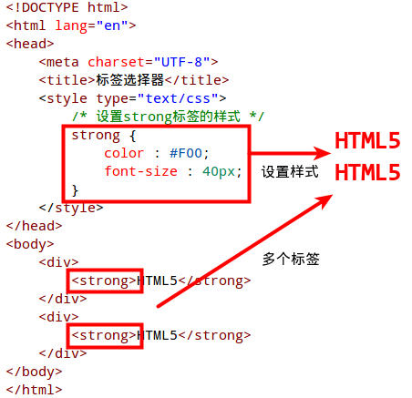
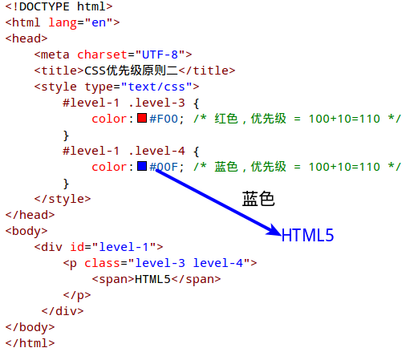
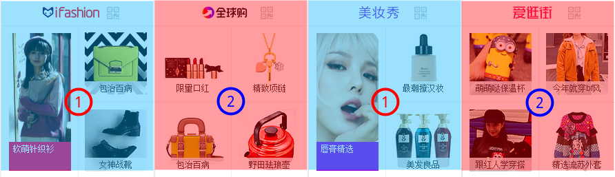

# 第四章 HTML5、CSS3、JavaScript的设计方法

古人云：“学而不思则罔，思而不学则怠”。千百年之前的圣贤已经告诉我们在学习的过程中要不断的思考和实践，即使是已经学过的东西也要思考其中的内在联系，并建立多种解决方案的知识体系，并且比较这些方案之间的优劣。阅读本书的读者一般都具有一定前端开发的知识，本章将不对基本的知识进行讲解，而是重要的且在开发过程经常遇到的各种问题提出相对较好的解决方法，从而抛砖引玉让读者能够向技术的更深层次思考。

#### 本章内容

> * HTML5的语义概念和常用标签
> * CSS3中基本与高级选择器的使用
> * 面向对象编程思想在CSS3中的应用
> * 面向对象编程技术在JavaScript中的应用
> * JQuery的DOM操作和AJAX的异步通讯

## 4.1 HTML5的语义概念和常用标签

2014年10月，这个月对于全世界的大部分人来说没有什么特殊的意义，但是对于IT界确有着不同的思考，因为在这个月HTML5的正式版发布，这也意味着在未来浏览器所支持的标准将越来越统一，页面呈现的效果在不同浏览器之间的差异将越来越小，开发人员也能够把精力更加集中在系统的构建，而不是调整各浏览器之间的兼容性。

然而HTML5标准的最终公布却经历的8年之久，对前端有一定了解的开发者可能知道，W3C（全称：World Wide Web Consortium，万维网联盟）是Web前端领域内多项标准的制定者，但是在1999年发布HTML4.01标准之后，W3C就没有对HTML有进一步的发展，而是有了另起炉灶的想法，但是随着Web系统的体量不断增大，在各种新功能层出不穷的被推出，对于前端的要求越来越高，而此时现有标准的内容已经越来越不能满足这些复杂系统的要求，同时W3C想指定的新标准又迟迟无法公布，因此如Opera、Mozilla基金会和Apple等这样的IT界的巨头决定自己成立一个组织，即WHATWG（全称：Web超文本应用技术工作组），用于推进HTML5的标准化，随后经过多年的博弈W3C决定采用WHATWG所指定的标准，并且将其完成成了现在正式版的HTML5标准，HTML5的图标如图4-1所示。


图4-1 HTML5的图标

### 4.1.1 结构、样式、行为

虽然在HTML5标准推行的过程中出现了WHATWG，但最终的发布者还是W3C，所以和HTML5相关的标准还是秉承了W3C标准的核心理念，即将网页的结构、网页的样式和网页的行为进行分离，各自形成自己的标准，这三个部分的标准就分别对应网页结构的HTML5标准、网页样式的CSS3标准和网页行为的EMCAScript6（即JavaScript）标准，通俗的说在这个核心理念里面HTML只是用来承载整个页面的内容，即有哪些文字和段落，它不会干涉页面的外观，而CSS只是用来负责承载页面的样式，即这个页面长成什么样子，最后的JavaScript则只是承载这个页面类似按下按钮弹窗等一系列的用户交互行为，如图4-2所示。


图4-2 HTML5标准间的关系

在过去传统的Web页面所采用的布局方式是以表格为基础，特别当Dreaweaver中可以实现各种控件的拖拽时，表格的布局就大行其道了，然后科技不断发展，页面要展示的内容也越来越多，复杂程度以几何数增长，同时前端开发人员也渐渐意识需要把程序和美工进行责任分离，使开发人员可以有更多的精力投入到前端代码的实现中，但是此时前端开发人员发现以表格为基础的页面布局存在布局灵活性较差，以及当页面内容复杂时表格的嵌套层次会非常多，从而严重影响后期的维护,如图4-3所示。因此为了解决这个问题，于是发明了DIV+CSS的布局方式，这种布局方式通过纯粹的CSS中浮动、位置等定位方法来实现页面布局，而HTML则专注于实现页面的内容结构，从这一刻起Web前端开发第一次把页面的结构和页面的样式进行分离，如图4-4所示。

（缺图）

图4-3 表格布局的案例

（缺图）

图4-4 DIV+CSS布局的案例

随着时间的推移，网站的重要性越发的重要，像小米在2014年花费360万美金购买域名的案例也不在少数，这些都是为了能让用户更多的了解品牌，然而除了网站域名的重要性外，能够被搜索引擎也是非常重要的，这个就是俗称的SEO（即搜索引擎优化），在网络上搜索引擎是看不见页面的样式，因此页面的好看和难看对于搜索引擎来说都是一样的，它只会搜索页面的结构，而DIV+CSS的布局方式虽然已经在SEO方面进行了很多的改进，但是有许多标签存在语义不明确，且样式和语义混淆的问题，造成无法进行有效的SEO处理，因此HTML5出现的一个很重要的目的就是删除了原先HTML4.01中和页面样式相关的标签，例如center、font、big等一系列标签，而添加了例如section、article、nav等语义更加明确的标签来帮助搜索引擎更好的了解页面的结构，使得用户在搜索时能够把最重要的内容呈现出来。

那么在实际的开发，前端开发人员要正确判断一个页面已经的使用语义标签，有一个简单的方法就是把样式去掉，即页面只以HTML的原本形式进行展示，由于HTML标签本身带有默认的样式，例如标题标签h1，它会把在该标签内的文字变大、变粗，然后通过观察网页的结构是否组织的良好，是否具有很好的可读性，例如标题是方法、重点部分是加粗，如果观察下来结构良好且具有较好的可读性，那么就可以说该页面正确使用了语义标签，如图4-5所示，就是在前端设计中非常著名的网站CSS Zen Garden（即禅意花园），该网站提供了标准的HTML文档，并且给定了一些预设的CSS类名，开发人员可以自己想象随意创造不同的前端，从图中可以看出所有完全不同的页面都具有相同的HTML文档内容，并且结构清晰、层次分明，而一旦加上了CSS就会变得千变万化，但依然突出重点，这就说明该页面的语义标签使用的较好，很好的表达了页面的思想。


图4-5 CSS Zen Garden语义标签的使用

### 4.1.2 HTML5中新增的文档结构标签

上节讲到HTML5出现的一个重要目的就是解决在HTML4.01时代的标签语义不明确造成的文档结构相对混乱的问题，下面的代码就是标准的HTML4.01的文档结构。

```html
<!DOCTYPE html PUBLIC "-//W3C//DTD XHTML 1.0 Transitional//EN" "http://www.w3.org/TR/xhtml1/DTD/xhtml1-transitional.dtd">
<html xmlns="http://www.w3.org/1999/xhtml" xml:lang="en">
<head>
    <meta http-equiv="Content-Type" content="text/html;charset=UTF-8">
	<title>响应式前端框架Bootstrap的使用</title>
</head>
<body>
    <h1>HTML5的语义概念和常用标签</h1>
        <p>014年10月......因为在这个月HTML5的正式版发布</p>
        <h2>结构、样式、行为</h2>
        <p>虽然在HTML5标准......还是秉承了W3C标准的核心理念</p>
        <h2>HTML5中新增的文档结构标签</h2>

    <h1>CSS3中常用的新特性</h1>
</body>
</html>
```

从上面的代码中不难看出，开发人员想表达的是一本书的两个章节，其中第一个`h1`标签到第二个`h1`标签之间的是第一章的内容，第二个`h1`标签开始则是第二章的内容，但在以HTML4.01为标准的时代没有办法通过明确的语义把第一章和第二章进行区分，所以造成SEO在解析时无法把两个`h1`标签之间内容作为第一章的内容，因此在当时开发人员为了解决这个问题，于是乎通过利用div标签外加CSS样式来表达出完整的文档结构文档的结构，具体代码如下：

```html
<!DOCTYPE html PUBLIC "-//W3C//DTD XHTML 1.0 Transitional//EN" "http://www.w3.org/TR/xhtml1/DTD/xhtml1-transitional.dtd">
<html xmlns="http://www.w3.org/1999/xhtml" xml:lang="en">
<head>
    <meta http-equiv="Content-Type" content="text/html;charset=UTF-8">
	<title>响应式前端框架Bootstrap的使用</title>
</head>
<body>
    <div class="section">
        <h1>HTML5的语义概念和常用标签</h1>
        <p>014年10月......因为在这个月HTML5的正式版发布</p>
        <div class="subsection">
            <h2>结构、样式、行为</h2>
            <p>虽然在HTML5标准......还是秉承了W3C标准的核心理念</p>
        </div>
        <div class="subsection">
            <h2>HTML5中新增的文档结构标签</h2>
        </div>
    </div>
    <div class="section">
        <h1>CSS3中常用的新特性</h1>
    </div>
</body>
</html>
```

但是即使是这样还依然无法解决文档结构语义不明却的问题，因为div标签本身没有任何语义，所以也不会因为添加了class属性就获得特殊的意义，同时div的使用在解析文档时也存在语义上的歧义，因为一个div元素可以被定义为章节或者子章节，也可以被用于仅仅为了页面的样式化。换句话说，在HTML4.01标准中章节的定义和章节的范围都不精确。因为在HTML4.01标准中有这类问题的存在，所以在HTML5添加了一系列新的结构标签用于表示具有完整语义的文档结构，如表4-1所示。

表4-1 HTML5中的结构标签

| 标签名 | 描述 |
| :-: | :- |
| address | address标签表示作者的联系方式，如果该标签的父标签是body，那么就表示该页面作者的联系方式，如果该标签的父标签是article，则表示该文章作者的联系方式。 |
| article | article标签表示文档、页面、应用或网站中的独立结构，其意图在于分离可独立、可复用的结构，如论坛帖子、杂志或新闻文章、用户提交的评论、交互式组件，或者其他独立的内容。 |
| aside | aside标签表示页面中可以独立于内容的部分，并且被单独拆分时不会使整体受到影响。一般情况下用于表现为侧边栏或者被独立插入的内容，例如相关的广告、Web应用程序等。 |
| footer | footer标签表示章节内容或者body元素的页脚。一个页脚通常包含该章节作者、版权数据或者与文档相关的链接等信息，这里要注意的是footer标签内的联系信息因在address标签中。 |
| header | header标签表示一组引导性的帮助，可以包含标题元素，也可以包含其他元素，如logo、搜索表单等。 |
| h1~h6 | h1~h6标签表示标题元素有六个不同的级别，h1标签是最高级的，而h6标签则是最低的。 |
| nav | 页面的导航栏，用于表示一个含有多个超链接的区域，这个区域包含转到其他页面，或者页面内部其他部分的链接列表。 |
| section | section标签表示文档中的一个区域（或节），比如一个书的某个章节，通常该标签会有包含一个标题。 |

根据表4-1中内容可以把上方原先语义不明确的代码改为语义更加明确的代码，从而对整个页面进行优化。从下方修改后的代码可以看出该页面一共有两个大章节，分别对应body标签下面两个根section标签，而在第一个section标签中通过h1标签定义了章节的名称，以及通过p标签定义该章节的简介，然后再次利用section定了子章节，最后通过aside标签来定义该章节中的广告页，通过这样的代码调整使得页面的结构更加接近真实世界的文档结构，也符合了HTML5的设计里面。此外HTML5标准中协议申明和head部分都做了相应的简化，不需要像HTML4.01一样书写很长的一段代码，由于具体代码如下：

```html
<!DOCTYPE html>
<html lang="en">
<head>
    <meta charset="UTF-8">
    <title>响应式前端框架Bootstrap的使用</title>
</head>
<body>
    <section>
        <h1>HTML5的语义概念和常用标签</h1>
        <p>014年10月......因为在这个月HTML5的正式版发布</p>

        <section>
            <h1>结构、样式、行为</h1>
            <p>虽然在HTML5标准......还是秉承了W3C标准的核心理念</p>
        </section>
        
        <section>
            <h1>HTML5中新增的文档结构标签</h1>
            <p>上节讲到HTML5出现的......的HTML4.01的文档结构。</p>
        </section>
        
        <aside>
            <p>页面广告</p>
        </aside>
    </section>

    <section>
        <h1>CSS3中常用的新特性</h1>
    </section>

    <footer>
        <p>(c) 2016 XXXX公司</p>
    </footer>
</body>
</html>
```

### 4.1.3 HTML5中增强的多媒体应用

在发布HTML5标准之前，如果想在网页中嵌入视频或者音频，就必须要通过转码以及第三方软件来实现，因此过去在HTML功能欠缺的情况下诸如Flash等软件就非常的火爆，但也存在系统安全性较低、容易被入侵等问题，但是今天在HTML5标准中提供了功能强大的视频和音频标签就解决这一问题，同时原生的标签也大大提高了系统运行速度和系统的稳定性，以及系统的安全性。在HTML5中关于多媒体部分增加了两个标签audio和video，分别对应音频和视频。同时这两个标签在目前几乎所有的最新浏览器上都可以得到支持，而且这两个标签的使用非常简单，方法和使用image标签非常相似，只需要在src属性中添加对应资源的地址就可以，具体代码如下：

```html
<video src="demo.mp4" controls>
    <p>你的浏览器不支持video标签</p>
</video>

<audio src="demo.mp3" controls autoplay loop>
    <p>你的浏览器不支持audio标签</p>
</audio>
```

此外audio和video这两个标签还共同拥有五个属性，用于控制音频或者视频是否自动播放、是否添加控制条、是否循环播放等，如表4-2所示。而video标签则再多两个width和height属性，用于设置video标签的视频大小。

表4-2 audio和video标签的共用属性

| 属性名 | 描述 |
| :-: | :- |
| controls | 为网页中的音频或者视频显示标准的HTML5控制器。 |
| autoplay | 使网页中的音频或者视频自动播放。 |
| loop | 使网页中的音频或者视频自动重复播放。 |
| preload | 用来缓冲音频或者视频，该属性有三个可以选择的值，分别为："none"表示不缓冲文件，"auto"表示缓冲音频或者视频文件，而"metadata"表示仅仅缓冲音频或者视频文件的基本数据，如时间长度等，此外如果设置了autoplay，那么该属性就会被忽略。 |

目前能够被播放器识别的音频和视频的格式有许多种，但是常用就只有mp3、mp4等，而HTML5对于音频和视频各支持三种格式，但是不同的浏览器版本也存在着一定的差异，如表4-3、表4-4所示。这里要特别注意的是Ogg格式指的是带有Theora视频编码和Vorbis音频编码的Ogg文件，MPEG4指的是带有H.264视频编码和AAC音频编码的MPEG 4文件，而WebM则指的是带有VP8视频编码和Vorbis音频编码的 WebM文件。

表4-3 audio标签支持的多媒体格式

| 音频格式 | IE9 | Firefox 3.5 | Opera 10.5 | Chrome 3.0 | Safari 3.0 |
| :-: | :-: | :-: | :-: | :-: | :-: |
| Ogg Vorbis |  | √ | √ | √ |  |
| MP3 | √ |  |  | √ | √ |
| Wav |  | √ | √ |  | √ |

表4-4 video标签支持的多媒体格式

| 视频格式 | IE | Firefox | Opera | Chrome | Safari |
| :-: | :-: | :-: | :-: | :-: | :-: |
| Ogg | No | 3.5+ | 10.5+ | 5.0+ | No |
| MPEG 4 | 9.0+ | No | No | 5.0+ | 3.0+ |
| WebM | No | 4.0+ | 10.6+ | 6.0+ | No |

由此可以看出在不同浏览器或者相同浏览器但版本不同时，它们之间也存在一定的差异，因此HTML5中还提供了一个source标签，用于帮助audio或者video标签提供更多的音频或者视频种类以适应不同浏览器之间差异。该标签有两个属性，分别为src属性用于设置audio或者video标签的资源文件路径和type属性用于设置这些资源文件的MIME字符串，来帮助浏览器更好的解析这些资源，具体代码如下：

```html
<video>
  <source src="demo.ogg" type="video/ogg">
  <source src="demo.mp4" type="video/mp4">
</video>

<audio>
  <source src="demo.wav" type="video/x-wav">
  <source src="demo.mp3" type="video/mpeg">
</audio>
```

### 4.1.4 HTML5中Form表单的新特性

在Web前端开发中表单通常用于登记用户的信息，所以被广泛的应用在各种论坛或门户网站中。在HTML4.01中表单通常只用于填写一些信息，然后把这些数据提交到服务器中，并且在填写这些信息时，主要以文本信息为主。而在HTML5中，表单的功能被大大的增强，使得表单在不同网站上表现的更加一致，同时还能及时的响应用户输入的数据，此外这些增加的特性对于禁止了浏览器脚本的用户也可以起到相同的作用。

在表单中用户输入的最重要的标签是`input`标签，该标签的属性`type`用于设置用户输入的类型，在HTML4.01中该属性有十个值，分别为button、checkbox、file、hidden、image、password、radio、reset、submit、text，这十个值分别表示`input`标签为按钮控件、多选按钮控件、上传文件控件、隐藏控件、图片控件、密码输入框、单选按钮控件、重置表单按钮控件、提交表单按钮控件和文本控件，这些控件基本能够满足日常的需求，但是在HTML5还需要考虑更多的语意和移动端的特性，因此HTML5在HTML4.01的基础上为`type`属性增加了如下四个值：

**1、search：** 该值使`input`标签表现为一个搜索框控件，同时把输入中的换行功能去掉，此外就和`input`的text值效果无异，该属性值的设计主要用于更加清楚的语意表达。

**2、tel：** 该值使`input`标签表现为一个输入电话号码的控件，同时把输入中的换行功能去掉，并且当程序运行在移动端时，用户的输入法会表现为电话输入状态，此外就和`input`的text值效果无异。

**3、url：** 该值使`input`标签表现为一个Web地址输入控件，并且在输入时换行符与首尾的空格都会被自动的删除，此外当用户提交的内容格式不符合标准的URL格式时浏览器是不会允许将表单的值提交给服务器。

**4、email：** 该值使`input`标签表现为一个E-Mail地址输入控件，同样原本text值时的换行功能会被自动删除，同时当程序运行在移动端时，用户的输入法会表现为邮件地址输入状态，当用户提交的内容格式不符合标准的E-Mail格式时浏览器是不会允许将表单的值提交给服务器。

HTML5除了增加`input`标签所表达的控件种类外，还为`input`标签添加了四项关于数据操作的属性，分别如下：

**1、list：** 该属性的使用通常要和HTML5中增加的<datalist>标签相结合，以此来实现类似下拉列表的功能，但是采用这种方式实现的下来列表可以与输入提示相结合，从而给用户更好的体验，其中list属性的值则填写datalist的id，以此进行双方绑定，如图4-6所示。

**2、pattern：** 该属性通常需要和type属性值为text、tel、search、url和email的input元素相结合，在该属性值中填写相应的正则表达式，以此来规范input标签的用户输入内容。

**3、form：** 在HTML4.01标准中表单中的所有内容都必须写在form标签内，但在实际开发中可能这些表单内容无法全部写在form标签内，因此在HTML5为input标题添加了一个form属性，该属性的值需要填写一个表单的ID号以实现input标签和表单的绑定，当绑定完成后该input标签可以不写在form标签内，但却属于绑定的表单，当该表单提交数据时依然会把该input标签的数据一起提交给服务器。

**4、placeholder：** 该属性主要用于input与textarea标签中，以此来提示用户在此需要输入什么内容，需要注意的是placeholder属性的内容不包含回车与换行，如图4-7所示。

**5、autofocus：** 该属性可以是表单内的某个一个控件自动获得焦点，需要注意的时是在一个HTML文件内容只有一个表单中的某一项能够拥有autofocu属性，此外当autofocus属性用于type值为hidden的input标签时，autofocus不会产生任何效果。


图4-6 select和datalist的区别


图4-7 placeholder属性的使用

## 4.2 CSS3中基本与高级选择器的使用

Cascading Style Sheets是CSS的英文全称，翻译成中文就是“层叠样式表”的意思，是在前端设计领域内专门用于开发页面样式的一种语言，正如4.1节所说的通过CSS可以帮助Web页面实现内容和样式的分离，此外CSS的使用还能够避免样式代码的重复，使得后期在维护是更加的容易，同时当Web被用于不同场合时，可以通过CSS来实现内容相同的情况下却呈现不同样式。

在过去由于Web设计标准存在滞后性与缺陷，因此造成了当时的Web开发者使用了错误的语法，然而各个浏览器厂商为了使自己的浏览器能够向后保持兼容，让这些存在缺陷的Web页面能够正常的解析，于是就发明了两种解析Web页面的模式，即标准模式（strict mode）和怪异模式（quirks mode）。其中标准模式指的是严格按照W3C制定的标准进行解析，而怪异模式指的是采用浏览器厂商自己的标准进行解析，这就造成采用这两种模式解析的网页相差甚远，其中最为显著的一个区别就是关于CSS中盒子模型宽度的界定，在标准模式下盒子模型的宽度由内容大小（width）、内边距大小（padding）和边框大小（border）三部分之和组成，而在怪异模式下盒子模型的内容大小就是已经包括了内边距大小（padding）和边框大小（border），没有把三个值进行分离，虽然看上去时很小的区别，但是在页面布局时却差别非常大。

因此在过去开发Web时都需要指定DTD（英文全程：Document Type Definition），即文档类型定义，通过指定DTD可以告诉浏览器采用那种模式进行Web解析，而到了今天HTML5的发布改变了这些，在HTML5中不再需要指定DTD，因为每个浏览器的厂商都采用相同的标准进行解析，使得Web代码在各个浏览器上能够基本保持一致性，CSS3的图标如图4-8所示。


图4-8 CSS3的图标

### 4.2.1 层叠样式表中层叠的概念

在本节的开头讲过CSS的中文名叫做层叠样式表，那么其中就有两个概念，第一个是样式表，第二个就是层叠。第一个概念非常好理解，所谓样式表就是定义用于定义页面的外观，也就是这个原因HTML5才摒弃了在HTML4.01时代很多和样式相关的标签，而把更多的和样式设置放到CSS中。而另外一个概念层叠就不是很容易理解。

在一个Web程序中，页面中的每一个元素的样式通常都是由许多个样式表共同来完成，如图4-9所示，可以看到一个div元素有多个CSS样式进行修饰。CSS正是通过各种不同方式，以及相对复杂的嵌套关系来为某个一个元素定义其样式，也就是这样复杂的关系才使得CSS具有如今强大的功能。通常来说层叠的来源主要有以下三种：

1、浏览器对于HTML元素的默认样式。

2、用户自定义的样式，例如Firefox中，可以通过“首选项”对话框中可以自定义样式，也可以建立一个单独的userContent.css的样式文件并放到“用户配置”的文件夹中。

3、开发者定义的样式，这种样式也有三种形式，即定义在外部文件的样式、定义在页面头部的样式，以及定义在特定元素本身的样式。


图4-9 标签的CSS修饰

当在HTML中使用strong标签时会发现strong标签内所呈现的字体会相对正常字体粗一些，这个就是上面所说的浏览器默认的样式，而当通过CSS代码把strong标签内容的文字变成红色时，那次开发人员定义的样式就覆盖浏览器的默认样式，此外如果在strong标签外添加一个父标签p，那么此时的strong就会继承p标签中的样式，同时p标签也会继承body标签标签中的许多样式，如图4-10所示。由此可以看出在CSS中样式的优先级就是开发者定义的样式优先级最高，然后时用户自定义的样式，最后才是浏览器的默认样式。

因此知道CSS的层叠概念就是标签和标签之间的继承继承关系，子标签覆盖父标签中的一些样式，同时子标签还继承父标签中的其他样式。


图4-10 CSS的层叠概念

### 4.2.2 CSS3中的基本选择器的使用

在CSS中要唯一的标识一个HTML标签、一类HTML标签以及一群不同类型的HTML标签，并改变他们的样式，那么就需要使用CSS的选择器，CSS只有通过使用选择器才能够精确的控制HTML中的任意元素。在图4-10中的代码中已经初步使用了选择，通过选择器的使用来控制body、p、strong标签的样式。CSS3中选择器的类型一共分为六种选择器，分别如下：

**1、标签选择器：** 即以HTML标签作为标识，来改变指定标签的样式，并且只要是HTML标签都可以作为标签选择器的对象，CSS不做任何的限制，所以图4-11就是一个典型的标签选择器。此外，当在HTML文档中出现多个相同的标签，那么这些标签都会根据CSS设定的样式进行改变，如图4-11所示。



图4-11 CSS的标签选择器

**2、类型选择器：** 在前端开发中经常需要使用Button组件，那么如果每用一个Button就为这个Button设计一个样式就显得非常繁琐，因此CSS为HTML标签提供一个class属性，该属性可以帮助开发人员进行HTML标签的分类，并且class的属性值可以任意的设置，但还是建议使用有意义的名称。此外CSS并不限制HTML标签的中class属性值的个数，所以可以使用多个属性值来共同为某个HTML标签添加样式，这也是在前端设计中所推荐的方法，但这里要注意的是在使用多个class属性值时每个属性值都需要用空格作为间隔，并且如果值的名称由多个单词组成，那么单词与单词之间需要用"-"符号作为间隔（例：class = "big-font red-font"）。最后在定义class时则需要在这些类型名字前面增加“.”符号（例：.big-font {font-size : 40px;}），此外如果要为某个元素指定定义class时就需要在“.”符号前添加元素标签（例：p.red-font {font-size : 40px; color : #F00;}），如图4-12所示。


图4-12 CSS的类型选择器

**3、ID选择器：** 在网页开发中有个不成文的规定就是当在一个页面中需要使用ID时，那么在该页面中的ID就不能够重复，必须具有唯一性，而Class因为标识一类标签因此可以重复。虽然在页面中如果出现两个相同的ID不会导致页面无法渲染，但是这与ID所表示的语意产生了冲突。因此如果要在页面中唯一修改某个位置上的某一个标签，那么就需要使用ID选择器，ID选择的使用和类型选择器很相似，但是ID选择器的前缀不是“.”而是“#”（例：#black-board {border-style: solid; border-width: 5px; border-color: #F00;}），如果要明确的标记某一个ID元素的样式，那么就要在“#”符号前面添加元素标签（例：strong#big-font {font-size : 40px;}），如图4-13所示。


图4-13 CSS的ID选择器

**4、属性选择器：** 当在了解网页开发相关的基础后，开发网页就不再是从头开始也代码，而是使用某一个前端框架作为基础，那么此时该框架为了实现多种不同的效果，就会为网页添加许多默认的Class和ID，此时的开发人员在进行基于此框架的二次开发时就需要根据不同属性内容添加不同的属性，此时就需要使用属性选择器，属性选择器依据使用场景的不同可以分为五种，具体格式如下：

* 元素标签[属性名]：对具有该属性名的元素标签进行样式设定。
* 元素标签[属性名=属性值]：对具有该属性名，且值等于该属性值的元素标签进行样式设定。
* 元素标签[属性名^=字符串]：对具有该属性名，且值中以该字符串为开头的元素标签进行样式设定。
* 元素标签[属性名$=字符串]：对具有该属性名，且值中以该字符串为结尾的元素标签进行样式设定。
* 元素标签[属性名*=字符串]：对具有该属性名，且值中以包含字符串的元素标签进行样式设定。

这里需要注意的是上面五种属性选择其中的最后三种为CSS3标准中新添加的，因此如果使用相对较老的浏览器可能会不支持这种方式，具体使用方法具体4-14所示。


图4-14 CSS的属性选择器

**5、伪类选择器：** 在前端开发经常会碰到这样类似的需求，即需要设置按钮的普通状态、按钮的点击状态和按钮的鼠标触碰状态时的样式，另外还有需要给一群具有相同样式标签中的第一个或最后一个标签单独添加样式，这些需求都无法使用上面的选择器来完成，那么为了解决这个问题CSS3就为开发人员提供了伪类选择器。伪类选择器的使用并不会在原本的基础上添加新的Class或者ID，而是为已经存在的元素或者选择进行更加精确的选择或者为元素不同状态添加不同的样式，伪类选择器共分为两大类，即状态选择器和查询选择器，两大类总共十五个常用选择器，具体如下：

（1）状态选择器：在该类中共有八个伪类选择器，用于为标签或者选择器选中的标签设置各个状态样式。

* :link：该选择器表示选择未被访问的链接并添加样式，应用格式为在:link之前添加标签或者选择器，例：a:link {color: #FF0000}或者a.red:link {color: #FF0000;}。
* :visited：该选择器表示选择已被访问的链接添加样式，应用格式为在:visited之前添加标签或者选择器，例：a:visited {color: #00FF00}或者a.red:visited {color: #FF0000;}。
* :active：该选择器表示选择被激活的元素添加样式，应用格式为在:active之前添加标签或者选择器，例：a:active {color: #0000FF}或者a.red:active {color: #FF0000;}。
* :hover：该选择器表示选择当鼠标悬浮在元素上方时，向元素添加样式，应用格式为在:hover之前添加标签或者选择器，例：a:hover {color: #FF00FF}或者a.red:hover {color: #FF0000;}。
* :focus：该选择器表示向拥有输入焦点的元素添加样式，应用格式为在:focus之前添加标签或者选择器，例：a:focus {color: #00FF00}或者a.red:focus {color: #FF0000;}。
* :checked：该选择器表示向单选按钮、多选按钮以及下拉选项中被选中的项添加样式，应用格式为在:checked之前添加input、option标签及相关选择器，例：input[type="radio"]:checked {margin-left: 25px;}或者option:checked {color: red;}。
* :enabled：该选择器表示向任何可用的元素添加样式，即一个能够被激活（如选择、点击或接受文本输入）或获取焦点的元素，应用格式为在:enabled之前添加标签或者选择器，例：input:enabled {color: #22AA22;}。
* :disabled：该选择器表示向任何被禁用的元素添加样式，即一个不能够被激活（如选择、点击或接受文本输入）或获取焦点的元素，应用格式为在:disabled之前添加标签或者选择器，例：input[type="text"]:disabled {background: #ccc;}。

这里需要特别说明的是在状态选择器中:link、:visited、:active、:hover这四个经常组合起来应用于描述一个按钮，但是在设置的时候需要按照一定的顺序，如果顺序错误会导致样式添加失败，其正确的声明顺序为:link -> :visited -> :hover -> :active，具体使用方法如图4-15所示。


图4-15 CSS的伪类选择器中的状态选择器

（2）查询选择器：在该类中共有七个伪类选择器，用于帮助标签或者选择器选中的某个位置上的元素。

* :first-child：该选择器表示向某个元素的第一个子元素添加样式，应用格式为在:first-child之前添加标签或者选择器，例：p:first-child {font-weight:bold;}。
* :nth-child(an+b)：该选择器表示向具有相同父标签，满足在父标签中从前向后数第an+b个子标签元素，并且该子标签元素与在该选择器前添加的元素相同时所添加的样式，其中n的取值范围为大于或等于0，b是定位的偏移量，应用格式为在:nth-child(an+b)之前添加标签或者选择器，例：tr:nth-child(2n+1) {background: #ccc;}，表示设置表格的奇数行添加背景样式。
* :nth-last-child(an+b)：该选择器表示向具有相同父标签，满足在父标签中从后向前数第an+b个子标签元素，并且该子标签元素与在该选择器前添加的元素相同时所添加的样式，其中n的取值范围为大于或等于0，b是定位的偏移量，应用格式为在:nth-last-child(an+b)之前添加标签或者选择器，例：tr:nth-last-child(-n+4){font-weight:bold;}，表示设置表格的最后四行的字体为加粗。
* :nth-of-type(an+b)：该选择器表示向具有相同父标签，且满足父标签中从前向后第an+b个匹配的子标签元素添加样式，其中n的取值范围为大于或等于0，b是定位的偏移量，应用格式为在:nth-of-type(an+b)之前添加标签或者选择器，例：p:nth-of-type(2n+1) {text-align: left;}，表示设置p标签在奇数位的样式为字体左对齐。
* :first-of-type：该选择器表示匹配父元素的所有该子元素类型中第一个出现的元素。应用格式为在:first-of-type之前添加标签或者选择器，例：div:first-of-type {background-color: #F00;}，表示设置第一个父标签下的第一个div标签的背景颜色为红色。
* :last-of-type：该选择器表示匹配父元素的所有该子元素类型中最后一个出现的元素。应用格式为在:last-of-type之前添加标签或者选择器，例：div:flast-of-type {background-color: #F00;}，表示设置第一个父标签下的最后一个div标签的背景颜色为红色。
* :empty：该选择器表示匹配没有子元素的元素。应用格式为在:empty之前添加标签或者选择器，例：div:empty {background-color: #F00;}，表示设置没有子元素的div标签的背景颜色为红色。

这里需要特别说明的是在查询选择器中经常会用于实现表格的斑马纹，此外还有很多方面的应用，这里以表格的斑马纹为例示范查询选择器的使用，具体方法如图4-16所示。


图4-16 CSS的伪类选择器中的查询选择器

### 4.2.3 CSS3中的关系选择器的使用

在上一节主要讲了CSS3中几种基本选择器，这些基本选择器都能够很好的找到页面中一个或者一类选择器，但是在实际的开发中CSS的选择要复杂的多，例如在页面中三个ClassB，它们分别在IDA、IDB、IDC下，那么此时如果要修改IDB下的ClassB样式就会发现上面的基本选择器没有办法做到，因此就需要使用CSS3中的关系选择器，关系选择器和伪选择器类似，它不会向代码中添加任何一个Class或者ID，而是通过定义多个选择器之间的关系来精确的定位到某一个标签，从而精确的修改其样式。CSS3中的关系选择器一共有五种，具体代码如图4-17所示，其五中关系管择期的意义分别如下。

**1、包含选择器：** 即SelectionA SelectionE {...}，也就是说定位SelectionA选择器下面的SelectionE选择器，A选择器和E选择器可以是元素，也可以是某个基本选择器。

**2、后代选择器：** 即SelectionA > SelectionE {...}，也就是说定位SelectionA选择器下面的SelectionE选择器，但是与包含选择器选择器不同的是，包含选择的样式可以渗透到SelectionA选择器的直接子元素、子元素的子元素，甚至更深的层次，但是后代选择器只能渗透到SelectionA选择器的直接子元素。

**3、相邻兄弟选择器：** 即SelectionA + SelectionE {...}，也就是说定位SelectionA后紧跟着的与SelectionA同级，且SelectionA具有相同父元素的SelectionE选择器。

**4、兄弟选择器：** 即SelectionA ～ SelectionE {...}，也就是定位SelectionA之后与SelectionA同级，且具有相同父元素的所有SelectionE选择器。

**5、组合选择器：** 即SelectionA, SelectionB, SelectionC, ... {...}，也就是定位SelectionA、SelectionB、SelectionC等多个选择器，为这些选择设置共同的样式。


图4-17 CSS的关系选择器的使用

### 4.2.4 CSS3中选择器优先级的计算

在上几节讲到网页设计中修饰一个元素通常不会只用一个CSS，而是通过多种样式的叠加来达到最终的效果，在这些样式中可能有些是整个页面的全局设置，可能有些是该页面中某个区域的设置，甚至有些设置只单独针对某一个控件，这些不同的样式通过一种规则有序的组合在一起形成了多样的页面，这个规则就是CSS3中选择器优先级。

正如前文所述，修饰一个元素通常有五种方式，分别为标签选择器、类型选择器、属性选择器、ID选择器，以及行内样式，同时各个选择器的优先级又由选择器的特殊性来决定，即针对性越强的选择器其优先级就会越大，而针对性相对一般的选择器则优先级就会越低。因此根据这一原则把标签选择器、类型选择器、属性选择器、ID选择器，以及行内样式这五种样式修饰方法的优先级分别定义为1、10、10、100、1000，如图4-18所示。


图4-18 CSS中选择器的优先级

从上面的图中可以知道行内样式的优先级最高，因为它的针对性最强，即只针对某一个标签进行设置，而标签选择器则标识只要是该页面中的指定标签都会获得其样式，具有最广泛的普适性，因此优先级最低。而在前端开发中浏览器引擎会计算样式的优先级，计算的方法就是样式所包含的对应优先级数值进行相加，最后得到某个样式的优先级，如果该样式计算得到的优先级比另外一个样式的优先级高，那么高优先级的样式就覆盖低优先级的样式。

例如下面的CSS代码，可以得到ID选择器#header和#left的优先级为100，标签选择器ul、li、a的优先级为1，类选择器.first的优先级为10，所以最后计算得到总的优先级值为213=100+100+1+1+10+1。

```css
#header #left ul li.first a {...}
```

除了上面五种选择器外，CSS中的选择器还有通用选择器（*）、子选择器（>）、相邻兄弟选择器（+）、兄弟选择器（～），以及伪选择器，但是这些选择器都不在优先级的计算范围内，因为这些选择器的优先级值都为0。此外CSS样式设定中还有一个关键字可以破坏这些预先设定的规则，该关键字就是“!important”，被该关键字修饰的样式不论本身计算得到优先级是多少，该样式的优先级都会变成最高。因此，综上所述可以得到在CSS编程时关于优先级的五条基本原则，具体如下：

原则一：当选择器的优先级数值越大，则其优先级就越高。所有的选择器都有其优先级的值，即使像伪选择器这样的选择也有其优先级的值，只不过为0，因此在参与运算时不影响最终得到的值。代码如图4-19所示，在该例子中虽然使用了关系选择器，但是没有影响优先级，不过因为数字2的代码要比数字1的代码后定义，因此在优先级相同的情况下数字2的代码覆盖了数字1的代码，所以最终的结果呈现红色。


图4-19 关系选择器不影响优先级

原则二：写在后面的样式优先级要高于写在前面的优先级。在标签的样式列表中，如果这些样式的优先级相等，那么越靠近过末尾的其优先级就越高。代码如图4-20所示，在该例子中样式的优先级相同，但是level-4出现的位置要比level-3靠后，因此最终level-4的优先级要比level-3高，所以最终的结果呈现蓝色。



图4-20 靠后的样式优先级高

原则三：每个浏览器引擎都会有自己的样式，但是开发人员所设置的样式优先级要高于浏览器引擎所设置的样式优先级。

原则四：因为CSS是层叠样式，因此子标签会继承父标签的样式，但是给子标签重新设置的样式优先级要会高于从父标签继承的优先级。代码如图4-21所示，在该例子中虽然第二个样式的优先级没有第一个样式的优先级高，同时这两个样式都作用于span这个标签，但是span获取第一个样式的设置是通过继承的方式，而获取第二个样式的设置则时是通过重新设置，因此重新设置的优先级要比继承高，所以最终的结果呈现红色。


图4-21 继承的样式优先级较低

原则五：“!important”会破坏原有的优先级，并且直接把样式的优先级变为最高。代码如图4-22所示，在该例子中虽然两个color的优先级相同，但是因为第一个color有一个“!important”的修饰，因此其优先级变为最高，所以最终的结果呈现蓝色。


图4-22 !important获取最高优先级

## 4.3 面向对象编程思想在CSS3中的应用

在上节中介绍了许多种CSS的样式选择器，如标签选择器、类别选择器、ID选择器等，同时还讲述了以及各种选择器在使用时优先级的计算。在掌握这些内容后，开发人员又会面临新的问题，即在实际开发中可能一个问题的解决方法有许多种，那么该如何选择一个比较好的解决方案就是本节要解决的问题。

目前常用的编程语言中除了C语言之外，几乎所有的语言都会提到一个概念，即面向对象，甚至在某购物网站还有关于运用面向对象的思想来编写C语言的书籍，因此可以说面向对象的概念被广泛并深刻的应用在各个领域，并由此产生了一系列的编程方法和编程思想。面向对象概念的流行是因为这种思维模式符合人们在现实生活中对客观事物的理解，能够更加准确的描述问题。

### 4.3.1 CSS3中“类”概念的应用

在前端设计中要运用现有的CSS知识去实现某一个单独的页面其实并不是很复杂，但要实现一个可维护、可扩展的，并且风格统一的CSS系统就实属不易，好在2008年由Nicole Sullivan首次提出了OOCSS的概念改变这一切，今天的我们就可以站在这些巨人的肩膀上来避免重复造轮子的问题。OOCSS即面向对象的CSS，其核心思想主要是减少CSS对HTML结构的依赖，并且增加CSS代码的重用性，从而提高开发效率。

在面向对象的概念中“类”这个概念非常的重要，很多如封装性、继承性、依赖倒置、多用组合少用继承的概念都源于“类”，因此要借鉴面向对象的概念来实现OOCSS时，首先就需要在CSS开发中引入“类”概念。所谓类，就是把页面进行模块化，如图4-23所示。在图中可以看出整个页面按照其结构可以分为两个模块，分别是模块1所示的左边一张大图，右边两张小图构成的部分，以及模块2所示的由四张小图组成的部分，因此在设计代码时可以把模块1和模块2分别设计其代码，并且在今后的页面中进行复用。



图4-23 页面模块化

但仔细看就可以发现，其实模块1和模块2之间任然有相同的部分，即在这两个模块的上面都有一个标题栏，这个标题栏包含了Logo、文字，以及二维码，那么如果我们基于图4-23所示的结构进行代码设计时就会在每个模块中把标题栏都去重复的实现一遍，这样不仅造成代码的冗余，而且在后期如果需要修改标题样式时也需要去修改每个模块中的标题样式，无形中增加了后期代码维护的成本，因此在进行模块设计时可以把标题栏部分单独剥离出来，形成一个独立的模块，如图4-24所示。通过模块的剥离不仅减少了代码的冗余，同时在后期修改时也只需要修改该模块的代码，而不用到每个模块1、模块2等中一个个的修改，从而减少了代码维护的成本。


图4-24 剥离标题栏

通过上面的分析可以得到页面设计的第一个原则，即在页面设计时尽量要保证页面中各个模块之间不含有相同的成分，如果有相同的成分，那么就将它进行剥离，形成一个独立的模块。其实图4-24中的拆分还没有完善，因为仔细观察模块2中会发现虽然模块2的结构与模块1的结构不同，但是模块2中每个方格的样式却和模块1右边的方格样式是相同的，所以在进行模块划分时可以把模块1和模块2中的小方格在进行剥离，形成模块4，如图4-25所示。


图4-25 完整的模块划分

在实际开发中模块的拆分通常会按照模块尽可能的简单，以提高模块的重用性，但是随着页面越来越复杂，拆解页面后产生的小模块就会越来越多，这样也无形中增加了另一种代码维护的难度，因此作为开发人员需要在模块的数量上和结构的单一性上做权衡，所以由此可以得带页面设计的第二个原则，就是在保证模块数量尽可能少的前提下，尽量做到模块的简单，以提高重用性。这两个原则就是面向对象程序设计中的“单一职责”。通常情况下一个类的功能越是简单，那么这个类的稳定性就越高，同时能够被重用的机会就越大，而如果一个类的功能太多，那么类的重用性就会相对较低。

### 4.3.2 “命名空间”在CSS3中的应用

在前端页面的开发中很多时候都会为一个CSS中选择器的名字而烦恼，因为在当前协作开发较为普遍的环境下很容易出现命名相同造成冲突的问题。通常来说CSS采用有意义的英文进行命名，例如页面头部的CSS通常采用head命名，页面内容的CSS通常采用main或者content进行命名，而页面尾部的CSS则采用foot进行命名，虽然这些命名都没有强制的要求，但是从目前约定俗成的规范来说这样的命名是最为合适的。

此外，一般的CSS选择器的命名上通常有两种命名方法，一种叫做划线命名法，类似于xxx-xxx这样的命名，另一种则是驼峰命名法，即命名的第一个单词全部小写，从第二个单词开始首字母大写，类似于redBorder这样的命名。采用这两种命名方法可以清楚地将单词进行分割，提高命名的可读性，但是在实际开发时如果只是单纯的运用其中的一种命名方法不仅影响代码的可读性，还不利于后期的维护，因此通用的做法是把划线命名法和驼峰命名法进行融合，同时应用于项目中，如下面的代码：

```html
<!DOCTYPE html>
<html lang="en">
<head>
    <meta charset="UTF-8">
    <title>CSS的命名空间</title>
    <style type="text/css">
        .jobList {...}
        .jobList .last {...}
    </style>
</head>
<body>
    <ul class="jobList">
        <li>班主任</li>
        <li>辅导员</li>
        <li>专业主任</li>
        <li class="last">院长</li>
    </ul>
</body>
</html>
```

在上面的代码中通过类别选择器".jobList"来设定无序列表的样式，同时为最后一个列表项单独添加了一个类别选择器“.last”，并通过子选择器“.jobList .last”来设定最后一项的样式，采用这种方法可以完成系统的要求，但在协作开发中这种方法会因为命名过于简单，且是常用单词，造成不同开发人员之间的样式冲突，为后期的代码维护和扩展造成严重的问题，并且这一类问题在解决时也异常的困难。那么此时如果把".last"改为".jobListLast"就可以很好的降低命名的冲突，可是从CSS的结构上看".last"是隶属于".jobList"，而".jobListLast"这样的命名并没有体现出这一点。

在面向对象的概念中有一个很重要的概念——“封装性”，通过“封装性”可以把编程的对象分为“公有”和“私有”两个部分，“公有”的部分可以看做是系统对外交流的接口，而“私有”的部分则可以看做是系统内部的，并不对外公开的部分。通常来说在面向对象的程序设计中，开发人员会尽量的减少对外的借口，做到必要且充分即可，而把其他的功能都变为“私有”，采用这种设计方法可以使得系统内部不论怎么修改都不会对外界的其他部分造成影响，从而提高了整个系统的稳定性。

虽然CSS没有“封装性”这个概念，但可以把这个概念从面向对象的概念中衍生到CSS中，即要求CSS选择器的命名中能够体现“封装性”，根据这一要求可以把划线命名法和驼峰命名的特点相结合，并应用到".jobListLast"中，最终该选择器可以命名为".jobList-last"，在这个命名中“.jobList”可以看做是一个“公有”的部分，而".jobList-last"中的“last”则可以看做是在“.jobList”这个命名空间下的私有的部分。这样的命名不仅有较高的可读性，而且还能体现选择器和选择器之间的隶属关系。如果采用这种方法还会产生冲突，那么就可以为小组中的每个开发人员起一个代号，然后在选择器的命名时在最前面添加上这个代码，从而把选择器的冲突降到最低。

### 4.3.3 “多用组合，少用继承”原则在CSS3中的应用

前文讲过CSS又称“层叠样式”，在父标签和子标签之间具有继承的特性，同时在类别选择器中可以通过组合的方式为某一个标签添加多个样式，而在面向对象的程序设计中也同样有这两个概念，因此很多面向对象的程序设计中会出现的问题也会出现在CSS中。

所谓继承，就是把多个具有相同特性的东西进行抽象并形成一个父类，在父类中包含各个子类所共有的功能，而子类中除了包含父类的功能外，还包含其自身所特有的功能，通过继承可以很方便的为父类拓展新的功能，但是继承也存在一些问题，就是基于父类的任何微小变化都需要重新定义一个类，很容易引起“类爆炸”——即类数量的大幅增加，从而产生一堆不同粒度的子类，增加了系统维护的难度。而组合的概念则与继承不同，组合是将一个复杂的类拆分为稳定的部分和容易变化的部分，并把容易变化的部分单独拆分出来变为几个功能单一的独立类，而把稳定的部分变为主类，然后通过主类与不同独立类之间的组合来实现标签的不同功能。采用组合的方式可以大大减少类的数量，可以帮助程序更加的健壮，也更有弹性，下面通过两个代码的比较来进行说明，具体代码如下：

```html
<!DOCTYPE html>
<html lang="en">
<head>
    <meta charset="UTF-8">
    <title>方式一：采用继承</title>
    <style type="text/css">
        .classJob, .gradeJob, .specialtyJob { border-width: 5px; }
        .classJob li, .gradeJob li, .specialtyJob li { font-size: 20px; }
        .gradeJob li { color: red; }
        .specialtyJob li { color: blue; }
    </style>
</head>
<body>
    <ul class="classJob">
        <li>班主任</li>
    </ul>
    <ul class="gradeJob">
        <li>辅导员</li>
    </ul>
    <ul class="specialtyJob">
        <li>专业主任</li>
    </ul>
</body>
</html>
```

```html
<!DOCTYPE html>
<html lang="en">
<head>
    <meta charset="UTF-8">
    <title>方式一：采用组合</title>
    <style type="text/css">
        .job { border-width: 5px; }
        .f20 { font-size: 20px; }
        .red { color: red; }
        .blue { color: blue; }
    </style>
</head>
<body>
    <ul class="job">
        <li class="f20">班主任</li>
    </ul>
    <ul class="job">
        <li class="f20 red">辅导员</li>
    </ul>
    <ul class="job">
        <li class="f20 blue">专业主任</li>
    </ul>
</body>
</html>
```

上面两段代码相同的是都可以实现同样的想过，不同的是实现的方法不同，第一个代码采用的是继承的方法来实现，而第二个代码则采用组合的方法来实现。此时读者可以思考，如果这个时候我在body里面再添加一个新的ul标签会得到什么样的结果？对于使用继承方式来实现的程序需要在样式表中添加一个新的class，并为这个标签再添加不同的样式，包括该标签的子标签，而采用组合方式实现的程序只需要在新的ul标签的class属性中添加现有的选择器就可以实现，大大减少了类别选择器的数量，同时也使得程序更具有灵活性，由此可以得出在设计CSS时的第三个原则就是“多用组合，少用继承”，具体代码如下：

```html
<!DOCTYPE html>
<html lang="en">
<head>
    <meta charset="UTF-8">
    <title>方式一：采用继承</title>
    <style type="text/css">
        .classJob, .gradeJob, .specialtyJob, .collegeJob { border-width: 5px; }
        .classJob li, .gradeJob li, .specialtyJob li, .collegeJob li { font-size: 20px; }
        .gradeJob li { color: red; }
        .specialtyJob li { color: blue; }
        .collegeJob li { color: blue; }
    </style>
</head>
<body>
    <ul class="classJob">
        <li>班主任</li>
    </ul>
    <ul class="gradeJob">
        <li>辅导员</li>
    </ul>
    <ul class="specialtyJob">
        <li>专业主任</li>
    </ul>
    <ul class="collegeJob">
        <li>院长</li>
    </ul>
</body>
</html>
```

```html
<!DOCTYPE html>
<html lang="en">
<head>
    <meta charset="UTF-8">
    <title>方式一：采用组合</title>
    <style type="text/css">
        .job { border-width: 5px; }
        .f20 { font-size: 20px; }
        .red { color: red; }
        .blue { color: blue; }
    </style>
</head>
<body>
    <ul class="job">
        <li class="f20">班主任</li>
    </ul>
    <ul class="job">
        <li class="f20 red">辅导员</li>
    </ul>
    <ul class="job">
        <li class="f20 blue">专业主任</li>
    </ul>
    <ul class="job">
        <li class="f20 blue">院长</li>
    </ul>
</body>
</html>
```

## 4.4 面向对象编程技术在JavaScript中的应用


## 4.5 JQuery的DOM操作和AJAX的异步通讯


