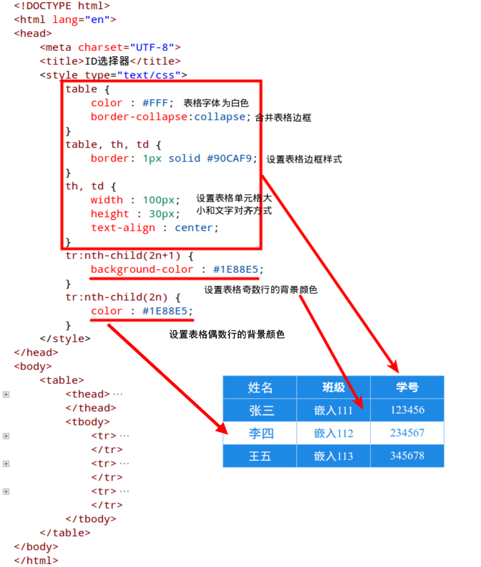
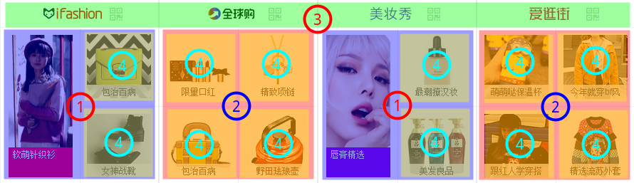
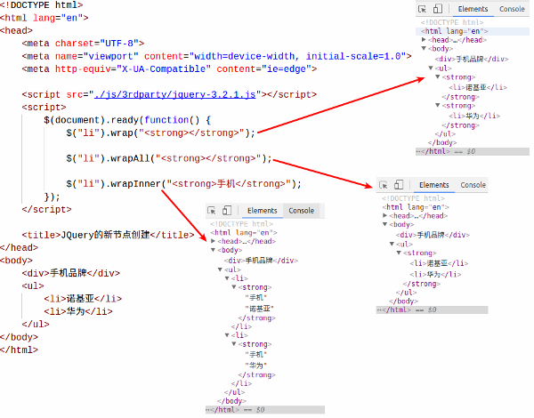

# 第五章 HTML5、CSS3、JavaScript的设计方法

古人云：“学而不思则罔，思而不学则怠”。千百年之前的圣贤已经告诉我们在学习的过程中要不断的思考和实践，即使是已经学过的东西也要思考其中的内在联系，并建立多种解决方案的知识体系，并且比较这些方案之间的优劣。阅读本书的读者一般都具有一定前端开发的知识，本章将不对基本的知识进行讲解，而是重要的且在开发过程经常遇到的各种问题提出相对较好的解决方法，从而抛砖引玉让读者能够向技术的更深层次思考。

#### 本章内容

> * HTML5的语义概念和常用标签
> * CSS3中基本与高级选择器的使用
> * 面向对象编程思想在CSS3中的应用
> * 面向对象编程技术在JavaScript中的应用
> * JQuery的DOM操作和AJAX的异步通讯

## 5.1 HTML5的语义概念和常用标签

2014年10月，这个月对于全世界的大部分人来说没有什么特殊的意义，但是对于IT界确有着不同的思考，因为在这个月HTML5的正式版发布，这也意味着在未来浏览器所支持的标准将越来越统一，页面呈现的效果在不同浏览器之间的差异将越来越小，开发人员也能够把精力更加集中在系统的构建，而不是调整各浏览器之间的兼容性。

然而HTML5标准的最终公布却经历的8年之久，对前端有一定了解的开发者可能知道，W3C（全称：World Wide Web Consortium，万维网联盟）是Web前端领域内多项标准的制定者，但是在1999年发布HTML4.01标准之后，W3C就没有对HTML有进一步的发展，而是有了另起炉灶的想法，但是随着Web系统的体量不断增大，在各种新功能层出不穷的被推出，对于前端的要求越来越高，而此时现有标准的内容已经越来越不能满足这些复杂系统的要求，同时W3C想指定的新标准又迟迟无法公布，因此如Opera、Mozilla基金会和Apple等这样的IT界的巨头决定自己成立一个组织，即WHATWG（全称：Web超文本应用技术工作组），用于推进HTML5的标准化，随后经过多年的博弈W3C决定采用WHATWG所指定的标准，并且将其完成成了现在正式版的HTML5标准，HTML5的图标如图5-1所示。


图5-1 HTML5的图标

### 5.1.1 结构、样式、行为

虽然在HTML5标准推行的过程中出现了WHATWG，但最终的发布者还是W3C，所以和HTML5相关的标准还是秉承了W3C标准的核心理念，即将网页的结构、网页的样式和网页的行为进行分离，各自形成自己的标准，这三个部分的标准就分别对应网页结构的HTML5标准、网页样式的CSS3标准和网页行为的EMCAScript6（即JavaScript）标准，通俗的说在这个核心理念里面HTML只是用来承载整个页面的内容，即有哪些文字和段落，它不会干涉页面的外观，而CSS只是用来负责承载页面的样式，即这个页面长成什么样子，最后的JavaScript则只是承载这个页面类似按下按钮弹窗等一系列的用户交互行为，如图5-2所示。


图5-2 HTML5标准间的关系

在过去传统的Web页面所采用的布局方式是以表格为基础，特别当Dreaweaver中可以实现各种控件的拖拽时，表格的布局就大行其道了，然后科技不断发展，页面要展示的内容也越来越多，复杂程度以几何数增长，同时前端开发人员也渐渐意识需要把程序和美工进行责任分离，使开发人员可以有更多的精力投入到前端代码的实现中，但是此时前端开发人员发现以表格为基础的页面布局存在布局灵活性较差，以及当页面内容复杂时表格的嵌套层次会非常多，从而严重影响后期的维护,如图5-3所示。因此为了解决这个问题，于是发明了DIV+CSS的布局方式，这种布局方式通过纯粹的CSS中浮动、位置等定位方法来实现页面布局，而HTML则专注于实现页面的内容结构，从这一刻起Web前端开发第一次把页面的结构和页面的样式进行分离，如图5-4所示。

（缺图）

图5-3 表格布局的案例

（缺图）

图5-4 DIV+CSS布局的案例

随着时间的推移，网站的重要性越发的重要，像小米在2014年花费360万美金购买域名的案例也不在少数，这些都是为了能让用户更多的了解品牌，然而除了网站域名的重要性外，能够被搜索引擎也是非常重要的，这个就是俗称的SEO（即搜索引擎优化），在网络上搜索引擎是看不见页面的样式，因此页面的好看和难看对于搜索引擎来说都是一样的，它只会搜索页面的结构，而DIV+CSS的布局方式虽然已经在SEO方面进行了很多的改进，但是有许多标签存在语义不明确，且样式和语义混淆的问题，造成无法进行有效的SEO处理，因此HTML5出现的一个很重要的目的就是删除了原先HTML4.01中和页面样式相关的标签，例如center、font、big等一系列标签，而添加了例如section、article、nav等语义更加明确的标签来帮助搜索引擎更好的了解页面的结构，使得用户在搜索时能够把最重要的内容呈现出来。

那么在实际的开发，前端开发人员要正确判断一个页面已经的使用语义标签，有一个简单的方法就是把样式去掉，即页面只以HTML的原本形式进行展示，由于HTML标签本身带有默认的样式，例如标题标签h1，它会把在该标签内的文字变大、变粗，然后通过观察网页的结构是否组织的良好，是否具有很好的可读性，例如标题是方法、重点部分是加粗，如果观察下来结构良好且具有较好的可读性，那么就可以说该页面正确使用了语义标签，如图5-5所示，就是在前端设计中非常著名的网站CSS Zen Garden（即禅意花园），该网站提供了标准的HTML文档，并且给定了一些预设的CSS类名，开发人员可以自己想象随意创造不同的前端，从图中可以看出所有完全不同的页面都具有相同的HTML文档内容，并且结构清晰、层次分明，而一旦加上了CSS就会变得千变万化，但依然突出重点，这就说明该页面的语义标签使用的较好，很好的表达了页面的思想。


图5-5 CSS Zen Garden语义标签的使用

### 5.1.2 HTML5中新增的文档结构标签

上节讲到HTML5出现的一个重要目的就是解决在HTML4.01时代的标签语义不明确造成的文档结构相对混乱的问题，下面的代码就是标准的HTML4.01的文档结构。

```html
<!DOCTYPE html PUBLIC "-//W3C//DTD XHTML 1.0 Transitional//EN" "http://www.w3.org/TR/xhtml1/DTD/xhtml1-transitional.dtd">
<html xmlns="http://www.w3.org/1999/xhtml" xml:lang="en">
<head>
    <meta http-equiv="Content-Type" content="text/html;charset=UTF-8">
	<title>响应式前端框架Bootstrap的使用</title>
</head>
<body>
    <h1>HTML5的语义概念和常用标签</h1>
        <p>014年10月......因为在这个月HTML5的正式版发布</p>
        <h2>结构、样式、行为</h2>
        <p>虽然在HTML5标准......还是秉承了W3C标准的核心理念</p>
        <h2>HTML5中新增的文档结构标签</h2>

    <h1>CSS3中常用的新特性</h1>
</body>
</html>
```

从上面的代码中不难看出，开发人员想表达的是一本书的两个章节，其中第一个`h1`标签到第二个`h1`标签之间的是第一章的内容，第二个`h1`标签开始则是第二章的内容，但在以HTML4.01为标准的时代没有办法通过明确的语义把第一章和第二章进行区分，所以造成SEO在解析时无法把两个`h1`标签之间内容作为第一章的内容，因此在当时开发人员为了解决这个问题，于是乎通过利用div标签外加CSS样式来表达出完整的文档结构文档的结构，具体代码如下：

```html
<!DOCTYPE html PUBLIC "-//W3C//DTD XHTML 1.0 Transitional//EN" "http://www.w3.org/TR/xhtml1/DTD/xhtml1-transitional.dtd">
<html xmlns="http://www.w3.org/1999/xhtml" xml:lang="en">
<head>
    <meta http-equiv="Content-Type" content="text/html;charset=UTF-8">
	<title>响应式前端框架Bootstrap的使用</title>
</head>
<body>
    <div class="section">
        <h1>HTML5的语义概念和常用标签</h1>
        <p>014年10月......因为在这个月HTML5的正式版发布</p>
        <div class="subsection">
            <h2>结构、样式、行为</h2>
            <p>虽然在HTML5标准......还是秉承了W3C标准的核心理念</p>
        </div>
        <div class="subsection">
            <h2>HTML5中新增的文档结构标签</h2>
        </div>
    </div>
    <div class="section">
        <h1>CSS3中常用的新特性</h1>
    </div>
</body>
</html>
```

但是即使是这样还依然无法解决文档结构语义不明却的问题，因为div标签本身没有任何语义，所以也不会因为添加了class属性就获得特殊的意义，同时div的使用在解析文档时也存在语义上的歧义，因为一个div元素可以被定义为章节或者子章节，也可以被用于仅仅为了页面的样式化。换句话说，在HTML4.01标准中章节的定义和章节的范围都不精确。因为在HTML4.01标准中有这类问题的存在，所以在HTML5添加了一系列新的结构标签用于表示具有完整语义的文档结构，如表5-1所示。

表5-1 HTML5中的结构标签

| 标签名 | 描述 |
| :-: | :- |
| address | address标签表示作者的联系方式，如果该标签的父标签是body，那么就表示该页面作者的联系方式，如果该标签的父标签是article，则表示该文章作者的联系方式。 |
| article | article标签表示文档、页面、应用或网站中的独立结构，其意图在于分离可独立、可复用的结构，如论坛帖子、杂志或新闻文章、用户提交的评论、交互式组件，或者其他独立的内容。 |
| aside | aside标签表示页面中可以独立于内容的部分，并且被单独拆分时不会使整体受到影响。一般情况下用于表现为侧边栏或者被独立插入的内容，例如相关的广告、Web应用程序等。 |
| footer | footer标签表示章节内容或者body元素的页脚。一个页脚通常包含该章节作者、版权数据或者与文档相关的链接等信息，这里要注意的是footer标签内的联系信息因在address标签中。 |
| header | header标签表示一组引导性的帮助，可以包含标题元素，也可以包含其他元素，如logo、搜索表单等。 |
| h1~h6 | h1~h6标签表示标题元素有六个不同的级别，h1标签是最高级的，而h6标签则是最低的。 |
| nav | 页面的导航栏，用于表示一个含有多个超链接的区域，这个区域包含转到其他页面，或者页面内部其他部分的链接列表。 |
| section | section标签表示文档中的一个区域（或节），比如一个书的某个章节，通常该标签会有包含一个标题。 |

根据表4-1中内容可以把上方原先语义不明确的代码改为语义更加明确的代码，从而对整个页面进行优化。从下方修改后的代码可以看出该页面一共有两个大章节，分别对应body标签下面两个根section标签，而在第一个section标签中通过h1标签定义了章节的名称，以及通过p标签定义该章节的简介，然后再次利用section定了子章节，最后通过aside标签来定义该章节中的广告页，通过这样的代码调整使得页面的结构更加接近真实世界的文档结构，也符合了HTML5的设计里面。此外HTML5标准中协议申明和head部分都做了相应的简化，不需要像HTML4.01一样书写很长的一段代码，由于具体代码如下：

```html
<!DOCTYPE html>
<html lang="en">
<head>
    <meta charset="UTF-8">
    <title>响应式前端框架Bootstrap的使用</title>
</head>
<body>
    <section>
        <h1>HTML5的语义概念和常用标签</h1>
        <p>014年10月......因为在这个月HTML5的正式版发布</p>

        <section>
            <h1>结构、样式、行为</h1>
            <p>虽然在HTML5标准......还是秉承了W3C标准的核心理念</p>
        </section>
        
        <section>
            <h1>HTML5中新增的文档结构标签</h1>
            <p>上节讲到HTML5出现的......的HTML4.01的文档结构。</p>
        </section>
        
        <aside>
            <p>页面广告</p>
        </aside>
    </section>

    <section>
        <h1>CSS3中常用的新特性</h1>
    </section>

    <footer>
        <p>(c) 2016 XXXX公司</p>
    </footer>
</body>
</html>
```

### 5.1.3 HTML5中增强的多媒体应用

在发布HTML5标准之前，如果想在网页中嵌入视频或者音频，就必须要通过转码以及第三方软件来实现，因此过去在HTML功能欠缺的情况下诸如Flash等软件就非常的火爆，但也存在系统安全性较低、容易被入侵等问题，但是今天在HTML5标准中提供了功能强大的视频和音频标签就解决这一问题，同时原生的标签也大大提高了系统运行速度和系统的稳定性，以及系统的安全性。在HTML5中关于多媒体部分增加了两个标签audio和video，分别对应音频和视频。同时这两个标签在目前几乎所有的最新浏览器上都可以得到支持，而且这两个标签的使用非常简单，方法和使用image标签非常相似，只需要在src属性中添加对应资源的地址就可以，具体代码如下：

```html
<video src="demo.mp4" controls>
    <p>你的浏览器不支持video标签</p>
</video>

<audio src="demo.mp3" controls autoplay loop>
    <p>你的浏览器不支持audio标签</p>
</audio>
```

此外audio和video这两个标签还共同拥有五个属性，用于控制音频或者视频是否自动播放、是否添加控制条、是否循环播放等，如表5-2所示。而video标签则再多两个width和height属性，用于设置video标签的视频大小。

表5-2 audio和video标签的共用属性

| 属性名 | 描述 |
| :-: | :- |
| controls | 为网页中的音频或者视频显示标准的HTML5控制器。 |
| autoplay | 使网页中的音频或者视频自动播放。 |
| loop | 使网页中的音频或者视频自动重复播放。 |
| preload | 用来缓冲音频或者视频，该属性有三个可以选择的值，分别为："none"表示不缓冲文件，"auto"表示缓冲音频或者视频文件，而"metadata"表示仅仅缓冲音频或者视频文件的基本数据，如时间长度等，此外如果设置了autoplay，那么该属性就会被忽略。 |

目前能够被播放器识别的音频和视频的格式有许多种，但是常用就只有mp3、mp4等，而HTML5对于音频和视频各支持三种格式，但是不同的浏览器版本也存在着一定的差异，如表5-3、表5-4所示。这里要特别注意的是Ogg格式指的是带有Theora视频编码和Vorbis音频编码的Ogg文件，MPEG4指的是带有H.264视频编码和AAC音频编码的MPEG 4文件，而WebM则指的是带有VP8视频编码和Vorbis音频编码的 WebM文件。

表5-3 audio标签支持的多媒体格式

| 音频格式 | IE9 | Firefox 3.5 | Opera 10.5 | Chrome 3.0 | Safari 3.0 |
| :-: | :-: | :-: | :-: | :-: | :-: |
| Ogg Vorbis |  | √ | √ | √ |  |
| MP3 | √ |  |  | √ | √ |
| Wav |  | √ | √ |  | √ |

表5-4 video标签支持的多媒体格式

| 视频格式 | IE | Firefox | Opera | Chrome | Safari |
| :-: | :-: | :-: | :-: | :-: | :-: |
| Ogg | No | 3.5+ | 10.5+ | 5.0+ | No |
| MPEG 4 | 9.0+ | No | No | 5.0+ | 3.0+ |
| WebM | No | 4.0+ | 10.6+ | 6.0+ | No |

由此可以看出在不同浏览器或者相同浏览器但版本不同时，它们之间也存在一定的差异，因此HTML5中还提供了一个source标签，用于帮助audio或者video标签提供更多的音频或者视频种类以适应不同浏览器之间差异。该标签有两个属性，分别为src属性用于设置audio或者video标签的资源文件路径和type属性用于设置这些资源文件的MIME字符串，来帮助浏览器更好的解析这些资源，具体代码如下：

```html
<video>
  <source src="demo.ogg" type="video/ogg">
  <source src="demo.mp4" type="video/mp4">
</video>

<audio>
  <source src="demo.wav" type="video/x-wav">
  <source src="demo.mp3" type="video/mpeg">
</audio>
```

### 5.1.4 HTML5中Form表单的新特性

在Web前端开发中表单通常用于登记用户的信息，所以被广泛的应用在各种论坛或门户网站中。在HTML4.01中表单通常只用于填写一些信息，然后把这些数据提交到服务器中，并且在填写这些信息时，主要以文本信息为主。而在HTML5中，表单的功能被大大的增强，使得表单在不同网站上表现的更加一致，同时还能及时的响应用户输入的数据，此外这些增加的特性对于禁止了浏览器脚本的用户也可以起到相同的作用。

在表单中用户输入的最重要的标签是`input`标签，该标签的属性`type`用于设置用户输入的类型，在HTML4.01中该属性有十个值，分别为button、checkbox、file、hidden、image、password、radio、reset、submit、text，这十个值分别表示`input`标签为按钮控件、多选按钮控件、上传文件控件、隐藏控件、图片控件、密码输入框、单选按钮控件、重置表单按钮控件、提交表单按钮控件和文本控件，这些控件基本能够满足日常的需求，但是在HTML5还需要考虑更多的语意和移动端的特性，因此HTML5在HTML4.01的基础上为`type`属性增加了如下四个值：

**1、search：** 该值使`input`标签表现为一个搜索框控件，同时把输入中的换行功能去掉，此外就和`input`的text值效果无异，该属性值的设计主要用于更加清楚的语意表达。

**2、tel：** 该值使`input`标签表现为一个输入电话号码的控件，同时把输入中的换行功能去掉，并且当程序运行在移动端时，用户的输入法会表现为电话输入状态，此外就和`input`的text值效果无异。

**3、url：** 该值使`input`标签表现为一个Web地址输入控件，并且在输入时换行符与首尾的空格都会被自动的删除，此外当用户提交的内容格式不符合标准的URL格式时浏览器是不会允许将表单的值提交给服务器。

**4、email：** 该值使`input`标签表现为一个E-Mail地址输入控件，同样原本text值时的换行功能会被自动删除，同时当程序运行在移动端时，用户的输入法会表现为邮件地址输入状态，当用户提交的内容格式不符合标准的E-Mail格式时浏览器是不会允许将表单的值提交给服务器。

HTML5除了增加`input`标签所表达的控件种类外，还为`input`标签添加了四项关于数据操作的属性，分别如下：

**1、list：** 该属性的使用通常要和HTML5中增加的<datalist>标签相结合，以此来实现类似下拉列表的功能，但是采用这种方式实现的下来列表可以与输入提示相结合，从而给用户更好的体验，其中list属性的值则填写datalist的id，以此进行双方绑定，如图5-6所示。

**2、pattern：** 该属性通常需要和type属性值为text、tel、search、url和email的input元素相结合，在该属性值中填写相应的正则表达式，以此来规范input标签的用户输入内容。

**3、form：** 在HTML4.01标准中表单中的所有内容都必须写在form标签内，但在实际开发中可能这些表单内容无法全部写在form标签内，因此在HTML5为input标题添加了一个form属性，该属性的值需要填写一个表单的ID号以实现input标签和表单的绑定，当绑定完成后该input标签可以不写在form标签内，但却属于绑定的表单，当该表单提交数据时依然会把该input标签的数据一起提交给服务器。

**4、placeholder：** 该属性主要用于input与textarea标签中，以此来提示用户在此需要输入什么内容，需要注意的是placeholder属性的内容不包含回车与换行，如图5-7所示。

**5、autofocus：** 该属性可以是表单内的某个一个控件自动获得焦点，需要注意的时是在一个HTML文件内容只有一个表单中的某一项能够拥有autofocu属性，此外当autofocus属性用于type值为hidden的input标签时，autofocus不会产生任何效果。


图5-6 select和datalist的区别


图5-7 placeholder属性的使用

## 5.2 CSS3中基本与高级选择器的使用

Cascading Style Sheets是CSS的英文全称，翻译成中文就是“层叠样式表”的意思，是在前端设计领域内专门用于开发页面样式的一种语言，正如5.1节所说的通过CSS可以帮助Web页面实现内容和样式的分离，此外CSS的使用还能够避免样式代码的重复，使得后期在维护是更加的容易，同时当Web被用于不同场合时，可以通过CSS来实现内容相同的情况下却呈现不同样式。

在过去由于Web设计标准存在滞后性与缺陷，因此造成了当时的Web开发者使用了错误的语法，然而各个浏览器厂商为了使自己的浏览器能够向后保持兼容，让这些存在缺陷的Web页面能够正常的解析，于是就发明了两种解析Web页面的模式，即标准模式（strict mode）和怪异模式（quirks mode）。其中标准模式指的是严格按照W3C制定的标准进行解析，而怪异模式指的是采用浏览器厂商自己的标准进行解析，这就造成采用这两种模式解析的网页相差甚远，其中最为显著的一个区别就是关于CSS中盒子模型宽度的界定，在标准模式下盒子模型的宽度由内容大小（width）、内边距大小（padding）和边框大小（border）三部分之和组成，而在怪异模式下盒子模型的内容大小就是已经包括了内边距大小（padding）和边框大小（border），没有把三个值进行分离，虽然看上去时很小的区别，但是在页面布局时却差别非常大。

因此在过去开发Web时都需要指定DTD（英文全程：Document Type Definition），即文档类型定义，通过指定DTD可以告诉浏览器采用那种模式进行Web解析，而到了今天HTML5的发布改变了这些，在HTML5中不再需要指定DTD，因为每个浏览器的厂商都采用相同的标准进行解析，使得Web代码在各个浏览器上能够基本保持一致性，CSS3的图标如图5-8所示。


图5-8 CSS3的图标

### 5.2.1 层叠样式表中层叠的概念

在本节的开头讲过CSS的中文名叫做层叠样式表，那么其中就有两个概念，第一个是样式表，第二个就是层叠。第一个概念非常好理解，所谓样式表就是定义用于定义页面的外观，也就是这个原因HTML5才摒弃了在HTML4.01时代很多和样式相关的标签，而把更多的和样式设置放到CSS中。而另外一个概念层叠就不是很容易理解。

在一个Web程序中，页面中的每一个元素的样式通常都是由许多个样式表共同来完成，如图5-9所示，可以看到一个div元素有多个CSS样式进行修饰。CSS正是通过各种不同方式，以及相对复杂的嵌套关系来为某个一个元素定义其样式，也就是这样复杂的关系才使得CSS具有如今强大的功能。通常来说层叠的来源主要有以下三种：

1、浏览器对于HTML元素的默认样式。

2、用户自定义的样式，例如Firefox中，可以通过“首选项”对话框中可以自定义样式，也可以建立一个单独的userContent.css的样式文件并放到“用户配置”的文件夹中。

3、开发者定义的样式，这种样式也有三种形式，即定义在外部文件的样式、定义在页面头部的样式，以及定义在特定元素本身的样式。


图5-9 标签的CSS修饰

当在HTML中使用strong标签时会发现strong标签内所呈现的字体会相对正常字体粗一些，这个就是上面所说的浏览器默认的样式，而当通过CSS代码把strong标签内容的文字变成红色时，那次开发人员定义的样式就覆盖浏览器的默认样式，此外如果在strong标签外添加一个父标签p，那么此时的strong就会继承p标签中的样式，同时p标签也会继承body标签标签中的许多样式，如图5-10所示。由此可以看出在CSS中样式的优先级就是开发者定义的样式优先级最高，然后时用户自定义的样式，最后才是浏览器的默认样式。

因此知道CSS的层叠概念就是标签和标签之间的继承继承关系，子标签覆盖父标签中的一些样式，同时子标签还继承父标签中的其他样式。


图5-10 CSS的层叠概念

### 5.2.2 CSS3中的基本选择器的使用

在CSS中要唯一的标识一个HTML标签、一类HTML标签以及一群不同类型的HTML标签，并改变他们的样式，那么就需要使用CSS的选择器，CSS只有通过使用选择器才能够精确的控制HTML中的任意元素。在图5-10中的代码中已经初步使用了选择，通过选择器的使用来控制body、p、strong标签的样式。CSS3中选择器的类型一共分为六种选择器，分别如下：

**1、标签选择器：** 即以HTML标签作为标识，来改变指定标签的样式，并且只要是HTML标签都可以作为标签选择器的对象，CSS不做任何的限制，所以图5-11就是一个典型的标签选择器。此外，当在HTML文档中出现多个相同的标签，那么这些标签都会根据CSS设定的样式进行改变，如图5-11所示。


图5-11 CSS的标签选择器

**2、类型选择器：** 在前端开发中经常需要使用Button组件，那么如果每用一个Button就为这个Button设计一个样式就显得非常繁琐，因此CSS为HTML标签提供一个class属性，该属性可以帮助开发人员进行HTML标签的分类，并且class的属性值可以任意的设置，但还是建议使用有意义的名称。此外CSS并不限制HTML标签的中class属性值的个数，所以可以使用多个属性值来共同为某个HTML标签添加样式，这也是在前端设计中所推荐的方法，但这里要注意的是在使用多个class属性值时每个属性值都需要用空格作为间隔，并且如果值的名称由多个单词组成，那么单词与单词之间需要用"-"符号作为间隔（例：class = "big-font red-font"）。最后在定义class时则需要在这些类型名字前面增加“.”符号（例：.big-font {font-size : 40px;}），此外如果要为某个元素指定定义class时就需要在“.”符号前添加元素标签（例：p.red-font {font-size : 40px; color : #F00;}），如图5-12所示。


图5-12 CSS的类型选择器

**3、ID选择器：** 在网页开发中有个不成文的规定就是当在一个页面中需要使用ID时，那么在该页面中的ID就不能够重复，必须具有唯一性，而Class因为标识一类标签因此可以重复。虽然在页面中如果出现两个相同的ID不会导致页面无法渲染，但是这与ID所表示的语意产生了冲突。因此如果要在页面中唯一修改某个位置上的某一个标签，那么就需要使用ID选择器，ID选择的使用和类型选择器很相似，但是ID选择器的前缀不是“.”而是“#”（例：#black-board {border-style: solid; border-width: 5px; border-color: #F00;}），如果要明确的标记某一个ID元素的样式，那么就要在“#”符号前面添加元素标签（例：strong#big-font {font-size : 40px;}），如图5-13所示。


图5-13 CSS的ID选择器

**4、属性选择器：** 当在了解网页开发相关的基础后，开发网页就不再是从头开始也代码，而是使用某一个前端框架作为基础，那么此时该框架为了实现多种不同的效果，就会为网页添加许多默认的Class和ID，此时的开发人员在进行基于此框架的二次开发时就需要根据不同属性内容添加不同的属性，此时就需要使用属性选择器，属性选择器依据使用场景的不同可以分为五种，具体格式如下：

* 元素标签[属性名]：对具有该属性名的元素标签进行样式设定。
* 元素标签[属性名=属性值]：对具有该属性名，且值等于该属性值的元素标签进行样式设定。
* 元素标签[属性名^=字符串]：对具有该属性名，且值中以该字符串为开头的元素标签进行样式设定。
* 元素标签[属性名$=字符串]：对具有该属性名，且值中以该字符串为结尾的元素标签进行样式设定。
* 元素标签[属性名*=字符串]：对具有该属性名，且值中以包含字符串的元素标签进行样式设定。

这里需要注意的是上面五种属性选择其中的最后三种为CSS3标准中新添加的，因此如果使用相对较老的浏览器可能会不支持这种方式，具体使用方法具体5-14所示。


图5-14 CSS的属性选择器

**5、伪类选择器：** 在前端开发经常会碰到这样类似的需求，即需要设置按钮的普通状态、按钮的点击状态和按钮的鼠标触碰状态时的样式，另外还有需要给一群具有相同样式标签中的第一个或最后一个标签单独添加样式，这些需求都无法使用上面的选择器来完成，那么为了解决这个问题CSS3就为开发人员提供了伪类选择器。伪类选择器的使用并不会在原本的基础上添加新的Class或者ID，而是为已经存在的元素或者选择进行更加精确的选择或者为元素不同状态添加不同的样式，伪类选择器共分为两大类，即状态选择器和查询选择器，两大类总共十五个常用选择器，具体如下：

（1）状态选择器：在该类中共有八个伪类选择器，用于为标签或者选择器选中的标签设置各个状态样式。

* :link：该选择器表示选择未被访问的链接并添加样式，应用格式为在:link之前添加标签或者选择器，例：a:link {color: #FF0000}或者a.red:link {color: #FF0000;}。
* :visited：该选择器表示选择已被访问的链接添加样式，应用格式为在:visited之前添加标签或者选择器，例：a:visited {color: #00FF00}或者a.red:visited {color: #FF0000;}。
* :active：该选择器表示选择被激活的元素添加样式，应用格式为在:active之前添加标签或者选择器，例：a:active {color: #0000FF}或者a.red:active {color: #FF0000;}。
* :hover：该选择器表示选择当鼠标悬浮在元素上方时，向元素添加样式，应用格式为在:hover之前添加标签或者选择器，例：a:hover {color: #FF00FF}或者a.red:hover {color: #FF0000;}。
* :focus：该选择器表示向拥有输入焦点的元素添加样式，应用格式为在:focus之前添加标签或者选择器，例：a:focus {color: #00FF00}或者a.red:focus {color: #FF0000;}。
* :checked：该选择器表示向单选按钮、多选按钮以及下拉选项中被选中的项添加样式，应用格式为在:checked之前添加input、option标签及相关选择器，例：input[type="radio"]:checked {margin-left: 25px;}或者option:checked {color: red;}。
* :enabled：该选择器表示向任何可用的元素添加样式，即一个能够被激活（如选择、点击或接受文本输入）或获取焦点的元素，应用格式为在:enabled之前添加标签或者选择器，例：input:enabled {color: #22AA22;}。
* :disabled：该选择器表示向任何被禁用的元素添加样式，即一个不能够被激活（如选择、点击或接受文本输入）或获取焦点的元素，应用格式为在:disabled之前添加标签或者选择器，例：input[type="text"]:disabled {background: #ccc;}。

这里需要特别说明的是在状态选择器中:link、:visited、:active、:hover这四个经常组合起来应用于描述一个按钮，但是在设置的时候需要按照一定的顺序，如果顺序错误会导致样式添加失败，其正确的声明顺序为:link -> :visited -> :hover -> :active，具体使用方法如图5-15所示。


图5-15 CSS的伪类选择器中的状态选择器

（2）查询选择器：在该类中共有七个伪类选择器，用于帮助标签或者选择器选中的某个位置上的元素。

* :first-child：该选择器表示向某个元素的第一个子元素添加样式，应用格式为在:first-child之前添加标签或者选择器，例：p:first-child {font-weight:bold;}。
* :nth-child(an+b)：该选择器表示向具有相同父标签，满足在父标签中从前向后数第an+b个子标签元素，并且该子标签元素与在该选择器前添加的元素相同时所添加的样式，其中n的取值范围为大于或等于0，b是定位的偏移量，应用格式为在:nth-child(an+b)之前添加标签或者选择器，例：tr:nth-child(2n+1) {background: #ccc;}，表示设置表格的奇数行添加背景样式。
* :nth-last-child(an+b)：该选择器表示向具有相同父标签，满足在父标签中从后向前数第an+b个子标签元素，并且该子标签元素与在该选择器前添加的元素相同时所添加的样式，其中n的取值范围为大于或等于0，b是定位的偏移量，应用格式为在:nth-last-child(an+b)之前添加标签或者选择器，例：tr:nth-last-child(-n+4){font-weight:bold;}，表示设置表格的最后四行的字体为加粗。
* :nth-of-type(an+b)：该选择器表示向具有相同父标签，且满足父标签中从前向后第an+b个匹配的子标签元素添加样式，其中n的取值范围为大于或等于0，b是定位的偏移量，应用格式为在:nth-of-type(an+b)之前添加标签或者选择器，例：p:nth-of-type(2n+1) {text-align: left;}，表示设置p标签在奇数位的样式为字体左对齐。
* :first-of-type：该选择器表示匹配父元素的所有该子元素类型中第一个出现的元素。应用格式为在:first-of-type之前添加标签或者选择器，例：div:first-of-type {background-color: #F00;}，表示设置第一个父标签下的第一个div标签的背景颜色为红色。
* :last-of-type：该选择器表示匹配父元素的所有该子元素类型中最后一个出现的元素。应用格式为在:last-of-type之前添加标签或者选择器，例：div:flast-of-type {background-color: #F00;}，表示设置第一个父标签下的最后一个div标签的背景颜色为红色。
* :empty：该选择器表示匹配没有子元素的元素。应用格式为在:empty之前添加标签或者选择器，例：div:empty {background-color: #F00;}，表示设置没有子元素的div标签的背景颜色为红色。

这里需要特别说明的是在查询选择器中经常会用于实现表格的斑马纹，此外还有很多方面的应用，这里以表格的斑马纹为例示范查询选择器的使用，具体方法如图5-16所示。



图5-16 CSS的伪类选择器中的查询选择器

### 5.2.3 CSS3中的关系选择器的使用

在上一节主要讲了CSS3中几种基本选择器，这些基本选择器都能够很好的找到页面中一个或者一类选择器，但是在实际的开发中CSS的选择要复杂的多，例如在页面中三个ClassB，它们分别在IDA、IDB、IDC下，那么此时如果要修改IDB下的ClassB样式就会发现上面的基本选择器没有办法做到，因此就需要使用CSS3中的关系选择器，关系选择器和伪选择器类似，它不会向代码中添加任何一个Class或者ID，而是通过定义多个选择器之间的关系来精确的定位到某一个标签，从而精确的修改其样式。CSS3中的关系选择器一共有五种，具体代码如图5-17所示，其五中关系管择期的意义分别如下。

**1、包含选择器：** 即SelectionA SelectionE {...}，也就是说定位SelectionA选择器下面的SelectionE选择器，A选择器和E选择器可以是元素，也可以是某个基本选择器。

**2、后代选择器：** 即SelectionA > SelectionE {...}，也就是说定位SelectionA选择器下面的SelectionE选择器，但是与包含选择器选择器不同的是，包含选择的样式可以渗透到SelectionA选择器的直接子元素、子元素的子元素，甚至更深的层次，但是后代选择器只能渗透到SelectionA选择器的直接子元素。

**3、相邻兄弟选择器：** 即SelectionA + SelectionE {...}，也就是说定位SelectionA后紧跟着的与SelectionA同级，且SelectionA具有相同父元素的SelectionE选择器。

**4、兄弟选择器：** 即SelectionA ～ SelectionE {...}，也就是定位SelectionA之后与SelectionA同级，且具有相同父元素的所有SelectionE选择器。

**5、组合选择器：** 即SelectionA, SelectionB, SelectionC, ... {...}，也就是定位SelectionA、SelectionB、SelectionC等多个选择器，为这些选择设置共同的样式。


图5-17 CSS的关系选择器的使用

### 5.2.4 CSS3中选择器优先级的计算

在上几节讲到网页设计中修饰一个元素通常不会只用一个CSS，而是通过多种样式的叠加来达到最终的效果，在这些样式中可能有些是整个页面的全局设置，可能有些是该页面中某个区域的设置，甚至有些设置只单独针对某一个控件，这些不同的样式通过一种规则有序的组合在一起形成了多样的页面，这个规则就是CSS3中选择器优先级。

正如前文所述，修饰一个元素通常有五种方式，分别为标签选择器、类型选择器、属性选择器、ID选择器，以及行内样式，同时各个选择器的优先级又由选择器的特殊性来决定，即针对性越强的选择器其优先级就会越大，而针对性相对一般的选择器则优先级就会越低。因此根据这一原则把标签选择器、类型选择器、属性选择器、ID选择器，以及行内样式这五种样式修饰方法的优先级分别定义为1、10、10、100、1000，如图5-18所示。


图5-18 CSS中选择器的优先级

从上图中可以知道行内样式的优先级最高，因为它的针对性最强，即只针对某一个标签进行设置，而标签选择器则标识只要是该页面中的指定标签都会获得其样式，具有最广泛的普适性，因此优先级最低。而在前端开发中浏览器引擎会计算样式的优先级，计算的方法就是样式所包含的对应优先级数值进行相加，最后得到某个样式的优先级，如果该样式计算得到的优先级比另外一个样式的优先级高，那么高优先级的样式就覆盖低优先级的样式。

例如下面的CSS代码，可以得到ID选择器#header和#left的优先级为100，标签选择器ul、li、a的优先级为1，类选择器.first的优先级为10，所以最后计算得到总的优先级值为213=100+100+1+1+10+1。

```css
#header #left ul li.first a {...}
```

除了上面五种选择器外，CSS中的选择器还有通用选择器（*）、子选择器（>）、相邻兄弟选择器（+）、兄弟选择器（～），以及伪选择器，但是这些选择器都不在优先级的计算范围内，因为这些选择器的优先级值都为0。此外CSS样式设定中还有一个关键字可以破坏这些预先设定的规则，该关键字就是“!important”，被该关键字修饰的样式不论本身计算得到优先级是多少，该样式的优先级都会变成最高。因此，综上所述可以得到在CSS编程时关于优先级的五条基本原则，具体如下：

原则一：当选择器的优先级数值越大，则其优先级就越高。所有的选择器都有其优先级的值，即使像伪选择器这样的选择也有其优先级的值，只不过为0，因此在参与运算时不影响最终得到的值。代码如图5-19所示，在该例子中虽然使用了关系选择器，但是没有影响优先级，不过因为数字2的代码要比数字1的代码后定义，因此在优先级相同的情况下数字2的代码覆盖了数字1的代码，所以最终的结果呈现红色。


图5-19 关系选择器不影响优先级

原则二：写在后面的样式优先级要高于写在前面的优先级。在标签的样式列表中，如果这些样式的优先级相等，那么越靠近过末尾的其优先级就越高。代码如图5-20所示，在该例子中样式的优先级相同，但是level-4出现的位置要比level-3靠后，因此最终level-4的优先级要比level-3高，所以最终的结果呈现蓝色。


图5-20 靠后的样式优先级高

原则三：每个浏览器引擎都会有自己的样式，但是开发人员所设置的样式优先级要高于浏览器引擎所设置的样式优先级。

原则四：因为CSS是层叠样式，因此子标签会继承父标签的样式，但是给子标签重新设置的样式优先级要会高于从父标签继承的优先级。代码如图5-21所示，在该例子中虽然第二个样式的优先级没有第一个样式的优先级高，同时这两个样式都作用于span这个标签，但是span获取第一个样式的设置是通过继承的方式，而获取第二个样式的设置则时是通过重新设置，因此重新设置的优先级要比继承高，所以最终的结果呈现红色。


图5-21 继承的样式优先级较低

原则五：“!important”会破坏原有的优先级，并且直接把样式的优先级变为最高。代码如图5-22所示，在该例子中虽然两个color的优先级相同，但是因为第一个color有一个“!important”的修饰，因此其优先级变为最高，所以最终的结果呈现蓝色。


图5-22 !important获取最高优先级

## 5.3 面向对象编程思想在CSS3中的应用

在上节中介绍了许多种CSS的样式选择器，如标签选择器、类别选择器、ID选择器等，同时还讲述了以及各种选择器在使用时优先级的计算。在掌握这些内容后，开发人员又会面临新的问题，即在实际开发中可能一个问题的解决方法有许多种，那么该如何选择一个比较好的解决方案就是本节要解决的问题。

目前常用的编程语言中除了C语言之外，几乎所有的语言都会提到一个概念，即面向对象，甚至在某购物网站还有关于运用面向对象的思想来编写C语言的书籍，因此可以说面向对象的概念被广泛并深刻的应用在各个领域，并由此产生了一系列的编程方法和编程思想。面向对象概念的流行是因为这种思维模式符合人们在现实生活中对客观事物的理解，能够更加准确的描述问题。

### 5.3.1 CSS3中“类”概念的应用

在前端设计中要运用现有的CSS知识去实现某一个单独的页面其实并不是很复杂，但要实现一个可维护、可扩展的，并且风格统一的CSS系统就实属不易，好在2008年由Nicole Sullivan首次提出了OOCSS的概念改变这一切，今天的我们就可以站在这些巨人的肩膀上来避免重复造轮子的问题。OOCSS即面向对象的CSS，其核心思想主要是减少CSS对HTML结构的依赖，并且增加CSS代码的重用性，从而提高开发效率。

在面向对象的概念中“类”这个概念非常的重要，很多如封装性、继承性、依赖倒置、多用组合少用继承的概念都源于“类”，因此要借鉴面向对象的概念来实现OOCSS时，首先就需要在CSS开发中引入“类”概念。所谓类，就是把页面进行模块化，如图5-23所示。在图中可以看出整个页面按照其结构可以分为两个模块，分别是模块1所示的左边一张大图，右边两张小图构成的部分，以及模块2所示的由四张小图组成的部分，因此在设计代码时可以把模块1和模块2分别设计其代码，并且在今后的页面中进行复用。


图5-23 页面模块化

但仔细看就可以发现，其实模块1和模块2之间任然有相同的部分，即在这两个模块的上面都有一个标题栏，这个标题栏包含了Logo、文字，以及二维码，那么如果我们基于图5-23所示的结构进行代码设计时就会在每个模块中把标题栏都去重复的实现一遍，这样不仅造成代码的冗余，而且在后期如果需要修改标题样式时也需要去修改每个模块中的标题样式，无形中增加了后期代码维护的成本，因此在进行模块设计时可以把标题栏部分单独剥离出来，形成一个独立的模块，如图5-24所示。通过模块的剥离不仅减少了代码的冗余，同时在后期修改时也只需要修改该模块的代码，而不用到每个模块1、模块2等中一个个的修改，从而减少了代码维护的成本。


图5-24 剥离标题栏

通过上面的分析可以得到页面设计的第一个原则，即在页面设计时尽量要保证页面中各个模块之间不含有相同的成分，如果有相同的成分，那么就将它进行剥离，形成一个独立的模块。其实图5-24中的拆分还没有完善，因为仔细观察模块2中会发现虽然模块2的结构与模块1的结构不同，但是模块2中每个方格的样式却和模块1右边的方格样式是相同的，所以在进行模块划分时可以把模块1和模块2中的小方格在进行剥离，形成模块4，如图5-25所示。



图5-25 完整的模块划分

在实际开发中模块的拆分通常会按照模块尽可能的简单，以提高模块的重用性，但是随着页面越来越复杂，拆解页面后产生的小模块就会越来越多，这样也无形中增加了另一种代码维护的难度，因此作为开发人员需要在模块的数量上和结构的单一性上做权衡，所以由此可以得带页面设计的第二个原则，就是在保证模块数量尽可能少的前提下，尽量做到模块的简单，以提高重用性。这两个原则就是面向对象程序设计中的“单一职责”。通常情况下一个类的功能越是简单，那么这个类的稳定性就越高，同时能够被重用的机会就越大，而如果一个类的功能太多，那么类的重用性就会相对较低。

### 5.3.2 “命名空间”在CSS3中的应用

在前端页面的开发中很多时候都会为一个CSS中选择器的名字而烦恼，因为在当前协作开发较为普遍的环境下很容易出现命名相同造成冲突的问题。通常来说CSS采用有意义的英文进行命名，例如页面头部的CSS通常采用head命名，页面内容的CSS通常采用main或者content进行命名，而页面尾部的CSS则采用foot进行命名，虽然这些命名都没有强制的要求，但是从目前约定俗成的规范来说这样的命名是最为合适的。

此外，一般的CSS选择器的命名上通常有两种命名方法，一种叫做划线命名法，类似于xxx-xxx这样的命名，另一种则是驼峰命名法，即命名的第一个单词全部小写，从第二个单词开始首字母大写，类似于redBorder这样的命名。采用这两种命名方法可以清楚地将单词进行分割，提高命名的可读性，但是在实际开发时如果只是单纯的运用其中的一种命名方法不仅影响代码的可读性，还不利于后期的维护，因此通用的做法是把划线命名法和驼峰命名法进行融合，同时应用于项目中，如下面的代码：

```html
<!DOCTYPE html>
<html lang="en">
<head>
    <meta charset="UTF-8">
    <title>CSS的命名空间</title>
    <style type="text/css">
        .jobList {...}
        .jobList .last {...}
    </style>
</head>
<body>
    <ul class="jobList">
        <li>班主任</li>
        <li>辅导员</li>
        <li>专业主任</li>
        <li class="last">院长</li>
    </ul>
</body>
</html>
```

在上面的代码中通过类别选择器".jobList"来设定无序列表的样式，同时为最后一个列表项单独添加了一个类别选择器“.last”，并通过子选择器“.jobList .last”来设定最后一项的样式，采用这种方法可以完成系统的要求，但在协作开发中这种方法会因为命名过于简单，且是常用单词，造成不同开发人员之间的样式冲突，为后期的代码维护和扩展造成严重的问题，并且这一类问题在解决时也异常的困难。那么此时如果把".last"改为".jobListLast"就可以很好的降低命名的冲突，可是从CSS的结构上看".last"是隶属于".jobList"，而".jobListLast"这样的命名并没有体现出这一点。

在面向对象的概念中有一个很重要的概念——“封装性”，通过“封装性”可以把编程的对象分为“公有”和“私有”两个部分，“公有”的部分可以看做是系统对外交流的接口，而“私有”的部分则可以看做是系统内部的，并不对外公开的部分。通常来说在面向对象的程序设计中，开发人员会尽量的减少对外的借口，做到必要且充分即可，而把其他的功能都变为“私有”，采用这种设计方法可以使得系统内部不论怎么修改都不会对外界的其他部分造成影响，从而提高了整个系统的稳定性。

虽然CSS没有“封装性”这个概念，但可以把这个概念从面向对象的概念中衍生到CSS中，即要求CSS选择器的命名中能够体现“封装性”，根据这一要求可以把划线命名法和驼峰命名的特点相结合，并应用到".jobListLast"中，最终该选择器可以命名为".jobList-last"，在这个命名中“.jobList”可以看做是一个“公有”的部分，而".jobList-last"中的“last”则可以看做是在“.jobList”这个命名空间下的私有的部分。这样的命名不仅有较高的可读性，而且还能体现选择器和选择器之间的隶属关系。如果采用这种方法还会产生冲突，那么就可以为小组中的每个开发人员起一个代号，然后在选择器的命名时在最前面添加上这个代码，从而把选择器的冲突降到最低。

### 5.3.3 “多用组合，少用继承”原则在CSS3中的应用

前文讲过CSS又称“层叠样式”，在父标签和子标签之间具有继承的特性，同时在类别选择器中可以通过组合的方式为某一个标签添加多个样式，而在面向对象的程序设计中也同样有这两个概念，因此很多面向对象的程序设计中会出现的问题也会出现在CSS中。

所谓继承，就是把多个具有相同特性的东西进行抽象并形成一个父类，在父类中包含各个子类所共有的功能，而子类中除了包含父类的功能外，还包含其自身所特有的功能，通过继承可以很方便的为父类拓展新的功能，但是继承也存在一些问题，就是基于父类的任何微小变化都需要重新定义一个类，很容易引起“类爆炸”——即类数量的大幅增加，从而产生一堆不同粒度的子类，增加了系统维护的难度。而组合的概念则与继承不同，组合是将一个复杂的类拆分为稳定的部分和容易变化的部分，并把容易变化的部分单独拆分出来变为几个功能单一的独立类，而把稳定的部分变为主类，然后通过主类与不同独立类之间的组合来实现标签的不同功能。采用组合的方式可以大大减少类的数量，可以帮助程序更加的健壮，也更有弹性，下面通过两个代码的比较来进行说明，具体代码如下：

```html
<!DOCTYPE html>
<html lang="en">
<head>
    <meta charset="UTF-8">
    <title>方式一：采用继承</title>
    <style type="text/css">
        .classJob, .gradeJob, .specialtyJob { border-width: 5px; }
        .classJob li, .gradeJob li, .specialtyJob li { font-size: 20px; }
        .gradeJob li { color: red; }
        .specialtyJob li { color: blue; }
    </style>
</head>
<body>
    <ul class="classJob">
        <li>班主任</li>
    </ul>
    <ul class="gradeJob">
        <li>辅导员</li>
    </ul>
    <ul class="specialtyJob">
        <li>专业主任</li>
    </ul>
</body>
</html>
```

```html
<!DOCTYPE html>
<html lang="en">
<head>
    <meta charset="UTF-8">
    <title>方式一：采用组合</title>
    <style type="text/css">
        .job { border-width: 5px; }
        .f20 { font-size: 20px; }
        .red { color: red; }
        .blue { color: blue; }
    </style>
</head>
<body>
    <ul class="job">
        <li class="f20">班主任</li>
    </ul>
    <ul class="job">
        <li class="f20 red">辅导员</li>
    </ul>
    <ul class="job">
        <li class="f20 blue">专业主任</li>
    </ul>
</body>
</html>
```

上面两段代码相同的是都可以实现同样的想过，不同的是实现的方法不同，第一个代码采用的是继承的方法来实现，而第二个代码则采用组合的方法来实现。此时读者可以思考，如果这个时候我在body里面再添加一个新的ul标签会得到什么样的结果？对于使用继承方式来实现的程序需要在样式表中添加一个新的class，并为这个标签再添加不同的样式，包括该标签的子标签，而采用组合方式实现的程序只需要在新的ul标签的class属性中添加现有的选择器就可以实现，大大减少了类别选择器的数量，同时也使得程序更具有灵活性，由此可以得出在设计CSS时的第三个原则就是“多用组合，少用继承”，具体代码如下：

```html
<!DOCTYPE html>
<html lang="en">
<head>
    <meta charset="UTF-8">
    <title>方式一：采用继承</title>
    <style type="text/css">
        .classJob, .gradeJob, .specialtyJob, .collegeJob { border-width: 5px; }
        .classJob li, .gradeJob li, .specialtyJob li, .collegeJob li { font-size: 20px; }
        .gradeJob li { color: red; }
        .specialtyJob li { color: blue; }
        .collegeJob li { color: blue; }
    </style>
</head>
<body>
    <ul class="classJob">
        <li>班主任</li>
    </ul>
    <ul class="gradeJob">
        <li>辅导员</li>
    </ul>
    <ul class="specialtyJob">
        <li>专业主任</li>
    </ul>
    <ul class="collegeJob">
        <li>院长</li>
    </ul>
</body>
</html>
```

```html
<!DOCTYPE html>
<html lang="en">
<head>
    <meta charset="UTF-8">
    <title>方式一：采用组合</title>
    <style type="text/css">
        .job { border-width: 5px; }
        .f20 { font-size: 20px; }
        .red { color: red; }
        .blue { color: blue; }
    </style>
</head>
<body>
    <ul class="job">
        <li class="f20">班主任</li>
    </ul>
    <ul class="job">
        <li class="f20 red">辅导员</li>
    </ul>
    <ul class="job">
        <li class="f20 blue">专业主任</li>
    </ul>
    <ul class="job">
        <li class="f20 blue">院长</li>
    </ul>
</body>
</html>
```

## 5.4 面向对象编程技术在JavaScript中的应用

Web发展之初，其主要的使用者都集中科学家身上，并且把Web作为科学资料的共享与传阅的一种方式，后来随着传阅的文件越来越多时就加入了超链接，从实现在一个页面上的显示更多的内容，再后来传阅资料所需要的形式越来越丰富，单纯的文字已经不能满足其要求，没过多久就在Web中加入了图片显示，以丰富其内容，但是随着Web系统的庞大和复杂，这些科学家和网站管理员就希望能够在网站上完成更多的工作，而不只是显示文字和图片，从而减少和减轻服务器交互的次数与压力，因此就诞生了后来的ECMAScript，而JavaScript则是ECMAScript在过去特定环境下所诞生的一个称呼，并且被延续至今，这里要特别说明的是Java和JavaScript虽然在称呼上类似，实则两个一点关系也没有，好在随着ECMAScript 6的发布，开发人员也开始使用ES6这样标准的称呼，而不再是JavaScript。在本书中为了兼容一些常用的第三方库，还是使用JavaScript这样称呼。

随着技术的发展，目前JavaScript的应用领域，已经不仅仅是在Web端，而是与HTML5、CSS3相结合，广泛的应用于服务器端、桌面应用、移动APP、游戏开发等众多领域，甚至国内外还有些厂商开发出面向物联网，并利用JavaScript实现智能控制的设备，因此可以说目前JavaScript无处不在。同时JavaScript又是一个入门非常简单的语言，只需要几行代码就可以立马看到效果，所以也特别适合初学者掌握，目前关于JavaScript基本语法的书非常多，但是很少涉及面向对象在JavaScript中的应用，而这项技术才是目前最热门，也是需求最旺盛的技术。因为面向对象的基本概念已经在第四章详细参数，因此本章讲重点讲述如何运用面向对象技术在JavaScript中的应用。

### 5.4.1 JavaScript的运行环境

要运行和编写JavaScript的程序非常简单，只需要一个浏览器就可以完成，而记事本则是编写JavaScript代码的最简单工具。当然在实践中，本书还是推荐使用VSCode作为JavaScript代码的编辑软件，这样可以为读者节约许多的时间，也提高代码编写的体验。要更好的了解和掌握JavaScript的代码，建议读者使用最新的FireFox、Chrome，以及Win10的Edge，这样可以把最新的JavaScript特性进行实践。实践JavaScript最简单的方法有三步：

* 第一步：创建一个HTML文件，并编写相应的HTML代码。

```html
<!DOCTYPE html>
<html lang="en">
<head>
    <meta charset="UTF-8">
    <meta name="viewport" content="width=device-width, initial-scale=1.0">
    <meta http-equiv="X-UA-Compatible" content="ie=edge">
    <title>JS运行环境</title>
</head>
<body>
    
</body>
</html>
```

* 第二步：在HTML文件的目录下创建文件夹JS，并创建JavaScript文件，命名为hello.js，并在其中键入如下代码。

```javascript
console.log('Hello JavaScript');
```

* 第三步：回到HTML文件中在head标签的结束标签</head>上面添加一段代码，实现把JS文件引入到HTML文件中的目的，具体代码如下。

```html
<!DOCTYPE html>
<html lang="en">
<head>
    <meta charset="UTF-8">
    <meta name="viewport" content="width=device-width, initial-scale=1.0">
    <meta http-equiv="X-UA-Compatible" content="ie=edge">
    <title>JS运行环境</title>

    <!--引入JS文件-->
    <script src="js/hello.js"></script>
</head>
<body>
    
</body>
</html>
```

* 第四步：使用浏览器打开HTML文件，并在键盘点击F12，进入开发者工具就可以在控制台（英文：Console），当看到“Hello JavaScript”就表示最简的JavaScript环境搭建完毕，以后只需要修改这个js就可以实践多种JavaScript代码，并且这个js文件夹和hello.js的名字也可以根据需要进行修改。

### 5.4.2 JavaScript中的数据类型与函数

在JavaScript中要定义一个变量，方法非常简单，只需要使用var i = 0即可，其中var是关键字，i则表示变量名，并且JavaScript是区分大写的，所以大写的i和小写的I表示的是两个不同的变量。到这里，读者也不难发现在JavaScript中，定义变量时也没有为其设定数据类型，因为它和PHP一样都是弱类型的语言，不需要显式的设定类型，而是由系统进行判断，同时它也和PHP一样采用赋值后才申请空间的方式，以提高内存使用的效率，如果读者在声明变量后没有进行赋值，那就用console.log()函数进行打印时就会在控制台打印“undefined”，因此建议读者在JavaScript中创建好变量后一定要进行初始化，即使赋值0也可以。

虽然在JavaScript中不需要为变量设置数据类型，但是其内部还是存在数据类型，主要包含两大类，分别为基本数据类型和复合数据类型，其中基本数据类型包括数值型（整型、浮点型）、字符串型、布尔型、undefined、null，而复合数据类型则包括数组和对象。JavaScript中可以通过关键字typeof来获取数据的类型，具体代码如下：

```javascript
var i = 2.3;
console.log(typeof i);

var i = "Hello JavaScript";
console.log(typeof i);

var i = true;
console.log(typeof i);
```

*执行结果：*

```javascript
number
string
boolean
```

这里要特别说明的是undefined和null类型，其中undefined类型是由JavaScript系统给予赋值，而null则是由开发人员进行赋值得到，虽然两者都表示空，但是在使用却有很大的区别，特别是在数值计算时，undefined和null转换的结果完全不同，具体代码如下：

```javascript
// undefined参与数值计算
console.log(2.3 + undefined);

// null参与数值计算
console.log(2.3 + null);

// undefined参与字符串计算
console.log("Hello World " + undefined);

// null参与字符串计算
console.log("Hello World " + null);

// undefined参与布尔计算
console.log(!!undefined);

// null参与布尔计算
console.log(!!null);
```

*执行结果：*

```javascript
NaN
2.3
Hello World undefined
Hello World null
false
false
```

从上面结果不难看出，undefined和null参与的计算分为三类，分别为数值计算、字符串运算和布尔计算。当undefined参与数值计算时会被转化为NaN，而当null参与数值计算时则会被转化为0。当undefined和null参与字符串计算时都会被直接转化为相应的字符串。当undefined和null参与布尔计算时都会被转化为false。

上面讲的都是JavaScript中的基本数据类型，而除了基本数据类型之外，JavaScript还有两个复合数据类型，即数组和对象，这里重点讲述数组，对象会在下一节中详细讲解。在JavaScript中数组的定义和基本数据类型的定义非常显示，但却有不同，数组定义是需要把一组数据用方括号围住，即var i = [1, 2, 3]。要读取数组内的数据则从通过索引来获取，而数组的索引起始值为0，而不是1，即i[0] = 1，i[1] = 2，i[2] = 3，以此类推。JavaScript因为是弱类型的语言，因此并不要求在数组的数据类型必须保持一直，所以有时会在数组中放各种类型的数据，如var i = [1, “Hello World”, null]，而更多的应用则是多维数组的应用和嵌套，特别是在网络通信中，从服务器上收到的HTTP数据，基本上都是采用数组嵌套的方式进行传输，如var i = [[1, 2, 3], [4, 5, 6], [7, 8, 9]]，对于这类多维数组的读取和一维数组的读取方式类似，如i[1][2] = 6，其中第一个数字“1”表示读取二维数组中的第一个数组，因为数组的索引从零开始，因此实际上就是第二个数组，即[4, 5, 6]，而第二个数字“2”表示读取第二个数组中的第二个元素，也是因为数组的索引从零开始，因此实际上就是第三个元素，最后得到的就是数字6。

编写JavaScript的目的在于实现某些功能，而变量只是实现这些功能的一个重要部分，函数才是这些功能真正的载体，因此JavaScript中函数的使用必不可少。JavaScript的函数定义和PHP中函数的定义极为类似，需要四个部分组成，分别为关键字function、函数名、函数参数列表、函数体，其中函数体中除了正常的函数实现外，还有一个返回值，并且当开发人员没有返回值时，该返回值会隐式的返回undefined，而当开发人员有返回值时，则会把undefined替换为开发人员的返回值进行返回，具体代码如下：

```javascript
function 函数名(函数参数列表) {
    函数体

    return 返回值 // 默认情况下返回undefined
}
```

因为JavaScript是一种弱类型的语言，因此它的变量可以的任意类型，甚至包括函数。很多刚接触的JavaScript的读者看源码的时候，往往会觉得JavaScript的代码非常奇怪，甚至觉得不符合规范，这是因为弱类型语言的自由性，所以要理解JavaScript，首先就要理解“函数实际上也是一种数据”这个概念，也就是说在JavaScript中可以把函数赋值给某一个变量，只有理解了这个概念才能为后续的内容打下坚实的基础。从形式上来说，函数变量有两种形式，一种是带命名函数表达式的函数标记法，还有一种则是不带命名函数表达式的函数标记法（也叫匿名函数），具体代码如下：

```javascript
// 不带命名函数表达式的函数标记法
var 变量名 = function (函数参数列表) {
    函数体
}

// 带命名函数表达式的函数标记法
var 变量名 = function 函数名(函数参数列表) {
    函数体
}
```

这两种形式中最常用的是不带命名函数表达式的函数标记法，而另外一种则很少用，因此接下来主要讲解不带命名函数表达式的函数标记法具体应用范围和方法。不论开发人员采用哪一种方法都可以使用操作符typeof来获取变量的类型，读者实验后会发现，其返回值为“function”，也就是说该变量的类型为函数，所以可以知道所谓“函数实际上也是一种数据”就是指该变量的数据类型非常特殊，是一个函数类型，并且包含了一段可执行的完整代码，并且可以像调用函数一样的方法调用这个函数变量，具体代码如下：

```javascript
var func = function (arg1, arg2) {
    return arg1 + arg2;
}

var add = func;
console.log(add(1, 2));
```

*执行结果：*

```javascript
3
```

从上面的程序不难看出，通过创建匿名函数得到函数变量func，并且变量func可以像普通变量一样进行赋值操作，上面例子中把变量func赋值给变量add，这是变量add也变成了函数变量，并且可以完成func的相关操作。匿名函数使用最广泛和最有意义的方式是被用于作为函数的参数传入其他函数，并且在其他函数中完成所需要的功能，下面将通过一个例子进行讲解，即实现把所有传入的参数乘以3，并且把乘3后的结果加1，具体代码如下：

```javascript
var addOne = function (arg) {
    return arg + 1;
}

function func(args, callback) {
    var a = [];

    for (var i = 0; i < args.length; i++) {
        a[i] = callback(args[i] * 3);
    }

    return a;
}

var arr = [2, 3, 4, 5];

console.log(func(arr, addOne));
```

*执行结果：*

```javascript
Array(4)
    0: 7
    1: 10
    2: 13
    3: 16
    length: 4
    __proto__: Array(0)
```

从上面的代码不难看出首先定义了一个匿名函数addOne来实现参数加1并返回的功能，然后创建一个函数func，该函数中通过循环实现所有参数乘以3，并且把addOne作为参数或者回调函数的方式传入到函数func中，并把参数乘3后的结果直接传给回调函数callback，并把回调函数的值赋值给新的数组，并最终返回。虽然这个例子没有实际的意义，但是却能清楚的表达匿名函数的作用。通过匿名函数的使用可以减少变量名的创建，并且也可以实现代码各项责任的区分，实现了代码的复用，也提高了整个代码的效率。

### 5.4.3 JavaScript中的基本对象类型

在上一节中讲到在JavaScript中可以通过索引的方式来访问数组数据，然而JavaScript中的对象和数组具有相似的特性，甚至可以把数组看做是对象的一种特殊表现形式，而唯一的不同点在于数组只能通过1...N的索引来访问数据成员，而对象则通过自定义的键值进行访问，并且这些自定义的键值可以使用语义更加明确的英文单词来进行表达，比如name、age、job等，下面就通过一个实例来说明JavaScript中对象的编写和组成。

```javascript
var person = {
    name: "李雷",
    age: 50,
    job: "engineer"
}

// 调用成员变量
console.log("Person name = " + person.name);
console.log("Person age = " + person.age);
console.log("Person job = " + person.job);
```

*执行结果：*

```javascript
Person name = 李雷
Person age = 50
Person job = engineer
```

在上面的例子中变量person表示的就是一个对象名称。与数组不同的是，对象使用花括号来包裹其内容，而不是使用方括号。在该例中花括号里有三组该对象的属性，或者也可以叫做成员变量，这些成员变量不需要使用关键字“var”来定义，只需要编写一个有意义的名称即可，并且成员变量之间使用逗号作为分割。这些属性的初始化也不是使用“=”好来完成，而是使用“键值对”的方式来完成，即name: "李雷"。如果要获取成员变量的值，那么只需要使用“对象名.成员变量名”的方式即可。

既然有个成员变量，那么对象就应该还能够添加成员函数，在JavaScript中添加成员函数的方法也是采用键值对的方式，只不过现在值是一个function，而不是数值，示例如下：

```javascript
var person = {
    name: "李雷",
    age: 50,
    job: "engineer",
    sayHello: function() {
        console.log("你们好，我的名字叫李雷");
    }
}

// 调用成员函数
person.sayHello();
```

*执行结果：*

```javascript
你们好，我的名字叫李雷
```

在创建完成类的成员函数后，经常需要调用各种成员变量，并且通过计算来获取相应的值，那么此时就特别需要注意的是，在成员函数中调用成员变量，必须在成员变量之前加上关键字this，这个this表示就是当前对象，和上一章中讲的this是相同的概念，接下来把上面例子中sayHello函数“李雷”改为使用成员变量name，示例如下：

```javascript
var person = {
    name: "李雷",
    age: 50,
    job: "engineer",
    sayHello: function() {
        console.log("你们好，我的名字叫" + this.name);
    }
}

// 调用成员函数
person.sayHello();
```

*执行结果：*

```javascript
你们好，我的名字叫李雷
```

从上面例子不难看出，在JavaScript中要创建一个对象实际上非常方便，但是也存着一些问题。阅读过第四章的读者可能已经有了疑问，在上面的案例中person只是单一的一个对象，那么如果要创建与person对象成员变量和成员函数相同，而成员变量的值不同的对象，那么就需要创建许多个类似的person对象，这样不仅需要编写许多的代码，而且不利于后期的维护。在PHP中对象的产生由类来完成，那么在JavaScript中有没有类的概念的，答案是有的，但是类的写法却与PHP有很大差别，这个差别导致很多刚从Java、C++、PHP等语言转换到JavaScript的工程师在最开始时会措手不及，下面就通过一个示例进行说明，示例如下：

```javascript
function Person(name, age, job) {
    this.name = name;
    this.age = age;
    this.job = job;
    this.sayHello = function() {
        console.log("你们好，我是一个对象，我的名字叫" + this.name);
    }
}

// 调用成员函数
var classPerson = new Person("李雷", 50, "engineer");
classPerson.sayHello();
```

*执行结果：*

```javascript
你们好，我是一个对象，我的名字叫李雷
```

从上面的例子可以看出，JavaScript并不使用class这个关键字，而是通过构造函数来进行对象的创建，例子中定义的function Person()就是一个类的构造函数，虽然这个构造函数的语法和普通函数的语法完全相同，但是其内部还是有很大的区别。在该例中，创建了一个带参数的构造函数，这样的做法和PHP中构造函数的写法非常类似，当然如果需要也可以使用不带参数的构造函数，随后在构造函数的函数体中创建了类的成员变量和成员函数，并且在这些成员变量和成员函数前面加上关键字this，表示这些成员变量和成员函数与被创建的对象进行绑定，随后只需要通过new关键字就可以进行对象的创建，当对象创建完成后就可以像普通的对象一个使用。这样的做法好处是可以通过构造函数，以及传入的参数来创建各种不同的对象，从而减少了代码的重复，提高了可维护性。

到这里读者应该对于JavaScript中对象的创建和使用非常清楚了，类比PHP可以发现，在PHP中实际上存在了大量的内建的方法和对象，这些方法和对象可以帮助开发人员去构建更为复杂的应用，那么在JavaScript有没有类似的内置对象呢？答案是肯定的。JavaScript中内置的对象大约可以分为三类：

* 数据对象：所谓数据对象就是Array（数组）、Boolean（布尔型）、Number（数值型）、String（字符串型）、Object（对象型），这些数据对象都提供一些常用的函数，例如数组的增、删、改、查等。
* 工具对象：所谓工具对象就是指包括Math、Date、RegExp等提供相关工具函数的类，例如通过Math获取随机数、通过Date获取当前时间、通过RegExp构建一个正则表达式等。
* 错误对象：所谓错误对象就是指当程序发生异常时抛出的错误提示，这就包括算数异常、类型异常等。

这里要特别说明的是，对于数据对象、工具对象、错误对象这三种对象来说，其内容非常的，但是要全部掌握却也是件很费力的事情，因此下来主要挑选几个代表性的对象来引导读者掌握其方法，不会把所有内容都呈现出来，如果需要查看所有对象的使用，可以到W3CSchool中去查看。

**1、Object对象：** 前面讲了如何去创建一个类，实际上在每个JavaScript对象中还隐藏了一个父类，即Object。Object是所有JavaScript对象的父类，不论对象继承了多少个父类，但是最终的父类一定是Object，也就是说可以通过Object创建一个空对象，然后利用JavaScript对象属性可以任意修改的特性来创建一个自定义的对象，示例如下：

```javascript
var objectPerson = new Object();
objectPerson.name = "李雷";
objectPerson.age = 50;
objectPerson.job = "engineer";
objectPerson.sayHello = function() {
    console.log("你们好，我的名字叫Object李雷");
    };

// 调用成员函数
objectPerson.sayHello();
```

*执行结果：*

```javascript
你们好，我的名字叫Object李雷
```

**2、Array对象：** Array对象就是前面讲的数组，即var a = []和var a = new Array()都是创建数组，具有相同的效果。而在数组循环获取数组长度的length则是Array对象的一个属性，此外Array还提供一些常用的函数来方便数组的操作，如表5-4所示。

表5-4 常用的Array成员函数

| 函数名 | 说明 |
| :-: | :- |
| push(newelement1, ...., newelementX) | 向数组的末尾添加一个或多个元素，并返回新的长度。 |
| pop() | 删除并返回数组的最后一个元素。 |
| sort(sortby) | 对数组的元素进行排序。如果调用该方法时没有参数，将按字母顺序对数组中的元素进行排序。 |
| join(separator) | 把数组中的所有元素放入一个字符串，元素通过指定的分隔符进行分隔的。 |
| splice(index, howmany, item1,....., itemX) | 从数组中添加/删除项目，然后返回被删除的项目。 |

**3、String对象：** 该对象是对象型的字符串，在String对象内部把字符串变成一个字符数组进行存储，因此可以通过索引的方式来获取字符串中每一个字符。但是在实际使用时，开发人员一般直接对字符串进行操作，而不会显式的去创建String对象，因为在JavaScript内部，当开发人员使用String对象的成员函数来操作字符串时，会在后台创建一个String对象，因此看上去就相当于在直接操作字符串，具体实例如下：

```javascript
var strTmp = "Hello String";
var strObj = new String("Hello String Obj");

// 在后台把strTmp转化为String对象后在进行操作
console.log(strTmp[0]);
// strObj中字符串已经转化为字符数组，因此可以通过索引操作
console.log(strObj[0]);
```

*执行结果：*

```javascript
H
H
```

除此之外，String对象还提供了很多常用的字符串操作函数，如表5-5所示。

表5-5 常用的String成员函数

| 函数名 | 说明 |
| :-: | :- |
| toLowerCase()/toUpperCase() | 把字符串转化为小写/大写。 |
| charAt(index) | 返回指定位置的字符。 |
| indexOf(searchvalue, fromindex) | 返回某个指定的字符串值在字符串中首次出现的位置。 |
| lastIndexOf(searchvalue, fromindex) | 返回一个指定的字符串值最后出现的位置，在一个字符串中的指定位置从后向前搜索。 |
| replace(regexp/substr, replacement) | 在字符串中用一些字符替换另一些字符，或替换一个与正则表达式匹配的子串。 |
| slice(start, end) | 提取字符串的某个部分，并以新的字符串返回被提取的部分。 |
| split(separator, howmany) | 把一个字符串分割成字符串数组。 |
| substring(start,stop) | 提取字符串中介于两个指定下标之间的字符。 |

**4、Math对象：** 该对象为开发人员提供了许多数学计算方法，因为该对象的创建与String和Array等都不同，它没有采用构造函数进行创建，因此在使用时不需要通过关键字new来进行创建，而只需要使用Math.XXX()来调用它的成员函数和成员变量。这里要特别说明的是Math中的成员变量都是不可修改的常量，例如Math.PI（圆周率中的π值）等。除此之外，Math对象提供的一些常用的数学操作函数，如表5-6所示。

表5-6 常用的Math成员函数

| 函数名 | 说明 |
| :-: | :- |
| abs(x) | 返回数的绝对值。 |
| acos(x) | 返回一个数的反余弦。 |
| asin(x) | 返回数的反正弦值。 |
| atan(x) | 以介于 -PI/2 与 PI/2 弧度之间的数值来返回 x 的反正切值。 |
| atan2(y,x) | 返回从 x 轴到点 (x,y) 的角度（介于 -PI/2 与 PI/2 弧度之间）。 |
| cos(x) | 返回数的余弦。 |
| max(x,y) | 返回 x 和 y 中的最高值。 |
| min(x,y) | 返回 x 和 y 中的最低值。 |
| pow(x,y) | 返回 x 的 y 次幂。 |
| random() | 返回 0 ~ 1 之间的随机数。 |
| round(x) | 把数四舍五入为最接近的整数。 |
| sin(x) | 回数的正弦。 |
| sqrt(x) | 返回数的平方根。 |
| tan(x) | 返回角的正切。 |

**4、Date对象：** 该对象为开发人员提供了时间操作的对象，并且可以通过传递四种不同类型的参数来创建该对象，这四种不同的参数分别为：无参数（表示当天时间）、字符串（获取指定时间的对象）、把时间参数分开传递（获取指定时间的对象）、时间戳（timestamp，获取指定时间对象），具体实例如下：

```javascript
// 得到当前时间
var currDate = new Date();
console.log(currDate);
// 字符串解析后得到制定时间
var strDate = new Date("2017 08 15 13:17");
console.log(strDate);
// 传递时间参数后得到制定时间
var paramsDate = new Date(2017, 07, 15, 13, 17, 00, 50);
console.log(paramsDate);
```

这里要特别说明的是，当使用时间参数创建Date对象时，月份是从0开始计算，而不是1，因此1月应该传递0，而12月应该传递11，所以在上面的例子new Date(2017, 07, 15, 13, 17, 00, 50)中“07”表示的是八月。此外Date对象还提供了一些很常用的函数，比如getXXX()、setXXX()函数来获取年、月、日、小时、分钟、秒、毫秒，还有Date.parse()函数可以把时间字符串转化为时间戳，以及Date.now()函数可以获取当前时间的时间戳。

**4、Error对象：** 该对象用于程序发生错误时告诉系统发生的是什么错误，但是往往遇到这样的错误时，系统就会停止运行，但是一个好的程序应该是在遇到错误时能够自己解决，所以在JavaScript中提供try...catch...finally...的语法来捕获这些异常，并且对这些异常进行处理。其中try后面跟的是可能产生异常的代码，catch后面则跟的是如果捕获到异常时的处理内容，finally是可选内容，当写了finally时，则表示不论是否捕获异常都会在后面执行finally中的语句。异常的种类很多，这些错误都可以在浏览器的控制台中看到，并且这些异常都是Error对象的子类，Error对象中提供两个成员变量，分别为name和message，用于表示异常的名称和异常的内容，具体代码如下：

```javascript
try {
    // 可能产生异常的代码
} catch(e) {
    // 捕获到异常时的处理内容
    console.log(e.name);
    console.log(e.message);
} finally {
    // 不论是否捕获异常都会执行的语句
}
```

### 5.4.4 JavaScript中的继承与扩展

要深入理解JavaScript中的继承和扩展的工作原理，首先就是需要理解JavaScript对象中的一个重要属性——prototype（原型）。在讲原型之前，有一个非常重要的思想要让各位读者知道，就是在JavaScript中除了基本数据类型之外，其他任何东西都是对象，也包括函数。在上一节讲到，要创建一个对象，除了直接使用花括号来进行创建外，还可以使用构造函数来进行创建，而构造函数本身就是一个对象，prototype就是该构造函数对象的一个属性，只不过该属性一开始是一个空对象，也就是说只是一个Object，不包含任何的成员变量和成员函数。prototype的作用和构造函数类似，可以向其中添加成员变量和成员方法，以供后续对象使用，如示例代码5-1所示：

```javascript
function Person(name, age, job) {
    this.name = name;
    this.age = age;
    this.job = job;
    this.sayHello = function() {
        console.log("你们好，我是一个对象，我的名字叫" + this.name);
    }
}

Person.prototype.home = "苏州";
Person.prototype.getHome = function() {
    console.log("我的家在" + this.home);
};

// 调用成员函数
var classPerson = new Person("李雷", 50, "engineer");
classPerson.sayHello();
classPerson.getHome();
```

*执行结果：*

```javascript
你们好，我是一个对象，我的名字叫李雷
我的家在苏州
```

例5-2 Prototype添加成员变量和方法

从上面的代码可以看到通过prototype属性可以像构造函数一样为对象添加属性和方法，但是实际上添加的home成员变量和getHome成员函数并没有添加到classPerson这个对象中，而是当classPerson在搜索getHome()函数时发现在Person类型中并没有该函数，那么JavaScript的脚本引擎就会自动到prototype中去查找，此时就会找到getHome()函数，并执行该函数，如图5-26所示，在图中可以看到getHome()和home都是在一个类型为Object，名字叫__proto__的对象中，该对象可以看做是prototype属性一个别名。这里还有一个非常重要的思想需要各位读者知道，就是在JavaScript中对象之间的传递都是采用址传递的方式，也就是说只传递对象的内存地址，那么prototype实际上就是保存了一个Object类型的对象地址，更加直接的说就是不论开发人员何时何地的修改Person的prototype都会影响使用Person创建出来的所有对象，如示例代码5-2所示：


图5-26 Prototype属性的实例

```javascript
// Person类的创建
...

var classPerson = new Person("李雷", 50, "engineer");
Person.prototype.getAge = function() {
    console.log("我今年" + this.age + "岁");
}

// 调用后加的成员函数
classPerson.getAge();
```

*执行结果：*

```javascript
我今年50岁
```

例5-2 Prototype引用特性的使用

从上面的代码可以看出虽然getAge()函数在创建完classPerson对象后才添加，因为classPerson引用了Person的prototype对象，所以虽然是后续添加的函数，但也可以在classPerson中进行调用，因此在JavaScript的脚本引擎中成员函数和成员变量会按照从对象->原型的方式进行搜索。不过有一种情况需要注意，就是当开发人员编写的函数或者变量与原型中的函数或者变量同名，那么此时脚本引擎就需要做出决断是采用原型中的函数或变量还是使用对象本身的函数或变量，这里的答案是对象本身的优先级要高于原型中的优先级，也就是说能调用对象本身的函数或变量时就不会调用原型的函数或变量。

到这里Prototype的基本概念和使用方法也就结束了，接下来首先先来回顾下面向对象的三大特性，即封装性、继承性、多态性，在JavaScript中因为没有封装性的特性，因此人为的定义在成员变量或者成员函数之前加上下划线的就表示其具有私有性，否则就具有公有性。而多态性在上面也讲了，当对象内部的成员变量和成员函数与原型中的成员变量和成员函数发生命名相同时，使用对象内部的成员变量和成员函数，所以可以看到在JavaScript已经满足了三大特性中两个，而继承性则是本节接下来要讲的主要内容。

了解了Prototype的使用，那么JavaScript中对象的继承性正是使用这一个属性来完成。上面讲Prototype最初实际上是保存了一个指向Object对象的地址。那么既然Prototype保存的是地址，那么就先可以让它指向其他对象，而不是一个空的Object，从而实现最基本的继承，下面将通过一个例子的不断迭代来完成继承的讲解，如示例代码5-3所示：

```javascript
// 形状的构造函数
function Shape() {
    this.name = "Shape";
    this.toString = function() {
        return this.name;
    };
}

// 多边形的构造函数
function Polygon(lines) {
    this.name = "Polygon";
    this.lines = lines;
    this.getLines = function () {
        return this.lines;
    }
}

// 矩形的构造函数
function Rectangle(width, height) {
    this.name = "Rectangle";
    this.width = width;
    this.height = height;
    this.getArea = function() {
        return this.width * this.height;
    }
}

// 使用原型实现继承
Polygon.prototype = new Shape();
// 防止修改原型造成的意外
Polygon.prototype.constructor = Polygon;

Rectangle.prototype = new Polygon(4);
Rectangle.prototype.constructor = Rectangle;

// 创建矩形的对象，并获取面积
var myRectangle = new Rectangle(10, 20);
console.log("矩形的面积 = " + myRectangle.getArea() + "，边数 = " + myRectangle.getLines());
```

*执行结果：*

```javascript
矩形的面积 = 200，边数 = 4
```

例5-3 最基础的继承实例

在上面的代码中，首先创建了Shape、Polygon、Rectangle这三个构造函数，然后创建了Shape对象，并且让Polygon的构造函数原型指向这个对象，然后创建了Polygon的对象，并且让Rectangle的构造函数原型指向了这个Polygon对象，通过这些步骤从而实现了如图5-27所示的原型链关系。这里有两个注意点需要特别声明：

1、因为prototype是指向的是一个原型对象，所以只能通过new关键字来创建对象后再赋值给prototype，不能够直接继承构造函数。

2、当修改原型链时，构造函数中的constructor属性会重新指向Object，而不是对象本身的构造函数，这会造成代码的混乱。因此，在修改原型链后一定要把原型链的constructor属性重新指向构造函数。


图5-27 Prototype链的继承关系

在创建完原型链后，通过new关键字创建矩形对象myRectangle，并获取面积和边数。在这个过程中JavaScript的脚本引擎首先回到Rectangle类中寻找getArea()和getLines()这两个函数，此时只能知道getArea()，而getLines()却没有找到，于是就像我们前面说的脚本引擎会到原型链中去查找该函数，此时在Polygon的对象中正好定义了该函数，那么就执行该函数，并返回，这个就是本例中函数的执行过程。此外，还可以利用原型中的成员函数isPrototypeOf()函数来验证Shape、Polygon、Rectangle这三个类之间的关系，在上面实例中加入下面的代码：

```javascript
// 验证原型链
if(Shape.prototype.isPrototypeOf(myRectangle)) {
    console.log("Shape是myRectangle的原型");
} else {
    console.log("Shape不是myRectangle的原型");
}
if(Polygon.prototype.isPrototypeOf(myRectangle)) {
    console.log("Polygon是myRectangle的原型");
} else {
    console.log("Polygon不是myRectangle的原型");
}
if(Rectangle.prototype.isPrototypeOf(myRectangle)) {
    console.log("Rectangle是myRectangle的原型");
} else {
    console.log("Rectangle不是myRectangle的原型");
}
if(Number.prototype.isPrototypeOf(myRectangle)) {
    console.log("Number是myRectangle的原型");
} else {
    console.log("Number不是myRectangle的原型");
}
```

*执行结果：*

```javascript
Shape是myRectangle的原型
Polygon是myRectangle的原型
Rectangle是myRectangle的原型
Number不是myRectangle的原型
```

从上面结果不难验证其原型链的存在和关系。虽然上面的代码已经实现了基本的继承功能，但仔细观察还是会发现能够改进的地方，比如Shape、Polygon、Rectangle这三个类中都有一个成员变量name，该属性实际上在任何时候都会发生改变，但是不论是通过new关键字创建Shape，还是创建Polygon，又或是创建Rectangle时，都会在内存中创建一个name的成员变量，因为此时的name采用的是this.name = "Rectangle"的写法，这样的写法意味着name属性是绑定到this上，也就是创建的对象上，如果此时创建了1000个对象，就会有1000个完全相同的name，也就是会浪费1000-1个内存空间，那么就没有办法可以解决这个问题呢？答案当然是有的，使用原型就可以实现属性的共享，但这里要特别说明的是，这个技术只适用于不会发生改变的成员变量和成员函数，而不适用于易变的成员变量和成员函数。接下来把上面原型链创建的过程进行修改，如示例代码5-4所示：

```javascript
// 形状的构造函数
function Shape() { }
// 添加共享数据
Shape.prototype.name = "Shape";
Shape.prototype.toString = function() {
    return this.name;
}

// 多边形的构造函数
function Polygon(lines) {
    this.lines = lines;
}
// 使用原型实现继承
Polygon.prototype = new Shape();
// 防止修改原型造成的意外
Polygon.prototype.constructor = Polygon;
// 添加共享数据
Polygon.prototype.name = "Polygon";
Polygon.prototype.getLines = function() {
    return this.lines;
}

// 矩形的构造函数
function Rectangle(width, height) {
    this.width = width;
    this.height = height;
}
// 使用原型实现继承
Rectangle.prototype = new Polygon(4);
Rectangle.prototype.constructor = Rectangle;
// 添加共享数据
Rectangle.prototype.name = "Rectangle";
Rectangle.prototype.getArea = function() {
    return this.width * this.height;
}
```

例5-4 原型中的共享属性和方法

在上面的代码中，首先来看Shape类，在Shape类中定义了一个空的构造函数，因为Shape的原型引用了一个Object对象，同时name成员变量和toString()成员函数都属于固定不变的内容，因此把name成员变量和toString()成员函数设置到引用的Object对象中，又因为每个Shape构造函数都会引用相同的原型，因此之后每创建一个Shape对象都会包含相同的原型引用，也就包含了name成员变量和toString()成员函数，从而实现了name和toString()的共享，避免了数据的重复创建和内存资源的浪费。

接下来再看Polygon类，该类和Shape的不同点在于Polygon的构造函数中并没有把所有的成员变量和成员函数放到原型中，而是保留了成员变量lines在构造函数体内，这是因为lines并不是固定不变的，而是在构建不同的多边形时需要传入不同的边数，所以lines属性必须由Polygon对象自己所持有，而不能放在原型中进行共享，否则就会出现没创建一个Polygon对象就会覆盖并修改lines的值，从而使得不论几边形最后都具有相同的边数。

最后来看Rectangle类，该类和Polygon类相似，并没有把所有的成员变量放到原型中，并且在重新引用原型时向Polygon传入参数4，表示这是一个四边形的矩形，而如果创建的是三角形，那么此时就需要向Polygon传递参数3，由此也可见Polygon中的lines实际上是不固定的，需要根据需求不断改变。此外，还可以使用对象的hasOwnProperty()来当前属性时候属于当前对象来侧面验证上面的说法，在上面实例中加入下面的代码：

```javascript
// 验证属性时候属于原型
if(myRectangle.hasOwnProperty("lines")) {
    console.log("lines不是myRectangle原型中的属性");
} else {
    console.log("lines是myRectangle原型中的属性");
}
if(myRectangle.hasOwnProperty("width")) {
    console.log("width不是myRectangle原型中的属性");
} else {
    console.log("width是myRectangle原型中的属性");
}
```

*执行结果：*

```javascript
lines是myRectangle原型中的属性
width不是myRectangle原型中的属性
```

从上面的结果可以看出符合上面讨论的结果，因为lines是Polygon类的属性，因此不输于Rectangle属性，而width则是在Rectangle对象内部。

## 5.5 JQuery的DOM操作和AJAX的异步通讯

在Web开发中，除了经常要使用JavaScript来完成各种工作外，另外一个就是使用各种各样的第三方库来实现不同的功能，这些第三方库的使用可以大大提高编程的效率和开发速度，目前比较主流的JavaScript库主要有两个，一个是Google推出的基于MVC架构的AngularJS，标志着下一代Web应用的开始，而另外一个则是从2006年发布以来经过11年发展，被无数Web应用验证的JQuery。从笔者的角度来看，AngularJS更像一个是一个精装房，你需要去熟悉每个房间的作用后才能使用，即使设计者的习惯和你的编程习惯大相径庭，但你还是需要去习惯它，因为他提供功能齐备、性能优良的一整套解决方案，而JQuery更像是一个毛坯房，你可以根据自己的需要去添砖加瓦，虽然有时设计上没有精装房那么精致，但是一切都符合你的习惯。

综上所述，可以知道JQuery的学习成本更低，使用也更为的方便，同时JQuery也能满足目前大部分Web应用的需求，因此本节将以JQuery为基础讲述如何实现Web DOM的操作以及如何通过Ajax与服务器进行通信。

### 5.5.1 JQuery的引入与建议

要把JQuery加入到项目中，首先就会要获取它，目前有两种引入JQuery的方法，一种是采用本地下载源文件后引用到项目中，另一种则是采用CDN的方式在线引用到项目中，下面就来介绍这两种方式的使用方法。

**1、本地下载：** 到笔者撰稿为止，JQuery目前最新的版本是3.2.1，读者可以到它的官方网站（http://jquery.com/）下载。进入官方网站，点击右边的“Download JQuery”进入下载页面，在该页面会看到“Download the compressed, production jQuery 3.x.x”（目前是3.2.1）和“Download the uncompressed, development jQuery 3.x.x”（目前是3.2.1）这两个超链接，读者可以任选一种一个进行下载。这两个的区别在于一个是压缩版（compressed），而另外一个则是非压缩版（uncompressed），所谓压缩版就是通过某些工具把代码中的空行、空格删除，并且把变量名改为非常简单的a、b、c，从而减少JavaScript文件的大小。这样好处是，当浏览器浏览该网页时只需要下载更少的内容就可以显示更加完整的内容，从而提高网页加载的速度。

**2、CDN获取：** CDN的全称是Content Delivery Network，即内容分发网络。其基本思路是尽可能避开互联网上有可能影响数据传输速度和稳定性的瓶颈和环节，使内容传输的更快、更稳定。由于国内网络环境还处于高速发展的阶段，并且一些最新的计算机相关的工具和库都存放在国外的站点上，造成通过国内网络去引用和访问国外这些站点资源时要经过一段很长的路由过程，使得速度非常慢，一旦当中有一个节点发生故障就会造成资源无法获取，因此国内一些公司利用本身资源把国外这些工具和库通过镜像的方式搬到了国内，并当用户要下载这些资源时就通过智能匹配系统为用户选择一个速度最快的节点服务器，从而提高整个网络的速度。目前国内在JavaScript方面做的比较好的两个CDN服务商有两个，一个是BootCDN（http://www.bootcdn.cn/），另一个这是Staticfile CDN（https://www.staticfile.org/）。CND的使用非常方便，进入官网后，在搜索栏搜索要查询的库，例如JQuery就会出现如图5-28所示的界面，然后把这些地址使用script标签包裹起来即可。


图5-28 JQuery在BootCDN和Staticfile CDN中查询的结果

当获取到JQuery的文件或者CND地址后，接下来就是把它放到页面头部。因为JavaScript的脚本引擎总是顺序执行，因此当脚本引擎读取到JQuery的引入地址后，就会从网络上或者本地读取该文件，当读取完毕后就表示JQuery准备完毕，随后开发人员就可以时候使用它进行开发。但是正如上面说的JavaScript脚本引擎是顺序执行的，此时的脚本引擎还未把当期那页面中所有的HTML代码读取完毕，如果贸然使用JQuery对文档进行操作，会可能造成要操作的HTML节点还未读取到，从而导致JQuery代码操作失败，所以要进行JQuery操作的话，一定要等到当前页面的HTML代码全部读取完毕后再执行，要实现该功能就需要把$(document).ready(function() {...})添加到head中，该函数中的document表示当前页面的Web文档，$符号是JQuery中特使的符号，可以把HTML的节点转化为JQuery可以操作的对象，而read(function() {...})函数则表示读取文档完成后执行的回调函数，开发人员的代码正应该添加在此回调函数中，才能保证读取文档中正确，具体代码如下：

```html
<head>
<script src="JQuery存放路径/jquery-3.2.1.js"></script>
<script>
$(document).ready(function() {
    // 添加自己的脚本代码
});
</script>
</head>
```

这里还有两点建议需要特别说明，以保证JQuery代码的正确执行，具体如下：

**1、依赖后置：** 如果使用某些第三方库时，需要依赖于JQuery，那么一定要把JQuery放在这些第三方库之前，以保证在读取这些库之前就已载入JQuery。

**2、样式表前置：** 因为在使用JQuery时经常要修改或读取页面的样式表，因此一定要把所有样式放在所有的script标签之前，以保证在使用JQuery时就已经加载完整的样式表。

### 5.5.2 DOM的理解与选择器

随着Web技术的发展，特别是HTML5技术的日渐成熟，网站的视觉效果越来越炫目，但是如果你用浏览器的开发者工具仔细观察，就会发现在这些绚丽的页面背后实际上就是无数个div、table、span等各种各样标签的增、删、改、查，并且在这些标签上面增、删、改、查各种带有颜色、大小等样式属性的的Class和ID。因此在Web开发中，JavaScript一个很重要的功能就是对这些标签、样式等进行操作，从而实现新内容的添加，老内容的修改，查询以及删除，那么这些页面中标签的集合就称为DOM。所谓DOM（Document Object Model），就是当Web浏览器在读取HTML网页时，除了对这些HTML标签进行渲染之外，还有一个主要功能就是记录这些HTML标签的层次结构，这个层次结构就是DOM，即文档对象模型。此外DOM还提供了页面的导航（就是有了这个功能，才实现了页面的前进和后退），以及增、删、改、查页面元素的工具，才是的JavaScript具有如此强大的功能，但是这里有一个概念要明确，就是DOM并不是JavaScript，而是由W3C组织所定义的一个标准，每种浏览器内核实现的方式都有所不同，但是接口却采用相同的接口。

在DOM中每个HTML元素都被称为节点，而原生的JavaScript提供两种两种方式来检索这些节点，即getElementsByTagName()和getElementsById()这两个函数，如示例代码5-5所示，结果如图5-29所示：

*HTML代码：*

```html
<!DOCTYPE html>
<html lang="en">
<head>
    <meta charset="UTF-8">
    <meta name="viewport" content="width=device-width, initial-scale=1.0">
    <meta http-equiv="X-UA-Compatible" content="ie=edge">
    
    <title>JS运行环境</title>
</head>
<body>
    <p>Hello HTML</p>
    <div id="demo">Hello Div</div>

    <!-- JavaScript的DOM操作 -->
    <script src="js/5-5.js"></script>
</body>
</html>
```

例5-5 JavaScript节点查询

*JavaScript代码：*

```javascript
console.log(document.getElementById("demo"));
console.log(document.getElementsByTagName("p"));
```

*执行结果：*


图5-29 JavaScript的选择器

在上面的HTML代码中为了防止文件还未加载完成就进行DOM的读取操作，因此把script标签放在body标签的最后，使得浏览器引擎能够在读取完整的HTML代码后在执行JavaScript代码。在JavaScript代码中通过原生的两个节点查询函数来获取制定的节点。从结果可以看出，通过ID查找的结果是唯一的，而通过标签名查找的节点确实一个数组，这是因为在DOM文档中可能同时出现许多个相同的节点名称，但是同一个ID却只会出现一次。

可能此时，很多读者会觉得原生的JavaScript在检索DOM时非常简单，那为什么还需要用JQuery呢？这是因为在早起，特别是HTML5还未标准化之前，没加浏览器在处理DOM时的方式都各有不同，使得如果使用原生的JavaScript会造成代码的不兼容性。虽然到了HTML5标准化之后，这种情况得到了很大的改善，但是每家浏览器多少还是有些不一样，因此JQuery的出现就会为了解决这个问题，即提供提供一致的兼容性，由JQuery来处理各个浏览器的不同，从而实现代码在各个浏览器之间呈现的效果基本相同。此外原生的JavaScript选择节点的方式比较单一，无法满足像CSS这样灵活的选择方式，而JQuery提供了类似CSS的节点选择工具，因此JQuery几乎成为了Web开发的标配沿用至今。

要使用JQuery，首先就要了解和学会选择器的使用，而JQuery的选择器完全继承了CSS的做法，也就是说只要是能通过CSS选择到的节点，那么就可以使用相同的选择器语法，并通过JQuery选择器选择到，接下来在示例代码5-5的基础上添加相应代码，结果如图5-30所示，具体代码如下：

```javascript
console.log($("#demo"));
console.log($("p"));
```

*执行结果：*


图5-30 JQuery基础选择器

从上面的结果不难看出，要使用JQuery检索节点非常方便，只需要通过$("选择器")就可以完成相关的检索，因为在CSS一节中已经讲了很多关于选择器的内容，这里就不再累述，需要查看看完整的选择器可以到W3CSchool的CSS目录下查看，里面有详细的选择器说明。细心的读者会发现，JQuery检索出来的全部是带[]的数组，而使用JavaScript则不同，这是因为通过JQuery检索得到的是一个特殊的JQuery对象集合，这个集合中包含了所有检索到的DOM节点对象，但是各位读者要记住的重要概念是，这些对象的集合虽然都是DOM节点，当并不是DOM对象，而是把DOM对象进行封装的JQuery对象。有个这个对象集合后，JQuery还帮开发人员做件非常重要的事，首先是节点的自动遍历，第二件事是实现代码的串联。

先说第一件事，自动遍历的功能可以大大提高开发人员的编程效率，例如通过$(".red")检索得到一个JQuery对象集合，那么开发人员就可以直接通过JQuery提供的增、删、改、查的函数来实现该节点内容的修改，而使用原生的JavaScript则需要在通过循环遍历的方式进行修改。看到这里读者可能会问，因为“.red”是一个类别选择器，所以可能检索出来多个，但我只想修改其中的某一个，如果直接对集合进行操作，岂不是就会造成不需要修改的也被修改了？这里有一个先决条件就是，JQuery默认通过选择器选择的节点就是开发人员要操作的节点，如果这个节点是很多个，那么就代表要对这些很多个节点进行操作，如果这个节点只有一个，那么就是对一个节点进行操作，具体的情况完全取决于前面的选择器，因此开发人员在使用选择器时应该正确的添加选择器，以便帮助JQuery找到所需要的那个节点或一群节点。

第二件事，实现代码的串联可以大大减少开发代码的数量，因为每个JQuery函数都会返回当前的JQuery对象，从而实现了代码的串联，但是要实现该功能，那么函数就必须使用JQuery自带的函数，而不能使用JavaScript或者开发人员自定义的函数。

### 5.5.3 Web页面中的DOM操作

通常来说对于DOM的操作主要分为三个方面，即HTML节点的操作、HTML节点属性的操作以及节点样式的操作。其中HTML节点的操作主要是实现节点的增、删、改、查，HTML节点属性的操作主要是实现节点的文本内容、事件对象等节点固有属性的操作，最后一个顾名思义就是对接点样式的修改。而JQuery则在此基础上增加了遍历的功能，具体如下：

**1、选择器：** 该类主要通过各种选择器的设置查找DOM中的制定节点，上一节中已经叙说，这里就不再累述。

**2、DOM操作：** 该类函数主要对DOM节点进行增、删、改，并且可以实现节点的嵌套操作。

在DOM操作中，除了查找节点之外，很多时候需要添加一个节点，例如通过HTTP通信的方式获取数据，并把这些数据添加节点中，这样的操作就需要创建新的节点，如示例代码5-6所示，运行结果如图5-31所示。

```html
<!DOCTYPE html>
<html lang="en">
<head>
    <meta charset="UTF-8">
    <meta name="viewport" content="width=device-width, initial-scale=1.0">
    <meta http-equiv="X-UA-Compatible" content="ie=edge">

    <style type="text/css">
        .red {
            background: red;
        }
    </style>

    <script src="./js/3rdparty/jquery-3.2.1.js"></script>
    <script>
        $(document).ready(function() {
            // 创建一个新的li节点
            var $new_li = $("<li class='red'>小米</li>");
            // 把新的li节点插入到ul下面
            $("ul").append($new_li);
        });
    </script>

    <title>JQuery的新节点创建</title>
</head>
<body>
    <div>手机品牌</div>
    <ul>
        <li>诺基亚</li>
        <li>华为</li>
    </ul>
</body>
</html>
```

例5-6 JQuery的节点创建

*执行结果：*


图5-30 创建新的节点

首先先看HTML中body代码，在改代码中创建了无序列表ui，并添加了两个列表项，然后在head中添加了一个用于把背景设置为红色自定义Class样式，并命名为red，此时的样式没有作用于任何的HTML代码，随后通过script中载入JQuery，并添加文档准备完毕的事件处理函数$(document).ready()。在ready()函数中你会发现要通过JQuery创建一个节点是如此的简单，只需要使用$()符号把正确的HTML填入即可，$()会自动把填入的HTML代码转化为JQuery能够识别的对象，并且通过JQuery的选择器查找到ul节点，再通过节点函数append把新增加的节点插入到ul内部，从浏览器的开发者工具可以看到，在ul标签内确实添加了一个新的li节点。

看完节点的创建，接下来看节点的插入函数，该类函数比较多，虽然使用起来比较简单，但很多初学者都容易混淆带To和不带To的区别。在JQuery的插入函数中，有类似A.append(B)和A.appendTo(B)这样的函数，其实这两个函数是相同的意思，只是表达方式不同，在A.append(B)中表示把B插入到A中，而A.appendTo(B)则是把A插入到B中，具体如表5-7所示。

表5-7 JQuery中常用的插入函数

| 方法 | 描述 | 示例代码 |
| :-: | :- | :- |
| append() | 在节点内部的最后追加元素。 | $(”选择器“).append(”JQuery新节点“) |
| appendTo() | 将节点追加到指定节点内部。 | $(”JQuery新节点“).appendTo(”选择器“) |
| prepend() | 在节点内部的头部追加元素。 | $(”选择器“).prepend(”JQuery新节点“) |
| prependTo() | 将节点追加到指定节点内部的头部。 | $(”JQuery新节点“).prependTo(”选择器“) |
| after() | 在指定节点之后添加新节点（注意：不是内部）。 | $(”选择器“).after(”JQuery新节点“) |
| insertAfter() | 和To的意思相似，将节点插入到指定节点之后 | $(”JQuery新节点“).insertAfter(”选择器“) |
| before() | 在指定节点之前添加新节点（注意：不是内部）。 | $(”选择器“).before(”JQuery新节点“) |
| insertBefore() | 和To的意思相似，将节点插入到指定节点之前 | $(”JQuery新节点“).insertBefore(”选择器“) |

在JQuery中要删除一个节点的方法也非常简单，JQuery一共提供了三个提供删除功能函数，分别是remove()、detach()和empty()，这三个都有各自的特点，具体如下：

（1）remove()函数：该函数有两种表达方式，分别是$(”要删除节点的选择器“).remove()，以及$(”要删除节点的选择器“).remove(”对要删除节点的选择器再进行筛选的选择器“)，具体来说第一种表示查询出相关的节点后直接删除，而第二种这是在查询结果中再进行筛选，并找出最终的节点进行删除。在执行remove()函数时，除了会删除节点之外，还会返回被删除的节点，如示例代码5-7所示。

```html
<!DOCTYPE html>
<html lang="en">
<head>
    <meta charset="UTF-8">
    <meta name="viewport" content="width=device-width, initial-scale=1.0">
    <meta http-equiv="X-UA-Compatible" content="ie=edge">

    <style type="text/css">
        .red {
            background: red;
        }
    </style>

    <script src="./js/3rdparty/jquery-3.2.1.js"></script>
    <script>
        $(document).ready(function() {
            // 创建一个新的li节点
            var $new_li = $("<li class='red'>小米</li>");
            // 把新的li节点插入到ul下面
            $("ul").append($new_li);

            // 删除节点，并把删除的节点打印
            var $delete_li = $("ul li").remove("li[class='red']");
            console.log($delete_li);
        });
    </script>

    <title>JQuery节点删除</title>
</head>
<body>
    <div>手机品牌</div>
    <ul>
        <li>诺基亚</li>
        <li>华为</li>
    </ul>
</body>
</html>
```

例5-7 JQuery的节点删除

*执行结果：*


图5-30 删除节点函数的使用

上面的代码非常容易理解，就不再阐述，这里要特别说明的是remove()函数的返回值，因为在上图中打印的返回值不仅包含了要删除的节点，还包含了没有删除的节点，这是因为remove()返回值实质上是返回要删除节点的选择器值，而如果还需要对该选择器值进行二次过滤时，那么不会对返回值造成影响，因此remove()的返回值取决于函数左边的选择器。

（2）detach()函数：该函数和remove()的功能相同，但区别在于使用remove()函数删除的节点，除了节点本身被删除之外，附加在该节点上的事件、数据等都会一并被删除，但是detach()则不同，detach()删除的节点不会移除事件和数据，当下次把删除的节点再移回来时，会和被移除之前保持一致，因此detach()函数特别适合那些因为某些原因需要被临时移除，但是又会马上恢复的节点。

（3）empty()函数：该函数用于清空某个元素的内部所有的内容和节点，也包括子节点，如表5-8所示。

表5-8 JQuery中常用的删除函数

| 方法 | 描述 | 示例代码 |
| :-: | :- | :- |
| remove() | 删除指定节点。 | $(”要删除节点的选择器“).remove()或$(”要删除节点的选择器“).remove(”对要删除节点的选择器再进行筛选的选择器“) |
| detach() | 删除指定节点。 | $(”要删除节点的选择器“).detach()或$(”要删除节点的选择器“).detach(”对要删除节点的选择器再进行筛选的选择器“) |
| empty() | 清空指定节点内部的所有内容。 | $(”选择器“).empty() |

上面讲了DOM的增加、删除，并且在上一节也讲了查找，那么接下来就是DOM的修改，DOM的修改主要涉及三类函数，分别是节点的克隆、节点的替换和节点的包裹，如表5-9所示。

表5-9 JQuery中常用的修改函数

| 方法 | 描述 | 示例代码 |
| :-: | :- | :- |
| clone() | 克隆一个节点，当函数参数为true时，则表示连绑定的事件也一同复制。 | $(”选择器“).clone()或$(”选择器“).clone(true) |
| replaceWith() | 将选择器A的替换为B。 | $(”A选择器“).replaceWith(”B选择器“) |
| replaceAll() | 将选择器B的替换为A。 | $(”A选择器“).replaceAll(”B选择器“) |
| wrap() | 将选择器B的包裹在每个的A选择器结果之外，如示例代码5-8所示。 | $(”A选择器“).wrap(”B选择器“) |
| wrapAll() | 将选择器B的包裹在所有的A选择器结果之外，如示例代码5-8所示。 | $(”A选择器“).wrapAll(”B选择器“) |
| wrapInner() | 将选择器A的包裹在每个的B选择器结果之外，如示例代码5-8所示。 | $(”A选择器“).wrapInner(”B选择器“) |

```html
<!DOCTYPE html>
<html lang="en">
<head>
    <meta charset="UTF-8">
    <meta name="viewport" content="width=device-width, initial-scale=1.0">
    <meta http-equiv="X-UA-Compatible" content="ie=edge">

    <script src="./js/3rdparty/jquery-3.2.1.js"></script>
    <script>
        $(document).ready(function() {
            $("li").wrap("<strong></strong>");

            $("li").wrapAll("<strong></strong>");

            $("li").wrapInner("<strong>手机</strong>");
        });
    </script>
    
    <title>JQuery节点的包裹</title>
</head>
<body>
    <div>手机品牌</div>
    <ul>
        <li>诺基亚</li>
        <li>华为</li>
    </ul>
</body>
</html>
```

例5-6 JQuery的节点包裹

*执行结果：*



图5-31 包裹节点函数的使用

从上面的结果可以看出，wrap()函数会包括每一个通过选择器选择出来的节点，而wrapAll()函数则是把这些选择器选择出来的节点作为一个整体，在外层进行包括，这里值得注意的是，如果查询出来的节点中掺杂了其他类型的节点，那么也会一并被包裹在内，最后是wrapInner()，该函数会在所有选择器选择出来的每一个节点内容的外面添加一层包裹。

**2、属性和CSS：** 该类函数主要用于增、删、改、查相关属性，如高度、大小等，以及修改相关的CSS样式。

在JQuery中要增、删、改、查某个节点属性非常的方便，只需要用到两个函数，分别是attr()函数和removeAttr()函数，其中attr()函数主要完成属性的增加、修改和获取，而removeAttr()函数则完成属性的删除。首先通过示例代码5-9来展示属性的增、删、改、查。

```html
<!DOCTYPE html>
<html lang="en">
<head>
    <meta charset="UTF-8">
    <meta name="viewport" content="width=device-width, initial-scale=1.0">
    <meta http-equiv="X-UA-Compatible" content="ie=edge">

    <script src="./js/3rdparty/jquery-3.2.1.js"></script>
    <script>
        $(document).ready(function() {
            // 获取属性
            console.log($("input").attr("value"));
            // 修改属性
            console.log($("input").attr("value", "我在修改属性"));
            // 获取修改后的属性
            console.log($("input").attr("value"));
            // 添加一个新的属性
            console.log($("input").attr("name", "attr-test"));
            // 获取新添加的属性值
            console.log($("input").attr("name"));
        });
    </script>
    
    <title>JQuery节点属性的增加、修改和获取</title>
</head>
<body>
    <form>
        <input type="text" value="这是属性修改测试" />
    </form>
</body>
</html>
```

例5-6 JQuery的属性增加、修改和获取

*执行结果：*

```JavaScript
这是属性修改测试
[input, prevObject: jQuery.fn.init(1)]
我在修改属性
[input, prevObject: jQuery.fn.init(1)]
attr-test
```

从上面的结果可以看出，当attr()只有一个参数的时候表示获取某一个属性的值，而当attr()有两个参数时，则用于属性的添加和修改，并且该函数会返回修改属性后的JQuery对象。在attr()函数中，第一个参数表示要查询的属性，第二个参数就表示要修改的值，如果要查询的属性不存在，那么就会把该属性作为新属性进行添加，并且值等于第二个参数，如果该属性能够查询到，那么就把该属性的值设置为第二个参数，从而实现了属性的增加、修改和获取。如果一次性想设置多个属性，那么就可以使用传入对象的方式完成，这里要特别说明的是，批量添加属性时，属性名称不需要加引号，但是属性值需要加引号，具体代码如下：

```javascript
$("选择器").attr({
    属性: "属性值",
    属性: "属性值",
    ...
    属性: "属性值"
})
```

了解了属性的增加、修改和获取后，接下来就是属性的删除函数removeAttr()，该函数的使用非常简单，只需要把要删除的属性名称作为参数填入removeAttr(“要删除的属性名”)即可。在了解了属性操作之后，接下来就是样式操作，样式操作主要包含样式的设置和获取、样式的追加、样式的移除，以及样式的判断，这些功能分别对应attr()、addClass()、removeClass()，以及hasClass()这四个函数，这几个函数中重点要说明的是attr()和addClass()函数的区别，因为其他函数都只要传入相应的样式名称即可完成操作，非常简单，而hasClass()则返回boolean类型来判断样式时候存在。

所谓样式的值，其实也是节点class属性的值，那么既然是属性就可以通过attr()函数进行操作，但是attr()同时是对属性值的进行修改，但是样式属性值有一个特点就是可以填入多个样式值，并以空格作为间隔，所以attr无法方便的对样式值里面的某一个样式进行操作，因此JQuery提供了addClass()函数，该函数可以添加一个或多个样式，而不需要再通过复杂的attr()操作来完成。

接下来重点来说下JQuery节点中很容易混淆的两个属性函数，分别是text()和val()，text()是用于设置设置节点内容，而val()则是用于设置节点value属性的值，一般来说text()函数用于普通的节点，例如\<p\>\</p\>、\<b\>\</b\>等，都可以设置这些节点的显示内容，而val()则更多的用于表单控件中，因为表单控件的值很多是放在value属性中，如text、button等，因此text()和val()这两个函数的应用场合不同，需要注意区分。

**3、遍历：** 该类函数主要对于检索出来的DOM集合进行遍历，例如在这个集合你查找第一个、添加一个新对象等。

在JQuery中遍历主要用于检索出想要的元素，因为很多时候并不是所有节点都会添加上唯一的标示用于检索，因此就需要找到一个父节点，然后一级级的向下或向上或向下搜索，这个时候遍历就起到非常大的作用。JQuery中遍历函数按照方向分类可以分为三类，第一类是向下搜索函数children()，第二类是向上搜索函数，分别为parent()、parents()、，最后是平行搜索函数，分别为next()、nextAll()、prev()、prevAll()、siblings()。下面通过表5-10进行说明。

表5-10 JQuery中遍历函数的使用

| 方法 | 描述 | 示例代码 |
| :-: | :- | :- |
| children() | 查询节点的所有子节点，当参数中传入选择器字符串时，则在子节点中进行二次过滤。 | $(”选择器“).children()或$(”选择器“).children("选择器") |
| parent() | 查询节点的上一级父节点，并返回，这里要注意的是parent()只查询一级。当参数中传入选择器字符串时，则在父节点中进行二次过滤。 | $(”选择器“).parent()或$(”选择器“).parent(”选择器“) |
| parents() | 查询节点的所有父节点，并返回，这里要注意和parent()进行区分，因为parents()会把所有的父节点，直到html节点为止都进行返回。当参数中传入选择器字符串时，则在父节点中进行二次过滤。 | $(”选择器“).parents()或$(”选择器“).parents(”选择器“) |
| next() | 查询节点后面的一个元素，当参数中传入选择器字符串时，则在结果中进行二次过滤，如果后面的节点不满足选择器，则函数就不返回对象。 | $(”选择器“).next()或$(”选择器“).next(”选择器“) |
| nextAll() | 查询节点后面的所有元素，当参数中传入选择器字符串时，则在结果中进行二次过滤。 | $(”选择器“).nextAll(”选择器“) |
| prev() | 查询节点前面的一个元素，当参数中传入选择器字符串时，则在结果中进行二次过滤，如果前面的节点不满足选择器，则函数就不返回对象。 | $(”选择器“).prev()或$(”选择器“).prev(”选择器“) |
| prevAll() | 查询节点前面的所有元素，当参数中传入选择器字符串时，则在结果中进行二次过滤。 | $(”选择器“).prevAll(”选择器“) |
| siblings() | 查询节点同级的所有元素，也就是nextAll()和prevAll()函数的结果集合，当参数中传入选择器字符串时，则在结果中进行二次过滤。 | $(”选择器“).siblings(”选择器“) |

### 5.5.4 深入理解JQuery中的事件响应

在上一小节中我们讲了如何通过JQuery进行DOM操作，但是读者肯定发现这些界面都不够灵活，也没有交互，这是因为在这些代码中没有添加相关的事件处理，因此都是让程序直接运行，没有任何的人为干预，而如果要让Web页面实现交互，那么就需要使用本节讲阐述的事件响应和事件处理。虽然传统的JavaScript中已经提供了一些事件处理函数，例如表单中的点击事件和提交事件，但是JQuery在此基础上进行了扩展，并且让这些事件处理变的更为简单和方便。

要了解JQuery中的事件处理函数，首先从我们非常熟悉的函数$(document).ready()开始，该函数是页面加载完毕后的处理函数，但这里要要注意的是页面加载完毕指的是DOM加载完毕，而不是所有的资源加载完毕，理解这点非常重要。例如在页面中使用标签加载了一张存放在网络上的图片，那么当脚本引擎执行到ready()的处理函数时表示页面已经加载了标签，并且可以通过JQuery对该标签进行操作，但是此时脚本引擎可能还未把该网络上的图片加载完毕，所以如果此时要对该图片进行操作就会有很大可能操作失败，因为图片的很多属性还未完整获得，那么有没有办法解决这个问题呢？那肯定是有的。在JQuery中还提供了一个页面加载完毕的处理函数，即$(window).load(function(){...})，该函数和ready()的区别就在于load()函数是要等所有资源加载完毕后再执行回调函数，那么此时有读者可能就会问，既然load()函数比ready()函数加载的内容更为完整，为什么还要使用ready()，而不是load()？这是因为ready()速度快，因为对于大部分的Web应用来说，只要DOM加载完毕就可以开始工作，而一些展示性的图片可以让它们在后台慢慢加载，所以有的网站在网络不好时，可以看到页面中的图片一张张被加载，而正常的页面跳转等操作却可以正常执行，而对于有些网页，例如在线的图片编辑软件，则需要在图片加载完毕后再进行操作，因为很多操作需要依赖完整的资源属性，所以此时就需要用load()函数来完成。

当页面加载完毕后就可以在回调函数中进行事件的绑定和操作。在JQuery中，事件的绑定有两个方法，第一种是使用专门的绑定函数进行事件绑定，第二种则是直接为节点事件添加处理函数，从笔者的角度来说更加喜欢第一种方式，因为这种方式更加的灵活，也能提供统一的事件绑定方式。因此这里先说第一种事件绑定方式，随后再说第二种方式。所谓专门的绑定函数就是使用JQuery中的on()，具体如下函数。其实事件绑定函数还有一个，即bind()，但是该函数在JQuery 3.0以上就已经被弃用了，所谓弃用，并不是代表不能用，而是不再为维护，并且在未来的某一天会从源码中直接移除，而on()函数则是在JQuery 1.7中增加的新函数，并且得到持续的维护，所以JQuery官方推荐使用on()函数来进行事件绑定，而不是使用bind()函数。

```javascript
JQuery对象.on("事件类型"[, "选择器"][, 数据对象], 事件处理函数)
```

从上面函数声明可以看出，on()函数最少可以只传递两个参数，一个是事件类型，另一个则是事件处理函数。JQuery中事件类型主要分为四大类，分别为浏览器事件（Browser Events）、表单事件（Form Events）、键盘事件（Keyboard Events）、鼠标事件（Mouse Events），具体如表5-11、5-12、5-13、5-14所示。

表5-11 JQuery的浏览器事件

| 事件类型 | 事件描述 |
| :-: | :- |
| resize | 浏览器窗口尺寸改变时触发。 |
| scroll | 当用户在节点内执行了滚动操作时触发。 |

表5-12 JQuery的表单事件

| 事件类型 | 事件描述 |
| :-: | :- |
| blur | 一个节点失去焦点将触发，虽然该事件开始时只在表单内使用，当现在适用于所谓的节点。 |
| change | 一个表单节点的值发生改变时将触发。此事件仅限用于input元素，textarea和select元素。对于下拉选择框，复选框和单选按钮，当用户用鼠标作出选择，该事件立即触发，但对于其他类型的input元素，该事件触发将推迟，直到元素失去焦点才会触点。 |
| focus | 当一个节点获得焦点时触发，获取焦点的方式有两种，一种是鼠标点击，还有一种是使用Tab键进行切换。 |
| select | 当用户在一个元素中进行文本选择时会触发。此事件只能用在text和textarea。 |
| submit | 当用户试图提交表单时会触发。 |

表5-13 JQuery的键盘事件

| 事件类型 | 事件描述 |
| :-: | :- |
| keydown | 键盘按键按下时触发。 |
| keypress | 键盘点击时触发。 |
| keyup | 键盘按键弹起时触发。 |

表5-14 JQuery的鼠标事件

| 事件类型 | 事件描述 |
| :-: | :- |
| click | 鼠标点击时触发。 |
| contextmenu | 鼠标右键时触发。 |
| dblclick | 双击鼠标时触发。 |
| hover | 鼠标经过节点时触发。 |
| mousedown | 鼠标按下时触发。 |
| mouseenter | 鼠标移入节点时触发，不会产生，冒泡事件 |
| mouseleave | 鼠标移出节点时触发，不会产生冒泡事件。 |
| mousemove | 鼠标在节点内部移动时触发。 |
| mouseout | 鼠标移出节点时触发。 |
| mouseover | 鼠标移入节点时触发。 |
| mouseup | 鼠标弹起时触发。 |

当需要绑定事件时只需要把上表中的事件类型名称作为字符串传入第一个参数即可。在了解完事件类型后，接下来看事件的事件处理函数，所谓事件处理函就是在事件触发时进行处理的函数，该函数可以采用两种方式，一种是带参数的事件处理函数function(e){...}，另外一种是不带参数的事件处理函数function(){...}，这两种方式唯一的区别就是参数，该参数就是事件对象（Event Object），用于记录事件相关的信息，常用的事件信息名称有target、currentTarget、data、pageX、pageY、type、which、metaKey，要获取这些信息只需要通过“e.事件信息名称”即可，这些常用的事件信息具体如表5-15所示。

表5-14 JQuery的常用事件信息

| 事件类型 | 事件描述 |
| :-: | :- |
| target | 触发当前事件的对象 |
| currentTarget | 事件冒泡过程中的当前DOM对象 |
| data | 事件数据 |
| pageX | 发生事件时，鼠标相对Web浏览器的X轴坐标。 |
| pageY | 发生事件时，鼠标相对Web浏览器的Y轴坐标。 |
| type | 触发事件类型，和表5-11至表5-14的内容一致。 |
| which | 获取触发鼠标或者键盘事件的按键。 |
| metaKey | 如果是MAC，那就是判断时候按下Meta键，如果是Windows，那么就是判断时候按下Win键。如果按下该值就是true，否则就是false。 |

这里要特别说明有三个事件信息，分别是data、target和currentTarget。先说事件数据data，上面讲到在绑定事件时最少可以传递两个参数，分别是事件类型和事件处理函数，还有两个是可选参数，其中第二个可选参数就是事件数据，该事件数据实际上是一个以键值对保存的JS对象，当绑定事件并触发事件时，就可以通过事件对象获得，例如“事件对象.data.数据Key值”这样的形式，但是采用这种方式无法实现事件数据的动态化，而需要都进行事件的重新绑定，这样显然是不合适的，因此JQuery提供了另外一个函数来模拟指定事件的触发，并且向事件内传递参数，该函数就是trigger("事件类型", 事件数据对象)，当节点绑定事件后就可以通过该函数进行触发，并且传入相应的事件数据对象，而不需要重新绑定事件。

第二个要讲的就是target和currentTarget。要了解事件触发是这两个参数的区别，有限就必须了解JavaScript中的事件冒泡效应。所谓事件冒泡，其实就是一种事件传递的方式，即当子节点触发一个事件时，父节点、父父节点，直至bod节点对于该事件的处理方式，下面通过一个例子来进行说明，如示例代码5-10所示。

```html
<!DOCTYPE html>
<html lang="en">
<head>
    <meta charset="UTF-8">
    <meta name="viewport" content="width=device-width, initial-scale=1.0">
    <meta http-equiv="X-UA-Compatible" content="ie=edge">

    <script src="./js/3rdparty/jquery-3.2.1.js"></script>
    <script>
        $(document).ready(function() {
            $("body").bind("click", function(e) { // 为Body绑定点击事件
                console.log("Body节点被触发...");
            })
            $("#parent").bind("click", function(e) { // 为Parent绑定点击事件
                console.log("父节点被触发...");
            });
            $("#child").bind("click", function(e) { // 为Child绑定点击事件
                console.log("子节点被触发...");
            });
        });
    </script>
    
    <title>JQuery节点属性的增加、修改和获取</title>
</head>
<body>
    <div id="parent">
        <div id="child">子节点</div>
    </div>
</body>
</html>
```

例5-10 JQuery的事件冒泡

*执行结果：*

```JavaScript
子节点被触发...
父节点被触发...
Body节点被触发...
```

从结果可以看出当子节点触发点击事件时，不仅子节点执行了处理函数，而且子节点的父节点，直到Body节点都触发了点击事件，这就是JavaScript中的事件冒泡效应，就像水底的一个小气泡，一点点的向上移动，直到浮出水面。有时这样的事件冒泡效应会带来很多烦恼，比如不想让父节点进行相应，只想在触发该事件的对象中相应，那么此时就需要调用事件对象的stopPropagation()函数来停止事件的冒泡。除此之外，JQuery有些绑定的事件也可以不产生冒泡效应，例如mouseenter和mouseleave这两个事件，因此如果不想让鼠标进入节点和离开节点时产生冒泡事件，那么就建议不要是mouseout和mouseover，而改为mouseenter和mouseleave。

那么现在再回到target和currentTarget，这两个事件信息的区别就在于target表示的是触发事件的对象，而currentTarget如果在触发节点类，那么就和target值的是同一个对象，如果是经过冒泡后的事件，那么currentTarget就是至当前触发该事件的DOM对象，即target的父节点，下面在例5-10的基础上进行修改，代码如下：

```javascript
$("body").bind("click", function(e) { // 为Body绑定点击事件
    console.log("Body节点被触发...");
    if(e.target == e.currentTarget) {
        console.log("在Body中，target和currentTarget相同");
    }else {
        console.log("在Body中，target和currentTarget不同");
    }
})
$("#parent").bind("click", function(e) { // 为Parent绑定点击事件
    console.log("父节点被触发...");
    if(e.target == e.currentTarget) {
        console.log("在Parent中，target和currentTarget相同");
    }else {
        console.log("在Parent中，target和currentTarget不同");
    }
});
$("#child").bind("click", function(e) { // 为Child绑定点击事件
    console.log("子节点被触发...");
    if(e.target == e.currentTarget) {
        console.log("在Child中，target和currentTarget相同");
    }else {
        console.log("在Child中，target和currentTarget不同");
    }
});
```

*执行结果：*

```JavaScript
子节点被触发...
在Child中，target和currentTarget相同
父节点被触发...
在Parent中，target和currentTarget不同
Body节点被触发...
在Body中，target和currentTarget不同
```

从结果可以验证上面的说法，在Child节点中target和currentTarget相同，而在后面的冒泡事件处理函数中这两个事件信息就不相同，因为currentTarget表示的是当前冒泡时间的DOM对象。

最后来讲事件绑定函数中第一个可选参数，该参数是一个选择器，如果该参数为null，则绑定函数直接忽略该参数，这类事件绑定称为直接事件，而如果绑定函数不为null，那么该事件就变为了委托事件。所谓的直接事件通俗来说就是我直接让事件处理对象来处理事件，即直接把事件绑定到某一个节点对象，而委托事件则不是直接绑定到一个目标节点上，而是绑定到目标节点的父节点上，委托父节点来管理子节点的事件处理，具体代码如下：

```javascript
$( "#dataTable tbody" ).on( "click", "tr", function() {
  console.log( $( this ).text() );
});
```

在上面的代码中，为表格绑定了一个点击事件，但其实是为表格中的每一个表格项绑定了事件，该事件只有在点击表格项的时候才会起作用。使用委托事件有如下两个优点：

1、自动绑定有效事件：委托事件可以防止节点存在的情况下频繁的绑定事件和解绑事件，例如在表格的处理中，只有表格项才能有事件处理，但是表格经常要删除和添加，如果不用委托事件，那么每删除一个表格项就需要解绑事件，而每添加一个表格项就需要增加事件绑定，这样的做法效率很低，因此采用委托事件就可以让表格自己来处理表格项的事件。

2、减少系统开销：委托事件的另一个好处就是，当子节点比较多时，如果一个个去绑定事件，那么系统的开销会非常大，而如果采用委托事件，那么只需要在父节点上绑定一个事件，子节点就相当于也绑定了事件。

既然有事件绑定，那么就一定有事件解绑，JQuery的事件解绑的使用非常简单，就是off()函数，具体代码如下。off()函数除了没有事件数据之外，其他方法和on()函数相同，读者可以参考使用。

```javascript
JQuery对象.off("事件类型"[, "选择器"], 事件处理函数)
```

上面就是第一种事件绑定的方法，接下来就说第二种事件绑定方法，该方法非常简单，因此就举一个例子进行说明，如示例代码5-11所示。

```html
<!DOCTYPE html>
<html lang="en">
<head>
    <meta charset="UTF-8">
    <meta name="viewport" content="width=device-width, initial-scale=1.0">
    <meta http-equiv="X-UA-Compatible" content="ie=edge">

    <script src="./js/3rdparty/jquery-3.2.1.js"></script>
    <script>
        $(document).ready(function() {
            $("body").click(function(e) {
                console.log("Body节点被触发...");
            });
            $("#parent").click(function(e) {
                console.log("父节点被触发...");
            });
            $("#child").click(function(e) {
                console.log("子节点被触发...");
            });
        });
    </script>
    
    <title>JQuery节点属性的增加、修改和获取</title>
</head>
<body>
    <div id="parent">
        <div id="child">子节点</div>
    </div>
</body>
</html>
```

例5-11 JQuery的简单事件绑定

*执行结果：*

```JavaScript
子节点被触发...
父节点被触发...
Body节点被触发...
```

例5-11是对例5-10的一个修改，在这个例子中通过事件函数来进行事件的绑定，绑定的函数名和事件类型完全相同，并且回调函数的使用也和on()函数相同，唯一的不同就是数据对象传入时的位置，完整的函数声明如下：

```javascript
JQuery对象.事件类型名([数据对象,] 事件处理函数);
```

### 5.5.5 Ajax异步通讯的理解和使用

在了解了DOM操作和事件处理后，你会发现整个页面已经能动起来了，并且使得Web具有很好的交互性，但是此时Web中的数据始终保持不变，这是因为还没有和后台服务器进行数据交互，因此本节将会讲解如何通过Ajax进行数据交互和解析。所谓Ajax并不是一门语言，而是多种技术的统称，目前Ajax已经成为Web中HTTP通信的标准方式，几乎所有的网站前台都是通过Ajax来完成与后台的交互，并且由于浏览器的支持，Ajax的使用几乎不需要使用任何插件就可以在任何浏览器上使用，并且Ajax可以实现局部数据的刷新，也就是说当数据获取完毕后，不需要进行整个页面的刷新，而只需要进行局部的数据更改即可，同时Ajax采用数据的异步通信，也就是说当使用Ajax通信时，会在浏览器内部启动一条线程，在该线程中完成整个数据的交互，而不会在界面的主线程中运行，当数据获取完毕后再把数据推送到主线程中进行解析，这样可以使得网络通信时也不会影响界面操作，从而提高了Web应用的体验。

虽然Ajax得到了大部分浏览器的支持，使得通过原生的JavaScript就可以实现Ajax的各种通信，但是每个浏览器多少在使用细节上还是有许多不同的地方，因此JQuery就对这些不同点进行了封装，使得所有浏览器都采用统一的Ajax接口，并且使得Ajax的使用变得更为简单和方便。JQuery中关于Ajax的核心函数一共就只有六个函数，并且并且函数可以按照从底层到高层的方式进行划分，其中最底层的函数为ajax()，该函数实现了最核心Ajax的功能，第二个层次的函数就是load()、get()和post()，这三个函数根部不同的业务对ajax()函数进行了二次的封装，得到更加精简的数据通信方式，最后一个层次就是getScript()和getJSON()，这两个函数不仅在业务层进行了封装，而且把数据类型也进行了封装，接下自下而上的对六个函数进行详细的说明。

**1、ajax()：** 该函数实际上使用并不是很多，因为上层函数已经可以完成大部分的工作，但是了解该函数的使用有助于其他高层函数的深刻理解。ajax()函数有两种形式，具体如下：

```javascript
ajax( "发送HTTP请求的服务器地址" [, Ajax的通信参数设定对象 ] );
ajax( [ Ajax的参数设定对象 ] )
``` 

其中核心的就是Ajax的通信参数对象设定，既然是对象，那么就是以键值对的形式进行保存，具体如表5-15所示。

表5-15 ajax函数中常用通信参数

| 参数名称 | 默认值 | 参数说明 |
| :-: | :- | :- |
| beforeSend | function( jqXHR jqXHR, PlainObject settings ) | 请求发送前的回调函数，用来修改请求发送前jqXHR，即JavaScript中Ajax的请求对象XMLHttpRequest，但是JQuery把其封装为jqXHR，该函数可以用来设置自定义HTTP头信息等。如果在beforeSend函数中返回false，该HTTP请求将被取消。 |
| complete | function( jqXHR jqXHR, String textStatus ) | 请求完成后回调函数。该回调函数得到2个参数： jqXHR对象和一个描述请求状态的字符串，该字符串描述了请求的结果状态，一共有7个，分别为"success"、"notmodified"、"nocontent"、"error"、"timeout"、"abort"和"parsererror"。 |
| contentType | 'application/x-www-form-urlencoded; charset=UTF-8' | 指定发送到服务器的内容类型。 |
| data |  | 发送到服务器的数据。 |
| dataType |  | 从服务器返回期望的数据类型，如果没有指定，jQuery将尝试通过MIME类型的响应信息来智能判断是xml、json、script、html中的哪一个。 |
| error | function( jqXHR jqXHR, String textStatus, String errorThrown ) | 请求失败时调用此函数。jqXHR对象描述发生错误类型的一个字符串和捕获的异常对象。如果发生了错误，textStatus除了得到null之外，还可能是timeout、error、abort以及parsererror。 并且errorThrown接收HTTP状态的文本部分，如“Not Found”、“Internal Server Error”等。 |
| method | "GET" | HTTP请求方法，例如"POST"、"GET "、"PUT"等。 |
| mimeType |  | 用来覆盖XHR中的MIME类型。 |
| statusCode |  | 一个包含HTTP响应状态码，以及对应处理函数的对象。 |
| success | function( Anything data, String textStatus, jqXHR jqXHR ) | 请求成功后的回调函数，其中data是从服务器返回的数据，textStatus是一个描述状态的字符串。 |
| timeout |  | 设置请求超时时间，以毫秒为单位。 |
| url |  | 发送HTTP请求的服务器地址。 |
| mimeType |  | 用来覆盖XHR中的MIME类型。 |
| mimeType |  | 用来覆盖XHR中的MIME类型。 |

从上表可以看到如果直接使用ajax()函数，还是比较复杂的，因此JQuery就在此基础上进行了二次的封装，其中的很多参数在封装时已经填入了默认值，而只暴露一些常用的接口，接下来来看下进行二次封装后的三个函数load()、get()和post()。

**2、load()：** 该函数的作用是从服务器载入数据，并且把返回的结果放入到通过选择器选择的节点中，该函数的具体形式如下：

```javascript
$("选择器").load( "服务器请求地址" [, 请求时传入的数据对象 ] [, 请求完成时的回调函数 ] )
```

该函数有两个可选参数，分别为以键值对保存的请求时传入的数据对象，另一个这是当请求完成时的回调函数，该函数的表现形式为complete(responseText, textStatus, XMLHttpRequest)，其中responseText为服务器返回的结果，textStatus为通信状态，而XMLHttpRequest则是Ajax的通信对象。这里需要注意的是，当load()函数没有传入数据对象时采用的GET明文通信，而当load()函数有传入数据对象时，则采用POST通信方式。

**3、get()：** 该死表示向服务器发出一个HTTP GET请求，并从服务器上获取数据，该函数的具体形式如下：

```javascript
jQuery.get( "服务器请求地址" [, 请求时传入的数据对象 ] [, 请求成功时的回调函数 ] [, 预期的数据类型 ] )
```

该函数有三个可选参数，第一个可选参数是以键值对保存的请求时传入的数据对象，第二个可选参数是当请求成功时的回调函数，该函数的表现形式为function( PlainObject data, String textStatus, jqXHR jqXHR )，其中data为服务器返回的数据对象，textStatus为通信状态，而jqXHR则是JQuery封装的Ajax通信对象，第三个可选参数则是这次请求希望从服务器返回的数据类型，可以是xml、json、script、text、html中的一个。上面说了，所有这些封装后的函数，都可以用ajax()函数来表达，那么get()函数实际上就下下面ajax()函数的封装：

```javascript
$.ajax({
    url: "服务器请求地址",
    data: 请求时传入的数据对象,
    success: 请求成功时的回调函数,
    dataType: 预期的数据类型
});
```

细心的读者可能会发现，在上面这些参数和回调函数中没有出现请求失败函数，这是因为在JQuery中所有的Ajax函数都会返回一个jqXHR对象，而失败的回调函数就在此对象中完成，因此完整的GET操作代码应该采用如下这种方式：

```javascript
$.get(
    url, 
    data, 
    function(data, textStatus, jqXHR) {
        // 请求成功的处理函数
    }, 
    dataType)
    .done(function() { 
        // 请求完成的处理函数
    })
    .fail(function() { 
        // 请求失败的处理函数
    })
    .always(function() { 
        // 不论成功、失败都会回调的处理函数
    });
```

**4、post()：** POST函数的请求和GET函数的请求非常的类似，只不过在函数名方面有所区别，这里就不再累述。虽然使用方法类似，都是采用HTTP进行通信，但实际上这这两个通信方式却有很多不一样的地方，首先采用GET方式，所有数据信息会放在URL地址栏中，并且采用明文方式进行传递，而采用POST方式，则是把数据信息放在HTTP的Content里面进行传递，不会在地址栏中显示，提高了数据的安全性，其次采用GET方式时，因为是放在地址栏中，而URL的大小是有限制的，通常不能大于2KB，而采用POST则不受限制，因此POST经常传递一些图片、视频等多媒体文件，最后一个就是在GET方式的话，数据会被缓存起来，可以从浏览器的历史记录中获得，所以通常情况下在传递需要数据隐秘或大数据文件时采用POST方式，而如果是小数据量，也没有隐秘可言时可以采用GET方式。同样post()方式也是ajax()的再封装，因此也可以使用ajax()函数来表达，具体如下：

```javascript
$.ajax({
    type: "POST",
    url: "服务器请求地址",
    data: 请求时传入的数据对象,
    success: 请求成功时的回调函数,
    dataType: 预期的数据类型
});
```

**5、getScript()和getJSON()：** 最后来说两个最上层的封装函数，这两个函数都是采用GET方式进行提交，区别在于getScript()用于载入JavaScript文件，因此不需要传递数据对象，而getJSON()则是用于从服务器上获取以JSON形式编码的数据，因此在发送HTTP请求时，可能需要传递数据对象，两个函数的原型和采用ajax()函数的表达形式如下：

```javascript
getScript( "服务器请求地址" [, 请求成功时的回调函数 ] )
$.ajax({
  url: "服务器请求地址",
  dataType: "script",
  success: 请求成功时的回调函数
});

getJSON( "服务器请求地址" [, 请求时传入的数据对象 ] [, 请求成功时的回调函数 ] )
$.ajax({
  dataType: "json",
  url: "服务器请求地址",
  data: 请求时传入的数据对象,
  success: 请求成功时的回调函数
});
```

## 5.6 小结

通过本章的学习，了解了Web网页的基本组成部分，并且深入了解部分非常重要的概念，首先深入分析了HTML5中语义标签的作用和使用方法，帮助开发人员树立正确的HTML编写思路，其次详细分析深入分析了面向对象的CSS构建，通过这部分的构建让开人员可以知道多用组合等优秀的设计理念，然后使用大量篇幅讲解了面向对象JavaScript编程方法，特别是如何在JavaScript中实现面向对象三大基本要素的方法，以及JavaScript中原对象的使用，最后讲了一个JavaScript高级封装库JQuery，通过JQuery来实现DOM的操作、事件的响应，以及HTTP通信，通过这些知识的学习读者基本可以有一个基于现代编程思想的整体Web前段开发理念，而不是采用头疼医头脚疼医脚的局部编程方法。但是本章的内容实际上还有很多可以深入的方法，例如JQuery的动画使用，JavaScript的设计模式等，这些对于今后的编程都是莫大的好处。