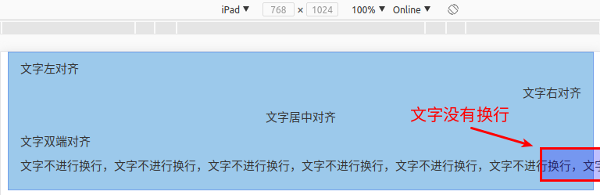

# 第六章 响应式前端框架Bootstrap的使用

古人云：“书山有路勤为径，学海无涯苦作舟”。千百年之前的圣贤就已经知道这个世界上是没有捷径可以走的，路都是需要一步一个脚印踏出来的，但在这个过程中有些部分是可以通过自己的智慧来缩短时间，从而实现事半功倍的效果。前端开发是一个完整的PHP技术栈中非常重要的一部分，是与用户交互的重要接口，然而在过去由于移动终端、平板等设备相对比较缺乏，因此前端开发主要针对的是PC端，但是目前由于这些设备的大量普及，使得前端应用的开发不得不考虑这些平台，并且这些平台都有其自身的特性，如移动端的屏幕是垂直的，而PC端的屏幕是水平的，在过去要实现这个特征，那么就必须开发完整的两套软件来应对不同的设备，这对开发人员来说是效率非常低，而且容易出错，因此这几年由一个IT界的龙头企业陆续开发出了基于响应式的前端框架，使用这些框架可以让前端开发人员只需要进行一次编码即可以在PC、平板、手机等平台上进行使用，而不需要为各个平台进行单独的定制开发，从而大大提高了开发效率，降低了人力成本。本章主要讲解一种主流的响应式框架，读者关键要理解其中的设计思路和思想，然后再根据具体的项目来举一反三。

#### 本章内容

> * Bootstrap简介与库文件的导入
> * 响应式的栅格系统运作原理的理解
> * 页面组件的全局样式设定
> * 响应式的常用组件绘制与函数应用
> * Bootstrap对JavaScript的实现与弹出组件应用

## 6.1 Bootstrap简介与库文件的导入

随着互联网技术的发展，特别是移动互联网技术的发展，用户已经不能满足于使用笨重的PC进行信息的查询，而是希望能够在公交、地铁、沙发等环境下通过对更加便携的设备进行操作来时时刻刻获取想要的信息。这看似简单的需求，但对于IT界来说却是一个不小的挑战，因为在过去谁都没有想到过会有这样的一天到来，即移动设备上能够浏览的内容和PC上浏览器的内容是相同的，而且展示方式又是非常的优雅和美观，然而这一天就这样到了，并且这样的便携设备操作时时刻刻在我们身边上演。

在过去要解决这个问题，那么就必须由两组人员来完成，其中一组专门用于开发PC端的网站，而另一组则是开发移动端的网站，然后再在服务器端通过判断User-Agent来获取用户是通过PC访问还是通过移动端访问，然后再跳转到不同的页面中。在这个过程中存在三点问题，分别如下：

**1、成本较高：** 由于需要有两组人员同时开发，并且要做到系统调用和信息的一致性，因此不论开发的时间成本还是人力成本都相对较高。

**2、可维护性较低：** 由于针对不同设备，因此代码之间的统一性较弱，影响了程序的可维护性。

**3、一致性较低：** 由于针对的设备不同，以及开发人员的不同，因此PC和移动端之间较难做到一致性，使得用户感受存在差异。

针对以上存在的问题，2010年起Twitter公司的几名前端工程师成立兴趣小组，就开始研究和开发建立能够帮助设计师和开发人员快速构建统一的、美观的，并且能够跨平台的前端工具包，经过1年多的打磨将其在GitHub开源，并命名为Bootstrap，Bootstrap的Logo如图6-1所示。从而普惠全世界的开发人员。严格来说，Bootstrap其本质是一个CSS的框架，开发人员只需在相应的标签上添加需要的CSS类就可以实现不同的功能。而在其内部，Bootstrap使用标准的HTML5和CSS3作为开发基础，因此要让Bootstrap的特性都发挥出来，那么开发的目标浏览器也需要能够支持HTML5和CSS3，到笔者撰写为止，各大浏览器提供商所提供的最新浏览器都能很好的支持Bootstrap。此外，在Bootstrap中，还通过引入第三方JavaScript标准库JQuery来实现各类UI组件的交互，例如导航条、下拉菜单等。因此可以说，Bootstrap为前端开发人员提供了一站式的前端解决方案。


图6-1 Bootstrap的图标

### 6.1.1 Bootstrap框架的引入

由于Bootstrap采用MIT的开源许可证，在法律上允许任何人修改它的代码，并变为自己的代码，同时还可以用于商业用途，因此Twitter为Bootstrap提供了最为宽松的版权协议，也因为这个，在Bootstrap官网（https://v3.bootcss.com/getting-started/）提供针对三类不同开发者的Bootstrap源码，分别是：

**1、针对普通开发者：** 大多数开发者都属于这一类，包括笔者也是，这类开发者主要使用Bootstrap工具进行各类B/S系统的开发，因此Twitter为这类开发者提供了系统开发所必须的JavaScript、CSS和字体文件，即用于生产环境的源码，只需要导入到页面中就可以使用。

**2、针对需要定制Bootstrap的开发者：** 这类开发者通常需要基于Bootstrap源码进行二次深度定制，从而形成自己的产品，因此针对这类开发者Twitter提供了编译为生产环境所需的Bootstrap源码，包括CSS的预编译文件Less、JavaScript和字体文件。

**3、针对使用Sass作为CSS预编译工具的开发者：** 而第三类确切的说也属于第二类，只是该类的开发者使用的CSS预编译语言不是Less，而是Sass，因此Twitter提供了从Less移植到Sass的工具，可以帮助这类开发者快速构建基于Sass的Bootstrap源码。

因此，本章的内容主要针对的是普通开发者，进入Bootstrap官网后就可以看到提供的下载链接，如图6-2所示。此外，为了使Bootstrap能提供更好的跨区域访问速度，Bootstrap联合国内的云服务商提供了免费的CDN加速服务，需要特别注意的是，因为Bootstrap中所有的JavaScript插件，包括UI组件都依赖于JQuery进行开发，因此在引入Bootstrap核心JavaScript库之前，需要引入JQuery才能提供完整的功能，并且JQuery的版本需要在1.9.1以上，在具体代码如下：

```html
<!-- 最新版本的Bootstrap核心CSS文件 -->
<link href="https://cdn.bootcss.com/bootstrap/3.3.7/css/bootstrap.min.css" rel="stylesheet">

<!-- 最新版本的Bootstrap主题文件 -->
<link href="https://cdn.bootcss.com/bootstrap/3.3.7/css/bootstrap-theme.min.css" rel="stylesheet">

<!-- 最新版本的JQuery核心JavaScript文件 -->
<script src="https://cdn.bootcss.com/jquery/3.3.1/jquery.min.js"></script>

<!-- 最新版本的Bootstrap核心JavaScript文件 -->
<script src="https://cdn.bootcss.com/bootstrap/3.3.7/js/bootstrap.min.js"></script>
```


图6-2 Bootstrap下载地址

下载并解压缩Bootstrap后，就可以看到如图6-3所示的目录结构，其中CSS目录存放Bootstrap的样式文件，JS目录存放Bootstrap的核心库文件，Fonts目录存放Bootstrap所使用的字体文件，在这些文件里面会看到有xxx.min.xxx和xxx.map这两类较为特殊文件，其中带min的文件表示经过压缩后的文件，CSS和JavaScript的压缩与图片、视频等多媒体文件的压缩方式不同，CSS和JavaScript的压缩通常是把文件中的空格、换行等内容进行替换和删除，从而减少文件的体积，而另外一个带map的文件，叫源码映射表，因为经过压缩的CSS和JavaScript文件在开发时无法精确的对源码进行调试，所以需要通过map文件把压缩后的文件转化为开发人员能够读懂，并且格式化的源码，从而方便程序的调试。


图6-3 Bootstrap的源码目录结构

### 6.1.2 Bootstrap基础模板的理解

几乎所有软件工程师都是从Hello World开始编写，Bootstrap也提供了类似与Hello World的基础模板，具体如示例代码6-1所示。

```html
<!DOCTYPE html>
<html lang="zh-CN">
  <head>
    <meta charset="utf-8">
    <meta http-equiv="X-UA-Compatible" content="IE=edge">
    <meta name="viewport" content="width=device-width, initial-scale=1, user-scalable=no">
    <title>Hello Bootstrap</title>

    <!-- 导入Bootstrap的样式库 -->
    <link href="css/bootstrap.min.css" rel="stylesheet">

    <!-- HTML5 shim 和 Respond.js是为了让IE8支持HTML5的元素，以及响应式布局核心的媒体查询（Media Queries）功能 -->
    <!-- 当使用file://方式访问本文件时，Respond.js库无效 -->
    <!--[if lt IE 9]>
      <script src="https://cdn.bootcss.com/html5shiv/3.7.3/html5shiv.min.js"></script>
      <script src="https://cdn.bootcss.com/respond.js/1.4.2/respond.min.js"></script>
    <![endif]-->
  </head>
  <body>
    <h1>你好，世界！</h1>

    <!-- 引入使用Bootstrap插件所必须的JQuery库 -->
    <script src="https://cdn.bootcss.com/jquery/1.12.4/jquery.min.js"></script>
    <!-- 引入完整的Bootstrap核心库 -->
    <script src="js/bootstrap.min.js"></script>
  </body>
</html>
```

例6-1 Bootstrap的HelloWorld

**第4行：** 表示设置当前文档的编码方式为UTF-8，当浏览器读到该meta时就会采用执行的编码方式进行文件的解码，同时笔者也建议今后所有的源代码文档都采用UTF-8进行编码，方便在各系统间进行移植。

**第5行：** 表示告诉IE浏览器采用最高级模式进行文档渲染，而不考虑向下兼容的问题，即IE7就采用IE7的模式进行渲染，IE10就采用IE10的模式进行渲染，因为目前有该meta的网页通常都是使用HTML5进行编写，因此只有文档渲染模式越新，那么所支持的HTML5越完整。此外，网上还有一种是修改content的值为"IE=edge,chrome=1"以提高浏览器对HTML5的兼容性，由于该方法需要在IE浏览器中安装Google的一款插件——Chrome Frame才能使用，但是目前该插件已经在2014年1月停止更新，所以该方法目前无法使用。

**第6行：** 表示设置移动端浏览器的视区大小，viewport表示该meta的类型为视区，content中的width表示设备宽度，initial-scale表示缩放比例，而user-scalable表示是否允许用户对页面进行缩放，笔者建议设置为no，此时用户只能够滚动屏幕的方式来查看内容，使得开发出来的网页看上去更像原生应用，当然这个设置可以根据每个项目不同的需求进行删减。这里需要特别说明的是4-6行必须放在head标签的最前面，其他内容后它们之后。

**第10行：** 表示导入一个Bootstrap的样式库，这里需要根据自己的情况进行定制，例如Bootstrap放在本地，那么就需要通过相对布局引入，如果使用CDN服务，那么就要把这行换做CDN地址。

**第14-17行：** 表示当通过浏览器的判断当前访问的浏览器版本是否小于IE9，因为IE9是支持HTML5，因此不需要判断。如果浏览器版本小于IE9，则引入html5shiv.min.js使得浏览器能够支持HTML5中的新增标签，同时引入respond.min.js使得浏览器能够支持媒体查询（Media Queries）功能，从而实现响应式的布局，关于媒体查询的内容会在下一节中重点讲解。

**第23行：** 表示导入Bootstrap插件必须的JQuery库，这里需要根据自己的情况进行定制，例如JQuery放在本地，那么就需要通过相对布局引入，如果使用CDN服务，那么就要把这行换做CDN地址。

**第25行：** 表示导入Bootstrap核心库，这里需要根据自己的情况进行定制，例如Bootstrap放在本地，那么就需要通过相对布局引入，如果使用CDN服务，那么就要把这行换做CDN地址。

目前国内浏览器厂商都会提供两种浏览器模式，即兼容模式（采用IE作为内核）和高速模式（采用WebKit作为内核），然而很多浏览器为了兼容更多的网站会采用兼容模式作为其默认模式，这使得采用较低版本的IE浏览器内核时，基于Bootstrap 构建的网站展现效果很糟糕。目前，国内浏览器厂商为了解决这个问题，在保持兼容性的同时也能够较好的支持HTML5相关特性，因此国内的浏览器在解析页面的同时提供了”renderer“元信息的支持，开发人员可以在head中填下如下元信息，使得浏览器在浏览器该页面时采用高速模式进行浏览器，从而实现对HTML5和Bootstrap更好的支持。

```html
<meta name="renderer" content="webkit">
```

## 6.2 响应式的栅格系统运作原理的理解

1692年，新登基的法国国王路易十四国王为了使法国的印刷制品的质量能有质的提升，命令成立一个管理印刷产品质量的皇家特别委员会。委员会的成员首要任务是设计出科学的、合理的，并且重视功能性的新字体。当时，该委员会由数学家尼古拉斯加宗担任支持，他们以罗马字体为基础，每个字体设计了由64个基本方格组成的基本单元，并且每个方格中还被分成了36个小格，通过把字体放在严谨的几何网格网络中进行设计和排版，从大大提升了当时法国印刷制品的品质。同时，这也是世界上最早的栅格系统雏形。

目前栅格系统广泛的用于各类设计系统中，例如UI设计、图标设计、字体设计等，通过栅格系统的应用可以使产品设计的质量更高，同时栅格系统还能为设计提供很好的参考，工作效率大幅提升。所谓栅格系统，就是把一个页面分为若干行，以及若干列，其中行的高度不一定要相同，但是每列的宽度却是固定的，如图6-4所示。在Bootstrap中提供了一套把页面进行12等分的栅格系统，并且这个栅格系统中的每一列的宽度都会根据当前页面的宽度进行自动计算，同时列和列之间还能进行合并。


图6-4 栅格系统的概念

### 6.2.1 响应式布局的核心——媒体查询

随着终端设备的种类越来越多，屏幕分辨率、屏幕尺寸也越来越复杂，早起的网页设计已经无法提供在各种终端上进行完善的显示，例如在1024*768的显示器上进行设计网页，在1080P的显示器上就会显得各种尺寸都很小，而反过来又会显的很大。因此，为了解决这个问题从CSS 2.1开始加入了各种多媒体类型的定义，如显示器、移动设备等，通过这些媒体类型的设计可以帮助开发人员针对这些不同的设备进行不同的CSS样式设计。当浏览器在进行页面显示时，会根据当前屏幕的大小查询相应的媒体类型，以及该媒体类型中的CSS设置，从而显示不同效果。可以说，目前所有的响应式布局都是在此特性的基础上进行构建，也包括Bootstrap，因此了解媒体查询的使用对深入理解响应式布局和Bootstrap至关重要。

媒体查询的设置语法如下：

```css
@media not|only 设备类型 [and (设备特征)] {样式列表}
```

**1、@media：** 表示该设置为一个媒体查询设置。

**2、not|only：** 当该值为not时，表示设置除指定设备类之外的设备类型样式列表。

**3、设备类型：** 表示媒体查询所支持的设备类型，其中sceen是最为常用的设备类型，如表6-1所示。

表6-1 媒体查询支持的设备类型

| 设备类型 | 说明 |
| :-: | :- |
| all | 适用于所有的设备 |
| aural | 适用于语音和音频合成器 |
| braille | 适用于触觉反馈设备 |
| embossed | 适用于凸点文字（盲文）印刷设备 |
| handheld | 适用于小型或者手提设备 |
| print | 适用于打印机 |
| projection | 适用于投影图像,如幻灯片 |
| sceen | 适用于计算机显示器 |
| tty | 适用于使用固定间距字符格的设备,如电传打字机和终端 |
| tv | 适用于电视类设备 |

**4、and （设备特征）：** 在媒体查询的语法中设备特征的数量可以从0-N个，通过设备特性的匹配可以对设备类型进行精确的匹配，从而显示不同的效果。同时，大多数的设备特征都是支持max和min的前缀，例如max-width、min-width分别表示最大、最小宽度，具体如表6-2所示。

表6-2 可设置的设备特征

| 设备特征 | 特性值规范 | 是否支持max/min | 说明 |
| :-: | :- | :-: | :- |
| color | 整数值 | 是 | 匹配设备使用多少位的色深,如果是彩色则该值为8，如果不是彩色设备则为0，如果RGB三色的位数不一样，那么就使用最小的位数作为该值 |
| color-index | 整数值 | 是 | 匹配色彩表中的颜色数，例如要匹配的色彩表中有256个颜色，那么该值就为256 |
| aspect-ratio | 浏览器宽高比值，如16/9、4/3 | 是 | 匹配浏览器的宽度值和高度值的比例 |
| device-aspect-ratio | 设备宽高比值，如16/9、4/3 | 是 | 匹配设备分辨率的宽度值与高度值的比例 |
| device-height | 整数值 | 是 | 匹配设备分辨率的高度值 |
| device-width | 整数值 | 是 | 匹配设备分辨率的宽度值 |
| grid |  0或1 | 否 | 匹配设备是网格设备还是位图设备。如果设备是基于网格的，如只能显示一种字体的电话，该值为1，否则为0 |
| height | 整数值 | 是 | 匹配浏览器的高度 |
| width | 整数值 | 是 | 匹配浏览器的宽度 |
| monochrome | 整数值 | 是 | 匹配一个带灰度的黑白设备每个像素的比特数，如果该设备不是黑白设备，则该值为0，如果是具有256阶灰度的设备，则该值为8 |
| orientation | landscape/portrait | 否 | 匹配设备是处于横屏还是竖屏，landscape表示横屏，即宽度大于高度，portrait表示竖屏，即高度大于宽度 |
| resolution | 分辨率，如300dpi | 是 | 匹配设备的物理分辨率，即像素密度 |
| scan | progressive/interlace | 否 | 匹配设备的扫描方式,其中progressive代表逐行扫描，interlace代表隔行扫描 |

从上面的语法解释不难看出，在前端页面设计中大部分的物理特性都可以通过媒体查询的方式进行检索和过滤，通过这种方式就可以开发人员就可以针对不同的物理特性去设置不同的内容，下面通过一个简单的例子来进行说明，具体如示例代码6-2所示。

```html
<!DOCTYPE html>
<html lang="en">
<head>
    <meta charset="UTF-8">
    <meta name="viewport" content="width=device-width, initial-scale=1.0">
    <meta http-equiv="X-UA-Compatible" content="ie=edge">
    <title>媒体查询示例</title>

    <style>
        html {
            font-size: 10px;
        }
        h2 {
            font-size: 2rem;
        }
        span {
            font-size: 1rem;
        }
        /* 媒体查询设置 */
        @media screen and (min-width: 320px) and (max-width: 420px) {
            html {
                font-size: 5px;
            }
        }
        @media screen and (min-width: 421px) and (max-width: 520px) {
            html {
                font-size: 10px;
            }
        }
        @media screen and (min-width: 521px) and (max-width: 620px) {
            html {
                font-size: 15px;
            }
        }
        @media screen and (min-width: 621px) and (max-width: 720px) {
            html {
                font-size: 20px;
            }
        }
        @media screen and (min-width: 721px) and (max-width: 820px) {
            html {
                font-size: 25px;
            }
        }
        @media screen and (min-width: 821px) and (max-width: 920px) {
            html {
                font-size: 30px;
            }
        }
        @media screen and (min-width: 921px) {
            html {
                font-size: 35px;
            }
        }
    </style>
</head>
<body>
    <div>
        <h2>苏州工业园区服务外包职业学院</h2>
        <span>嵌入式技术与应用专业</span>
    </div>
</body>
</html>
```

例6-2 媒体查询的示例

在上面的代码中，设置了多个媒体查询，在这些查询中都以浏览器的最大宽度和最小宽度作为设备特征，当浏览器宽度属于某个范围内时，就会修改HTML根标签的字号。这里需要特别说明的是，在样式列表中还定义了h2和span标签的字号，并且这个字号所使用的单位不是通常的px而rem。rem是一个相对的字号大小单位，其相对的目标是HTML根标签\<html\>\</html\>内设置的字号大小。

在rem概念还没有引入之前，通常开发人员会以最小的屏幕开发出一个初始的版本，当该页面被不同设备进行浏览时，再通过JavaScript的方式去修改viewport中的initial-scale参数，这样的做法在一定程度上能满足基本需求，但也出现了很多问题，最主要的问题是当页面被大屏设备访问时就会出现字体、图片模糊的现象，这是因为initial-scale参数的本质实际上是拉伸页面，因此无法提供良好的用户体验。当rem的概念引入之后，开发人员只需要设置HTML根标签的字号就会相应的修改所有子页面中的字号。

正如本例中所示，当浏览器大小发生改变时，由于通过媒体查询的方式修改了HTML根标签的字号大小，同时又因为h2和span标签使用了rem作为字号的单位，所以当根标签的字号大小变化时也会同时作用于h2和span标签。就因为rem单位的特殊性和相对性，所以自从有了响应式页面的需求，该单位才开始崭露头角逐渐成为现在响应式页面的字号和图片设置的主流。在上面的示例代码中，虽然h2和span设置的字号大小都相同，但是因为浏览器大小的不同，造成根标签内的字号大小不同，使得h2和span标签的字号也发生了改变，示例代码的结果如图6-5所示。


图6-5 栅格系统的效果图

### 6.2.2 Bootstrap中栅格系统的原理

Bootstrap中对栅格系统做了进一步的完善和改进，并且把网页纵向分为等分的12列进行设计，通过一系列的行（row）和列（column）的组合来创建所需要的页面，但是要正确的创建和使用Bootstrap的栅格系统只是引入CSS和JavaScript还不够，还需要按照一定的规则才能让栅格系统和Bootstrap系统提供的组件运作起来，这些规则一共有三点，具体如下：

**1、容器（container）的设置：** 要使Bootstrap的栅格系统运作起来首先必须在其最外层包裹一个容器，Bootstrap中的容器分为两种，一种是固定宽度的容器container，该容器是支持响应式的布局容器，而另外一种则是占据整个视区（viewport）的容器container-fluid，此容器所在的浏览器不论如何变化，该容器都是撑满整个浏览器。但需要注意的是，这两种容器之间不能相互嵌套，只能独立使用，下面通过分析这两个容器的源码来进一步的分析。

**container的样式设置：**

```css
.container {
    padding-right: 15px;
    padding-left: 15px;
    margin-right: auto;
    margin-left: auto;
}
@media (min-width: 768px) {
    .container {
        width: 750px;
    }
}
@media (min-width: 992px) {
    .container {
        width: 970px;
    }
}
@media (min-width: 1200px) {
    .container {
        width: 1170px;
    }
}
```

该样式表示的是支持响应式布局的固定宽度容器container，从上面的代码可以看出该容器的左右内边距始终为15px，并且margin-right和margin-left设为auto表示该容器水平居中，而后面的@media则为媒体查询，其设备特征为浏览器的宽度，当浏览器的宽度满足条件时则会修改容器的宽度，具体如下。因此，从上面的代码可以知道，当使用该容器时，改变浏览器的宽度，容器的宽度也会跟着发生变化，但是不论该容器的宽度如何变化，容器的位置都为水平居中，此容器最大的宽度为1170px，最小宽度为750px，如果浏览器的宽度大于1200px时，那么在容器的两边会进行留白。

**container-fluid的样式设置：**

```css
.container-fluid {
    padding-right: 15px;
    padding-left: 15px;
    margin-right: auto;
    margin-left: auto;
}
```

该样式表示的是占据整个视区（viewport）的容器container-fluid，从上面的代码可以看出该容器的左右内边距始终为15px，并且margin-right和margin-left设为auto表示该容器水平居中，并且撑满整个视区。因此，该容器所在的浏览器不论如何变化，该容器都是撑满整个浏览器。

**2、行、列的创建：** 当添加容器后，接下来就需要创建一系列垂直方向的行（row），并且在每个列中创建一系列水平方向的列（column），通过行和列的组合来创建所需要的页面。这里需要注意的是所有的内容都必须要放在“列”中完成，并且“行”的第一个子标签的样式必须是“列”，具体示例代码如下：

```html
<body>
    <div class="container">
        <div class="row">
            <div class="col-md-4">
                <h2>苏州工业园区服务外包职业学院</h2>
            </div>
            <div class="col-md-2">
                <span>嵌入式工程系</span>
            </div>
            <div class="col-md-6">
                <span>嵌入式技术与应用专业</span>
            </div>
        </div>
    </div>
</body>
```

在上面的代码中首先定义了一个响应式的容器"container"，然后在该容器中定义了一个"行"（row），在"行"标签的内定义了三个"列"（col），并且为每个"列"添加要显示的内容。这里还需要再次强调的是，在行和列之间不能添加其他内容，所有的内容都必须添加在"列"标签内。为了方便和快速的布局栅格系统，在Bootstrap中定义了一系列的预定义样式类，其格式为".col-屏幕大小-所占列的个数"。因为Bootstrap把一行分为了12列，因此一行中所有列所占的列数之和必须为12，如果所占列数之和超出12，那么超出的部分就会自动转移到下一行。从响应式的容器container源码可以知道，容器所针对的屏幕分为四种，分别是浏览器宽度大于1200px的大屏、浏览器宽度大于992px的中屏、浏览器宽度大于768px的小屏，以及浏览器宽度小于768px的超小屏，针对不同屏幕Bootstrap提供了不同的屏幕大小标识来说明不同的屏幕，分别是xs（超小屏）、sm（小屏）、md（中屏）和lg（大屏），因此完整的"列"样式应该类似于”.col-md-4“这样的形式。具体如表6-3所示。

表6-3 栅格"列"的样式说明

| 项目名称/屏幕 | 超小屏幕设备（<768px） | 超小屏幕设备（>=768px） | 中等屏幕设备（>=992px） | 大屏幕设备（>=1200px） |
| :- | :- | :- | :- | :- |
| 栅格系统行为 | 总是水平排列 | 开始是堆叠在一起的，当大于这些阈值时将变为水平排列 |
| .container 最大宽度 | None（自动） | 750px | 970px | 1170px |
| 类前缀 | .col-xs- | .col-sm- | .col-md- | .col-lg- |
| 列数 | 12 |
| 水平内边距 | 30px（左右各15px） |
| 可嵌套 | 是 |
| 可偏移 | 是 |
| 可列排序 | 是 |

**3、栅格样式的最优化选择：** 由于.col-xs-、.col-sm-、.col-md-、.col-lg-这些样式类都定义在媒体查询中，示例代码如下。因此当浏览器尺寸不同时，只会显示对应屏幕的样式，而其他屏幕的样式则不会被应用，例如在浏览器宽度小于992px时，当前页面只会应用.col-sm-12的样式，而不会是.col-md-12的样式，因此通过媒体选择的方式Bootstrap为页面选择了最为合适的样式，以达到最好效果。

```css
@media (min-width: 768px) {
    ......
    .col-sm-12 {
        width: 100%;
    }
    ......
}

@media (min-width: 992px) {
    ......
    .col-md-12 {
        width: 100%;
    }
    ......
}

@media (min-width: 1200px) {
    ......
    .col-lg-12 {
        width: 100%;
    }
    ......
}
```

### 6.2.3 Bootstrap中栅格系统的页面布局

要正确的使用栅格系统设计响应式页面首先需要了解栅格系统中栅格的水平排列和垂直排列（或者称为堆叠排列）之间的切换。上一节讲过Bootstrap通过媒体查询的方式实现栅格系统，当浏览器的宽度大于某个阈值时，那么这些栅格就为水平排列，而当浏览器的宽度小于某个阈值时，那么这些栅格就为垂直排列，下面以响应式容器container和col-md-?为例进行说明，示例代码如例6-3所示。

```html
<!DOCTYPE html>
<html lang="en">
<head>
    ......

    <style>
        html {
            font-size: 10px;
        }

        .row div {
            background-color: #9ACFEA;
            border: 1px #66AFE9 solid;
            font-size: 1.5rem;
            padding-top: 10px;
            padding-bottom: 10px;
        }

        .row {
            margin-bottom: 10px;
        }
    </style>

</head>
<body>
    <div class="container">
        <div class="row">
            <div class="col-md-1">.col-md-1</div>
            <div class="col-md-1">.col-md-1</div>
            <div class="col-md-1">.col-md-1</div>
            <div class="col-md-1">.col-md-1</div>
            <div class="col-md-1">.col-md-1</div>
            <div class="col-md-1">.col-md-1</div>
            <div class="col-md-1">.col-md-1</div>
            <div class="col-md-1">.col-md-1</div>
            <div class="col-md-1">.col-md-1</div>
            <div class="col-md-1">.col-md-1</div>
            <div class="col-md-1">.col-md-1</div>
            <div class="col-md-1">.col-md-1</div>
        </div>
        <div class="row">
            <div class="col-sm-8">.col-sm-8</div>
            <div class="col-sm-4">.col-sm-4</div>
        </div>
        <div class="row">
            <div class="col-md-4 col-sm-4">.col-md-4 .col-sm-4</div>
            <div class="col-md-4 col-sm-4">.col-md-4 .col-sm-4</div>
            <div class="col-md-4 col-sm-4">.col-md-4 .col-sm-4</div>
        </div>
    </div>

    ......
</body>
</html>
```

例6-3 栅格排列的示例

在上面的代码中有两种栅格列前缀，分别时col-md-？和col-sm-？，这两个前缀如表6-3所示，表示浏览器宽度大于992px和768px的列样式。同时，在上面的代码中，有两种栅格的使用方法，一种为列只添加栅格样式，另外一种则是为列添加多种栅格样式，如第三个row所示。执行代码，并对浏览器进行缩放，当浏览器的宽度大于等于992px时，会看到如图6-6所示的效果，每个栅格都以水平排列的方式显示在浏览器上。而浏览器的宽度小于992px时，栅格系统就会发生变化，第一个row中原先水平排列的栅格变为以垂直形式排列的栅格，但是此时第二个row和第三个row依然以水平方式进行排列，对于第二个row来说，这是因为当前行中的栅格定义为col-sm-？的列，其浏览器宽度的阈值为768px，此时浏览器的宽度还大于该值，而对于第三个row来说，由于采用md和sm混排的方式，因此Bootstrap在内部计算时会以最小的那个类型作为是水平排列还是垂直排列的依据，因此第三个row的情况就和第二个row相同，如图6-7所示。此时，继续缩小浏览器宽度，当浏览器宽度小于768px时，所有的栅格都变为垂直排列，如图6-8所示。


图6-6 浏览器宽度大于992px的效果


图6-7 浏览器宽度小于992px的效果


图6-8 浏览器宽度小于768的效果

从上面的结果可以得出这样的结论，即在Bootstrap中如果浏览器的屏幕大于等于栅格所在类型的阈值时，那么栅格以水平方式进行排列，如果如浏览器的屏幕小于栅格所在类型的阈值时，那么栅格以垂直方式进行排列，如果某个栅格中存在两个以上的栅格类型，那么该栅格以最小的那个类型作为判断栅格是水平还是垂直排列的依据。

通过Bootstrap的这一特性就可以创建针对移动端、平板和PC等不同屏幕尺寸的动态布局。上面说了，在Bootstrap中有四种栅格类型，分别是col-xs、col-sm、col-md和col-lg，其中col-xs主要设计针对移动设备，col-sm-则设计针对平板设备，而col-md和col-lg设计针对的是PC设备，因此如果希望页面在移动设备上不要以堆叠方式（垂直方式）排列，那么就需要为栅格添加col-xs样式，如果希望在平板设备上不要以堆叠方式显示，那么就需要在栅格上添加col-sm样式，示例代码如例6-4所示。

```html
<!DOCTYPE html>
<html lang="en">
......

<body>
    <div class="container">
        <div class="row">
            <div class="col-xs-12 col-sm-6 col-md-8">.col-xs-12 .col-sm-6 .col-md-8</div>
            <div class="col-sm-6 col-md-4">.col-sm-6 .col-md-4</div>
        </div>
        <div class="row">
            <div class="col-xs-6 col-sm-4">.col-xs-6 .col-sm-4</div>
            <div class="col-xs-6 col-sm-4">.col-xs-6 .col-sm-4</div>
            <div class="col-xs-6 col-sm-4">.col-xs-6 .col-sm-4</div>
        </div>
    </div>

    ......
</body>
</html>
```

例6-4 针对手机、平板、PC的响应式布局示例

运行上面的代码就可以看到，在第一行中，第一个栅格在移动端时，显示为占据一行，即col-xs-12起作用，在平板端时，col-sm-6起作用，第一个和第二个栅格以6:6的方式水平排列在页面中，而在PC端，则col-md起作用，第一个和第二个栅格以8:6的方式水平排列在页面中。而第二行中，由于col-xs的值之和大于12，因此这三个栅格在移动端时，显示为2行，第一个和第二个栅格组成一行，而多出的第三个栅格则另起一行，而这个三个栅格在平板段时，由于col-sm的值之和等于12，因此这三个栅格以水平方式进行排列，如图6-9和6-10所示。


图6-9 平板端显示效果


图6-10 移动端显示效果

在进行页面布局时，经常会使用CSS中的margin等样式来设置页面元素的偏移量，在Bootstrap的栅格系统中也具有类似的功能，即通过“col-类型-offset-偏移数”这样的样式类型来实现，其中偏移数不能超过12，因为偏移量的设置只能作用于同一行，而一行最多是12列，示例代码如例6-5所示，效果如图6-11所示。

```html
<!DOCTYPE html>
<html lang="en">
......

<body>
    <div class="container">
        <div class="row">
            <div class="col-md-4">.col-md-4</div>
            <div class="col-md-4 col-md-offset-4">.col-md-4 .col-md-offset-4</div>
        </div>
        <div class="row">
            <div class="col-md-3 col-md-offset-3">.col-md-3 .col-md-offset-3</div>
            <div class="col-md-3 col-md-offset-3">.col-md-3 .col-md-offset-3</div>
        </div>
        <div class="row">
            <div class="col-md-6 col-md-offset-3">.col-md-6 .col-md-offset-3</div>
        </div>
    </div>

    ......
</body>
</html>
```

例6-5 栅格的偏移示例


图6-11 栅格偏移的效果

从上图不难看出，第一行中的第二个栅格偏移了4格，而第二行中的第一个栅格偏移了3格，第二个栅格偏移了3格，第三行中的栅格偏移三格。由此可知，通过对栅格进行设置可以方便的进行位置的偏移，但要确保每行中的栅格偏移量和栅格大小之和应该小于等于12。此外，在开发复杂页面时，经常会出现页面元素之间的相互嵌套，从而把整个页面由整体向局部递进式的设计和编码，Bootstrap中的栅格系统也具备同样的功能，即在一个栅格中添加一个新的行（row），然后再把改行分为多个小栅格进行布局，从而实现对某个栅格的局部再布局，并且新添加row的最大宽度为其父栅格的宽度，栅格嵌套的示例代码如例6-6所示，效果如图6-12所示。

```html
<!DOCTYPE html>
<html lang="en">
<head>
    ......

    <style>
        html {
            font-size: 10px;
        }

        .grid-block {
            background-color: #9ACFEA;
            border: 1px #66AFE9 solid;
            font-size: 1.5rem;
            padding-top: 10px;
            padding-bottom: 10px;
        }
    </style>

</head>
<body>
    <div class="container">
        <div class="row">
            <div class="col-sm-9 grid-block">
                Level1：col-sm-9
                <div class="row">
                    <div class="col-xs-8 col-sm-6 grid-block">Level2：col-xs-8 col-sm-6</div>
                    <div class="col-xs-4 col-sm-6 grid-block">Level2：col-xs-4 col-sm-6</div>
                </div>
            </div>
            <div class="col-sm-3 grid-block">Level1：col-sm-3</div>
        </div>
    </div>

    ......
</body>
</html>
```

例6-6 栅格的嵌套示例


图6-12 栅格嵌套的效果

## 6.3 页面组件的全局样式设定

在前端页面设计中，除了基本的布局外，就是对页面中所有组件进行标准化的排版，例如字体的大小、行间距、表格的表现形式，以及按钮的样式等。这些内容看似简单，但要设计出一套完整的、可修改、易扩展的样式套件具有一定难度，因此Bootstrap却提供了一套统一的CSS样式，通过这套样式可以快速的完成页面中所有元素的渲染，从而使得整个页面排版更加简单，风格也更加统一。在Bootstrap中为几乎所有的标签都有其基本的设定，例如全局的字体大小为14px，行高（line-height）为1.428，即20px，又如<p>被设置了等于1/2行高（即10px）的底部外边距等诸如此类的默认设置，此外Bootstrap还添加了一些可以根据需求添加的样式，例如表格是否带条纹，是否带悬停效果等，因此本节主要针对这些需要根据需求自行添加的内容进行讲解，并嵌入一些常用的默认设置。Bootstrap中的全局样式共分为五类，分别是文本样式、表格样式、表单样式、按钮样式，以及图片样式，下面就进行详细的说明。

### 6.3.1 Bootstrap中的文本样式

**1、文字对齐：** Bootstrap提供了五种文字对齐的方式，分别是左对齐（text-left）、右对齐（text-right）、居中对齐（text-center）、双端对齐（text-justify），以及不自动换行（text-nowrap），其中除了text-nowrap使用的是white-space属性进行设置，其他都是通过CSS属性text-align进行设置，具体代码如下，效果如图6-13所示。

```html
<p class="text-left">文字左对齐</p>
<p class="text-right">文字右对齐</p>
<p class="text-center">文字居中对齐</p>
<p class="text-justify">文字双端对齐</p>
<p class="text-nowrap">文字不进行换行</p>
```



图6-13 文字对齐的效果

**2、英文大小写的转换：** Bootstrap中提供了三种样式来进行英文字母的大小写转换，分别是转换到大写（text-uppercase）、转换到小写（text-lowercase），以及首字母大写（text-capitalize），这三个样式都是通过CSS属性text-transform来实现，具体代码如下：

```html
<p class="text-lowercase">Lowercased text</p>
<p class="text-uppercase">Uppercased text</p>
<p class="text-capitalize">Capitalized text</p>
```

**3、多种引用样式：** 在页面设计中，经常会要引用一些名人名言等内容，Bootstrap提供了一个通过blockquote标签实现引用的模板，并且可以通过在blockquote标签中添加blockquote-reverse样式实现引用内容的左对齐和右对齐，具体代码如下，效果如图6-14所示。

```html
<blockquote>
    <p>明月几时有，把酒问青天，不知天上宫阙，今夕是何年</p>
    <footer>苏轼<cite title="Source Title">水调歌头</cite></footer>
</blockquote>
<blockquote class="blockquote-reverse">
    <p>北国风光，千里冰封，万里雪飘</p>
    <footer>毛泽东<cite title="Source Title">沁园春雪</cite></footer>
</blockquote>
```


图6-14 文字引用的效果

### 6.3.2 Bootstrap中的表格样式

在页面设计中，表格是经常被使用的组件，Bootstrap也对表格做了一些标准化的设置和优化，但是由于以表格为基础延生出诸多类似日历、日期选择等多种的组件，因此出于兼容性的考虑，以及不影响其他控件的显示效果，Bootstrap并没有把表格的优化做成默认设置，而是采用在table标签上添加各类表格样式的方式来实现不同类型的表格显示。在Bootstrap中一共提供六种类型的表格样式，分别是默认表格（.table）、条纹表格（.table-striped）、边框表格（.table-bordered）、鼠标悬停的表格（.table-hover）、紧凑表格（.table-condensed）和响应式表格（.table-responsive）。此外，Bootstrap还提供了用于设置表格的行和单元格的五种状态颜色，分别是标识悬停状态的颜色（.active）、标识操作成功的颜色（.success）、标识提示信息或动作的颜色（.info）、标识警告的颜色（.warning），以及标识危险的颜色（.danger），并且这些颜色在后续按钮组件的设置中也会经常用到。

**1、默认表格（.table）：** 默认表格的样式使用起来非常简单，只需要在table标签中添加样式"table"即可，具体代码如下，效果如图6-15所示。

```html
<table class="table">
<thead>
    <tr>
        <th>编号</th>
        <th>省份</th>
        <th>城市</th>
        <th>行政区</th>
    </tr>
</thead>
<tbody>
    <tr>
        <td>1</td>
        <td>江苏</td>
        <td>苏州</td>
        <td>吴中区</td>
    </tr>
    <tr>
        <td>2</td>
        <td>浙江</td>
        <td>余姚市</td>
        <td>凤山街道</td>
    </tr>
</tbody>
</table>
```


图6-15 默认表格的效果

在上面的代码中只添加了一个table样式就实现这个效果，接下来分析table样式的源码。

```css
.table {
  width: 100%; /* 表格的宽度为100% */
  max-width: 100%;
  margin-bottom: 20px; /* 底部外边距为20px */
}
.table > thead > tr > th,
.table > tbody > tr > th,
.table > tfoot > tr > th,
.table > thead > tr > td,
.table > tbody > tr > td,
.table > tfoot > tr > td {
  padding: 8px;
  line-height: 1.42857143;
  vertical-align: top;
  border-top: 1px solid #ddd;
}
.table > thead > tr > th {
  vertical-align: bottom;
  border-bottom: 2px solid #ddd;
}
.table > caption + thead > tr:first-child > th,
.table > colgroup + thead > tr:first-child > th,
.table > thead:first-child > tr:first-child > th,
.table > caption + thead > tr:first-child > td,
.table > colgroup + thead > tr:first-child > td,
.table > thead:first-child > tr:first-child > td {
  border-top: 0;
}
.table > tbody + tbody {
  border-top: 2px solid #ddd;
}
.table .table {
  background-color: #fff;
}
```

第1-5行：设置表格的的宽度为100%，如果浏览器的容器为响应式的容器，那么该表格的宽度响应式容器的宽度，如果浏览器的容器为浏览器宽度，那么表格的宽度就为整个浏览器的宽度，以及设置表格的底部外边距为20px。

第6-16行：设置单元格内边距为8px，垂直对齐方向为上对齐，并且添加顶部边框，边框为1个像素、实线。

第17-20行：设置表头的垂直对齐方向为下对齐，并添加底部边框，边框为2个像素、实线。

第21-34行：设置表头的顶部边框宽度为0，即清除顶部边框。并且设置表格的背景颜色为白色（#FFF）。

**2、条纹表格（.table-striped）：** 所谓条纹表格，就是表格中的奇数行和偶数行的背景颜色不同，也有的书上称作"斑马表格"。该表格的实现非常简单，只需要在默认表格的样式后面添加"table-striped"即可。条纹表格使用CSS中的伪类:nth-child()来实现，并且传入odd和even参数来实现奇数行和偶数行的不同背景颜色。具体代码如下，效果如图6-16所示。

```html
<table class="table table-striped">
  ...
</table>
```


图6-16 条纹表格的效果

**3、边框表格（.table-bordered）：** 默认情况下表格都不带边框，需要通过CSS样式进行设置才能显示边框，Bootstrap中通过在默认表格的基础上添加"table-bordered"样式从而实现边框表格。边框表格的实现原理是通过添加边框样式border来实现，具体代码如下，效果如图6-17所示。

```html
<table class="table table-bordered">
  ...
</table>
```


图6-17 边框表格的效果

**4、鼠标悬停的表格（.table-hover）：** 鼠标悬停表格就是当鼠标碰到表格的某一行时，其背景颜色突出显示，类似与在按钮标签中使用伪类hover实现鼠标悬停效果。在Bootstrap中要实现表格的悬停效果非常简单，只需要在默认表格的基础上添加“table-hover”样式即可。具体代码如下，效果如图6-18所示。

```html
<table class="table table-hover">
  ...
</table>
```


图6-18 悬停表格的效果

**5、紧凑表格（.table-condensed）：** 要实现紧凑型的表格只需要在默认表格的基础上添加“table-condensed”样式即可。所谓紧凑型的表格，就是把表格的内边距padding变为原先的一半，即5px。具体代码如下。

```html
<table class="table table-condensed">
  ...
</table>
```

“.table-condensed”样式的源码如此下，从源码可以看到其内边距为5px。

```css
.table-condensed > thead > tr > th,
.table-condensed > tbody > tr > th,
.table-condensed > tfoot > tr > th,
.table-condensed > thead > tr > td,
.table-condensed > tbody > tr > td,
.table-condensed > tfoot > tr > td {
  padding: 5px;
}
```

**6、响应式表格（.table-responsive）：** 默认情况下，当浏览器不断变窄时，表格也同时会变窄，从而影响了正常内容的显示，但是使用响应式的表格则不会出现这样的问题。因为当屏幕宽度已经不能让表格的内容显示在一行上时，表格就会出现水平滚动条，而当屏幕宽度足够显示文字时，则水平滚动条消失。要实现响应式表格也与前面的条纹表格等类型的表格不同，需要在表格置于DIV标签之内，并且为这个DIV添加“table-responsive”样式，其内部的表格可以再根据实际情况进行样式的修改，具体代码如下，效果如图6-19所示。

```html
<div class="table-responsive">
    <table class="table">
    ...
    </table>
</div>
```


图6-19 响应式表格的效果

**7、表格的状态颜色：** 所谓的表格状态颜色，其本质是通过设备表格的行和表格的单元格的背景颜色来完成，这些颜色是Bootstrap默认风格的颜色，并且这些颜色不光用于表格，后期的按钮、表单等需要设置背景颜色的标签都可以使用。状态颜色的样式使用起来非常方便，只需要在原本的样式上添加如下的样式即可，具体代码如下，效果如图6-20所示。

```html
<table class="table table-bordered table-hover">
    <thead>
    <tr class="success">
        ...
    </tr>
    </thead>
    <tbody>
    <tr>
        ...
        <td class="warning">江苏江苏江苏</td>
        ...
    </tr>
    </tbody>
</table>
```


图6-20 响应式表格的效果

### 6.3.3 Bootstrap中的表单样式

在页面设计中，表单是经常被使用的组件，用于向服务器提交各类信息。Bootstrap也对表单做了一些标准化的设置和优化，使得表单的样式可以以更加现代的方式进行展示。在Bootstrap中一共提供三种基本的表格类型，分别是默认的表单样式、内联表单的样式和水平表单的样式。同时Bootstrap还对表单中的大部分控件进行优化，例如text、password、datetime等，并且还优化了控件的禁用、只读，以及校验状态的样式，从而为页面中的表单应用提供了统一的模板。

在Bootstrap的表单中，有两个样式非常重要，分别是form-control和form-group，其中form-control表示表单中的控件样式，其核心的就是以块级元素的方式进行显示，即占用整个页面中的一行，并且宽度为100%；而form-group表示表单中一组控件的样式，并且为这组控件添加了15px的底部外边距。。

```css
.form-control {
  display: block;
  width: 100%;
  height: 34px;
  padding: 6px 12px;
  font-size: 14px;
  line-height: 1.42857143;
  color: #555;
  background-color: #fff;
  background-image: none;
  border: 1px solid #ccc;
  border-radius: 4px;
  -webkit-box-shadow: inset 0 1px 1px rgba(0, 0, 0, .075);
          box-shadow: inset 0 1px 1px rgba(0, 0, 0, .075);
  -webkit-transition: border-color ease-in-out .15s, -webkit-box-shadow ease-in-out .15s;
       -o-transition: border-color ease-in-out .15s, box-shadow ease-in-out .15s;
          transition: border-color ease-in-out .15s, box-shadow ease-in-out .15s;
}

.form-group {
  margin-bottom: 15px;
}
```

**1、默认的表单样式：** 所谓默认表单就类似与“Hello World”，通过Bootstrap提供的默认样式使得表单元素看上去更加的美观，具体代码如下：

```html
<form>
    <div class="form-group">
        <label for="email-address">邮件地址</label>
        <input type="email" class="form-control" id="email-address" placeholder="邮件地址">
    </div>
    <div class="form-group">
        <label for="user-password">密码</label>
        <input type="password" class="form-control" id="user-password" placeholder="密码">
    </div>
    <div class="form-group">
        <label for="input-file">文件输入</label>
        <input type="file" id="input-file">
        <p class="help-block">说明文字</p>
    </div>
    <div class="checkbox">
        <label>
            <input type="checkbox"> 多选按钮
        </label>
    </div>
    <button type="submit" class="btn btn-default">提交</button>
</form>
```

上面的代码并不难理解，但是有三点需要注意的地方。首先，表单中的form-group中的内容并不是固定，更多的是表示逻辑上的分组，即有开发人员自行决定，但它的特点是会在底部添加15px的外边距；其次，除了单选按钮radio、多选按钮checkbox、文件输入file之外，其他控件都需要添加上form-control样式，以便符合Bootstrap的风格；最后，必须为每个表单控件添加标签label，因为不添加label，屏幕阅读器就无法识别并读取对应组件的名称，但是如果业务需求需要隐藏标签，则可以通过在标签label上添加样式src-only的方式来实现。效果如图6-21所示。


图6-21 默认表单的样式

**2、内联表单的样式：** 所谓内敛表单就是指表单内的所有元素（包括表单组和表单组内的元素）都在同一行，这样的设置通常放在页面首页中的顶部登陆栏。要实现这个功能，只需要在form标签中添加“form-inline”样式即可。在使用内敛表单时有两点需要注意，首先由于“form-inline”的样式设定置于媒体查询中，并且查询的条件是浏览器宽度大于768px，因此只有当浏览器宽度大于768px时，才能实现水平排列，如果浏览器宽度小于768px，那么表单内原本水平排列的标签（label）和控件（input）又会变为垂直排列；其次，默认情况下表单控件的宽度都为100%，即占用一行，但是在内敛表单中，由于所有表单组件都在一行，因此不能设置100%，而是把width设为auto，因此使得组件水平排列后可能会出现空余的空间，此时开发人员就需要根据需求来确定是否添加一些额外的设置来调整整个表单的宽度，从而填充空余的位置，示例代码如下，效果如图6-22所示。

```html
<form class="form-inline">
    <div class="form-group">
        <label for="email-address">邮件地址</label>
        <input type="email" class="form-control" id="email-address" placeholder="邮件地址">
    </div>
    <div class="form-group">
        <label for="user-password">密码</label>
        <input type="password" class="form-control" id="user-password" placeholder="密码">
    </div>
    <button type="submit" class="btn btn-default">登陆</button>
</form>
```


图6-22 内联表单的样式

**3、水平表单的样式：** 所谓水平表单就是指表单组以垂直方式进行排列，而表单组内的元素则以水平方式进行排列。由于form-group样式的行为与栅格系统中row类似，因此可以在不添加row的情况下使用栅格类型（col-md、col-sm等）对水平排列的表单组件进行重新布局。水平表单的实现非常简单，只需要在form标签上添加样式form-horizontal即可，示例代码如下，效果如图6-23所示。

```html
<form class="form-horizontal">
    <div class="form-group">
        <label for="email-address" class="col-sm-2 control-label">邮件地址</label>
        <div class="col-sm-10">
            <input type="email" class="form-control" id="email-address" placeholder="邮件地址">
        </div>
    </div>
    <div class="form-group">
        <label for="user-password" class="col-sm-2 control-label">密码</label>
        <div class="col-sm-10">
            <input type="password" class="form-control" id="user-password" placeholder="密码">
        </div>
    </div>
    <div class="form-group">
        <div class="col-sm-offset-2 col-sm-10">
            <div class="checkbox">
                <label><input type="checkbox">记住密码</label>
            </div>
        </div>
    </div>
    <div class="form-group">
        <div class="col-sm-offset-2 col-sm-10">
            <button type="submit" class="btn btn-default">登陆</button>
        </div>
    </div>
</form>
```


图6-23 水平表单的样式

**4、静态控件：** 所谓静态控件就是与表单标签label放置在同一行，但是内容不可修改的纯文本，在实际应用中静态控件通常是直接从服务器上获取的数据，用户不能对其进行修改，针对这样的控件，在Bootstrap中通常使用p标签来完成，并在p标签上添加form-control-static样式，示例代码如下，效果如图6-24所示。

```html
<form class="form-horizontal">
    <div class="form-group">
        <label for="email-address" class="col-sm-2 control-label">邮件地址</label>
        <div class="col-sm-10">
            <p class="form-control-static" id="email-address">email@example.com</p>
        </div>
    </div>
    <div class="form-group">
        <label for="user-password" class="col-sm-2 control-label">密码</label>
        <div class="col-sm-10">
            <input type="password" class="form-control" id="user-password" placeholder="密码">
        </div>
    </div>
</form>
```


图6-24 静态控件的样式

**5、无图标的校验状态：** 在做表单应用时，经常需要表单能够反馈提供的信息是否正确。针对这个应用，Bootstrap提供了三种表单状态，分别是error（错误）、warning（警告）和success（成功），只需要通过在form-group中添加相应的.has-warning、.has-error或.has-success样式类，就可以使form-group中所包含的表单控件都受到校验状态的影响。示例代码如下，效果如图6-25所示。

```html
<form class="form-horizontal">
    <div class="form-group has-error">
        <label for="user-name" class="col-sm-2 control-label">用户名</label>
        <div class="col-sm-10">
            <input type="text" class="form-control" id="user-name" placeholder="用户名">
        </div>
    </div>
    <div class="form-group has-success">
        <label for="email-address" class="col-sm-2 control-label">邮件地址</label>
        <div class="col-sm-10">
            <input type="email" class="form-control" id="email-address" placeholder="邮件地址">
        </div>
    </div>
    <div class="form-group has-warning">
        <label for="user-password" class="col-sm-2 control-label">密码</label>
        <div class="col-sm-10">
            <input type="password" class="form-control" id="user-password" placeholder="密码">
        </div>
    </div>
</form>
```


图6-25 无图标的表单验证

**6、带图标的校验状态：** 为了表单能够提供更好的反馈信息，Bootstrap还提供了带图标的表单验证，只需要通过在form-group中添加样式has-feedback，并且在input控件后添加图标标签span，同时在图标标签span中添加图标样式和表单反馈样式（form-control-feedback）。这里需要注意的是反馈图标只能应用于文本输入框，即\<input type="text" class="form-control"\>，此外Bootstrap中使用的图标是Glyphicons字体图标，该图标并不是使用图片来绘制，而是使用CSS进行绘制，因此速度更快、耗费的资源更少。示例代码如下，效果如图6-26所示。

```html
<form class="form-horizontal">
    <div class="form-group has-error has-feedback">
        <label for="user-name" class="col-sm-2 control-label">用户名</label>
        <div class="col-sm-10">
            <input type="text" class="form-control" id="user-name" placeholder="用户名">
            <span class="glyphicon glyphicon-remove form-control-feedback"></span>
        </div>
    </div>
    <div class="form-group has-success has-feedback">
        <label for="email-address" class="col-sm-2 control-label">邮件地址</label>
        <div class="col-sm-10">
            <input type="email" class="form-control" id="email-address" placeholder="邮件地址">
            <span class="glyphicon glyphicon-ok form-control-feedback"></span>
        </div>
    </div>
    <div class="form-group has-warning has-feedback">
        <label for="user-password" class="col-sm-2 control-label">密码</label>
        <div class="col-sm-10">
            <input type="password" class="form-control" id="user-password" placeholder="密码">
            <span class="glyphicon glyphicon-warning-sign form-control-feedback"></span>
        </div>
    </div>
</form>
```


图6-26 带图标的表单验证

### 6.3.4 Bootstrap中的按钮样式

按钮是页面中频繁被使用的组件，在Bootstrap中\<a\>、\<button\>和\<input\>这三个标签都可以通过添加相应的样式绘制成按钮，但是在使用时还有一些主要注意的问题。首先，在导航栏中只支持button标签的按钮，而a和input标签都不能用于导航栏；其次，如果使用a标签作为按钮时，那么必须为a标签添加role="button"属性；最后，在使用按钮的地方尽量使用button标签作为绘制按钮的首选，因为在不同浏览器上使用a标签或input标签绘制按钮时会存在差异，使得效果不尽相同。

**1、默认的按钮：** 要在Bootstrap中实现按钮效果，只需要在\<a\>、\<button\>和\<input\>中添加样式btn，即可把标签声明为按钮，这是所有按钮的基础，其他样式的按钮都是在该样式上进行添加，例如想添加默认的样式，那么在btn样式旁边再添加一个btn-default样式，示例代码如下，效果如图6-27所示。

```html
<a class="btn btn-default" href="#" role="button">超链接按钮</a>
<button class="btn btn-default" type="submit">普通按钮</button>
<input class="btn btn-default" type="button" value="Input按钮">
<input class="btn btn-default" type="submit" value="Submit按钮">
```


图6-27 默认按钮

**2、预定义样式的按钮：** 除了默认样式之外，Bootstrap还是提供了七种预定义的样式使得按钮能够在视觉上提供更好的表达，这七种预定义分别是默认样式（btn-default）、首选样式（btn-primary）、成功样式（btn-success）、一般信息样式（btn-info）、警告信息样式（btn-warning）、错误样式（btn-danger）、链接样式（btn-link），示例代码如下，效果如图6-28所示。

```html
<button type="button" class="btn btn-default">（默认样式）Default</button>
<button type="button" class="btn btn-primary">（首选项）Primary</button>
<button type="button" class="btn btn-success">（成功）Success</button>
<button type="button" class="btn btn-info">（一般信息）Info</button>
<button type="button" class="btn btn-warning">（警告）Warning</button>
<button type="button" class="btn btn-danger">（危险）Danger</button>
<button type="button" class="btn btn-link">（链接）Link</button>
```


图6-28 预定义样式按钮

**3、控制按钮尺寸：** 在Bootstrap中，为按钮提供了三种不同尺寸的样式，分别是大尺寸按钮（btn-lg）、小尺寸按钮（btn-sm），以及超小尺寸按钮（btn-xs）。此外，Bootstrap还提供了一个占用一行的块级按钮（block-btn），该按钮的宽度为100%，示例代码如下，效果如图6-29所示。

```html
<div>
    <button type="button" class="btn btn-default btn-lg">大尺寸按钮</button>
    <button type="button" class="btn btn-default">默认尺寸按钮</button>
    <button type="button" class="btn btn-default btn-sm">小尺寸按钮</button>
    <button type="button" class="btn btn-default btn-xs">超小尺寸按钮</button>
</div>
<div>
    <button type="button" class="btn btn-default btn-lg btn-block">块级按钮</button>
</div>
```


图6-29 预定义样式按钮

### 6.3.5 Bootstrap中的图片样式

图片应用也是Web开发中经常用到的组件，在Bootstrap中通过添加响应式的图片样式img-responsive可以实现图片的自动缩放，其本质是为图片设置了属性的最大宽度为100%、高度为auto，并且显示方式为block，同时Bootstrap还提供了三种样式实现圆形图片（img-rounded）、方形图片（img-circle），以及方形带边框的图片（img-thumbnail），示例代码如下，效果如图6-30所示。

```html


```


图6-30 响应式的图片

### 6.3.6 Bootstrap中的辅助样式

**1、快速浮动：** 在Bootstrap中可以通过添加pull-left和pull-right样式来实现任意元素的左浮动和右浮动，并且在这两个样式中都使用!important来提高样式的优先级，但需要注意的是快速浮动的样式不能用于导航栏的设置，示例代码如下。

```html
<div class="pull-left">...</div>
<div class="pull-right">...</div>
```

**2、块居中：** 当需要把一个块级元素居中或把一个元素变为块级元素后实现居中，在Bootstrap中可以通过center-block样式来实现，示例代码如下。

```html
<div class="center-block">...</div>
```

**3、元素的隐藏和显示：** 在Bootstrap中可以通过show和hidden样式来实现元素的显示和隐藏。

```html
<div class="show">...</div>
<div class="hidden">...</div>
```

**4、响应式工具：** 为了配合移动端的应用开发，Bootstrap还提供了一套利用媒体查询实现的响应式的隐藏和显示样式，以及响应式的块级元素、内联元素，以及内联块级元素的样式，如表6-4、6-5所示。

表6-4 响应式的隐藏和显示样式（*表示block、inline、inline-block中的一个）

| 项目名称/屏幕 | 超小屏幕设备（<768px） | 超小屏幕设备（>=768px） | 中等屏幕设备（>=992px） | 大屏幕设备（>=1200px） |
| :- | :-: | :-: | :-: | :-: |
| .visible-xs-* | 可见 | 隐藏 | 隐藏 | 隐藏 |
| .visible-sm-* | 隐藏 | 可见 | 隐藏 | 隐藏 |
| .visible-md-* | 隐藏 | 隐藏 | 可见 | 隐藏 |
| .visible-lg-* | 隐藏 | 隐藏 | 隐藏 | 可见 |
| .hidden-xs | 隐藏 | 可见 | 可见 | 可见 |
| .hidden-sm | 可见 | 隐藏 | 可见 | 可见 |
| .hidden-md | 可见 | 可见 | 隐藏 | 可见 |
| .hidden-lg | 可见 | 可见 | 可见 | 隐藏 |

表6-5 响应式的元素显示方式（*表示xs、sm、md、lg中的一个）

| 类组 | CSS |
| :- | :-: |
| .visible-*-block | display: block; |
| .visible-*-inline | display: inline; |
| .visible-*-inline-block | display: inline-block; |

## 6.4 响应式的常用组件绘制与函数应用

在上一节中讲了Bootstrap中的栅格系统的使用和基本UI组件样式的设置，以及常用的一些辅助样式，通过这些内容的使用可以构建一个最基本页面。除此之外，Bootstrap还提供了一套完善的UI组件，可以帮助开发人员快速构建响应式的现代页面，本节将以这些UI组件为立足点讲述Bootstrap中常用UI组件的使用方法和技术细节。

### 6.4.1 Bootstrap中的字体图标

在字体图标出现之前，Web中的图标都是采用制作Sprite图片来完成，即在一张较大的图片上按照一定规律放上若干个小图片，当页面被访问时开发人员需要知道图标的大小和图标在Sprite图片上的位置，然后通过CSS调整img标签的的大小和位置来实现图标的显示。由于Sprite图片包含了许多小图片，因此需要严格控制Sprite图片大小，从而降低对带宽的要求，这就势必会造成Sprite图片中小图标的尺寸较小，使得在移动终端或者Web上会出现模糊的问题。虽然采用矢量图能好的解决这个问题，但是Android系统还不能完全支持矢量图，因此字体图标就成为目前最好的图标解决方案。此外，相较于图片图标，字体图标还有四点优势，分别是：

**1、清晰度高：** 字体图标其本质就是字体，因此当对图标进行放大、缩小时都能提供非常好的清晰度。

**2、体积小：** 字体图标通常都比图片要小的多，并且一旦字体图标浏览器加载就会马上渲染出来，而不需要通过HTTP请求来下载一个图片。

**3、灵活性高：** 图标字体的使用非常灵活，只需要通过font、color等CSS属性就可以调节图标的大小、样式、颜色等效果。

**4、兼容性强：** 目前所有的现代浏览器都支持字体图标，更具有通用性。

在Bootstrap中采用了Glyphicon Halflings免费提供的200多个字体图标，如图6-31所示。从图中可以看出每个字体图标都有两个名称，分别是glyphicon和glyphicon-*，即用于显示图标的样式名称。要显示图标非常简单只需要通过标签span即可，具体代码如下：

```html
<span class="glyphicon glyphicon-asterisk"></span>
```


图6-31 字体图标

从上面可以看出字体图标的使用非常简单，但是在使用时还有两个注意点需要注意。首先，由于图标样式只能应用在没有任何内容的标签上，因此在span标签内不能包含任何的内容，如果有组件需要包含图标，那么需要嵌套一个空的span标签，并且把图标样式应用到该span标签上即可；其次，如果需要把图标和文字进行混排时，例如下面的代码，表示的是带图标的按钮，就需要在图标和文本之间添加一个空格，才能让Bootstrap更好的设置包含图标的组件内边距，示例代码如下：

```html
<button type="button" class="btn btn-default btn-lg">
  <span class="glyphicon glyphicon-star" aria-hidden="true"></span> 开始
</button>
```

### 6.4.2 下拉菜单的绘制与事件处理

下拉菜单是构建Web页面中经常要使用的UI组件，也是顶部菜单或者导航条的重要组成部分，如果要从头开始绘制一个下拉菜单，并且添加相应的处理事件函数还是比较困难的，而在Bootstrap中已经集成了绘制下拉菜单所需的样式和响应下拉菜单打开和关闭事件函数，开发人员只需要添加相应的HTML代码，以及CSS样式即可实现下拉菜单的绘制，下面就给出下拉菜单绘制的标准代码，示例代码如下，效果如图6-32所示：

```html
<div class="dropdown">
    <button class="btn btn-default dropdown-toggle" type="button" data-toggle="dropdown">
        擅长的运动 <span class="caret"></span>
    </button>
    <ul class="dropdown-menu">
        <li class="dropdown-header">大球运动</li>
        <li><a href="#">足球</a></li>
        <li class="disabled"><a href="#">篮球</a></li>
        <li><a href="#">排球</a></li>
        <li role="separator" class="divider"></li>
        <li class="dropdown-header">小球运动</li>
        <li><a href="#">羽毛球</a></li>
        <li><a href="#">乒乓球</a></li>
    </ul>
</div>
```


图6-32 下拉菜单的效果

**第1行代码：** 由于下拉菜单的绘制必须至于dropdown样式或者已经声明position: relative的元素中，因此要绘制下拉菜单首先就需要添加一个div标签，并为该div添加样式dropdown，如果要绘制上拉菜单，那么div的样式需要改为dropup，然后把下拉菜单的主体部分至于其中。

**第2行代码：** 绘制下拉菜单的按钮，这里需要注意的是由于Bootstrap已经为Button绑定了data-toggle属性，因此要实现拉下菜单就必须为Button添加属性data-toggle="dropdown"。此外，如果想要修改下拉菜单的大小，那么只需要在button中在添加样式btn-lg、btn-sm和btn-xs即可。

**第3行代码：** 添加Button的文字，并使用Bootstrap的辅助类caret实现下拉菜单的三角符号。

**第5-14行代码：** 通过在ul标签中添加dropdown-menu样式，从而完整的实现下拉菜单的内容。

**第6行代码：** 通过在li标签中添加dropdown-header样式，实现下拉菜单的标题，该标题用户不能选择，而是起到分组的作用，需要注意的是下拉菜单的标题内不要添加a标签，只需要填入标题的文字即可。

**第8行代码：** 要禁用下拉菜单中的某一行，只需要在所在li标签中添加样式disabled。

**第10行代码：** 通过在li标签中添加divider样式，从而实现下拉菜单的分隔线。

绘制完下拉菜单，接下来就是与下拉菜单之间的交互。在Bootstrap中为下拉菜单提供一个函数和四个事件，分别是下拉菜单展开函数、下拉菜单即将展开的事件、下拉菜单已经展开的事件、下拉菜单即将关闭的事件，以及下来菜单已经关闭的事件。

**1、拉菜单展开函数：** 该函数的原型为$("下拉菜单按钮的选择器").dropdown('toggle')，需要注意的是Bootstrap中的下拉菜单不能通过代码的方式进行打开和关闭。该函数的主要目的是对下拉菜单的起始状态进行初始化，即如果当页面加载完毕后调用该函数，那么下拉菜单的起始状态为展开状态，如果不调用该函数，那么下拉菜单的起始状态就为关闭状态。

**2、下拉菜单即将展开的事件：** 该事件的原型为$("下拉菜单的选择器").on('show.bs.dropdown',function(){...})，其中“下拉菜单的选择器”表示下拉菜单最外层的DIV，而“show.bs.dropdown”则是Bootstrap定义的下拉菜单即将展开的事件名称，具体代码如下：

```javascript
$('.dropdown').on('show.bs.dropdown',function(){
    console.log('下拉菜单即将张开');
});
```

**3、下拉菜单已经展开的事件：** 该事件的原型为$("下拉菜单的选择器").on('shown.bs.dropdown',function(){...})，其中“下拉菜单的选择器”表示下拉菜单最外层的DIV，而“shown.bs.dropdown”则是Bootstrap定义的下拉菜单已经展开的事件名称，具体代码如下：

```javascript
$('.dropdown').on('shown.bs.dropdown',function(){
    console.log('下拉菜单已经张开');
});
```

**4、下拉菜单即将关闭的事件：** 该事件的原型为$("下拉菜单的选择器").on('hide.bs.dropdown',function(){...})，其中“下拉菜单的选择器”表示下拉菜单最外层的DIV，而“hide.bs.dropdown”则是Bootstrap定义的下拉菜单即将关闭的事件名称，具体代码如下：

```javascript
$('.dropdown').on('hide.bs.dropdown',function(){
    console.log('下拉菜单即将关闭');
});
```

**5、下来菜单已经关闭的事件：** 该事件的原型为$("下拉菜单的选择器").on('hidden.bs.dropdown',function(){...})，其中“下拉菜单的选择器”表示下拉菜单最外层的DIV，而“hidden.bs.dropdown”则是Bootstrap定义的下来菜单已经关闭的事件名称，具体代码如下：

```javascript
$('.dropdown').on('hidden.bs.dropdown',function(){
    console.log('下拉菜单已经关闭');
});
```

### 6.4.3 按钮组的绘制与事件处理

所谓按钮组，就是把一组按钮放在同一行，类似与PC软件中的工具栏。如果按钮组再与单选按钮或者多选按钮相结合就可以实现更加丰富的功能。

**1、基础按钮组：** 要实现一个最基本的按钮组，其核心的样式为btn-group，只需要把一组button嵌套在具有btn-group样式的div中即可。此外，默认情况下，按钮组的排列方式为水平排列，如果需要垂直排列的按钮组，那么就需要把btn-group样式修改为btn-group-vertical样式，示例代码如下，效果如图6-33所示：

```html
<div class="btn-group（或btn-group-vertical）" role="group">
  <button type="button" class="btn btn-default">打开</button>
  <button type="button" class="btn btn-default">关闭</button>
  <button type="button" class="btn btn-default">重置</button>
</div>
```


图6-33 基础样式的按钮组

**2、工具栏按钮：** 所谓工具栏按钮，就是把多个按钮组组合起来，即把多个按钮组嵌套在具有btn-toolbar样式的div中，同时还可以在btn-group样式上添加btn-group-xs/sm/lg来调整按钮组的大小，示例代码如下，效果如图6-34所示：

```html
<div class="btn-toolbar">
    <div class="btn-group btn-group-lg" role="group">
        <button type="button" class="btn btn-default">打开</button>
        <button type="button" class="btn btn-default">关闭</button>
        <button type="button" class="btn btn-default">重置</button>
    </div>
    <div class="btn-group btn-group-xs" role="group">
        <button type="button" class="btn btn-default">复制</button>
        <button type="button" class="btn btn-default">黏贴</button>
        <button type="button" class="btn btn-default">剪切</button>
    </div>
</div>
```


图6-34 工具栏的按钮组

**3、具有下拉菜单的工具栏按钮：** 所谓具有下拉菜单的工具栏按钮，就是把下拉菜单与按钮组进行组合，其方法是在按钮组中添加完整的下拉菜单代码，但要注意的是要把原本样式为dropdown的div修改为btn-group样式，示例代码如下，效果如图6-35所示：

```html
<div class="btn-group" role="group">
  <button type="button" class="btn btn-default">打开</button>
  <button type="button" class="btn btn-default">关闭</button>
  <button type="button" class="btn btn-default">重置</button>

  <div class="btn-group" role="group">
        <button type="button" class="btn btn-default">打开</button>
        <button type="button" class="btn btn-default">关闭</button>
        <button type="button" class="btn btn-default">重置</button>

        <div class="btn-group">
            <button class="btn btn-default dropdown-toggle" type="button" data-toggle="dropdown">
                擅长的运动 <span class="caret"></span>
            </button>
            <ul class="dropdown-menu">
                <li class="dropdown-header">大球运动</li>
                <li><a href="#">足球</a></li>
                <li class="disabled"><a href="#">篮球</a></li>
                <li><a href="#">排球</a></li>
                <li role="separator" class="divider"></li>
                <li class="dropdown-header">小球运动</li>
                <li><a href="#">羽毛球</a></li>
                <li><a href="#">乒乓球</a></li>
            </ul>
        </div>
    </div>
</div>
```


图6-35 具有下拉菜单的按钮组

**4、等分按钮的按钮组：** 所谓等分按钮的按钮组，就是让一组按钮等于所在栅格的宽度，并且其中的按钮的大小都相同，由于a标签和button标签都可以作为按钮使用，但是因为其显示方式和能够支持的CSS不同，因此要绘制等分按钮组时，a标签和button标签的绘制方式不同。a标签的等分按钮组只需要在btn-group中增加btn-group-justified样式即可，而button标签的等分按钮组除了要加btn-group-justified样式外，还需要每个按钮嵌套在一个btn-group中，示例代码如下，效果如图6-36所示：

```html
<!--a标签的等分按钮组-->
<div class="btn-group btn-group-justified">
    <a class="btn btn-default">打开</a>
    <a class="btn btn-default">关闭</a>
    <a class="btn btn-default">重置</a>
</div>

<!--button标签的等分按钮组-->
<div class="btn-group btn-group-justified">
    <div class="btn-group">
        <button type="button" class="btn btn-default">打开</button>
    </div>
    <div class="btn-group">
        <button type="button" class="btn btn-default">关闭</button>
    </div>
    <div class="btn-group">
        <button type="button" class="btn btn-default">重置</button>
    </div>
</div>
```


图6-36 等分按钮组

**5、单选/多选按钮组：** 所谓单选/多选按钮组，就是把一组单选/多选按钮组成一个按钮组。由于默认情况下，单选/多选按钮有其自身的样式，并且通过简单的CSS无法修改其样式，因此在Bootstrap中就需要借助JavaScript代码才能实现和按钮组的融合，目前这部分已经由Bootstrap完成，开发人员只需要在绘制按钮组的同时在btn-group所在的div中添加data-toggle="buttons"属性即可。需要注意的是，有单选/多选按钮是表单的一部分，因此需要把单选/多选按钮置于label标签中，并为label标签添加按钮相关的样式，如btn、btn-default等，示例代码如下，效果如图6-37所示：

```html
<div class="btn-group" data-toggle="buttons">
    <label class="btn btn-default">
        <input type="radio" name="sport"> 足球
    </label>
    <label class="btn btn-default">
        <input type="radio" name="sport"> 篮球
    </label>
    <label class="btn btn-default">
        <input type="radio" name="sport"> 排球
    </label>
</div>

<div class="btn-group" data-toggle="buttons">
    <label class="btn btn-default">
        <input type="checkbox" name="fruit" checked> 橘子
    </label>
    <label class="btn btn-default">
        <input type="checkbox" name="fruit"> 苹果
    </label>
    <label class="btn btn-default">
        <input type="checkbox" name="fruit"> 香梨
    </label>
</div>
```


图6-37 单选/多选按钮组

**6、分裂式按钮下拉菜单：** 所谓分裂式按钮下拉菜单，就是把一个下拉菜单与一个按钮进行组成，从而形成一个整体，其方法是在一个按钮组中添加一个完整的按钮和下拉列表。但是需要注意的是，下拉列表中的按钮不能携带文字，但需要添加一个向上或向下的三角符号，同时不需要在下拉列表外再嵌套一个带dropdown样式的div，而是以带btn-group样式div包裹即可。如果此时想把下拉菜单改为向上弹出，那么就需要在btn-group中添加dropup样式即可，示例代码如下，效果如图6-38所示：

```html
<div class="btn-group">
    <button type="button" class="btn btn-default">字体</button>
    <button type="button" class="btn btn-default dropdown-toggle" data-toggle="dropdown">
        <span class="caret"></span>
    </button>
    <ul class="dropdown-menu">
        <li><a href="#">红色</a></li>
        <li><a href="#">蓝色</a></li>
        <li><a href="#">绿色</a></li>
    </ul>
</div>
```


图6-38 分裂式按钮下拉菜单

### 6.4.4 输入框组的绘制与事件处理

在表单中，文本输入框是最为常用的组件，样式也比较单一，没有办法提供较好的视觉效果，以及明确传达设计者的意图。但Bootstrap却对文本框输入框进行的改造，通过在输入框的前、后两边加上文字、按钮、下拉菜单等内容使得文本输入框具有了更加丰富的展示效果，从而形成输入框组。输入框组中最核心的是input-group-addon和input-group-btn这两个样式，前者主要用于在输入框前后添加文字，而input-group-btn则主要用在输入框前后添加按钮。此外，在应用是需要注意的是，Bootstrap中输入框组只支持文本输入框，并且在文本输入框的左、右两边只能各添加一个input-group-addon或者input-group-btn元素，不支持多个元素，但是在这两个元素中可以添加多个子标签，以实现多个文字或多个按钮的效果。

**1、文本类型的输入框组：** 要实现最基本的输入框组非常简单，首先创建一个带input-group样式的div，然后在div中创建文本输入框input，最后根据应用的要求，在input标签的前后添加标签span，并且为span添加样式input-group-addon，同时完善span标签中的内容即可。此外，还可以在input-group样式旁边添加input-group-lg或者input-group-sm来修改输入框组的大小，示例代码如下，效果如图6-39所示：

```html
<form>
    <div class="form-group">
        <label for="user-mail">用户邮箱</label>
        <div class="input-group input-group-lg">
            <input type="text" class="form-control" id="user-mail" placeholder="邮箱名称">
            <span class="input-group-addon">@163.com</span>
        </div>
    </div>
</form>
```


图6-39 文本类型输入框组

**2、按钮类型的输入框组：** 与文本类型输入框组不同的是，在按钮类型输入框组中原本input-group-addon改为input-group-btn，并且把span标签内的文字改为按钮。如果此时需要添加多个按钮，只需要在包含input-group-btn样式的span标签内添加多个按钮即可，示例代码如下，效果如图6-40所示：

```html
<form>
    <div class="form-group">
        <label for="user-mail">用户邮箱</label>
        <div class="input-group input-group-lg">
            <input type="text" class="form-control" id="user-mail" placeholder="邮箱名称">
            <span class="input-group-btn">
                <button class="btn btn-default" type="button">按钮1</button>
                <button class="btn btn-default" type="button">按钮2</button>
            </span>
        </div>
    </div>
</form>
```


图6-40 按钮类型输入框组

**3、下拉菜单或分裂式下来菜单类型的输入框组：** 带下拉菜单或者分裂式下拉菜单的绘制和按钮类型的几乎相同，只是需要把原本存放按钮的span标签改为div即可，并把下拉菜单或者分裂式下拉菜单的内容置于该div标签中即可，而原先带有dropdown样式的div则由带input-group-btn样式的div替代，示例代码如下，效果如图6-41所示：

```html
<form>
    <div class="form-group">
        <label for="user-mail">用户邮箱</label>
        <div class="input-group input-group-lg">
            <input type="text" class="form-control" id="user-mail" placeholder="邮箱名称">
            <div class="input-group-btn">
                <button class="btn btn-default dropdown-toggle" type="button" data-toggle="dropdown">
                    邮箱类型 <span class="caret"></span>
                </button>
                <ul class="dropdown-menu">
                    <li><a href="#">@163.com</a></li>
                    <li><a href="#">@sina.com</a></li>
                    <li><a href="#">@hotmail.com</a></li>
                    <li><a href="#">@gmail.com</a></li>
                </ul>
            </div>
        </div>
    </div>
</form>
```


图6-41 下拉菜单类型的输入框组

### 6.4.5 标签页的绘制与事件处理

在页面的设计中，标签页是非常常用的页面组件，可以实现在有限屏幕上更多内容的显示。在Bootstrap中，标签页被重新设计为不需要编写一行JavaScript代码就可以实现标签和标签面板之间的联动。同时，标签页所依赖的组件样式名称页非常简单，即nav。通过nav-pills或者nav-tabs与nav样式的配合，就可以实现胶囊标签和普通标签。

**1、普通标签页和胶囊标签页的绘制：** 标签页的绘制以无序列表ul为基础，依赖核心样式nav，当在ul标签上添加nav样式，并与nav-pills样式结合就实现了胶囊式的标签页，而与nav-tabs样式结合则可实现普通的标签页。此外，如果要让标签页两端对齐，即填满页面的撑满，并且每页的大小都等分，那么就需要在ul标签样式的基础上添加nav-justified样式。如果还需要激活某个标签，那么只需要在对应的li标签上添加样式active即可，而如果要禁用某个标签，则在对应的li标签上添加样式disabled即可。示例代码如下，效果如图6-42所示：

```html
<!-- 普通标签页 -->
<ul class="nav nav-tabs nav-justified">
    <li><a href="#">普通标签页1</a></li>
    <li class="active"><a href="#">普通标签页2</a></li>
    <li><a href="#">普通标签页3</a></li>
</ul>

<!-- 胶囊标签页 -->
<ul class="nav nav-pills nav-justified">
    <li class="active"><a href="#">胶囊标签页1</a></li>
    <li><a href="#">胶囊标签页2</a></li>
    <li class="disabled"><a href="#">胶囊标签页3</a></li>
</ul>
```


图6-42 基本标签页的绘制

**2、带下拉菜单的标签页绘制：** 带下拉菜单的标签页与普通标签页的区别在于，首先原本置于div中的dropdown样式需要置于下拉菜单所在的li标签中。其次，原本用于作下拉列表按钮的button标签需要改为使用a标签构建的按钮，并且删除btn和btn-*的按钮样式，其他内容保持不变，示例代码如下，效果如图6-43所示：

```html
<ul class="nav nav-tabs">
    <li><a href="#">胶囊标签页1</a></li>
    <li><a href="#">胶囊标签页2</a></li>
    <li class="dropdown active">
        <a href="#" class="dropdown-toggle" data-toggle="dropdown" >
            邮箱类型 <span class="caret"></span>
        </a>
        <ul class="dropdown-menu">
            <li><a href="#">@163.com</a></li>
            <li><a href="#">@sina.com</a></li>
            <li><a href="#">@hotmail.com</a></li>
            <li><a href="#">@gmail.com</a></li>
        </ul>
    </li>
</ul>
```


图6-43 带下拉菜单的标签页

编写完上面的代码并执行，读者就会发现实际上这些标签页都无法实现切换的效果，而是为哪个li添加了active样式，那么这个li标签所对应的标签页就会被选中。这是因为在Bootstrap中需要使用标签页切换函数$("标签页选择器").tab('show')才能实现标签的切换。此外需要注意的是，由于在标签页中标签的绘制是使用a标签来实现，而标签页的切换需要为a标签添加点击事件，但如果此时a标签的href的值为“#”，那么当点击标签页时JQuery就会抛出异常。因此，为了解决这个问题，需要把href的值改为javascript:void(0)，示例代码如下。

*HTML代码：*

```html
<ul class="nav nav-tabs" id="my-tabs">
    <li><a href="javascript:void(0)">胶囊标签页1</a></li>
    <li><a href="javascript:void(0)">胶囊标签页2</a></li>
    <li class="dropdown active">
        <a href="#" class="dropdown-toggle" data-toggle="dropdown" >
            邮箱类型 <span class="caret"></span>
        </a>
        <ul class="dropdown-menu">
            <li><a href="javascript:void(0)">@163.com</a></li>
            <li><a href="javascript:void(0)">@sina.com</a></li>
            <li><a href="javascript:void(0)">@hotmail.com</a></li>
            <li><a href="javascript:void(0)">@gmail.com</a></li>
        </ul>
    </li>
</ul>
```

*JavaScript代码：*

```javascript
$(document).ready(function () {
    $('#my-tabs a').click(function (e) {
        e.preventDefault();
        $(this).tab('show');
    })
});
```

在上面的HTML代码中，为每个a标签的href值添加javascript:void(0)，以解决href值为#的问题。在JavaScript代码中，通过JQuery的选择器选择标签页中的a标签，并为a标签添加点击事件，在点击事件的处理函数中，首先添加e.preventDefault()函数，以阻止JQuery的事件冒泡，然后调用Bootstrap中的标签页函数$().tab('show')以切换到当前点击的标签页。

通过上面的代码可以非常简单的实现标签页切换，但是标签页最重要的作用是对内容进行切换，要实现这样的效果并不容易，不过Bootstrap已经为开发人员提供了一个很好的解决方案，并且不添加一行JavaScript代码，具体步骤如下：

**1、添加标签页面板容器：** 在标签页的下方添加一个div标签，并且为这个div标签添加一个tab-content样式，该标签就是标签页面板的容器。

**2、在容器中添加标签页面板：** 在标签页面板容器中添加若干个div标签，其数量要和标签的数量相同，然后为div标签添加样式tab-pane，以此来表示这是一个标签页面板，如果需要有淡入淡出的效果，那么还需要添加样式fade和in。随后在该div中添加一个唯一的id，该id的作用是用于与指定标签进行绑定。最后为默认打开的标签页div添加active样式。

**3、绑定标签页的ID：** 修改每个标签页a标签的href值，该值为标签页面板的id值，格式为“#ID值”。需要注意的是，如果标签页中有下拉列表，那么下拉列表按钮的href不需要设置为标签页面板ID，而是保持javascript:void(0)即可。

**3、添加标签页触发事件：** 在每个标签页的a标签中添加标签页的事件触发，即添加data-toggle="tab"，完成后当用户点击标签页时，Bootstrap就会执行其内部代码来实现页面的切换。

示例代码如下，效果如图6-44所示：

```html
<ul class="nav nav-tabs" id="my-tabs">
    <li class="active"><a href="#home" data-toggle="tab">主页</a></li>
    <li><a href="#mobile" data-toggle="tab">移动终端</a></li>
    <li class="dropdown">
        <a href="javascript:void(0)" class="dropdown-toggle" data-toggle="dropdown" >
            移动操作系统 <span class="caret"></span>
        </a>
        <ul class="dropdown-menu">
            <li><a href="#android" data-toggle="tab">Android</a></li>
            <li><a href="#ios" data-toggle="tab">IOS</a></li>
            <li><a href="#wp" data-toggle="tab">WindowsPhone</a></li>
        </ul>
    </li>
</ul>
<div class="tab-content">
    <div class="tab-pane fade in active" id="home">
        <p>主页的内容</p>
    </div>
    <div class="tab-pane fade in" id="mobile">
        <p>移动终端的内容</p>
    </div>
    <div class="tab-pane fade in" id="android">
        <p>Android操作系统</p>
    </div>
    <div class="tab-pane fade in" id="ios">
        <p>IOS操作系统</p>
    </div>
    <div class="tab-pane fade in" id="wp">
        <p>WindowsPhone操作系统</p>
    </div>
</div>
```


图6-44 实现下拉菜单的切换

### 6.4.6 顶部导航栏的绘制与事件处理

顶部导航栏是Bootstrap提供的一个非常重要的功能，也是以Bootstrap构建网站时一个很明显的特色。因为Bootstrap是一个移动优先的框架，因此顶部导航栏不仅能在PC上正常显示，而且还能在浏览器宽度变窄到一定阈值时，通过折叠的方式显示在移动端，如果再和响应式的按钮结合，那么在移动端所呈现出的效果就是顶部弹出菜单。Bootstrap中的导航栏主要有三部分构成，首先是网站的图标或者网站的名称，然后是以链接形式为主的网站导航按钮，最后是以表单形式存在的内容，如用户登录等。

为了提供更好的语义特征，Bootstrap的顶部导航栏必须定义为nav标签，并且在nav标签中添加导航栏的核心样式navbar，其功能类似于绘制按钮时添加的btn样式，主要用于构建导航栏最基本的样式，然后再添加导航栏的主题样式，Bootstrap默认提供的主题有两种，一种是以灰色为主色调的样式navbar-default，另外一种则是以黑色为主色调的样式navbar-inverse，如图6-45所示。


图6-45 Bootstrap中导航栏的样式

**1、构建最简导航栏：** 导航栏的构建与页面内容构建时最大的不同在于，构建页面内容是需要把页面中的所有内容都置于一个具有container或者container-fluid样式的div容器中，但是导航栏的内容则独立于该容器，并以nav标签作为其父标签，作为body标签的直接子标签。此外，由于导航栏的宽度都通常占用一整行，因此在nav标签下需要添加一个div容器，并且该容器的样式为container或者container-fluid，此时就已经完成了导航栏的基本架构。接下来就是填充内容，导航栏中最核心的就是以链接形式存在的一系列导航按钮，该导航按钮的绘制绘制与标签页的构建方法极为类似，都是是ul标签为基础进行绘制。唯一的区别在于，绘制标签页时ul标签的样式为nav和nav-tabs，而绘制导航栏时ul标签的样式为nav和navbar-nav，示例代码如下，效果如图6-46所示：

```html
<body>
    <nav class="navbar navbar-default">
        <div class="container-fluid">
            <ul class="nav navbar-nav">
                <li><a href="javascript:void(0)">主页</a></li>
                <li><a href="javascript:void(0)">公司业务</a></li>
                <li class="dropdown">
                    <a href="javascript:void(0)" class="dropdown-toggle" data-toggle="dropdown" >
                        移动操作系统 <span class="caret"></span>
                    </a>
                    <ul class="dropdown-menu">
                        <li><a href="javascript:void(0)" data-toggle="tab">Android</a></li>
                        <li><a href="javascript:void(0)" data-toggle="tab">IOS</a></li>
                        <li><a href="javascript:void(0)" data-toggle="tab">WindowsPhone</a></li>
                    </ul>
                </li>
            </ul>
        </div>
    </nav>
</body>
```


图6-46 最简导航栏的样式

**2、构建带品牌标记的导航栏：** 通常在一个页面的导航栏中都需要添加一个公司Logo或者公司名称。而在Bootstrap中要完成这个功能，那么就需要在导航栏的容器container-fluid或者container中添加一个具有navbar-header样式的div标签，并且在该标签中添加一个链接到公司主页的a标签，同时为该标签增加品牌样式navbar-brand。如果a标签中只存放文字，那么该导航栏中的品牌标记则以文字形式展现，如果再在a标签中添加img标签，那么该导航栏中的品牌标记则以图片形式展现，示例代码如下，效果如图6-47所示：

```html
<nav class="navbar navbar-default">
    <div class="container-fluid">
        <div class="navbar-header">
            <a class="navbar-brand" href="#">品牌名称</a>
            <!-- 以图片形式展示品牌标记 -->
            <!--<a class="navbar-brand" href="#">-->
                <!---->
            <!--</a>-->
        </div>

        <ul class="nav navbar-nav">
            <li><a href="javascript:void(0)">主页</a></li>
            <li><a href="javascript:void(0)">公司业务</a></li>
            <li class="dropdown">
                <a href="javascript:void(0)" class="dropdown-toggle" data-toggle="dropdown" >
                    移动操作系统 <span class="caret"></span>
                </a>
                <ul class="dropdown-menu">
                    <li><a href="javascript:void(0)" data-toggle="tab">Android</a></li>
                    <li><a href="javascript:void(0)" data-toggle="tab">IOS</a></li>
                    <li><a href="javascript:void(0)" data-toggle="tab">WindowsPhone</a></li>
                </ul>
            </li>
        </ul>
    </div>
</nav>
```


图6-47 带品牌标记的导航栏

**3、构建带表单的导航栏：** 目前在许多现代的网页上，导航栏已经不仅仅是起到导航的作用，而是还集成了如账户登录、搜索等提交的功能，这些功能的实现都依赖表单的设置。在Bootstrap中，要在导航栏中实现表单的方法与实现普通表单没有太大的差异，唯一的不同就是要在form标签上添加样式navbar-form。需要注意的是，很多时候在导航栏中的表单不需要显示label标签，但是在构建表单代码时为了使程序更具语义，还是应该为input标签添加上该标签，并通过为label标签设置sr-only样式来隐藏文字。此外，由于默认情况下，导航栏中的组件都是左对齐，而如果要调整导航栏中某一个或者某几个组件的位置，那么只需要在对应的组件上添加navbar-left或者navbar-right样式即可，示例代码如下，效果如图6-48所示：

```html
<nav class="navbar navbar-default">
    <div class="container-fluid">
        ...

        <form class="navbar-form navbar-right">
            <div class="form-group">
                <label for="search-input" class="sr-only">Search Content</label>
                <input type="text" class="form-control" id="search-input" placeholder="搜索的内容">
            </div>
            <button type="submit" class="btn btn-default">搜索</button>
        </form>
    </div>
</nav>
```


图6-48 带表单的导航栏

**4、导航栏的位置：** 在Bootstrap中，导航栏的位置有三种，分别是固定在顶部、固定在底部，以及静止在顶部，其样式分别是navbar-fixed-top、navbar-fixed-bottom和navbar-static-top，只需要在nav标签的样式中添加其中一个即可。默认情况下导航栏的位置为静止在顶部，而所谓的固定在顶部或底部，其本质是通过把导航栏的position属性设置为fixed，从而把导航栏固定在浏览器的某个位置，使得浏览器轮动时，导航栏的位置始终不变。需要注意的是，到导航栏设置为固定在顶部或顶部时，需要手动添加body的内边距padding，默认情况下导航栏的高度为50px，因为导航栏设为固定时，其脱离了标准流，后面的标签会填补原先导航栏的位置，示例代码如下。

```html
<nav class="navbar navbar-default navbar-fixed-top">
    <div class="container-fluid">
        ...
    </div>
</nav>
```

**5、响应式的导航栏：** 在前面的例子中，当浏览器宽度逐渐变小时，会发现所有导航栏组件都以堆叠的方式进行排列，并且占用了很大的空间，如图6-49所示。但是通常的移动端应用碰到类似的情况，应该是把导航栏收起，并在原本的导航栏中添加一个展开按钮，通过点击展开按钮的方式来打开和关闭导航栏组件，要实现这一效果需要添加复杂的代码。但是在Bootstrap中，只需要添加一些简单的样式就可以实现，具体步骤如下：

>* 首先，在具有navbar-header样式的div标签中添加一个按钮，并且为该按钮添加样式navbar-toggle，以及三个按钮图标，用于表示该按钮是一个导航栏的切换按钮，
>* 其次，为该按钮添加data-toggle="collapse"属性和data-target="#导航栏组件ID"属性，前者用于告诉Bootstrap的JavaScript库该按钮应该具备的行为，后者用于告诉Bootstrap的JavaScript库该按钮的行为所作用于的对象。
>* 然后，创建一个与具有navbar-header样式的div平行，并具有collapse和navbar-collapse样式的div标签，并且为该标签添加ID。注意该ID必须和按钮中的导航栏组件ID相同。
>* 最后，把所有导航栏组件置于具有collapse和navbar-collapse样式的div标签内。

通过上面的步骤就可以完成整个响应式导航栏的绘制，示例代码如下，效果如图6-50所示：

```html
<nav class="navbar navbar-default">
    <div class="container-fluid">
        <div class="navbar-header">
            <!-- 添加导航栏按钮 -->
            <button type="button" class="navbar-toggle" data-toggle="collapse" data-target="#main-navbar">
                <!-- 导航栏的三个图标 -->
                <span class="icon-bar"></span>
                <span class="icon-bar"></span>
                <span class="icon-bar"></span>
            </button>

            <a class="navbar-brand" href="#">
                
            </a>
        </div>

        <div class="collapse navbar-collapse" id="main-navbar">
            <ul class="nav navbar-nav">
                ...
            </ul>

            <form class="navbar-form navbar-right">
                ...
            </form>
        </div>

    </div>
</nav>
```


图6-49 优化前的响应式导航栏


图6-50 优化后的响应式导航栏

### 6.4.7 路径导航的绘制与事件处理

在Web页面中，经常会有逐级递进的页面，此时就会用到路径导航，类似于Windows系统中文件浏览系统中的顶部路径栏，用户可以选择父路径中的任意一个，并进行跳转。在Bootstrap中要实现该功能非常简单，只需要创建一个有序列表ol，并为该标签添加breadcrumb样式，同时在列表项li标签中添加相应a标签，以及a标签对应的文字和链接。示例代码如下，效果如图6-51所示：

```html
<ol class="breadcrumb">
  <li><a href="#">主页</a></li>
  <li><a href="#">学院列表</a></li>
  <li class="active">纳米科技学院</li>
</ol>
```


图6-51 路径导航的样式

### 6.4.8 分页导航的绘制与事件处理

在Web页面中，分页是非常重要的组件，当页面展示内容非常多时就可以用分页来完成，不仅能提高页面展示的速度，而且还能提高数据库查询效率。在Bootstrap中提供两种分页导航，一种是带页码的分页导航，另外一种则是不带页码的翻页导航，但是不论是哪种都是以无序列表ul为基础进行构建。

**1、带页码的分页导航：** 由于分页导航也是导航的一种，因此需要使用nav标签作为父标签，然后在nav标签中添加无序列表ul，并且为ul标签添加pagination样式即可，同时，可以通过在li标签中添加pagination-lg或pagination-sm样式来修改分页导航的大小。此外，还可以为分页导航的列表项添加active样式来激活列表项，或者为列表项添加disabled样式来禁用列表项，示例代码如下，效果如图6-52所示：

```html
<nav>
    <ul class="pagination">
        <li class="disabled">
            <a href="#"><span>&laquo;</span></a>
        </li>
        <li class="active"><a href="#">1</a></li>
        <li><a href="#">2</a></li>
        <li><a href="#">3</a></li>
        <li><a href="#">4</a></li>
        <li><a href="#">5</a></li>
        <li>
            <a href="#"><span>&raquo;</span></a>
        </li>
    </ul>
</nav>
```


图6-52 带页码的分页导航样式


**2、带翻页的分页导航：** 翻页的分页导航与带页码的分页导航相似，区别在于ul标签的样式为pager，而不是pagination。如果想让带翻页按钮成两端对齐模式，那么还需要在“上一页”对应的li中添加previous样式，“下一页”对应的li中添加next样式，示例代码如下，效果如图6-53所示：

```html
<nav>
    <ul class="pager">
        <li><a href="#">上一页</a></li>
        <li><a href="#">下一页</a></li>
    </ul>
</nav>
```


图6-53 带翻页的分页导航样式

### 6.4.9 标签与徽章的绘制与事件处理

所谓标签和徽章，就类似与手机微信或QQ当收到消息时，在标签的旁边添加了明显的符号，以示有新消息的到来。在Bootstrap中，要实现这种效果非常简单，只需要使用span标签即可，如果在span标签中添加样式label，那么span就以标签的形式展示，并且标签还提供了五种颜色选择，分别是label-default（灰色）、label-primary（蓝色）、label-success（绿色）、label-info（淡蓝）、黄色（label-warning）、label-danger（红色），而如果在span标签中添加样式badge，那么span就以徽章的形式展示，示例代码如下，效果如图6-54所示：

```html
<nav class="navbar navbar-default">
    <div class="container-fluid">
        <div class="navbar-header">
            ...
        </div>

        <div class="collapse navbar-collapse" id="main-navbar">
            <ul class="nav navbar-nav">
                <li><a href="javascript:void(0)">主页<span class="badge pull-right">20</span></a></li>
                <li><a href="javascript:void(0)">公司业务<span class="label label-danger pull-right">New</span></a></li>
                <li class="dropdown">
                    <a href="javascript:void(0)" class="dropdown-toggle" data-toggle="dropdown" >
                        移动操作系统 <span class="caret"></span>
                    </a>
                    <ul class="dropdown-menu">
                        <li><a href="javascript:void(0)" data-toggle="tab">Android</a></li>
                        <li><a href="javascript:void(0)" data-toggle="tab">IOS</a></li>
                        <li><a href="javascript:void(0)" data-toggle="tab">WindowsPhone</a></li>
                    </ul>
                </li>
            </ul>

            <form class="navbar-form navbar-right">
                ...
            </form>
        </div>
    </div>
</nav>
```


图6-54 标签和徽章的样式

在上面的代码中，首先为导航栏的“主页”栏添加了一个徽章，然后又在导航栏的“公司业务”栏添加了一个标签，并且设置该标签为红色。默认情况下，徽章和标签的位置都是紧贴所在的文字，如果想让该页面在移动端展示时，标签和徽章呈现在右边，那么就需要为标签和徽章添加一个右浮动的样式pull-right，如上面代码。

### 6.4.10 巨幕的绘制与事件处理

巨幕是Bootstrap另一个显著的特性，通常位于顶部导航栏之下，并占用很大的一块空间，用于展示最核心的功能。在构建巨幕时需要注意的是，巨幕与顶部导航栏、主页内容一样都是Bootstrap页面的重要组成部分，因此巨幕相关HTML代码并不放置于具有container或container-fluid样的div中，而是直接作为body的子元素呈现。巨幕的绘制并不复杂，首先在body标签中添加一个div标签，并且样式为jumbotron，然后在该div中添加具有container样式的div，最后根据所需内容逐一添加，示例代码如下，效果如图6-55所示：

```html
<body>
    ...

    <div class="jumbotron">
        <div class="container">
            <h1>你好，SISO</h1>
            <p>江苏省苏州市工业园区若水路99号，苏州工业园区服务外包职业学院</p>
            <p><a class="btn btn-primary btn-lg" href="#">登录系统</a></p>
        </div>
    </div>

    ...
</body>
```


图6-55 巨幕的样式

### 6.4.11 缩略图的绘制与事件处理

这里所谓的缩略图并不单指图片的缩略图，而是由文字、图片、按钮等多种元素组成的一个组件，然后再利用栅格系统有规律的放置在页面中，类似于通过电商平台搜索后的结果展示页面。缩略图在利用栅格系统进行布局的同时，还利用栅格系统对图片进行适当的压缩，并且到浏览器宽度变小时，缩略图的排列也会因为栅格系统内栅格排列的变化而变化，从而实现缩略图的响应式。在Bootstrap中，要构建缩略图，其核心样式是thumbnail，然后配合栅格系统进行布局，并在栅格中添加相关组件就可以实现内容丰富的效果，示例代码如下，效果如图6-56所示：

```html
<div class="row">
    <div class="col-sm-3">
        <div class="thumbnail">
            
            <div class="caption">
                <h3>飞利浦呼吸机</h3>
                <p>飞利浦呼吸机伟康557P全自动家用医用无创睡眠暂停打呼噜止鼾器</p>
                <p>
                    <a href="#" class="btn btn-primary">下单</a>
                    <a href="#" class="btn btn-success">详情</a>
                </p>
            </div>
        </div>
    </div>
    <div class="col-sm-3">
        <div class="thumbnail">...</div>
    </div>
    <div class="col-sm-3">
        <div class="thumbnail">...</div>
    </div>
    <div class="col-sm-3">
        <div class="thumbnail">...</div>
    </div>
</div>
```


图6-56 缩略图的样式

### 6.4.12 进度条的绘制与事件处理

进度条的使用不论在Web中，还是在PC软件中，都得到了非常广泛的使用。在Bootstrap中提供了完整了进度条绘制方法，其核心样式为progress和progress-bar，前者用于绘制进度条的外边框，而后者则是绘制进度条的内容。此外，在Bootstrap中进度条的进度是通过CSS来进行控制，即这是进度条内容的width属性。

**1、带文字的基本进度条：** 在Bootstrap中要创建进度条，首先需要创建一个div标签，并为该标签添加progress样式，然后在该标签中再添加一个div标签，并为该标签添加样式progress-bar，如果要在进度条上显示进度值，那么只需要在具有progress-bar样式的div中添加文字即可，如果进度条的值较小，例如0%，那么可以为progress-bar样式的div设置min-width属性，以保证进度条的文本可见。此外，在Bootstrap中，还可以为进度条添加四种不同的颜色样式，分别是绿色（progress-bar-success）、蓝色（progress-bar-info）、黄色（progress-bar-warning），以及红色（progress-bar-danger）。示例代码如下，效果如图6-57所示：

```html
<div class="progress">
    <div class="progress-bar progress-bar-info" style="width: 60%;">60%</div>
</div>
```


图6-57 带文字的基本进度条样式

**2、带斑马纹的进度条：** 如果想让进度条具有斑马纹效果，那么就需要为具有progress-bar样式的div标签添加progress-bar-striped样式，如果还希望斑马纹能够呈现动画效果，那么还需要在添加progress-bar-striped样式的基础上添加active样式。示例代码如下，效果如图6-58所示：

```html
<div class="progress">
    <div class="progress-bar progress-bar-info progress-bar-striped active" style="width: 60%;">60%</div>
</div>
```


图6-58 带斑马纹的进度条样式

**3、堆叠效果的进度条：** 所谓堆叠效果的进度条，就是把多个进度条放入一个具有progress样式的div中。需要注意的是，这些进度条并不是以层的方式进行方式，而是以水平排列方式进行防治，因此如果有4个进度条，那么每个进度条的最大宽度应该为25%。示例代码如下，效果如图6-59所示：


图6-59 进度条堆叠的样式

### 6.4.13 面板的绘制与事件处理

面板是Bootstrap中非常重要的组件，通过面板既可以实现简单的内容展示，也可以与JavaScript结合实现复杂的带有动画效果的内容展示。在Bootstrap中，面板由三部分组成，分别是面板的标题、面板的内容，以及面板的注脚，其中面板的标题和注脚可以根据具体的需求选择性的添加和删除，但是面板内容必须有。

**1、绘制完整的基本面板：** 要绘制一个完整的面板组件，一共依赖四个核心样式，分别是绘制面板的panel样式，其主要功能是设置面板的内边距和边框；绘制面板标题的panel-heading样式，其主要功能是设置面板标题的内边距和边框；绘制面板内容的panel-body样式，其主要功能是设置面板内容的内边距；绘制面板注脚的panel-footer样式，其主要功能是设置面板注脚的内边距和边框；以及绘制面板主题的五种主题颜色样式，分别是深蓝色（panel-primary）、绿色（panel-success）、淡蓝色（panel-info）、黄色（panel-warning）和红色（panel-danger）。示例代码如下，效果如图6-60所示：

```html
<div class="panel panel-primary">
    <div class="panel-heading">面板标题</div>
    <div class="panel-body">
        <p>面板内容</p>
        <p>面板内容</p>
        <p>面板内容</p>
        <p>面板内容</p>
    </div>
    <div class="panel-footer">面板注脚</div>
</div>
```


图6-60 基础面板的样式

**2、绘制带表格的面板：** 在面板中除了添加文字之外，还可以添加无边框的表格，但需要在表格上添加table样式，并且表格的位置不是置于panel-body中，而是作为具有panel样式的div标签的直接子标签。示例代码如下，效果如图6-61所示：


```html
<div class="panel panel-primary">
    <div class="panel-heading">面板标题</div>
    <div class="panel-body">
        <p>面板内容</p>
        <p>面板内容</p>
    </div>
    <table class="table">
        <thead>
            <tr>
                <th>编号</th><th>用户名</th><th>类型</th><th>到期时间</th>
            </tr>
        </thead>
        <tbody>
            <tr>
                <td>1</td><td>taowenyin</td><td>管理员</td><td>2017-01-20</td>
            </tr>
            <tr>
                <td>2</td><td>lilei</td><td>操作员</td><td>2017-06-15</td>
            </tr>
        </tbody>
    </table>
    <div class="panel-footer">面板注脚</div>
</div>
```


图6-61 带表格的面板样式

**3、带折叠的面板：** 所谓带折叠的面板就是把多个面板进行组合，形成一个面板组，然后在同一时刻只有一个面板呈打开状态，其他面板都呈关闭状态，从而在有限的页面中呈现更多的内容。要实现折叠面板一共需要经过如下八个步骤，示例代码如下，效果如图6-62所示：

>* 第一步：创建一个携带panel-group样式的div标签，并且为该标签添加一个ID，该ID的目的是用于绑定面板组和面板，帮助折叠面板的JavaScript进行识别。
>* 第二步：在面板组panel-group中创建若干个带有panel和panel-default样式的基础面板。
>* 第三步：为每个面板添加一个带有panel-heading样式的面板标题。
>* 第四步：在面板标题中添加具有panel-title样式的标签，并根据语义特性，该标签应该是h1-h6之间的标题标签。
>* 第五步：在标题标签中添加一个超链接标签a，并在a标签中添加需要在面板标题上显示的文字。
>* 第六步（重点）：为a标签添加属性data-toggle，并设置该属性的值为collapse，以此来告诉JavaScript该a标签的作用是进行折叠。
>* 第七步（重点）：创建完a标签后就需要添加href属性，该属性的值为对应面板的ID号，目的是告诉JavaScript该折叠面板折叠的是哪个面板。同时再添加data-parent属性，该属性的值为面板组的ID号，目的是告诉JavaScript该折叠面板和哪个面板组进行了绑定。
>* 第八步（重点）：在具有panel-heading样式的div标签之后创建具有panel-collapse和collapse样式的div。同时，在该标签中创建具有panel-body样式的div标签，并添加所需展示的内容。如果想让某个面板默认是展开状态，那么还需要在具有panel-collapse和collapse样式的div上添加in样式。

```html
<div class="panel-group" id="accordion-os">
    <div class="panel panel-default">
        <div class="panel-heading">
            <h4 class="panel-title">
                <a data-toggle="collapse" data-parent="#accordion-os" href="#collapse-android">
                    Android操作系统
                </a>
            </h4>
        </div>
        <div id="collapse-android" class="panel-collapse collapse in">
            <div class="panel-body">
                Android操作系统是Google研发的开源移动设备操作系统
            </div>
        </div>
    </div>
    <div class="panel panel-default">
        <div class="panel-heading">
            <h4 class="panel-title">
                <a class="collapsed" data-toggle="collapse" data-parent="#accordion-os" href="#collapse-ios">
                    IOS操作系统
                </a>
            </h4>
        </div>
        <div id="collapse-ios" class="panel-collapse collapse">
            <div class="panel-body">
                IOS操作系统是苹果公司研发的手机操作系统
            </div>
        </div>
    </div>
    <div class="panel panel-default">
        <div class="panel-heading">
            <h4 class="panel-title">
                <a class="collapsed" data-toggle="collapse" data-parent="#accordion-os" href="#collapse-wp">
                    WindowsPhone操作系统
                </a>
            </h4>
        </div>
        <div id="collapse-wp" class="panel-collapse collapse">
            <div class="panel-body">
                WindowsPhone操作系统是微软公司研发的手机操作系统
            </div>
        </div>
    </div>
</div>
```


图6-62 带折叠的面板样式

此外，在Bootstrap中还提供了三个函数来帮助开发人员通过JavaScript的方式来打开、关闭和切换面板，分别是$(#面板ID).collapse('show')、$(#面板ID).collapse('hide')，以及$(#面板ID).collapse('toggle')，其中“面板ID“指的是具有panel-body样式的div标签所在div标签的ID号，以上面的代码为例，示例代码如下。

```javascript
$('#collapse-android').collapse('toggle'); // 面板打开、关闭的切换
$('#collapse-android').collapse('show'); // 面板的显示
$('#collapse-android').collapse('hide'); // 面板的关闭
```

### 6.4.14 列表的绘制与事件处理

列表不论在Web应用中、PC应用，还是手机应用中都是非常常用的组件。在Bootstrap中，列表所依赖的核心样式为list-group和list-group-item，其中前者用于修饰这个列表组，而后者则是修饰列表组中的每一项。

**1、基础列表：** Bootstrap中的列表通过ul标签进行创建，并在ul标签上添加list-group样式，以表示列表组，然后为每一个li标签添加list-group-item样式，以表示列表项。此外，还可以在每个列表项中添加徽章，以表示新增的数目等信息。示例代码如下，效果如图6-63所示：

```html
<ul class="list-group">
    <li class="list-group-item active">
        <span class="badge">14</span>
        Android
    </li>
    <li class="list-group-item">IOS</li>
    <li class="list-group-item">WindowsPhone</li>
    <li class="list-group-item">Blackberry</li>
    <li class="list-group-item">MeeGo</li>
</ul>
```


图6-63 基础列表的样式

**2、带链接的列表：** 带链接的列表与普通列表的区别在于，当用户点击列表项时，带链接的列表会有颜色反馈，而普通列表则没有反馈。要实现带链接的列表非常简单，只需要普通列表中的ul改为div，li改为a标签即可。此外，还可以在每个列表项上添加四种颜色样式，分别是list-group-item-success、list-group-item-info、list-group-item-warning，以及list-group-item-danger。示例代码如下，效果如图6-64所示：

```html
<div class="list-group">
    <a href="#" class="list-group-item active">
        <span class="badge">14</span>
        Android
    </a>
    <a href="#" class="list-group-item">IOS</a>
    <a href="#" class="list-group-item">WindowsPhone</a>
    <a href="#" class="list-group-item">Blackberry</a>
    <a href="#" class="list-group-item">MeeGo</a>
</div>
```


图6-64 带链接的列表样式

**3、自定义样式的列表：** 在Bootstrap的列表样式库中还提供了两个较为特殊的样式，分别是list-group-item-heading，用于表示列表项的标题，以及list-group-item-text，用于表示列表项的内容，通过这两个样式的运用可以实现定制内容的绘制。示例代码如下，效果如图6-65所示：

```html
<div class="list-group">
    <a href="#" class="list-group-item active">
        <h4 class="list-group-item-heading">Android</h4>
        <p class="list-group-item-text">Google的操作系统</p>
    </a>
    <a href="#" class="list-group-item">
        <h4 class="list-group-item-heading">IOS</h4>
        <p class="list-group-item-text">苹果的操作系统</p>
    </a>
    <a href="#" class="list-group-item">
        <h4 class="list-group-item-heading">WindowsPhone</h4>
        <p class="list-group-item-text">微软的操作系统</p>
    </a>
</div>
```


图6-65 自定义样式的列表样式

## 6.5 Bootstrap对JavaScript的实现与弹出组件应用

在上一章节主要讲了如何通过Bootstrap所提供的各类CSS样式来绘制UI组件。在讲解这些内容时，少数几个组件涉及到JavaScript，而不大部分组件的绘制都还是通过CSS来完成，但是实际上Bootstrap中一个很重要的组成部分就是JavaScript，并且BootStrap通过HTML5的新增特性与JavaScript相结合，使得用户只需要在标签中添加对应的属性就可以无感的运用各类JavaScript插件。在上一节中，很多UI组件都用到了data-*属性，该属性是HTML5中新增加的特性，允许开发人员添加各类自定义的数据，其中“*”所表示的内容可以是开发者任意定义的字符，以表示某一个自定义的API名称，而data-*所对应的值则是一串事先定义好的字符串，表示某一个自定义API所作用的对象，例如data-dismiss="modal"中dismiss表示就是关闭的API，modal表示模态对话框，那么该属性组合起来就是关闭模态对话框的意思。Bootstrap中正是通过这些自定义的data-*属性从而实现许多以往只能通过JavaScript代码才能实现的功能。当然，Bootstrap也提供了这些data-*属性所对应的API接口，其调用方式与JQuery一致，并且也支持JQuery的链式操作，示例代码如下：

```javascript
$('.btn.danger').button('toggle').addClass('fat')
```

在上面的代码中$('选择器').button()是按钮组件Button的data-*属性所对应的API接口，而'toggle'则是该接口函数对应的参数。在Bootstrap中，所有的接口函数都能支持三种类型的参数，分别是无参（即默认参数）、对象参数（即通过{}符号形成的配置参数），以及字符串参数（即代表方法的字符串），示例代码如下：

```javascript
$('#myModal').modal()                      // 以默认值初始化
$('#myModal').modal({ keyboard: false })   // 传入配置参数对象
$('#myModal').modal('show')                // 初始化后立即调用show方法
```

### 6.5.1 模态对话框的绘制与事件处理

对话框是Web应用、PC应用，以及移动终端应用中非常常见的组件。所谓模态对话框就是当对话框打开时，会阻止用户对弹出对话框之外的内容进行操作，并且模态对话框一次只能显示一个。在Bootstrap中，模态对话框的绘制共需要三层容器的绘制，第一层是具有modal样式的div标签，该标签用户绘制整个模态对话框的框架，并且对话框的显示和隐藏都用该标签来完成，第二层是具有modal-dialog样式的div标签，该标签重要绘制模态对话框的样式，而第三层则是具有modal-content样式的div标签，在该标签中又有三部分组成，分别是绘制对话框标题的具有modal-header样式的div标签、绘制对话框内容的具有modal-body样式的div标签，以及绘制对话框脚注的具有modal-footer样式的div标签，示例代码如下：

```html
<!-- 绘制对话框的框架 -->
<div class="modal">
    <!-- 绘制对话框的样式 -->
    <div class="modal-dialog">
        <!-- 绘制对话框的内容 -->
        <div class="modal-content">
            <!-- 绘制对话框的标题 -->
            <div class="modal-header">
                <button type="button" class="close" data-dismiss="modal">
                    <span aria-hidden="true">&times;</span>
                </button>
                <h4 class="modal-title">模态对话框标题</h4>
            </div>
            <!-- 绘制对话框的内容 -->
            <div class="modal-body">
                <p>模态对话框内容</p>
            </div>
            <!-- 绘制对话框的脚注 -->
            <div class="modal-footer">
                <button type="button" class="btn btn-default">关闭</button>
                <button type="button" class="btn btn-primary">保存</button>
            </div>
        </div>
    </div>
</div>
```

在绘制模态对话框是需要注意的是，必须将其代码至于文档的最高层级，即作为body标签的直接子元素，以避免其他组件影响模态框的展现或功能。当绘制完成后接下来就是要和按钮进行绑定，从而实现点击按钮时弹出对话框。绑定按钮前，首要为模态对话框添加ID，该ID的作用就是用于告诉按钮弹出的是哪一个对话框，添加完ID之后就添加一个按钮组件Button，并添加data-target和data-toggle属性，前者用于告诉按钮作用的对象是哪个，因此属性值为对话框ID，后者是告诉按钮点击时执行的行为是打开模态对话框。如果需要为关闭按钮添加关闭对话框的操作，那么就需要在关闭按钮上添加API属性data-dismiss="modal"，因此修改上面的代码如下，效果如图6-66所示：

```html
<button type="button" class="btn btn-primary btn-lg" data-toggle="modal" data-target="#my-dialog">
    打开模态对话框
</button>

<!-- 添加模态对话框的ID -->
<div class="modal fade" id="my-dialog">
    ...

    <div class="modal-footer">
        <button type="button" class="btn btn-default" data-dismiss="modal">关闭</button>
        <button type="button" class="btn btn-primary">保存</button>
    </div>
</div>
```


图6-66 模态对话框的样式

除了上面提供的data-toggle、data-target，以及data-dismiss属性外，Bootstrap还提供了三个属性用于设置对话框，以及三个函数用于控制对话框的打开和关闭状态，其中三个属性分别是backdrop、keyboard，以及show，backdrop的属性值为布尔型，表示是否允许用户点击模态框外部时关闭对话框，keyboard的属性值也为布尔型，表示是否允许按下键盘上的ESC键来关闭对话框，最后是show的属性值也为布尔型，表示对话框初始化之后是否立即显示，设置代码如下：

```javascript
$('#my-dialog').modal({
    backdrop: false,
    keyboard: true,
    show: false
})
```

而三个控制函数则分别如下：

**1、$('选择器')modal('toggle')：** 切换对话框的打开和关闭状态。

**2、$('选择器')modal('show')：** 打开对话框。

**3、$('选择器')modal('hide')：** 关闭对话框。

除了属性和函数外，Bootstrap还为模态对话框提供了一些监听对话框的事件，具体如表6-7所示。

表6-7 模态对话框的事件

| 事件类型 | 描述 | 使用方法 |
| :-: | :- | :- |
| show.bs.modal | 对话框显示之前触发该事件。如果是通过点击某个元素触发器，那么可以通过事件的relatedTarget属性来获取触发的对象。 | $('#myModal').on('show.bs.modal', function (e) {...}) |
| shown.bs.modal | 对话框显示之后触发该事件。如果是通过点击某个元素触发器，那么可以通过事件的relatedTarget属性来获取触发的对象。 | $('#myModal').on('shown.bs.modal', function (e) {...}) |
| hide.bs.modal | 对话框隐藏结束之前触发该事件。 | $('#myModal').on('hide.bs.modal', function (e) {...}) |
| hidden.bs.modal | 对话框隐藏结束之后触发该事件。 | $('#myModal').on('hidden.bs.modal', function (e) {...}) |

### 6.5.2 提示工具的绘制与事件处理

当在填写表单等信息时，很多时候都不知道如何填写，那么此时提示工具就显得非常重要。在Bootstrap中提示工具并不需要编写相关的HTML代码，而是在需要显示提示工具的标签添加相应的属性即可，提示工具依赖的最核心属性有三个，分别是data-toggle="tooltip"、title="提示工具显示的文字"，以及data-placement="位置"，其中data-toggle属性表示调用的是提示工具，title属性表示用于在提示工具上显示的提示文字，而data-placement则表示提示工具相对触发对象的位置。示例代码如下，效果如图6-67所示：

```html
<button type="button" class="btn btn-primary" data-toggle="tooltip" data-placement="bottom" title="按钮提示工具测试">
    按钮提示工具测试
</button>
<a href="#" data-toggle="tooltip" data-placement="top" title="链接提示工具测试">链接提示工具测试</a>
```


图6-67 提示工具的样式

需要注意的是，提示工具的使用需要在页面加载完毕后进行激活，因此可以添加如下的带来来对页面中的提示工具进行初始化。

```javascript
$(document).ready(function () {
    $("[data-toggle='tooltip']").tooltip();
});
```

此外，Bootstrap还为提示工具添加了丰富的属性来设置提示工具的特性，具体如表6-8所示。

表6-8 提示工具的属性

| 属性名称 | 类型/默认值 | Data属性名称 | 说明 |
| :-: | :- | :- | :- |
| animation | 布尔型 | data-animation | 是否启用动画 |
| placement | 字符串（top、bottom、left、right、auto）或者函数返回 | data-placement | 提示工具的位置。当值为auto时，会动态调整提示工具。即提示工具将会尽可能显示在左边，在情况不允许的情况下它才会显示在右边 |
| title | 字符串或者函数返回 | data-title | 如果未指定 title 属性，则 title 选项是默认的 title 值 |
| trigger | 字符串（click、hover、focus、manual）或者函数返回 | data-trigger | 定义如何触发提示工具 |
| delay | 整数或者延时对象 | data-delay | 延迟显示和隐藏提示工具的毫秒数，如果传入延时对象，应该是{ show: 时间, hide: 时间 } |
| trigger | 字符串（click、hover、focus、manual）或者函数返回 | data-trigger | 定义如何触发提示工具 |
| trigger | 字符串（click、hover、focus、manual）或者函数返回 | data-trigger | 定义如何触发提示工具 |
| trigger | 字符串（click、hover、focus、manual）或者函数返回 | data-trigger | 定义如何触发提示工具 |
| trigger | 字符串（click、hover、focus、manual）或者函数返回 | data-trigger | 定义如何触发提示工具 |

### 6.5.3 警告框的绘制与事件处理

警告框组通常用于为用户提供一些页面的提示信息或者动作反馈。在Bootstrap中，警告框的绘制主要依赖三个样式，分别是alert、alert-样式名称、alert-dismissible，其中alert用于绘制整个警告框的样式，alert-样式名称则用于绘制警告框的背景颜色和文字颜色，而alert-dismissible则绘制警告框的关闭按钮，示例代码如下，效果如图6-68所示：

```html
<div class="alert alert-danger alert-dismissible fade in">
    <button type="button" class="close" data-dismiss="alert"><span>&times;</span></button>
    <strong>警告！</strong>服务器出现异常，需要紧急处理...
</div>
```

>* 第一行代码：如果该警告框不需要携带关闭按钮，那么alert-dismissible样式可以删除，反之则必须添加。此外，fade和in是警告框关闭时的动画效果。
>* 第二行代码：添加了一个警告框的关闭按钮，并且该关闭按钮添加的关闭处理属性data-dismiss。需要注意的是，警告框可以不携带关闭按钮，但是如果携带了关闭按钮，那么该按钮标签只能作为具有alert-dismissible样式的div标签中的第一个标签。


图6-68 警告框的样式

## 6.6 小结

通过本章的学习，了解了Bootstrap的基本组成部分，并且深入了解了部分非常重要的概念，首先分析了创建HTML5中如何设置viewport、缩放等基本属性，帮助开发人员创建一个最简单的基于响应式的页面，其次了解了Bootstrap的组成部分和导入方法，然后深入学习了响应式布局中非常重要的栅格系统的构建原理和方法，为今后深入分析响应式布局的现象提供了理论支撑，最后讲了大量Bootstrap中常用的UI组件的绘制方法和相关函数的调用，以及Bootstrap中“data-api”的使用方法。通过这些知识的学习读者基本可以有一个基于响应式框架的Web页面开发方法，但是Bootstrap框架的内容还在不断改进，到笔者撰书为止，Bootstrap 4已经开始测试，并且将在2017年底或2018年初正式发布，因此本章在学习是重点是其方法，通过对原理的理解为今后的学习打下扎实的基础。