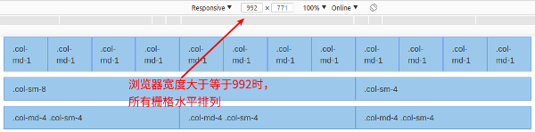

# 第六章 响应式前端框架Bootstrap的使用

古人云：“书山有路勤为径，学海无涯苦作舟”。千百年之前的圣贤就已经知道这个世界上是没有捷径可以走的，路都是需要一步一个脚印踏出来的，但在这个过程中有些部分是可以通过自己的智慧来缩短时间，从而实现事半功倍的效果。前端开发是一个完整的PHP技术栈中非常重要的一部分，是与用户交互的重要接口，然而在过去由于移动终端、平板等设备相对比较缺乏，因此前端开发主要针对的是PC端，但是目前由于这些设备的大量普及，使得前端应用的开发不得不考虑这些平台，并且这些平台都有其自身的特性，如移动端的屏幕是垂直的，而PC端的屏幕是水平的，在过去要实现这个特征，那么就必须开发完整的两套软件来应对不同的设备，这对开发人员来说是效率非常低，而且容易出错，因此这几年由一个IT界的龙头企业陆续开发出了基于响应式的前端框架，使用这些框架可以让前端开发人员只需要进行一次编码即可以在PC、平板、手机等平台上进行使用，而不需要为各个平台进行单独的定制开发，从而大大提高了开发效率，降低了人力成本。本章主要讲解一种主流的响应式框架，读者关键要理解其中的设计思路和思想，然后再根据具体的项目来举一反三。

#### 本章内容

> * Bootstrap简介与库文件的导入
> * 响应式的栅格系统运作原理的理解
> * 页面组件的全局样式设定
> * 响应式的导航栏与常用组件的应用
> * Bootstrap框架与JavaScript插件的组合应用

## 6.1 Bootstrap简介与库文件的导入

随着互联网技术的发展，特别是移动互联网技术的发展，用户已经不能满足于使用笨重的PC进行信息的查询，而是希望能够在公交、地铁、沙发等环境下通过对更加便携的设备进行操作来时时刻刻获取想要的信息。这看似简单的需求，但对于IT界来说却是一个不小的挑战，因为在过去谁都没有想到过会有这样的一天到来，即移动设备上能够浏览的内容和PC上浏览器的内容是相同的，而且展示方式又是非常的优雅和美观，然而这一天就这样到了，并且这样的便携设备操作时时刻刻在我们身边上演。

在过去要解决这个问题，那么就必须由两组人员来完成，其中一组专门用于开发PC端的网站，而另一组则是开发移动端的网站，然后再在服务器端通过判断User-Agent来获取用户是通过PC访问还是通过移动端访问，然后再跳转到不同的页面中。在这个过程中存在三点问题，分别如下：

**1、成本较高：** 由于需要有两组人员同时开发，并且要做到系统调用和信息的一致性，因此不论开发的时间成本还是人力成本都相对较高。

**2、可维护性较低：** 由于针对不同设备，因此代码之间的统一性较弱，影响了程序的可维护性。

**3、一致性较低：** 由于针对的设备不同，以及开发人员的不同，因此PC和移动端之间较难做到一致性，使得用户感受存在差异。

针对以上存在的问题，2010年起Twitter公司的几名前端工程师成立兴趣小组，就开始研究和开发建立能够帮助设计师和开发人员快速构建统一的、美观的，并且能够跨平台的前端工具包，经过1年多的打磨将其在GitHub开源，并命名为Bootstrap，Bootstrap的Logo如图6-1所示。从而普惠全世界的开发人员。严格来说，Bootstrap其本质是一个CSS的框架，开发人员只需在相应的标签上添加需要的CSS类就可以实现不同的功能。而在其内部，Bootstrap使用标准的HTML5和CSS3作为开发基础，因此要让Bootstrap的特性都发挥出来，那么开发的目标浏览器也需要能够支持HTML5和CSS3，到笔者撰写为止，各大浏览器提供商所提供的最新浏览器都能很好的支持Bootstrap。此外，在Bootstrap中，还通过引入第三方JavaScript标准库JQuery来实现各类UI组件的交互，例如导航条、下拉菜单等。因此可以说，Bootstrap为前端开发人员提供了一站式的前端解决方案。


图6-1 Bootstrap的图标

### 6.1.1 Bootstrap框架的引入

由于Bootstrap采用MIT的开源许可证，在法律上允许任何人修改它的代码，并变为自己的代码，同时还可以用于商业用途，因此Twitter为Bootstrap提供了最为宽松的版权协议，也因为这个，在Bootstrap官网（https://v3.bootcss.com/getting-started/）提供针对三类不同开发者的Bootstrap源码，分别是：

**1、针对普通开发者：** 大多数开发者都属于这一类，包括笔者也是，这类开发者主要使用Bootstrap工具进行各类B/S系统的开发，因此Twitter为这类开发者提供了系统开发所必须的JavaScript、CSS和字体文件，即用于生产环境的源码，只需要导入到页面中就可以使用。

**2、针对需要定制Bootstrap的开发者：** 这类开发者通常需要基于Bootstrap源码进行二次深度定制，从而形成自己的产品，因此针对这类开发者Twitter提供了编译为生产环境所需的Bootstrap源码，包括CSS的预编译文件Less、JavaScript和字体文件。

**3、针对使用Sass作为CSS预编译工具的开发者：** 而第三类确切的说也属于第二类，只是该类的开发者使用的CSS预编译语言不是Less，而是Sass，因此Twitter提供了从Less移植到Sass的工具，可以帮助这类开发者快速构建基于Sass的Bootstrap源码。

因此，本章的内容主要针对的是普通开发者，进入Bootstrap官网后就可以看到提供的下载链接，如图6-2所示。此外，为了使Bootstrap能提供更好的跨区域访问速度，Bootstrap联合国内的云服务商提供了免费的CDN加速服务，需要特别注意的是，因为Bootstrap中所有的JavaScript插件，包括UI组件都依赖于JQuery进行开发，因此在引入Bootstrap核心JavaScript库之前，需要引入JQuery才能提供完整的功能，并且JQuery的版本需要在1.9.1以上，在具体代码如下：

```html
<!-- 最新版本的Bootstrap核心CSS文件 -->
<link href="https://cdn.bootcss.com/bootstrap/3.3.7/css/bootstrap.min.css" rel="stylesheet">

<!-- 最新版本的Bootstrap主题文件 -->
<link href="https://cdn.bootcss.com/bootstrap/3.3.7/css/bootstrap-theme.min.css" rel="stylesheet">

<!-- 最新版本的JQuery核心JavaScript文件 -->
<script src="https://cdn.bootcss.com/jquery/3.3.1/jquery.min.js"></script>

<!-- 最新版本的Bootstrap核心JavaScript文件 -->
<script src="https://cdn.bootcss.com/bootstrap/3.3.7/js/bootstrap.min.js"></script>
```


图6-2 Bootstrap下载地址

下载并解压缩Bootstrap后，就可以看到如图6-3所示的目录结构，其中CSS目录存放Bootstrap的样式文件，JS目录存放Bootstrap的核心库文件，Fonts目录存放Bootstrap所使用的字体文件，在这些文件里面会看到有xxx.min.xxx和xxx.map这两类较为特殊文件，其中带min的文件表示经过压缩后的文件，CSS和JavaScript的压缩与图片、视频等多媒体文件的压缩方式不同，CSS和JavaScript的压缩通常是把文件中的空格、换行等内容进行替换和删除，从而减少文件的体积，而另外一个带map的文件，叫源码映射表，因为经过压缩的CSS和JavaScript文件在开发时无法精确的对源码进行调试，所以需要通过map文件把压缩后的文件转化为开发人员能够读懂，并且格式化的源码，从而方便程序的调试。


图6-3 Bootstrap的源码目录结构

### 6.1.2 Bootstrap基础模板的理解

几乎所有软件工程师都是从Hello World开始编写，Bootstrap也提供了类似与Hello World的基础模板，具体如示例代码6-1所示。

```html
<!DOCTYPE html>
<html lang="zh-CN">
  <head>
    <meta charset="utf-8">
    <meta http-equiv="X-UA-Compatible" content="IE=edge">
    <meta name="viewport" content="width=device-width, initial-scale=1, user-scalable=no">
    <title>Hello Bootstrap</title>

    <!-- 导入Bootstrap的样式库 -->
    <link href="css/bootstrap.min.css" rel="stylesheet">

    <!-- HTML5 shim 和 Respond.js是为了让IE8支持HTML5的元素，以及响应式布局核心的媒体查询（Media Queries）功能 -->
    <!-- 当使用file://方式访问本文件时，Respond.js库无效 -->
    <!--[if lt IE 9]>
      <script src="https://cdn.bootcss.com/html5shiv/3.7.3/html5shiv.min.js"></script>
      <script src="https://cdn.bootcss.com/respond.js/1.4.2/respond.min.js"></script>
    <![endif]-->
  </head>
  <body>
    <h1>你好，世界！</h1>

    <!-- 引入使用Bootstrap插件所必须的JQuery库 -->
    <script src="https://cdn.bootcss.com/jquery/1.12.4/jquery.min.js"></script>
    <!-- 引入完整的Bootstrap核心库 -->
    <script src="js/bootstrap.min.js"></script>
  </body>
</html>
```

例6-1 Bootstrap的HelloWorld

**第4行：** 表示设置当前文档的编码方式为UTF-8，当浏览器读到该meta时就会采用执行的编码方式进行文件的解码，同时笔者也建议今后所有的源代码文档都采用UTF-8进行编码，方便在各系统间进行移植。

**第5行：** 表示告诉IE浏览器采用最高级模式进行文档渲染，而不考虑向下兼容的问题，即IE7就采用IE7的模式进行渲染，IE10就采用IE10的模式进行渲染，因为目前有该meta的网页通常都是使用HTML5进行编写，因此只有文档渲染模式越新，那么所支持的HTML5越完整。此外，网上还有一种是修改content的值为"IE=edge,chrome=1"以提高浏览器对HTML5的兼容性，由于该方法需要在IE浏览器中安装Google的一款插件——Chrome Frame才能使用，但是目前该插件已经在2014年1月停止更新，所以该方法目前无法使用。

**第6行：** 表示设置移动端浏览器的视区大小，viewport表示该meta的类型为视区，content中的width表示设备宽度，initial-scale表示缩放比例，而user-scalable表示是否允许用户对页面进行缩放，笔者建议设置为no，此时用户只能够滚动屏幕的方式来查看内容，使得开发出来的网页看上去更像原生应用，当然这个设置可以根据每个项目不同的需求进行删减。这里需要特别说明的是4-6行必须放在head标签的最前面，其他内容后它们之后。

**第10行：** 表示导入一个Bootstrap的样式库，这里需要根据自己的情况进行定制，例如Bootstrap放在本地，那么就需要通过相对布局引入，如果使用CDN服务，那么就要把这行换做CDN地址。

**第14-17行：** 表示当通过浏览器的判断当前访问的浏览器版本是否小于IE9，因为IE9是支持HTML5，因此不需要判断。如果浏览器版本小于IE9，则引入html5shiv.min.js使得浏览器能够支持HTML5中的新增标签，同时引入respond.min.js使得浏览器能够支持媒体查询（Media Queries）功能，从而实现响应式的布局，关于媒体查询的内容会在下一节中重点讲解。

**第23行：** 表示导入Bootstrap插件必须的JQuery库，这里需要根据自己的情况进行定制，例如JQuery放在本地，那么就需要通过相对布局引入，如果使用CDN服务，那么就要把这行换做CDN地址。

**第25行：** 表示导入Bootstrap核心库，这里需要根据自己的情况进行定制，例如Bootstrap放在本地，那么就需要通过相对布局引入，如果使用CDN服务，那么就要把这行换做CDN地址。

目前国内浏览器厂商都会提供两种浏览器模式，即兼容模式（采用IE作为内核）和高速模式（采用WebKit作为内核），然而很多浏览器为了兼容更多的网站会采用兼容模式作为其默认模式，这使得采用较低版本的IE浏览器内核时，基于Bootstrap 构建的网站展现效果很糟糕。目前，国内浏览器厂商为了解决这个问题，在保持兼容性的同时也能够较好的支持HTML5相关特性，因此国内的浏览器在解析页面的同时提供了”renderer“元信息的支持，开发人员可以在head中填下如下元信息，使得浏览器在浏览器该页面时采用高速模式进行浏览器，从而实现对HTML5和Bootstrap更好的支持。

```html
<meta name="renderer" content="webkit">
```

## 6.2 响应式的栅格系统运作原理的理解

1692年，新登基的法国国王路易十四国王为了使法国的印刷制品的质量能有质的提升，命令成立一个管理印刷产品质量的皇家特别委员会。委员会的成员首要任务是设计出科学的、合理的，并且重视功能性的新字体。当时，该委员会由数学家尼古拉斯加宗担任支持，他们以罗马字体为基础，每个字体设计了由64个基本方格组成的基本单元，并且每个方格中还被分成了36个小格，通过把字体放在严谨的几何网格网络中进行设计和排版，从大大提升了当时法国印刷制品的品质。同时，这也是世界上最早的栅格系统雏形。

目前栅格系统广泛的用于各类设计系统中，例如UI设计、图标设计、字体设计等，通过栅格系统的应用可以使产品设计的质量更高，同时栅格系统还能为设计提供很好的参考，工作效率大幅提升。所谓栅格系统，就是把一个页面分为若干行，以及若干列，其中行的高度不一定要相同，但是每列的宽度却是固定的，如图6-4所示。在Bootstrap中提供了一套把页面进行12等分的栅格系统，并且这个栅格系统中的每一列的宽度都会根据当前页面的宽度进行自动计算，同时列和列之间还能进行合并。


图6-4 栅格系统的概念

### 6.2.1 响应式布局的核心——媒体查询

随着终端设备的种类越来越多，屏幕分辨率、屏幕尺寸也越来越复杂，早起的网页设计已经无法提供在各种终端上进行完善的显示，例如在1024*768的显示器上进行设计网页，在1080P的显示器上就会显得各种尺寸都很小，而反过来又会显的很大。因此，为了解决这个问题从CSS 2.1开始加入了各种多媒体类型的定义，如显示器、移动设备等，通过这些媒体类型的设计可以帮助开发人员针对这些不同的设备进行不同的CSS样式设计。当浏览器在进行页面显示时，会根据当前屏幕的大小查询相应的媒体类型，以及该媒体类型中的CSS设置，从而显示不同效果。可以说，目前所有的响应式布局都是在此特性的基础上进行构建，也包括Bootstrap，因此了解媒体查询的使用对深入理解响应式布局和Bootstrap至关重要。

媒体查询的设置语法如下：

```css
@media not|only 设备类型 [and (设备特征)] {样式列表}
```

**1、@media：** 表示该设置为一个媒体查询设置。

**2、not|only：** 当该值为not时，表示设置除指定设备类之外的设备类型样式列表。

**3、设备类型：** 表示媒体查询所支持的设备类型，其中sceen是最为常用的设备类型，如表6-1所示。

表6-1 媒体查询支持的设备类型

| 设备类型 | 说明 |
| :-: | :- |
| all | 适用于所有的设备 |
| aural | 适用于语音和音频合成器 |
| braille | 适用于触觉反馈设备 |
| embossed | 适用于凸点文字（盲文）印刷设备 |
| handheld | 适用于小型或者手提设备 |
| print | 适用于打印机 |
| projection | 适用于投影图像,如幻灯片 |
| sceen | 适用于计算机显示器 |
| tty | 适用于使用固定间距字符格的设备,如电传打字机和终端 |
| tv | 适用于电视类设备 |

**4、and （设备特征）：** 在媒体查询的语法中设备特征的数量可以从0-N个，通过设备特性的匹配可以对设备类型进行精确的匹配，从而显示不同的效果。同时，大多数的设备特征都是支持max和min的前缀，例如max-width、min-width分别表示最大、最小宽度，具体如表6-2所示。

表6-2 可设置的设备特征

| 设备特征 | 特性值规范 | 是否支持max/min | 说明 |
| :-: | :- | :-: | :- |
| color | 整数值 | 是 | 匹配设备使用多少位的色深,如果是彩色则该值为8，如果不是彩色设备则为0，如果RGB三色的位数不一样，那么就使用最小的位数作为该值 |
| color-index | 整数值 | 是 | 匹配色彩表中的颜色数，例如要匹配的色彩表中有256个颜色，那么该值就为256 |
| aspect-ratio | 浏览器宽高比值，如16/9、4/3 | 是 | 匹配浏览器的宽度值和高度值的比例 |
| device-aspect-ratio | 设备宽高比值，如16/9、4/3 | 是 | 匹配设备分辨率的宽度值与高度值的比例 |
| device-height | 整数值 | 是 | 匹配设备分辨率的高度值 |
| device-width | 整数值 | 是 | 匹配设备分辨率的宽度值 |
| grid |  0或1 | 否 | 匹配设备是网格设备还是位图设备。如果设备是基于网格的，如只能显示一种字体的电话，该值为1，否则为0 |
| height | 整数值 | 是 | 匹配浏览器的高度 |
| width | 整数值 | 是 | 匹配浏览器的宽度 |
| monochrome | 整数值 | 是 | 匹配一个带灰度的黑白设备每个像素的比特数，如果该设备不是黑白设备，则该值为0，如果是具有256阶灰度的设备，则该值为8 |
| orientation | landscape/portrait | 否 | 匹配设备是处于横屏还是竖屏，landscape表示横屏，即宽度大于高度，portrait表示竖屏，即高度大于宽度 |
| resolution | 分辨率，如300dpi | 是 | 匹配设备的物理分辨率，即像素密度 |
| scan | progressive/interlace | 否 | 匹配设备的扫描方式,其中progressive代表逐行扫描，interlace代表隔行扫描 |

从上面的语法解释不难看出，在前端页面设计中大部分的物理特性都可以通过媒体查询的方式进行检索和过滤，通过这种方式就可以开发人员就可以针对不同的物理特性去设置不同的内容，下面通过一个简单的例子来进行说明，具体如示例代码6-2所示。

```html
<!DOCTYPE html>
<html lang="en">
<head>
    <meta charset="UTF-8">
    <meta name="viewport" content="width=device-width, initial-scale=1.0">
    <meta http-equiv="X-UA-Compatible" content="ie=edge">
    <title>媒体查询示例</title>

    <style>
        html {
            font-size: 10px;
        }
        h2 {
            font-size: 2rem;
        }
        span {
            font-size: 1rem;
        }
        /* 媒体查询设置 */
        @media screen and (min-width: 320px) and (max-width: 420px) {
            html {
                font-size: 5px;
            }
        }
        @media screen and (min-width: 421px) and (max-width: 520px) {
            html {
                font-size: 10px;
            }
        }
        @media screen and (min-width: 521px) and (max-width: 620px) {
            html {
                font-size: 15px;
            }
        }
        @media screen and (min-width: 621px) and (max-width: 720px) {
            html {
                font-size: 20px;
            }
        }
        @media screen and (min-width: 721px) and (max-width: 820px) {
            html {
                font-size: 25px;
            }
        }
        @media screen and (min-width: 821px) and (max-width: 920px) {
            html {
                font-size: 30px;
            }
        }
        @media screen and (min-width: 921px) {
            html {
                font-size: 35px;
            }
        }
    </style>
</head>
<body>
    <div>
        <h2>苏州工业园区服务外包职业学院</h2>
        <span>嵌入式技术与应用专业</span>
    </div>
</body>
</html>
```

例6-2 媒体查询的示例

在上面的代码中，设置了多个媒体查询，在这些查询中都以浏览器的最大宽度和最小宽度作为设备特征，当浏览器宽度属于某个范围内时，就会修改HTML根标签的字号。这里需要特别说明的是，在样式列表中还定义了h2和span标签的字号，并且这个字号所使用的单位不是通常的px而rem。rem是一个相对的字号大小单位，其相对的目标是HTML根标签\<html\>\</html\>内设置的字号大小。

在rem概念还没有引入之前，通常开发人员会以最小的屏幕开发出一个初始的版本，当该页面被不同设备进行浏览时，再通过JavaScript的方式去修改viewport中的initial-scale参数，这样的做法在一定程度上能满足基本需求，但也出现了很多问题，最主要的问题是当页面被大屏设备访问时就会出现字体、图片模糊的现象，这是因为initial-scale参数的本质实际上是拉伸页面，因此无法提供良好的用户体验。当rem的概念引入之后，开发人员只需要设置HTML根标签的字号就会相应的修改所有子页面中的字号。

正如本例中所示，当浏览器大小发生改变时，由于通过媒体查询的方式修改了HTML根标签的字号大小，同时又因为h2和span标签使用了rem作为字号的单位，所以当根标签的字号大小变化时也会同时作用于h2和span标签。就因为rem单位的特殊性和相对性，所以自从有了响应式页面的需求，该单位才开始崭露头角逐渐成为现在响应式页面的字号和图片设置的主流。在上面的示例代码中，虽然h2和span设置的字号大小都相同，但是因为浏览器大小的不同，造成根标签内的字号大小不同，使得h2和span标签的字号也发生了改变，示例代码的结果如图6-5所示。


图6-5 栅格系统的效果图

### 6.2.2 Bootstrap中栅格系统的原理

Bootstrap中对栅格系统做了进一步的完善和改进，并且把网页纵向分为等分的12列进行设计，通过一系列的行（row）和列（column）的组合来创建所需要的页面，但是要正确的创建和使用Bootstrap的栅格系统只是引入CSS和JavaScript还不够，还需要按照一定的规则才能让栅格系统和Bootstrap系统提供的组件运作起来，这些规则一共有三点，具体如下：

**1、容器（container）的设置：** 要使Bootstrap的栅格系统运作起来首先必须在其最外层包裹一个容器，Bootstrap中的容器分为两种，一种是固定宽度的容器container，该容器是支持响应式的布局容器，而另外一种则是占据整个视区（viewport）的容器container-fluid，此容器所在的浏览器不论如何变化，该容器都是撑满整个浏览器。但需要注意的是，这两种容器之间不能相互嵌套，只能独立使用，下面通过分析这两个容器的源码来进一步的分析。

**container的样式设置：**

```css
.container {
    padding-right: 15px;
    padding-left: 15px;
    margin-right: auto;
    margin-left: auto;
}
@media (min-width: 768px) {
    .container {
        width: 750px;
    }
}
@media (min-width: 992px) {
    .container {
        width: 970px;
    }
}
@media (min-width: 1200px) {
    .container {
        width: 1170px;
    }
}
```

该样式表示的是支持响应式布局的固定宽度容器container，从上面的代码可以看出该容器的左右内边距始终为15px，并且margin-right和margin-left设为auto表示该容器水平居中，而后面的@media则为媒体查询，其设备特征为浏览器的宽度，当浏览器的宽度满足条件时则会修改容器的宽度，具体如下。因此，从上面的代码可以知道，当使用该容器时，改变浏览器的宽度，容器的宽度也会跟着发生变化，但是不论该容器的宽度如何变化，容器的位置都为水平居中，此容器最大的宽度为1170px，最小宽度为750px，如果浏览器的宽度大于1200px时，那么在容器的两边会进行留白。

**container-fluid的样式设置：**

```css
.container-fluid {
    padding-right: 15px;
    padding-left: 15px;
    margin-right: auto;
    margin-left: auto;
}
```

该样式表示的是占据整个视区（viewport）的容器container-fluid，从上面的代码可以看出该容器的左右内边距始终为15px，并且margin-right和margin-left设为auto表示该容器水平居中，并且撑满整个视区。因此，该容器所在的浏览器不论如何变化，该容器都是撑满整个浏览器。

**2、行、列的创建：** 当添加容器后，接下来就需要创建一系列垂直方向的行（row），并且在每个列中创建一系列水平方向的列（column），通过行和列的组合来创建所需要的页面。这里需要注意的是所有的内容都必须要放在“列”中完成，并且“行”的第一个子标签的样式必须是“列”，具体示例代码如下：

```html
<body>
    <div class="container">
        <div class="row">
            <div class="col-md-4">
                <h2>苏州工业园区服务外包职业学院</h2>
            </div>
            <div class="col-md-2">
                <span>嵌入式工程系</span>
            </div>
            <div class="col-md-6">
                <span>嵌入式技术与应用专业</span>
            </div>
        </div>
    </div>
</body>
```

在上面的代码中首先定义了一个响应式的容器"container"，然后在该容器中定义了一个"行"（row），在"行"标签的内定义了三个"列"（col），并且为每个"列"添加要显示的内容。这里还需要再次强调的是，在行和列之间不能添加其他内容，所有的内容都必须添加在"列"标签内。为了方便和快速的布局栅格系统，在Bootstrap中定义了一系列的预定义样式类，其格式为".col-屏幕大小-所占列的个数"。因为Bootstrap把一行分为了12列，因此一行中所有列所占的列数之和必须为12，如果所占列数之和超出12，那么超出的部分就会自动转移到下一行。从响应式的容器container源码可以知道，容器所针对的屏幕分为四种，分别是浏览器宽度大于1200px的大屏、浏览器宽度大于992px的中屏、浏览器宽度大于768px的小屏，以及浏览器宽度小于768px的超小屏，针对不同屏幕Bootstrap提供了不同的屏幕大小标识来说明不同的屏幕，分别是xs（超小屏）、sm（小屏）、md（中屏）和lg（大屏），因此完整的"列"样式应该类似于”.col-md-4“这样的形式。具体如表6-3所示。

表6-3 栅格"列"的样式说明

| 项目名称/屏幕 | 超小屏幕设备（<768px） | 超小屏幕设备（>=768px） | 中等屏幕设备（>=992px） | 大屏幕设备（>=1200px） |
| :- | :- | :- | :- | :- |
| 栅格系统行为 | 总是水平排列 | 开始是堆叠在一起的，当大于这些阈值时将变为水平排列 |
| .container 最大宽度 | None（自动） | 750px | 970px | 1170px |
| 类前缀 | .col-xs- | .col-sm- | .col-md- | .col-lg- |
| 列数 | 12 |
| 水平内边距 | 30px（左右各15px） |
| 可嵌套 | 是 |
| 可偏移 | 是 |
| 可列排序 | 是 |

**3、栅格样式的最优化选择：** 由于.col-xs-、.col-sm-、.col-md-、.col-lg-这些样式类都定义在媒体查询中，示例代码如下。因此当浏览器尺寸不同时，只会显示对应屏幕的样式，而其他屏幕的样式则不会被应用，例如在浏览器宽度小于992px时，当前页面只会应用.col-sm-12的样式，而不会是.col-md-12的样式，因此通过媒体选择的方式Bootstrap为页面选择了最为合适的样式，以达到最好效果。

```css
@media (min-width: 768px) {
    ......
    .col-sm-12 {
        width: 100%;
    }
    ......
}

@media (min-width: 992px) {
    ......
    .col-md-12 {
        width: 100%;
    }
    ......
}

@media (min-width: 1200px) {
    ......
    .col-lg-12 {
        width: 100%;
    }
    ......
}
```

### 6.2.3 Bootstrap中栅格系统的页面布局

要正确的使用栅格系统设计响应式页面首先需要了解栅格系统中栅格的水平排列和垂直排列（或者称为堆叠排列）之间的切换。上一节讲过Bootstrap通过媒体查询的方式实现栅格系统，当浏览器的宽度大于某个阈值时，那么这些栅格就为水平排列，而当浏览器的宽度小于某个阈值时，那么这些栅格就为垂直排列，下面以响应式容器container和col-md-?为例进行说明，示例代码如例6-3所示。

```html
<!DOCTYPE html>
<html lang="en">
<head>
    ......

    <style>
        html {
            font-size: 10px;
        }

        .row div {
            background-color: #9ACFEA;
            border: 1px #66AFE9 solid;
            font-size: 1.5rem;
            padding-top: 10px;
            padding-bottom: 10px;
        }

        .row {
            margin-bottom: 10px;
        }
    </style>

</head>
<body>
    <div class="container">
        <div class="row">
            <div class="col-md-1">.col-md-1</div>
            <div class="col-md-1">.col-md-1</div>
            <div class="col-md-1">.col-md-1</div>
            <div class="col-md-1">.col-md-1</div>
            <div class="col-md-1">.col-md-1</div>
            <div class="col-md-1">.col-md-1</div>
            <div class="col-md-1">.col-md-1</div>
            <div class="col-md-1">.col-md-1</div>
            <div class="col-md-1">.col-md-1</div>
            <div class="col-md-1">.col-md-1</div>
            <div class="col-md-1">.col-md-1</div>
            <div class="col-md-1">.col-md-1</div>
        </div>
        <div class="row">
            <div class="col-sm-8">.col-sm-8</div>
            <div class="col-sm-4">.col-sm-4</div>
        </div>
        <div class="row">
            <div class="col-md-4 col-sm-4">.col-md-4 .col-sm-4</div>
            <div class="col-md-4 col-sm-4">.col-md-4 .col-sm-4</div>
            <div class="col-md-4 col-sm-4">.col-md-4 .col-sm-4</div>
        </div>
    </div>

    ......
</body>
</html>
```

例6-3 栅格排列的示例

在上面的代码中有两种栅格列前缀，分别时col-md-？和col-sm-？，这两个前缀如表6-3所示，表示浏览器宽度大于992px和768px的列样式。同时，在上面的代码中，有两种栅格的使用方法，一种为列只添加栅格样式，另外一种则是为列添加多种栅格样式，如第三个row所示。执行代码，并对浏览器进行缩放，当浏览器的宽度大于等于992px时，会看到如图6-6所示的效果，每个栅格都以水平排列的方式显示在浏览器上。而浏览器的宽度小于992px时，栅格系统就会发生变化，第一个row中原先水平排列的栅格变为以垂直形式排列的栅格，但是此时第二个row和第三个row依然以水平方式进行排列，对于第二个row来说，这是因为当前行中的栅格定义为col-sm-？的列，其浏览器宽度的阈值为768px，此时浏览器的宽度还大于该值，而对于第三个row来说，由于采用md和sm混排的方式，因此Bootstrap在内部计算时会以最小的那个类型作为是水平排列还是垂直排列的依据，因此第三个row的情况就和第二个row相同，如图6-7所示。此时，继续缩小浏览器宽度，当浏览器宽度小于768px时，所有的栅格都变为垂直排列，如图6-8所示。



图6-6 浏览器宽度大于992px的效果


图6-7 浏览器宽度小于992px的效果


图6-8 浏览器宽度小于768的效果

从上面的结果可以得出这样的结论，即在Bootstrap中如果浏览器的屏幕大于等于栅格所在类型的阈值时，那么栅格以水平方式进行排列，如果如浏览器的屏幕小于栅格所在类型的阈值时，那么栅格以垂直方式进行排列，如果某个栅格中存在两个以上的栅格类型，那么该栅格以最小的那个类型作为判断栅格是水平还是垂直排列的依据。

通过Bootstrap的这一特性就可以创建针对移动端、平板和PC等不同屏幕尺寸的动态布局。上面说了，在Bootstrap中有四种栅格类型，分别是col-xs、col-sm、col-md和col-lg，其中col-xs主要设计针对移动设备，col-sm-则设计针对平板设备，而col-md和col-lg设计针对的是PC设备，因此如果希望页面在移动设备上不要以堆叠方式（垂直方式）排列，那么就需要为栅格添加col-xs样式，如果希望在平板设备上不要以堆叠方式显示，那么就需要在栅格上添加col-sm样式，示例代码如例6-4所示。

```html
<!DOCTYPE html>
<html lang="en">
......

<body>
    <div class="container">
        <div class="row">
            <div class="col-xs-12 col-sm-6 col-md-8">.col-xs-12 .col-sm-6 .col-md-8</div>
            <div class="col-sm-6 col-md-4">.col-sm-6 .col-md-4</div>
        </div>
        <div class="row">
            <div class="col-xs-6 col-sm-4">.col-xs-6 .col-sm-4</div>
            <div class="col-xs-6 col-sm-4">.col-xs-6 .col-sm-4</div>
            <div class="col-xs-6 col-sm-4">.col-xs-6 .col-sm-4</div>
        </div>
    </div>

    ......
</body>
</html>
```

例6-4 针对手机、平板、PC的响应式布局示例

运行上面的代码就可以看到，在第一行中，第一个栅格在移动端时，显示为占据一行，即col-xs-12起作用，在平板端时，col-sm-6起作用，第一个和第二个栅格以6:6的方式水平排列在页面中，而在PC端，则col-md起作用，第一个和第二个栅格以8:6的方式水平排列在页面中。而第二行中，由于col-xs的值之和大于12，因此这三个栅格在移动端时，显示为2行，第一个和第二个栅格组成一行，而多出的第三个栅格则另起一行，而这个三个栅格在平板段时，由于col-sm的值之和等于12，因此这三个栅格以水平方式进行排列，如图6-9和6-10所示。


图6-9 平板端显示效果


图6-10 移动端显示效果

在进行页面布局时，经常会使用CSS中的margin等样式来设置页面元素的偏移量，在Bootstrap的栅格系统中也具有类似的功能，即通过“col-类型-offset-偏移数”这样的样式类型来实现，其中偏移数不能超过12，因为偏移量的设置只能作用于同一行，而一行最多是12列，示例代码如例6-5所示，效果如图6-11所示。

```html
<!DOCTYPE html>
<html lang="en">
......

<body>
    <div class="container">
        <div class="row">
            <div class="col-md-4">.col-md-4</div>
            <div class="col-md-4 col-md-offset-4">.col-md-4 .col-md-offset-4</div>
        </div>
        <div class="row">
            <div class="col-md-3 col-md-offset-3">.col-md-3 .col-md-offset-3</div>
            <div class="col-md-3 col-md-offset-3">.col-md-3 .col-md-offset-3</div>
        </div>
        <div class="row">
            <div class="col-md-6 col-md-offset-3">.col-md-6 .col-md-offset-3</div>
        </div>
    </div>

    ......
</body>
</html>
```

例6-5 栅格的偏移示例


图6-11 栅格偏移的效果

从上图不难看出，第一行中的第二个栅格偏移了4格，而第二行中的第一个栅格偏移了3格，第二个栅格偏移了3格，第三行中的栅格偏移三格。由此可知，通过对栅格进行设置可以方便的进行位置的偏移，但要确保每行中的栅格偏移量和栅格大小之和应该小于等于12。此外，在开发复杂页面时，经常会出现页面元素之间的相互嵌套，从而把整个页面由整体向局部递进式的设计和编码，Bootstrap中的栅格系统也具备同样的功能，即在一个栅格中添加一个新的行（row），然后再把改行分为多个小栅格进行布局，从而实现对某个栅格的局部再布局，并且新添加row的最大宽度为其父栅格的宽度，栅格嵌套的示例代码如例6-6所示，效果如图6-12所示。

```html
<!DOCTYPE html>
<html lang="en">
<head>
    ......

    <style>
        html {
            font-size: 10px;
        }

        .grid-block {
            background-color: #9ACFEA;
            border: 1px #66AFE9 solid;
            font-size: 1.5rem;
            padding-top: 10px;
            padding-bottom: 10px;
        }
    </style>

</head>
<body>
    <div class="container">
        <div class="row">
            <div class="col-sm-9 grid-block">
                Level1：col-sm-9
                <div class="row">
                    <div class="col-xs-8 col-sm-6 grid-block">Level2：col-xs-8 col-sm-6</div>
                    <div class="col-xs-4 col-sm-6 grid-block">Level2：col-xs-4 col-sm-6</div>
                </div>
            </div>
            <div class="col-sm-3 grid-block">Level1：col-sm-3</div>
        </div>
    </div>

    ......
</body>
</html>
```

例6-6 栅格的嵌套示例


图6-12 栅格嵌套的效果

## 6.3 页面组件的全局样式设定

在前端页面设计中，除了基本的布局外，就是对页面中所有组件进行标准化的排版，例如字体的大小、行间距、表格的表现形式，以及按钮的样式等。这些内容看似简单，但要设计出一套完整的、可修改、易扩展的样式套件具有一定难度，因此Bootstrap却提供了一套统一的CSS样式，通过这套样式可以快速的完成页面中所有元素的渲染，从而使得整个页面排版更加简单，风格也更加统一。在Bootstrap中为几乎所有的标签都有其基本的设定，例如全局的字体大小为14px，行高（line-height）为1.428，即20px，又如<p>被设置了等于1/2行高（即10px）的底部外边距等诸如此类的默认设置，此外Bootstrap还添加了一些可以根据需求添加的样式，例如表格是否带条纹，是否带悬停效果等，因此本节主要针对这些需要根据需求自行添加的内容进行讲解，并嵌入一些常用的默认设置。Bootstrap中的全局样式共分为五类，分别是文本样式、表格样式、表单样式、按钮样式，以及图片样式，下面就进行详细的说明。

### 6.3.1 Bootstrap中的文本样式

**1、文字对齐：** Bootstrap提供了五种文字对齐的方式，分别是左对齐（text-left）、右对齐（text-right）、居中对齐（text-center）、双端对齐（text-justify），以及不自动换行（text-nowrap），其中除了text-nowrap使用的是white-space属性进行设置，其他都是通过CSS属性text-align进行设置，具体代码如下，效果如图6-13所示。

```html
<p class="text-left">文字左对齐</p>
<p class="text-right">文字右对齐</p>
<p class="text-center">文字居中对齐</p>
<p class="text-justify">文字双端对齐</p>
<p class="text-nowrap">文字不进行换行</p>
```


图6-13 文字对齐的效果

**2、英文大小写的转换：** Bootstrap中提供了三种样式来进行英文字母的大小写转换，分别是转换到大写（text-uppercase）、转换到小写（text-lowercase），以及首字母大写（text-capitalize），这三个样式都是通过CSS属性text-transform来实现，具体代码如下：

```html
<p class="text-lowercase">Lowercased text</p>
<p class="text-uppercase">Uppercased text</p>
<p class="text-capitalize">Capitalized text</p>
```

**3、多种引用样式：** 在页面设计中，进场会要引用一些名人名言等内容，Bootstrap提供了一个通过blockquote标签实现引用的模板，并且可以通过在blockquote标签中添加blockquote-reverse样式实现引用内容的左对齐和右对齐，具体代码如下，效果如图6-14所示。

```html
<blockquote>
    <p>明月几时有，把酒问青天，不知天上宫阙，今夕是何年</p>
    <footer>苏轼<cite title="Source Title">水调歌头</cite></footer>
</blockquote>
<blockquote class="blockquote-reverse">
    <p>北国风光，千里冰封，万里雪飘</p>
    <footer>毛泽东<cite title="Source Title">沁园春雪</cite></footer>
</blockquote>
```


图6-14 文字引用的效果

### 6.3.2 Bootstrap中的表格样式


### 6.3.3 Bootstrap中的表单样式


### 6.3.4 Bootstrap中的按钮样式


### 6.3.5 Bootstrap中的图片样式


## 6.4 响应式的导航栏与常用组件的应用


## 6.5 Bootstrap框架与JavaScript插件的组合应用


## 6.6 小结