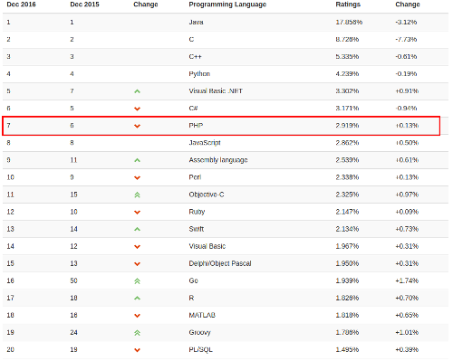
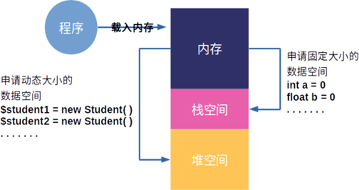
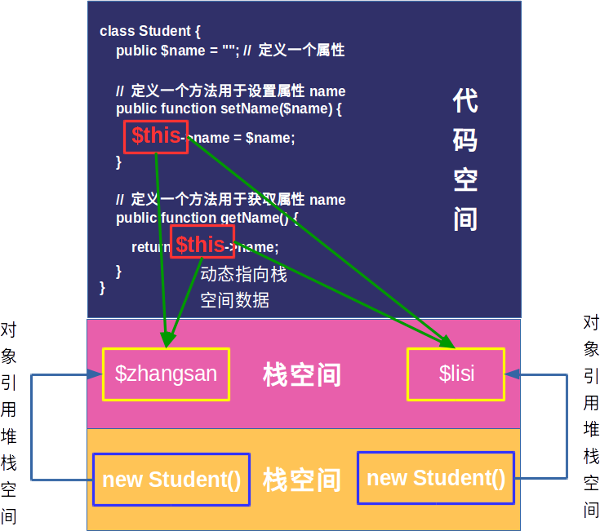

# 第七章 面向对象的程序分析与设计

古人云：”仁者见仁，智者见智“，一件事或者一个物体从不同的角度进行观察就会得出不同的结果，但这些结果又必有其相关性和区别性，就像看张艺谋的《长城》，有人觉得好看，也有人觉得不好看。在程序设计中针对一个问题的解决思路也是有多种方法，本章讲述的是目前在高级语言中最为流行，也是应用最为广泛的程序设计方法，即面向对象的程序分析与设计方法，这个方法具有很强的普适性，它可以用不同的语言以不同的语法进行表现，却有着相同的内涵，在本章我们则依托PHP编程来进行讲解。

#### 本章内容

> * 面向对象的基本概念
> * 面向对象的构成与内存分配
> * 面向对象的$this和构造函数的分析
> * 面向对象中继承性的应用
> * 面向对象中抽象与接口的理解
> * 面向对象中封装性与多态性的应用

## 7.1 面向对象的基本概念

到2016年距离PHP第一个版本的发布已经过去了22年，这22年中PHP由一个只是用来维护个人网页的工具发展到被Google、Facebook、Microsoft、阿里、腾讯等知名公司广泛使用的开发语言，并且在国际权威的开发语言排行榜TIOBE中始终排名在前十名，如图7-1所示的是2016年12月份的排名，目前PHP是排名在第六，可见其被应用的广泛程度。PHP目前有两个主要的分支，分别为PHP 5.x和PHP 7.x，而PHP 5.x是应用最为广泛的版本，许多第三方的框架都是基于该版本进行开发，其外在PHP 5.x中全面引入了面向对象的机制，并且保留了向下兼容的面向过程的函数，因此在本书中关于PHP的内容都是以PHP 5.x为基础上进行讲解。



图7-1 PHP语言排行榜

完整的面向对象通常包含三个层次的概念，即面向对象的分析（Object Oriented Analysis，OOA）、面向对象的设计（Object Oriented Design，OOD），以及面向对象的编程（Object Oriented Programming，OOP），其中面向对象的分析主要目的是找出要解决的问题中各个相对独立的对象，而面向对象的设计主要目的是找出这些独立对象之间关系，最终通过面向对象的编程把这些独立的对象和关系利用计算机语言进行实现，从而形成完整的系统。在这里读者一定要明白的是，面向对象并不是一门编程语言，而是一种编程思想，在面向对象的系统中每一个对象都能够对数据进行接收、处理和发送，从而使得整个软件系统的代码更加的简洁和更容易的维护，从而满足了软件设计的基本要求，即重用性、灵活性，以及扩展性。面向对象能够成为软件领域内最为热门的话题，主要原因是它符合我们看待事物的一般规律，例如我们从桌子上拿起一瓶饮料，我们做为一个独立的对象只需要伸手去拿即可，而不需要关心我们在拿饮料的过程中肌肉是如何传动的，能量是如何被消耗的等等一系列的问题，所以通过面向对象可以很好的把这些不需要关心的行为进行封装，让其内部进行，而不对外暴露。

因此在学习PHP的面向对象程序设计时除了要学习相关的语法外，更加重要的是要学习和思考面向对象的编程思想。起初在学习其相关语法时很多读者会觉得非常的简单，但是要深入的去思考为什么要这样设计，就像在本章开头所引用的那句古语”仁者见仁，智者见智“，运用面向对象的思想编程没有统一标准的答案，只有更好，没有最好，所以读者需要多思考、多练习。

### 7.1.1 理解类与对象

为了理解类和对象之间的关系，可以举一个通俗的例子，就好比在路上看到一只小狗，我们会叫他小狗，那么小狗就是一个类，因为世界上没有什么动物叫小狗，我们只是把有四个脚，并且会汪汪叫的动物称作小狗，但在我们眼前的这只小狗就是一个实实在在的动物，它是小狗这个概念具体化的产物，所以这个具体的小狗就是对象。因此可以知道所谓的类其实是把一系列具有相同属性、相同行为的对象进行抽象后形成的类。

因此在程序设计中类通常都是一个个独立的单元，这些单元有各自的属性，以及相应的行为，同时类也是符合这些特征的无数对象的高度抽象后的结果。类不存在于客观世界，而是存在与人们对于一个问题的思考和分类，也可以说类是人们所下的一个定义，例如我们说有四个脚，并且会汪汪叫的动物叫做小狗，我也可以说有四个脚，并且会汪汪叫的动物叫做猫，这些完全都有设计者来决定。

而对象与类恰恰相反，对象是在客观世界中实实在在存在的东西，客观的世界就是由无数个各种各样的对象组合起来的，这些对象又因为某种关系把他们联系在一起，比如家里领养了只小狗，那么本身没有任何关系的两个对象家庭成员和小狗，因为领养了这只小狗就产生了关系，领养是家庭成员的一个行为，而小狗则成了这个家庭中每个人的一个属性，所以可以认为对象是构成某个系统的基本单元，并且在对象内有一组相关的属性，以及可以操作的行为。

因此通过上面的介绍相信读者对于类和对象的关系有了一定的了解，虽然已无从考证为什么“class”会被翻译成“类”，但是笔者认为这个翻译是特别贴切的，因为“类”就相当于现实生活中把客观世界的各种东西进行分类，每个类型有自己的属性和行为，然后一个类型可以产生很多各实体，每个实体都是一个对象。

### 7.1.2 理解面向对象的程序设计

在PHP 5.x之前PHP并没有引入面向对象的概念，开发人员通过一个个的函数模块来构成整个交互系统，但是到了PHP 5.x这一切就发生了改变，因为在PHP 5.x中引入了面向对象编程的所有功能，同时还保持了原来的函数模块，保证了程序的兼容性，从此开发人员可以采用更加符合对客观世界理解的方式来进行开发和解决问题。

在面向对象的程序设计中，其相关语法并不是十分困难，甚至有C语言基础的读者会觉得它非常的简单，但是面向对象的程序设计的难点在于如何使用面向对象的思想来解决问题，例如要设计一个学生管理系统，那么首先要思考的不是这个系统有多少个学生、多少个班主任、多少个辅导员，因为这些内容都是不确定的，可能这个系统用在A学校就只有50个学生，而用在B学校就有100个学生，因此正确的思考应该是把整个系统进行分类，分成学生、班主任、辅导员，并且找出学生、班主任、辅导员这几个类别中每个类别应该有的行为，然后确定学生、班主任、辅导员之间的关系，例如每个学生都属于一个班级，每个班级都有一个班主任，若干个班级组成一个年级，每个年级都有一个辅导员，这样就可以把学生、班主任、辅导员之间的关系理清楚，然后在思考所对应的专业、学院和学校，以此类推就可以得到整个系统的体系结构。

从上面的分析不难看出使用面向对象编程思想编程时通常的思考方法是自顶向下的思考，也就是说先从整个系统进行整体划分，然后像剥洋葱皮一样一层层往下进行设计，直到最后一个部分，然全部划分完成后就是要确定这个模块之间的关系，以及模块与模块之间的数据是如何传递的、方向是什么等内容，从而构成了整个面向对象的系统。

## 7.2 面向对象的构成与内存分配

在程序开发中整形、浮点型、布尔型、双精度型都被成为基本数据类型，而数组和对象都被称为复合数据类型。虽然PHP是弱类型的语言，可以要求数组中的元素类型不相同，而不会像强类型的语言那样要求数组中每个元素的类型必须相同，但数组有个明显的不足就是无法为其添加行为，并且设定每个元素的访问权限，而这些功能则是类和对象所擅长的。在上一节本书讲解的面向对象的基本概念，本节将会讲述如何通过代码的方式创建一个类和一个对象。

### 7.2.1 类的声明

要声明一个类其实方法非常的简单，主需要在前面添加一个class关键字，后面跟着类名，最后用花括号括起来就可以，这里特别要说明的是类名和class之间一定要增加一个空格，具体代码如下：

```php
class 类名 {
    // 类的内容
}
```

在创建类是有一点需要特别的强调，就是关于类名的命名规则必须要要符合国际通行的管理，即如果该类名由一个单词构成，那么该单词必须是首字母大写，如果该类名由多个单词构成，那么每个单词的首字母都要大写，其他字母小写，同时要保证这个类名具有一定的意义，切记起一些没有意义的名称，例如AABB、ABCD等。

在类的内容中主要添加一些成员方法和成员属性，这个成员方法也就是函数，它主要表明这个类具有什么功能，而成员属性则表明这个类具有什么特质，例如要定义一个人这个类，那么姓名、年龄、性别就是人这个类的属性，而能够走路、能够跑步、能够拿东西就是人这个类的功能，这些东西都需要在类中进行定义，这里需要说明的是在类中定义的变量虽然可以不赋初值，但是给一个变量赋初值是一个很好的习惯，同时在方法名前添加限定符也是很好的习惯，可以明确该函数的权限。因此可以说所有的类都是由形形色色的属性和方法构成的，其能够实现的功能比数组多出许多，并且一个PHP程序可以声明无限多个类，只要系统需要，但在设计这些类时需要思考的关键是要把各种对象中所共性的进行抽象，从而得到了真正需要的类，具体代码如下：

```php
class 类名 {
    限定符 $属性名 = 初始值;
    ......

    限定符 function 方法名(参数列表) {
        // 函数体
    }
    ......
}
```

### 7.2.2 对象的实例化与内存分配

前面讲过类是许多个对象的高度抽象后的结果，因此一个类不仅仅表示一个对象，而是表示很多个对象，所以程序中不能直接对类进行操作，而是需要通过类的实例化后得到对象，然后调用对象中的各种方法，从而实现各种功能，这些方法也就是事先在类中已经定义好的方法。那么要实例化一个对象其实非常简单，只需要使用关键字new，然后后面加一个空格，空格之后跟上一个类名，最后紧跟一对小括号即可，如果此时在实例化一个对象时需要传递一些初始化参数，那么在类名之后的小括号中就需要传递一组初始化参数列表，具体代码如下：

```php
$对象名 = new 类名(); // 没有参数的情况
$对象名 = new 类名(参数列表); // 有参数的情况
```

其中“$对象名”表示通过某个类创建的对象名称，可以类比为变量名，只不过它表示的内容更加的复杂，而参数列表则是对象初始化的所需要的参数，例如创建一个Student对象时，可以传入如姓名、性别、年龄等初始化信息，从而创建出不同内容的对象。当类在创建对象时PHP会调用一个特殊的函数，即构造函数。构造函数的种类有两种，一种是默认的构造函数，当创建对象时如果它的参数列表为空，那么系统就会试图去调用默认的构造函数，因为默认的构造函数不需要传递任何的参数，通过内部的代码来实现对象的初始化，采用这种方法产生的对象均有相同的内容，而另一种就是自定义的构造函数，和默认的构造函数正好相反，创建对象时的参数列表不为空，当系统创建对象时，系统通过这些参数来初始化对象，对象通过这些参数来动态的生成其内容。这里需要特别说明的是在具体的程序开发中自定义构造函数一定是由开发人员自己来实现的，而默认的构造函数可以采用系统默认的方式，也可以由开发人员自己来实现，对于这部分内容在后续的章节中会进一步说明。

当一个类产生一个对象时，其实质是通过关键字new向操作系统发送申请空间的指令，因此每使用new一个对象就会在内容中获得一块内存空间，这些空间中存放了不同的内容，虽然这些对象的类型都是相同的，但是它们之间不存在任何的关系，因为在物理空间上就是分离的，就好比世界两端的人，虽然他们都是Person，但是从姓名、生活阅历、家庭来说它们是完全不同的，可以说是完全独立的两个人。所以，要完全理解并且熟练掌握对象的使用，除了要知道对象的基本使用方法还需要了解对象是如何在内存中进行创建和分配的，这样才能更加灵活的去使用对象。

在计算机中存储器不是指通常意义上的硬盘，而是指的内存，硬盘在计算机中只是相当于外部存储器，用来持久的保存数据，而计算机程序在运行时所有的数据都需要从硬盘中读取然后放入内存中进行计算，因此当内存较大时，就减少了计算机与硬盘进行数据交换的次数，也就提高了程序的运行速度。通常来说一个程序运行时所占用的内存空间会被划分为四个部分，分别为栈数据空间、堆数据空间、全局数据空间、程序代码空间，这四部分的作用分别如下：

* 栈数据空间：该部分数据空间相对较小，并且主要用于存放一些占用空间固定的数据，例如存放一些整型、浮点型等基本数据类型，因为数据的大小固定可以很方便的分配数据空间，所以计算机在设计该部分空间时把它设计成访问速度较快的空间，以便提高程序的效率，此外该空间还被用于存放一些临时的变量，当程序超出了临时变量的作用域时，该变量就会被销毁，所以栈空间一般被用于基本数据类型的交换，以及保存临时变量保存。
* 堆数据空间：区别于栈空间，堆空间主要用于为一些具有动态内存特性的数据分配存储空间，这些数据所占用的空间大小不固定，可能随着程序的运行进行所占用的空间增加或者减少，因此堆空间通常用于存储一些数据大小不固定，且占用较大空间的数据，例如像对象、数据这样数据都是存储在堆空间中。
* 全局数据空间：该空间相对较为简单，主要用于存储一些已经初始化完成的全局的静态变量。
* 代码空间：上面三种存储空间主要用于存储数据，而代码空间则主要存放由程序员编写的程序，这些程序不是编写的源程序文件，而是通过编译器或者解释器后产生的可执行文件，因为程序在运行时不能够被修改，所以这部分的空间具有只读的特性，而不能被写入。

从上面的解释可以知道，当PHP创建一个对象后，系统就会在内存的堆空间分配一部分容量用于存放该对象的数据，但为了提高整个系统的系统运行速度和安全性，避免对内存空间的随意修改，操作系统不允许运行的程序直接访问堆空间中数据，而是需要在栈空间中创建一个整数类型的变量，该变量就是通常所说的对象名，并且在该变量中存放着堆空间中对应对象的地址，然后通过对该变量所指向的堆空间地址中的数据进行操作，从而实现对象的操作。对象数据这样特殊的存储方式是因为栈空间的存取速度非常快，几乎具有和CPU寄存器一样的速度，但是栈空间具有存放数据必须大小固定的缺点，而堆空间却没有这样的要求，不过堆空间的速度相对较慢，因此对象数据的存储正式结合这两种存储方式的优点，既满足了速度要求，又满足了存储大小的要求，如图7-2所示的就是程序运行时的内存分配。



图7-2 堆栈内存的分布

在上图中把整个内存分为了三个部分，分别为内存、栈空间和堆空间。当程序运行时，操作系统会把要运行的程序全部载入到内存中，当程序遇到需要创建基本数据类型时，例如“int a = 0”和“float b = 0”时，程序就会通过操作系统向内存中的栈空间申请一块空间用来存放这些数据。而当程序遇到需要创建对象类型或者数组类型时，程序首先会通过new关键字来告诉操作系统当前程序需要在堆空间内申请一块内存空用来存放一些相对较大的数据，例如“new Student()”，此时每new一次就会在堆空间中申请一块内存空间，这些内存空间之间相互独立，当在堆中申请完空间后系统又会在栈空间申请一个内存空间，用来保存堆空间中的数据地址，例如“$student1 = new Student()”中的$student1就是用来存放这个地址的变量，这个地址的长度在32位的操作系统中是一个32位的整型，而如果在64位的操作系统中，则是一个64位的整型数据，最后操作系统把这个地址数据返回给程序，程序就可以根据这个地址对数据进行操作。

在程序中加、减、乘、除等操作实质上都是在栈空间中进行，例如“int a = 1; int b = 0; a = b”这样的操作，其本质是把在栈空间中b地址中的值赋值给a地址中的值，因为基本数据类型的数据就是存放在栈中，因此看到的现象就是数值的拷贝，但是对于类数据和数组数据这样的数据类型来说，栈空间存放的是数据在堆空间中存放的地址，因此如果直接在类对象或数组数据之间进行赋值，那么其本质是地址值的赋值，而不是数据内容的赋值，所以例如“Student student1 = new Student(); Student student2 = new Student(); student1 = student2”这样操作的结果是student2把其所指向的堆内存空间中的地址赋值给student1，使得student1和student2都指向了同一段的堆空间，此时对于这段堆内存来说就有两个变量来表示它，只要对其中一个变量进行操作，另外一个变量也可以得到操作后的结果，当然对于程序来说可以创建很多个指向相同堆空间的变量，这些变量称为别名，即虽然名字不相同，实质确实相同的东西。

## 7.3 面向对象的$this和构造函数的分析

当构建对象时传入一些参数作为对象初始化的依据，那么所得到对象的其内部会因为不同的参数而不尽相同，但是在调用对象方法时，只要对象的类型相同，其调用的函数就必定相同，此外当程序运行结束，或者对象的生命周期已经完成，这个时候就需要对对象进行销毁，本节的主要内容就是分析系统是如何实现动态对象方法的调用，以及对象在构造和销毁时的行为。

### 7.3.1 运行时对象属性与方法的动态访问

在上一节讲过类在定义是可以在其中添加属性和方法，属性表示的就是类的特征，例如Student类的属性就可以包括姓名、年龄、性别等，而方法表示的就是类的行为，还以Student类来说就是读书、运动、恋爱等。当类产生对象以后就可以通过特殊运算符“->”进行访问，这些访问可以是对属性的赋值或者获取，也可以是执行某一个方法，具体代码如下：

```php
$对象名 = new 类名(参数列表); // 有参数的情况

$对象名->属性名 = 值; // 属性的赋值操作
$属性值 = $对象名->属性名; // 属性值的获取操作

$对象名->方法名(参数列表); // 执行类的某个方法或行为
```

下面通过一个实例来具体说明如何通过运算符“->”来实现对属性和方法的操作，首先定义了一个Student类，并为这个类添加一个“name”属性用于表示Student类的名字，然后定义一个“setName()”方法，该方法用于设置“name”属性的值，最后再定义一个"getName()"方法，通过该方法来获取“name”属性，当完成Student类定义后，通过关键字new在内存空间中创建了Student对象，然后就使用特殊运行算符“->”来设置和读取相关属性值，具体代码如下：

```php
class Student {
    public $name = ""; // 定义一个属性

    // 定义一个方法用于设置属性name
    public function setName($name) {
        $this->name = $name;
    }

    // 定义一个方法用于获取属性name
    public function getName() {
        return $this->name;
    }
}

// 产生$zhangsan对象
$zhangsan = new Student();
$zhangsan->setName("张三");
echo $zhangsan->name."<br />";
echo $zhangsan->getName();

// 产生$lisi对象
$lisi = new Student();
$lisi->setName("李四");
echo $lisi->name."<br />";
echo $lisi->getName();
```

*程序结果输出：*

```php
// 第一个输出的结果
张三
张三

// 第二个输出的结果
李四
李四
```

从上面的代码中可以了解到特殊运算“->”在实际代码编写中的使用方法。在上一节中讲到当对象在堆空间中被创建后，程序是不能够直接对其进行访问，必须要再在栈空间中创建一个变量，该变量保存了该对象在堆空间的地址，程序正是通过这个地址来完成对对象的操作，那么对于已经由类产生的对象来说要实现对属性和方法的操作只需要通过对象名的操作就可以完成，但很多时候除了外部的读取和访问外，在类的内部也需要进行先对属性进行一定的处理后再进行输出，例如女生都希望自己的一直保持年轻，所以别人在问自己年龄的时候可能会在实际的年龄上减少几岁，那么对于询问者来说所获取的年龄实际上是经过处理后的结果，而不是原本的值，因此在实际开发中类的属性经常需要被内部的其他成员函数进行访问和处理，然后再把处理后的结果进行返回。

在7.2节描述中讲到，通过new关键字产生的每个对象在堆空间中都具有相对独立的空间，但是其实现的代码却是相同的，即共用一份代码数据。从上面的例子中也不难看出，虽然都是Student类型，但是却创建了不同的对象，但是这些对象之间不存在任何的关系，那么要在对象内部正确的访问到相应属性，而不是李四的对象访问到张三的对象，或者张三的对象访问李四的对象，就需要有一个能够在运行时表示不同对象的引用，目前知道new关键字产生的对象名可以完成属性的读写，但是对象的内部是没有办法获取对象名，因此在PHP中提供了一个非常特殊的对象引用“$this指针”，这个引用代表了当前程序运行时的对象引用。在上面的例子中有两个对象，分别为$zhangsan和$lisi，那么对于对象$zhangsan来说$this就表示$zhangsan对象的引用，而对于对象$lisi来说$this就表示$lisi对象的引用，即在$zhangsan中$this指向和$zhangsan相同的内存空间，而在$lisi中$this指向和$lisi相同的内存空间，所以$this并不表示某一个特定的对象，而是表示这个对象本身的引用，如图7-3所示。



图7-3 $this指针的理解

### 7.3.2 构造函数和析构函数的运行分析