# 第七章 MySQL数据库的设计与查询

古人有云：“路漫漫其修远兮，吾将上下而求索”。这句话形容数据库的学习最为贴切，因为数据库开发的学习和编程语言的学习有着重要的区别，对于编程语言而言，只要软件稍有规模，例如大几千行或者上万行时，就可以通过不断的实验各种先进的编程思想和体系结构对软件系统进行不断的重构，从而使软件更具可读性和可扩展性，但是数据库则不同，在不同的用户环境下，相同的数据库设计可能带来截然不同的结果，例如在只有几十人或上百人使用的系统中，对于目前的数据库系统来说不需要任何的优化就可以实现很好的性能，但是对于上万人或几十万用户的系统来说，如果不对数据库系统进行任何的优化，那么将很难得到想要的性能，从而大幅降低系统的用户体验，而对于向双十一、春运等这类高并发应用来说，除了对现有数据库系统进行优化之外，可能还需要使用如分布式等更高级的数据库技术才能很好的实现用户体验。因此数据库的学习从来都不是一蹴而就，也不是通过看几本书就可以学会的，而是需要在有一定基础的情况下通过长时间的不断实践才能完成。

目前市场上常用的数据库主要包含IBM的DB2、甲骨文的Oracle、微软的SQL Server、加州大学伯克利分校计算机系开发的PostgreSQL，以及被Oracle收购的MySQL，其中DB2、Oracle、SQL Server都是商用软件，需要支付较高的费用，但也提供良好的服务。而PostgreSQL和MySQL都属于开源软件，同时其开源协议决定了这两个数据库软件都可以免费进行商用，虽然从性能上来说PostgreSQL和MySQL都兼顾了高性能和高稳定性，甚至在某些对稳定性要求非常高的应用中（如微信支付），PostgreSQL还略胜一筹，但是由于历史中的诸多巧合，以及MySQL迎合了市场快速开发的需求，因此MySQL成为目前中小型企业系统开发的首选。本章也将以MySQL为出发点，讲述MySQL中的各种常见的使用方法，从帮助读者从整体上了解MySQL的使用方法，为后续的进一步实践搭建良好的基础。


图7-1 MySQL的Logo

#### 本章内容

> * 数据存储的发展和技术构成
> * MySQL的数据类型与数据库、数据表的操作
> * 常用查询语句的使用
> * 数据项的插入、更新、删除，以及函数使用
> * 深入了解触发器和存储过程的使用

## 7.1 数据存储的发展和技术构成

对于普通用户来说，几乎平时接触不到数据库，以及相关概念，但是普通用户却会在电脑中经常保存一些重要的资料或者文档，随着电脑使用的时间越来越长，各种资料和文档也就越来越多，那么此时如果想要查找其中的某一个文档就显得十分困难，一台个人电脑尚且如此，如果是要在几十人或者上百人的人电脑里查找文件，那就像大海捞针一般困难。数据库的出现就是为了解决这个问题，提高数据检索的速度，提高整个系统的运行效率。本节将从应用角度介绍数据存储的发展，以及数据库的必要性，同时介绍构成数据库的几个最重要的技术。

### 7.1.1 数据存储的发展

在计算机出现以前，数据存储主要以文字的方式纪录在各种简单的物理介质中，如纸张、龟壳、竹简等。但是，随着整个社会的不断发展，要存储的数据越来越多，而这些采用传统保存数据保存下来的信息不仅容量有限，而且极易丢失和损坏，显然已经不能应对社会发展的要求。于是在1884年美国统计学家赫尔曼·何乐礼（制表机器公司创始人，IBM前身）根据1725年法国纺织专家巴索·魯修发明的用于保存印染布图案的卡片发明了“打孔卡片制表机”。通过在纸带上打上很小的圆孔来确认数据是0还是1，从而实现了数据的存储。虽然穿孔纸带所能存储的数据与今天相比小了很多，但是对于当时的存储方式已经有了质的飞跃，如图7-2所示。


图7-2 穿孔卡片

到了20世纪50年代，IBM公司第一次把盘式磁带用于数据存储，此时的一盘盘式磁带所携带的信息量是当时打孔卡片的1万倍，大大提高的存储容量。随后就出现了存储容量更大的磁鼓、软盘、硬盘和光盘，这些存储介质所能存储的数据甚至超越了全世界图书馆中存储文献之和。但是，随着信息存储内容的越来越多，数据的管理却越来越不方便，特别是对数据的移植、检索、修改、删除、增加等操作都已经无法靠人力来完成。因此，从20世纪50年代到60年代开始出现了各种数据处理系统，这些各式各样的系统其目的就是在把计算机中所存储的数据进行有机的组织，通过简单的文件名对文件进行检索、存、取操作，再利用存储器读写设备对存储在系统中数据进行修改，如图7-3所示，Linux的文件系统结构。

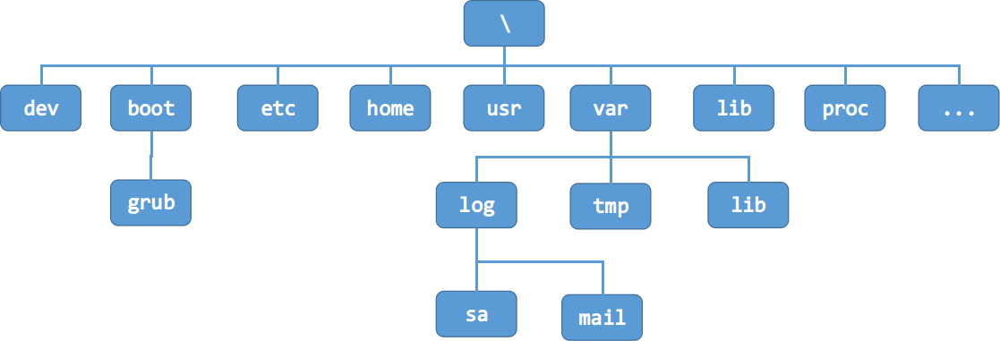

图7-3 Linux的文件系统结构

当时的文件系统已经和现在文件系统相类似，能够满足基本对数据操作的要求，但是要在这些数据中精确的找出某一个想要的数据还是相当困难。特别是随着计算机CPU的不断发展，其计算速度也在不断提高，相应的对于数据处理速度的要求和处理数据的规模都在不断提高，而此时的文件系统已经不能够满足这一要求。因此，在20世纪60年代后期，由于美国阿波罗计划的运行，需要进行大量航空数据的存储在计算机内部，于是IBM公司就着手开展对于“大型共享数据库的关系模型”的研究，由此出现了数据库（即Database）和关系模型的概念，并且数据库的雏形也逐渐显现，由此诞生了后续影响全世界的MySQL、Oracle等众多优秀的关系型数据库，如图7-4所示。虽然当时的数据库还只是雏形，但是其设计理念已经与文件系统大不相同，它不再针对某一个特定数据或者应用，而是针对所有的数据类型，全面的对各类数据进行组织和整理，使得数据更加具有结构性，从而减少数据的冗余，提高数据的复用性。同时，把后台数据和前台程序进行分离，使得数据库系统能够更加专注于数据的组织和管理，从而提高对数据进行增、删、改、查的效率，而开发人员不需要关心数据如何存储，只需要通过简单接口实现数据的访问即可，从而省去了原先复杂的业务逻辑带来前端应用和后端数据的高耦合性，影响了整个系统的移植性和高效性。

### 7.1.2 数据库范式与技术构成

自数据库诞生以来就伴随着各种技术的发展，不论是数据库的实现方式，还是数据库的应用领域都在变化，但是其中最核心的却是两个部分，一个是建立数据库的规则，即范式，另一个则是建立数据库所需的相关技术，如数据库引擎、SQL、数据库访问技术等。

**1、数据库范式的基本概念**

1970年，由美国著名的科学哲学家托马斯·库恩在其出版的专著《科学革命的结构》中提出了“范式”的概念，这个概念后来运用于多个领域，例如社会科学、计算机科学等。所谓范式，就是指常规科学赖以运作的理论基础和实践规范，是从事某一科学领域的研究者群体所共同遵从的世界观和行为方式，是一种公认的模型或者模式。同年，英国科学家埃德加·弗兰克·科德根据这一概念，提出了关系数据库模型，并对关系数据库的设计进行总结，从而提出了关系型数据库理论的理论基础，以及在设计数据库时必须要遵循的规则，即数据库范式。

目前数据库范式一共有八种，分别是第一范式（1NF）、第二范式（2NF）、第三范式（3NF）、巴斯-科德范式（BCNF）、第五范式（5NF）、DK范式（DKNF）、第六范式（6NF）。通常情况下，使用最多的就是1NF、2NF和3NF，下面对这三种范式进行详细说明。

1、第一范式（1NF）：所谓第一范式就是数据表中的每一个字段都是不可分割的原子。例如数据表中存储了电话字段，并且这个电话包括了公司电话和家庭电话，那么这个数据表就不符合第一范式，需要把电话字段再分为公司电话和家庭电话。需要注意的是，数据库设计只有满足了第一范式才能称为关系型数据库，否则就不能称为关系型数据库。

2、第二范式（2NF）：所谓第二范式，首先必须满足第一范式，然后为每张数据表添加一个主键，同时数据表中每个字段都依赖于主键。例如，对于主键为订单ID的数据表【订单详情】（订单ID，产品ID，单价，折扣，数量，产品名称）来说，虽然产品ID和订单ID共同构成了一个唯一的订单，但是单价，折扣，数量，产品名称等信息并不依赖于订单ID，而是依赖于产品ID。因此，这样的设计就不符合第二范式，而是应该把单价，折扣，数量，产品名称等信息单独列出一张表，通过产品ID作为主键和外键的方式进行关联。

3、第三范式（3NF）：所谓第三范式，首先必须满足第二范式，然后每张表中所有非主键字段都依赖于主键，并且不存在非主键字段依赖于非主键字段的问题。例如，对于主键为订单ID的数据表【订单表】（订单ID，下单日期，客户ID，客户名称，客户地址，客户所在城市）来说，虽然客户ID确实依赖于订单ID，从而实现客户名称、客户地址等信息依赖于订单ID，但是客户名称、客户地址等信息却不是直接依赖于主键订单ID，而是通过客户ID进行依赖传递，这样的数据表就不符合第三范式，而是应该把客户ID、客户名称、客户地址等信息单独拉成一张表，通过把客户ID作为主键和外键的方式进行两张表的关联。

**2、数据库存储引擎技术**

由于MySQL数据库是开源数据库，虽然背后有企业进行支撑，但主要还是由本地开发人员进行维护，而SQL Server和Oracle数据库由于是纯商业数据库，用户需要支付一定的费用才能获取软件产品，以及相应的服务，所以SQL Server和Oracle数据库的维护通常由对应的企业来完成，也因为这个原因MySQL中对于存储引擎的使用采用更加开放的态度，即开发人员可以根据项目的实际要求选择多个存储引擎，可以是某一个数据库的存储引擎，也可以是某一个数据表的存储引擎。所谓存储引擎，其主要作用是把各种数据通过不同的技术存储到文件或者内存中。目前MySQL中的存储引擎主要有三种，分别是InnoDB存储引擎、MyISAM存储引擎，以及Memory存储引擎，具体如表7-1所示。

表7-1 存储引擎的比较

| 名称 | 优点 | 缺点 |
| :-: | :- | :- |
| InnoDB存储引擎 | 支持事务处理和外键支持 | 运行速度慢，并且占用资源高 |
| MyISAM存储引擎 | 支持数据索引，以及高并发的读写操作 | 不支持事务操作 |
| Memory存储引擎 | 内存存储，性能优异 | 数据稳定性不高，并且掉电就会丢失所有数据 |


**3、数据库脚本技术SQL**

SQL是应用于数据库中的编程语言，与面向对象和面向过程的语言相比，这种语言的特点就是结构化。所谓结构化语言，其特点在于通过既定的规则或结构来实现对数据库操作，类似于数学公式的套用。SQL语句最早由IBM公司在上世纪70年代进行研发，用于最早的关系型数据库System R中进行数据的操作。到了80年代，美国国家标准局（ANSI）、国际标准化组织（ISO）先后发布了数据库语言美国标准和国际标准，也标志这SQL正式称为一个通用的数据库操作语言。SQL语句主要包含五个部分，分别是数据查询语句、数据操作语句、事务处理语句、数据定义语句、指针控制语句，具体如下：

1、数据查询语句：通过SELECT、WHERE、ORDER BY、GROUP BY和HAVING这些关键字来实现对数据库中数据的查询。

2、数据操作语句：通过INSERT、UPDATE和DELETE这些关键字来实现对数据库中数据的插入、升级和删除。

3、事务处理语句：通过BEGIN TRANSACTION、COMMIT和ROLLBACK这些关键字来实现对数据库中事件的处理。

4、数据定义语句：通过CREATE和DROP关键字实现数据库中数据表的创建和删除，以及索引等内容的加入。

5、指针控制语句：通过DECLARE CURSOR、FETCH INTO和UPDATE WHERE CURRENT来实现对一个或多个数据表的单独操作。

此外，SQL语言还提供了五种数据类型，分别是字符型（char或varchar）、文本型（text）、数值型（int、numeric、money）、布尔型（bit），以及日期型（datetime、smalldatetime）。其中字符型用于存放最长255个字符的字符串，文本型用于存放超长文本，数值型用于存放整型、浮点型、钱币类型，布尔型用于存放0或1的逻辑值，而日期型则用于存放日期数据类型。

**4、数据库访问库**

在应用系统中，除了需要有存储数据所需的数据库，还需要有访问数据库数据的访问接口，而针对不同的编程语言，其背后的支持公司都提供了不同的数据库访问库。目前主流的编程语言有五种，其中具有完整开发环境和商业公司支持的有微软的.Net技术和Oracle的Java技术，此外还有轻量级的PHP技术、Python技术，以及Node.js技术，其数据库访问库也有相应的五种，分别是：

1、.Net的ADO.NET组件：ADO.NET是微软针对.Net技术提供的访问各类关系型数据库的第三方软件库，默认情况下可以访问微软的SQL Server，而如果需要访问其他数据库，则需要下载对应的数据库驱动程序，例如要访问MySQL数据库，就需要在MySQL官网下载数据库驱动程序Connector/ODBC。

2、Java的JDBC组件：JDBC是Oracle提供访问关系型数据库的标准Java API程序库，但是由于该接口没有和任何数据库进行绑定，因此除了在程序中引入该库之外，还需要下载并安装对应数据库的驱动程序，例如访问MySQL就需要下载Connector/J。

3、PHP的PDO组件：PDO（PHP Database Object）插件是PHP中面向对象数据库组件，底层提供了几乎所有数据库的访问支持，而对于上层则采用统一的API进行访问和操作，也就是说开发人员只需要会使用PDO访问一种数据库，那么其他数据库也都会进行访问和操作。此外，由于和PHP联系最紧密的数据库就是MySQL，因此PHP还提供了针对MySQL的链接库MySQLi，通过该库可以实现对MySQL数据库的任意操作，但是缺点是该库只能应用于MySQL，而不能用于其他数据库。

4、Python的DB-API：DB-API与JDBC类似，提供了Python访问数据库标准接口，但是这些接口没有和特定的数据库进行绑定。因此，除了引入该API模块之外，还需要下载对应数据库的Python模块。

5、Node.js的数据库驱动：Node.js没有像其他语言一样提供统一的访问接口，而是需要根据不同的数据库下载并安装不同的操作库。

## 7.2 MySQL的数据类型与数据库、数据表的操作

为了更好的利用数据服务器中的资源，减少数据存储过程中无用数据的冗余，MySQL数据库对常用的数据类型进行抽象得到了MySQL中的四种数据类型，分别是数值型、时间型、字符串型，以及二进制型，并且数据库开发人员需要在保存数据时指定相应的数据类型，从而使得MySQL数据库能对这些数据进行优化。此外，由于MySQL是关系型数据库，因此在使用该数据库时，数据表是整个数据库的基础，数据库就是由各种类型的数据表组合而成，并且通过设置表和表之间的关系，从而实现整个系统的逻辑顺序。本节将详细分析数据库的四种数据类型所应用的场合，以及如何通过指令实现数据库和数据表的操作。

### 7.2.1 MySQL中的的数据类型

MySQL中的数据类型可以分为四大类，分别是数值型、时间型、字符串型，以及二进制型，其中数值型用于存储各类整型和浮点型的数据，时间型用于存储日期和时间的数据，字符串型则用于保存文本型的数据，而二进制类型则通常用于保存一些多媒体文件，但是由于二进制文件相较于字符串、数值类型的数据来说体积相对较大，因此对于二进制文件的保存和检索都比较慢，所以保存二进制数据的常规做法并不是把数据保存在数据库中，而是采用字符串的形式保存二进制数据在本地的存储路径，然后通过读取数据库中二进制数据的路径来对这些信息进行存取。

**1、数值类型**

数值类型是MySQL中最基本的数据类型，主要包括整数型和浮点数型，其中整数型根据数据长度的不同又可以分为微整型（TINYINT）、小整型（SMALLINT）、中整型（MEDIUMINT）、整型（INT），以及超大整型（BIGINT），读者可以根据自己项目的需求选择不同的数据类型，从而减少保存数据时的资源浪费，具体如表7-2所示。需要说明的是，在很多时候开发人员会在数据库中保存布尔类型的数据，虽然MySQL提供了布尔数据类型（BOOL），但是在MySQL中布尔类型会最终转化为TINYINT(1)类型，因此在MySQL中通常使用TINYINT(1)来表示布尔类型。

表7-2 整数型的数据类型

| 类型名 | 字节数 | 有符号的取值范围 | 无符号的取值范围 |
| :-: | :-: | :-: | :-: |
| 微整型（TINYINT） | 1字节 | 0 ~ 2^8 - 1 | -2^7 ~ 2^7 - 1 |
| 小整型（SMALLINT） | 2字节 | 0 ~ 2^16 - 1 | -2^15 ~ 2^15 - 1 |
| 中整型（MEDIUMINT） | 3字节 | 0 ~ 2^24 - 1 | -2^23 ~ 2^23 - 1 |
| 整型（INT） | 4字节 | 0 ~ 2^32 - 1 | -2^31 ~ 2^31 - 1 |
| 超大整型（BIGINT） | 8字节 | 0 ~ 2^64 - 1 | -2^63 ~ 2^63 - 1 |

除了整数类型外，MySQL还有浮点数据类型，即带小数的数据类型，包括单精度浮点型（FLOAT）、双精度浮点型（DOUBLE），以及定点浮点型（DECIMAL），其中单精度浮点型占用4字节，而双精度浮点型占用8字节。特别要说明的是定点浮点型，该数据类型由两个数据类型参数构成，分别是表示数据总长度的参数M和表示小数点位数的参数D。当传入数据的小数点位数比设定的位数长时，那么数据就会进行四舍五入操作，而当传入的数据位数比设定的位数小时，则全部保留。此外，由于定点浮点数在保存数据时，其本质是使用字符串对数据进行保存，因此在数据保存的准确性上会比单精度浮点型和双精度浮点型要高，也因为这个原因，当对于数据精度要求比较高时，通常都会采用定点浮点型进行保存。具体的数据类型的定义格式如下：

```sql
DECIMAL(M, D)
```

**2、时间类型**

为了方便进行时间信息的管理，MySQL提供了五种与日期和时间相关的数据类型，分别是年份类型（YEAR）、日期类型（DATE）、时间类型（TIME）、日期时间类型（DATETIME），以及时间戳（TIMESTAMP），并且这五种数据均采用字符串的方式进行保存，其中年份类型（YEAR）用于存放年份、日期类型（DATE）用于存放年月日、时间类型（TIME）用于存放时分秒、日期时间类型（DATETIME）可以同时存放年月日和时分秒，而时间戳（TIMESTAMP）与日期时间类型相似，但是时间戳特别之处在于具有时区之间转换的功能。

>* 年份类型（YEAR）：年份类型在MySQL数据中占用1个字节，并且MySQL提供了两个种存储方式，一种是使用四位数字或字符串进行存储的完整年份，即“YYYY”的形式，采用这种形式存储的年份其最小值为1901年，最大值为2155年，而当超过这个范围时则会保存为默认值“0000”。另外一种则是使用两位字符串进行存储，即年份数据的后两位，当传入的值在1-69之间，那么MySQL会自动把年份转化为2001-2069年，而当传入的值在70-99之间，那么MySQL会自动把年份转化为1970-1999，而当传入数字00时，MySQL却不会自动转化为2000年，而是转化为0000年。因此，如果需要添加2000年，那么就需要传入字符串“0”。

>* 日期类型（DATE）：日期类型在MySQL数据库中占用4个字节，并且MySQL提供了四种存储日期类型的方式，分别是“YYYY-MM-DD”、“YY-MM-DD”、“YYYYMMDD”和“YYMMDD”，从形式上可以明显看到其实质就是两大类，一种是带分隔符的日期表示，还有一种是不带分隔符的日期表示，同时每种表示方式又可以再分两类，一种是采用完整年份进行保存，还有一种是采用缩略年份进行保存，当采用缩略年份时，其特性与年份类型（YEAR）的规则相同。此外，当传递的月份和日期不足两位时，MySQL会自动在前面补0，例如传入的日期为“2018-5-4”，那么保存在MySQL中会变为“2018-05-04”。

>* 时间类型（TIME）：时间类型在MySQL数据库中占用3个字节，并且MySQL提供了两种存储时间类型的方式，分别是“HH:MM:SS”和“HHMMSS”，从形式上可以发现和日期类型相似，即一个带分隔符，还有一个不带分隔符。另外这两种方式都可以采用非严格方式进行存储，例如采用HH:MM:SS方式传入“11:20”，那么存入数据库时就会变为“11:20:00”，如果采用HHMMSS方式传入“1120”，那么存入数据库时就会变为“00:11:20”。由此可以看出，不论采用哪种方式进行存储，当传入的参数不足时会在其缺省的位置不足0。

>* 日期时间类型（DATETIME）：日期时间类型在MySQL数据库中占用8个字节，是日期类型和时间类型的组合，因此其存储方式也有四种，分别是“YYYY-MM-DD HH:MM:SS”、“YY-MM-DD HH:MM:SS”和“YYYYMMDDHHMMSS”、“YYMMDDHHMMSS”，从上面的存储方式可以看出，采用日期时间类型进行数据存储时，如果日期采用分隔符方式，那么时间也要采用分隔符方式，而如果日期采用非分隔符方式，那么时间也需要采用非分隔符方式。

>* 时间戳（TIMESTAMP）：时间戳在MySQL数据库中占用4个字节，时间戳的使用和日期时间类型非常相似，但是由于时间戳所表示的是从格林威治时间1970年01月01日00时00分00秒起到当前所经过的秒数，因此采用时间戳保存的数据具有时区的概念，通过时区的转换可以把时间戳转化为不同时区所对应的时间。此外，时间戳的表示范围较小，最大时间为“2038-01-19 11:14:07”，当超过这个值时就会显示错误，因此在一般应用时通常采用日期时间类型，而不采用时间戳，只有在需要进行时区转化时才使用时间戳进行数据保存。

**3、字符串类型**

对字符串数据的保存也是数据库存储的重要组成部分，MySQL主要提供了两种存储字符串的数据类型，分别是固定长度的字符串类型（CHAR）和可变长度的字符串类型（VARCHAR）。此外，还很多MySQL相关的书籍上还会提到文本数据类型TEXT，但是由于文本数据类型与可变长度字符串类型非常相似，而且在InnoDB存储引擎下，可变长度字符串类型的效率要比文本类型的效率更高，因此在通常情况下会使用可变长度字符串类型代替文本数据类型。

>* 固定长度的字符串类型（CHAR）：固定长度数据类型就是指在创建字符串时需要传入字符串长度，语法格式为“CHAR(M)”，其中变量M就表示字符串长度，取值范围为0~255，也就是说最多存储255个字符。而所谓固定长度就是指当传入的字符串长度小于指定长度时，该数据类型所占用的存储空间依然保持M个字符所占的控件，而不会因为存储内容少而减少。同样，当存储的字符串长度大于指定长度时，则系统就会报错。

>* 可变长度的字符串类型（VARCHAR）：可变长度数据类型在创建和固定长度数据类型一样，需要传入字符串长度值，语法格式为“VARCHAR(M)”，其中变量M就表示字符串长度，取值范围为0~65535，也就是说最多存储65535个字符。而所谓可变长度就是指当传入的字符串长度小于指定的字符串长度，那么该数据类型为当前传入字符串所占实际空间大小加1，附加的1用于存储字符串的结束符。此外，当传入的字符串结尾包含空格时，固定长度的字符串类型会自动把空格删除，而可变长度的字符串类型则会把空格保留。

>* 文本数据类型（TEXT）：文本类型通常包含四种数据类型，分别是小型文本（TINYTEXT）、文本（TEXT）、中型文本（MEDIUMTEXT）和超长文本（LONGTEXT），其中小型文本最多存储255个字节，文本最多存储65535个字节，因此如上面所说，如果存储的文本长度不超过65535个字节，那么从性能触发建议使用可变长度的字符串类型，而如果存储的文本长度超过65535个字节，那么根据情况可以选择中型文本或者超长文本，其中中型文本最多存储2^24-1个字符，而超长文本最多存储2^32-1个字符。这里需要注意的文本数据类型所占用的存储空间并不与存储数据的大小相同，如小型文本类型和文本类型所占空间为数据大小加2个字节，而中型文本类型所占空间为数据大小加3个字节，大型文本类型所占空间为数据大小加4个字节。

### 7.2.2 MySQL中数据库的操作

如果把数据库类比为一个大型仓库，那么上一节中讲到的数据类型就相当于仓库中不同类型的库位，即有的库位用于存放方形货物，而有的库位则放圆形货物等。要向仓库中存放不同货物，首先需要创建一个最基本的仓库，即一个空的数据库，但在创建仓库时，由于所存放的货物可能来自不同的渠道，使得这些货物对应的编码方式可能各不相同，然而为了能让仓库管理员识别出存放在仓库中的每一个货物，就需要为仓库中所有货物进行统一编码和标识，该过程就是转码。因此在创建数据库时除了通过指令进行创建外，还需要指定相应的编码方式，使得数据库在保存和读取时避免因编码错误而造成的乱码问题。

在MySQL中需要通过指令来创建数据库，该指令有两个参数，分别是数据库名称和数据库编码方式，其中数据库名称可以是任意的英文单词，其命名规则为所有英文单词均采用小写方式，同时单词和单词之间使用下划线作为间隔，如film_actor、city等，并且需要注意的是数据库名称上的引号是反引号，通常是键盘数字1左边的那个按键。而数据库编码方式则需要使用MySQL所支持的编码方式，目前MySQL提供多种编码方式，如UTF8、BIG5、LATIN1等，并且每种编码方式还提供了诸如是否区分大小写等细节的分类，但在平时使用中频率最高的就是utf8_general_ci编码，创建数据库的指令如下：

```sql
CREATE SCHEMA `数据库名称` DEFAULT CHARACTER SET 数据库编码方式 ;
```

既然有创建数据库，就一定会有查看数据库和删除数据库的指令，具体指令如下：

```sql
#显示已经存在的数据库列表
SHOW SCHEMAS;

#删除指定的数据库
DROP DATABASE `数据库名称`;
```

### 7.2.3 MySQL中数据表的创建

当仓库创建完毕后，接下来就是要创建各类库房，在数据库中这些库房就是数据表，通过创建具有各种数据类型的数据表来为类型不同的，但相互关联的数据提供结构化的物理存储空间。要了解数据表的创建过程，首先需要了解与数据表密切相关的三个重要概念，分别是主键、外键和约束，具体如下：

**1、数据表中的主键**

所谓主键通常是一组不重复的，且唯一的数据，其目的首先是满足第二范式中对数据表设计的要求，其次主键可以使数据库系统能够在数据表中唯一的找到的某一条数据，从而帮助数据库系统以最快的速度定位到某一条信息，虽然在数据库规范中没有规定主键必须是什么类型，但是在通常的应用中，主键一般采用整型数据进行存储，因为相较于字符串或者浮点数来说整型数据的检索速度最快。此外，还需要说明的是，在一般的设计中主键除了是一组不重复的整型数据外，还需要满足与业务的无关性，这是因为很多短期看似不会重复的数据，从长远来看可能就会产生重复，例如企业的员工号，可能今年某员工的工号是123456，但是当他离职后，该号码就可能给到其他新进的员工，此时在系统中就会出现同一个员工号，但表示了两个不同员工的问题，因此为了避免这个问题，通常主键在定义时都会采用业务无关的具有唯一性的整型数据。

**2、数据表中的外键**

所谓外键其主要作用是在表和表之间建立联系，并且这种联系是与某表中的主键之间的联系。其目的首先是满足范式一中的数据不冗余，其次是使得数据表和数据表之间只能通过主键和外键产生联系，例如在选课数据表A中有一个用于表示学生ID的字段stu_id，而在另一个学生信息表B中有一个主键用于唯一标识某一个学生的字段id，并且A表中的stu_id只与B表中的主键ID相关联，此时表A与表B就建立了联系，并且A表中的字段stu_id只能是B表中字段id所有值中的一个，当数据库要进行多表查询是就可以通过stu_id字段反查到数据表B中的学生数据，那么字段stu_id就是表A的外键。

**3、数据表中的约束**

所谓约束就是对数据表中某个字段进行一定的限制，以保证数据表的完整性。在MySQL中，数据库的约束有六种，分别是主键约束、外键约束、唯一性约束、非空约束、自增约束、默认值约束，具体如下：

>* 主键约束：指把数据表中的某一个字段设置为主键，使得该字段在该表中具有唯一性，并且与表中的数据无关。

>* 外键约束：指把数据表中的某一个字段设置为外键，并且该字段的值一定来自于关联数据表。

>* 唯一性约束：指某个数据表中，除了主键外的某一个字段值不具有重复性，并且可以给多个字段设置唯一性约束。

>* 非空约束：指数据表中的某一个字段值不能为空。

>* 自增约束：指当添加新数据时，没有向数据表中的某个字段传值，但是该字段会在上一行数据的基础上加一后进行填充。

>* 默认值约束：指当添加新数据时，没有向数据表中的某个字段传值，那么该字段的值会采用的默认值进行填充。

由于MySQL数据表在创建时除了需要包含相应的数据之外，还需要添加各类约束，因此完整的数据表创建相对复杂，本节以最小创建语句开始通过多个阶段迭代的方式最终完成整个数据表的创建，同时读者在实际应用时可以根据自己项目的需求对各阶段完整代码进行裁剪从而得到所需要的代码。

**1、阶段一：最小数据表创建代码**

```sql
USE 数据库名称
CREATE TABLE `新的数据表名称` （
    `字段名` 数据类型, 
    `字段名` 数据类型, 
    ..., 
    `字段名` 数据类型
）;
```

因为数据表一定是创建在某一个数据库中，所以在创建数据表之前需要使用SQL关键字“USE”来选择某一个数据库，如果没有添加这样的语句，那么MySQL数据库就不知道要在哪个数据库中进行创建，并且会显示语句执行错误，因此创建表前指定数据库是必要的。选择完数据库就需要使用SQL关键字“CREATE TABLE”来创建一个数据表，这里需要注意的是，在创建数据表时，其名称不能使用SQL语句中的关键字，如create、update等。确定好数据表名称后，接下来就是确定字段名，类似与Excel表格中的表头，而数据类型就是这一列数据中需要保存什么类型的数据，示例代码如下，表结果如图7-4所示。

```sql
CREATE SCHEMA `test` DEFAULT CHARACTER SET utf8
USE test;
CREATE TABLE `person` (
    `id` INT, 
    `name` VARCHAR(10), 
    `sex` TINYINT(1)
);
```


图7-4 通过SQL语句创建的数据表

在上面的代码中首先通过“CREATE SCHEMA”语句创建了一个数据库，然后通过“CREATE TABLE”创建了一个数据表，并且该数据表中有三个字段，分别是表示ID的整型数据，表示名字的动态字符，以及表示性别的微整型。

**2、阶段二：创建主键、自增、不能为空约束**

```sql
USE 数据库名称
CREATE TABLE `新的数据表名称` （
    `字段名` 数据类型 [约束条件], 
    `字段名` 数据类型 [约束条件], 
    ..., 
    `字段名` 数据类型 [约束条件],
    [特殊约束条件]
    ...
）;
```

在上面代码中约束条件通常放在数据类型之后，如果要添加不能为空的约束，那么就需要在数据类型后面添加关键字“NOT NULL”，当为某个字段添加了不能为空约束后，那么在添加新的数据行时就必须为该字段添加数据，否则数据库系统就会报错。而如果需要添加自增约束，那么就需要在数据类型后面添加关键字“AUTO_INCREMENT”，当为某个字段添加了自增约束后，如果增加新数据行时没有为该字段设置数据，那么该字段的数据就会在上一行数据的基础上加1，通常该约束应用于主键中。最后是主键约束的添加，该约束的添加有两种方法，一种是如同不能为空和自增约束一样，在某个字段后面添加主键约束关键字“PRIMARY KEY”，还有一种方法则是在所有字段定义完毕后，添加关键字“PRIMARY KEY (`字段1`, `字段2`, ..., `字段3`)”，这样的好处是可以为同时把多个字段设置为主键，而第一个种方法只能设置一个字段为主键，示例代码如下，表结果如图7-4所示。

```sql
CREATE TABLE `person` (
    `id` INT NOT NULL AUTO_INCREMENT,
    `name` VARCHAR(10) NULL,
    `sex` TINYINT(1) NULL,
    PRIMARY KEY (`id`)
);
```

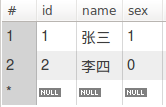

图7-5 创建数据表时添加主键、自增、不能为空约束

在上面的代码中首先通过“CREATE TABLE”创建了一个数据表，并且字段“id”添加了不能为空和自增的约束，同时在创建数据表的最下方通过关键字“PRIMARY KEY”把字段“id”设置为主键。这里需要特别说明的是，通常来说主键的设置以整数类型居多，并且均采用“不能为空”、“增增”的约束。

**3、阶段三：添加唯一性、默认值约束**

```sql
USE 数据库名称
CREATE TABLE `新的数据表名称` （
    `字段名` 数据类型 [约束条件], 
    `字段名` 数据类型 [约束条件], 
    ..., 
    `字段名` 数据类型 [约束条件],
    [特殊约束条件]
    ...
）;
```

在上面代码与第二阶段的代码相同，不同点在于添加默认值约束所使用的关键字为“DEFAULT”，并且在关键字后添加该字段的默认值。而添加默认唯一性约束与添加主键约束相同，也同样具有两种方法，第一种是直接在某个字段后面添加关键字“UNIQUE”，此时被添加唯一性约束的字段值在整张表中都不能有重复，否则插入数据时会出现错误。而第二种则是在所有字段定义完毕后，添加唯一性索引关键字“UNIQUE INDEX `自定义约束名称` (`字段名` ASC)”，这样的好处是当数据库运行是，数据表中会建立一个唯一性的索引，那么就可以确保所有添加的数据都不会出现重复，使得系统更加的安全，此外最后的ASC表示索引采用升序方式进行保存，示例代码如下，表结果如图7-6所示。

```sql
CREATE TABLE `person` (
    `id` INT NOT NULL AUTO_INCREMENT,
    `name` VARCHAR(10) NULL DEFAULT '默认值',
    `sex` TINYINT(1) NULL DEFAULT 1,
    PRIMARY KEY (`id`),
    UNIQUE INDEX `id_UNIQUE` (`id` ASC)
);
```

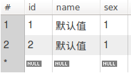

图7-6 创建数据表时添加唯一性、默认值约束

在上面的代码中首先通过“CREATE TABLE”创建了一个数据表，并且字段“name”和“sex”添加了默认数值的约束，同时在创建数据表的最下方通过关键字“UNIQUE INDEX”创建了一个唯一性索引，并别在该索引中添加了字段“id”。这里需要特别说明的是，很多书上添加唯一性索引的方法都是在字段后面添加一个“UNIQUE”关键字，这种做法没有错误，但是不够好，通过添加唯一性索引可以提高整个系统的安全性和运行效率。

**4、阶段四：添加外键约束**

```sql
USE 数据库名称
CREATE TABLE `新的数据表名称` （
    `字段名` 数据类型 [约束条件], 
    `字段名` 数据类型 [约束条件], 
    ..., 
    `字段名` 数据类型 [约束条件],
    [特殊约束条件]
    ...
）;
```

在上面代码与第二阶段的代码也是相同，而不同点在于要设置外键，那么至少需要两个数据表，然后通过外键的方式把两个数据表进行关联。外键约束的定义可以分为两步，首先是是使用关键字“INDEX”为要设置为外键的字段创建一个索引列表，语法如下：

```sql
INDEX `自定义索引名称` (`字段名` ASC),
```

然后在使用在关键“CONSTRAINT”创建把当前数据表中的字段和另外一个数据表中的字段进行关联，这里需要特别注意的是，相关联的两个字段的数据类型必须相同，并且被设为外键的字段值只能来自于关联表格，如法如下：

```sql
CONSTRAINT `自定义外键名称` FOREIGN KEY (`字段名称`) REFERENCES `需要关联的数据库名称`.`需要关联的数据库中的数据表名称` (`需要关联的数据库中的数据表中的字段名`)
```

示例代码如下，表结果如图7-7、7-8所示。

```sql
CREATE TABLE `test`.`class` (
    `id` INT, 
    `name` VARCHAR(10)
);

CREATE TABLE `test`.`person` (
    `id` INT NOT NULL AUTO_INCREMENT,
    `name` VARCHAR(10) NOT NULL DEFAULT '默认值',
    `sex` TINYINT(1) NOT NULL DEFAULT 1,
    `class_id` INT NOT NULL,
    PRIMARY KEY (`id`),
    UNIQUE INDEX `id_UNIQUE` (`id` ASC),
    INDEX `fk_person_class_idx` (`class_id` ASC),
    CONSTRAINT `fk_person_class` FOREIGN KEY (`class_id`) REFERENCES `test`.`class` (`id`)
);
```

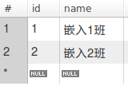

图7-7 创建数据表时添加外键约束的关联数据表

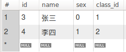

图7-8 创建数据表时添加外键约束的数据表

在上面的代码中首先通过“CREATE TABLE”创建了一个关联数据表“class”和需要创建外键约束的数据表“person”，然后在数据表“person”的最下方通过关键字“INDEX”创建了一个索引表，并要设为外键的“class_id”字段加入该索引表中，最后在通过添加“CONSTRAINT”关键字，把数据表“class”中的字段id和数据表“person”中的字段class_id进行关联，此时class_id的值只能来源于数据表“class”。

### 7.2.4 MySQL中数据表的查看与修改

创建完数据表后通常都需要进行二次验证，即查看数据的结构是否与创建的需求保持一致。MySQL提供了两种方式进行查看，一种是通过关键字“DESC”来查看所创建表的结构，包括字段的数据类型、字段是否能为空、字段是否为关键字、字段是否有默认值等，另一种则是通过关键字“SHOW CREATE TABLE”来查看创建数据表时的SQL语句，具体如下：

**1、“DESC”关键字的验证方式**

```sql
use 数据库名称;
DESC 数据表名称;
```

在上面的代码中，首先选择一个数据库，然后通过关键字“DESC”来获取所查看的表结构，以Person表为例，查看结果如图7-9所示。

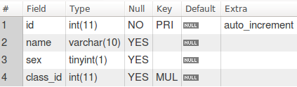

图7-9 “DESC”查看数据表结构的结果

在上图中，“#”栏表示字段的序号，而不是数据表的主键，“Field”栏表示数据表字段的名称，“Type”栏表示字段的数据类型，“Null”栏表示字段是否可以为空，“YES”表示可以为空，“NO”表示不能为空，“KEY”栏表示数据是否为索引，“PRI”表示主键，“MUL”表示复合键，“Default”栏表示字段的默认值，“Extra”栏表示字段的扩展属性，如是否为自增字段。

**2、“SHOW CREATE TABLE”关键字的验证方式**

```sql
use 数据库名称;
SHOW CREATE TABLE 数据表名称;
```

在上面的代码中，首先选择一个数据库，然后通过关键字“SHOW CREATE TABLE”来获取创建数据表的SQL语句，以Person表为例，查看结果如图7-10所示。

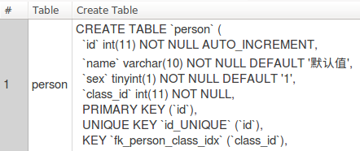

图7-10 “SHOW CREATE TABLE”查看数据表创建语句

在上图中，“Table”栏表示要查看的数据表名字，“Create Table”栏表示创建数据库的SQL语句。

### 7.2.5 MySQL中数据表的修改

在实际开发过程中经常会遇到因初期业务需求不明确造成中期开发时需要对数据表进行变更的情况，对于这种情况最直接的做法往往是把数据表删除后重新建表，但这也会造成大量测试数据丢失的问题，因此最好的方法就是直接通过SQL语句对数据表结构进行修改。MySQL提供了六条指令用于对数据表进行修改，分别是数据表名的修改、数据表字段数据类型的修改、数据表字段名称的修改、数据表字段的删除、数据表外键约束的删除，以及数据表字段的增加，具体如下：

**1、数据表名的修改**

要修改数据表的名称可以使用以下SQL语句：

```sql
use 数据库名称;
ALTER TABLE 原数据表名 RENAME 新数据表名;
```

**2、数据表字段数据类型的修改**

要修改数据表字段的数据类型可以使用以下SQL语句：

```sql
use 数据库名称;
ALTER TABLE 表名 MODIFY 字段名 数据类型;
```

**3、数据表字段名称的修改**

要修改数据表字段的名称可以使用以下SQL语句：

```sql
use 数据库名称;
ALTER TABLE 表名 CHANGE 原字段名 新字段名 新字段数据类型;
```

**4、数据表字段的删除**

要删除数据表中的字段可以使用以下SQL语句：

```sql
use 数据库名称;
ALTER TABLE 表名 DROP 字段名;
```

**5、数据表外键约束的删除**

要删除数据表外键的约束可以使用以下SQL语句：

```sql
use 数据库名称;
ALTER TABLE 表名 DROP FOREIGN KEY 外键名;
```

**5、数据表字段的增加**

数据表字段的增加在实际开发使用最为频繁，同时也最为复杂，其SQL语句如下：

```sql
use 数据库名称;
ALTER TABLE 表名 ADD 新字段名 新字段数据类型 [约束条件] [FIRST | AFTER 字段名（插入的位置）];
```

最后两个参数为可选参数，即约束条件和插入的位置。其中“FIRST”表示将新字段插入到数据表的开头，而“AFTER”表示将新字段插入到数据表中某个字段之后。而约束条件的设置与创建数据表时为每个字段设置约束的方式相同，如字段能否为空、是否是主键或外键、是否有默认值、是否属于自增数据，示例如下，结果如图7-11所示。

```sql
use test;
ALTER TABLE person ADD address varchar(45) NOT NULL AFTER sex;
```

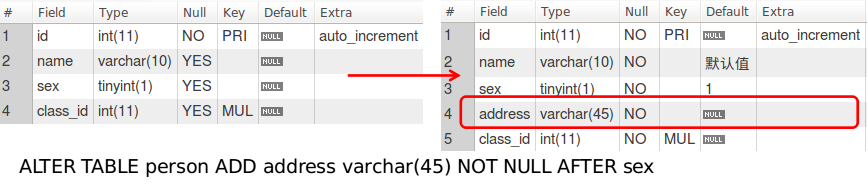

图7-11 为数据表添加字段的效果

### 7.2.6 MySQL中数据表的删除

在实际开发中，数据表的删除最让人头疼的是要删除的表还与其他表存在关联关系，要解决这个问题最好的方法就是通过删除数据表中的外键来断开与其他数据表的关联，最后再把该表删除。在MySQL中当某个数据表不与其他数据表有任何关联时就可以通过MySQL提供的删除语句进行删除。需要注意的是，删除数据表的同时还会把该数据表中的所有数据删除，因此为了后续的追溯等功能，数据库中数据的删除采用逻辑删除的方式，特别是删除数据表中的数据，通常添加一个“is_delete”字段，当该字段为1时表示该数据处于删除状态，而0时则表示非删除状态，具体代码如下：

```sql
use 数据库名称;
DROP TABLE 表名;
```

## 7.3 常用查询语句的使用

在服务端的应用开发中频率最高的操作就是数据库的读取操作，这些操作涉及到信息的读取，BI的展示、数据表的分页以及多平台数据的传输等众多内容内容，因此MySQL除了支持标准的SQL语句外，还提供了许多内部函数来为数据库查询提供更多的功能。按照查询的方式不同可以把所有的查询语句分为五个类别，分别是单数据表的基础查询、单数据表的条件查询、集合函数与分组数据查询、多数据表的联合查询、子数据表查询，通过这些不同查询语句的组合就可以实现任何内容的查询。其中需要注意的是单数据表的基础查询或单数据表的条件查询中的单表并不仅仅指物理上的一个数据表，还包括经过经过多种数据表查询后得到的数据表，因此虽然本节中应用的例子是单表，但实际上可以应用于多表查询，具体参见子数据表查询。

### 7.3.1 单数据表的基础查询

在MySQL数据库中要获取数据，首先就要使用SELECT关键字来进行查询，SELECT语句的使用非常灵活，但总结下来可以是如下SQL结构：

```sql
SELECT 字段1,字段2,...,字段列表 FROM 数据表或者视图名称 
       [WHERE 查询条件表达式] 
       [GROUP BY 分组字段名 [HAVING 分组查询条件表达式]]
       [ORDER BY 排序字段名 [ASC（升序）|DESC（降序）]];
```

这里有四点需要特别注意的地方，具体如下：

1、在数据库查询软件中每条查询语句都要以“;”作为结尾，而在服务端软件开发中SQL语句却不能包括“;”。

2、除了第一个SELECT关键字只需要在右边保留一个关键字外，每个关键字的左右两边必须加空格。在实际开发中经常会出现缺少空格造成的SQL语句执行错误的问题，因此在服务端软件开发中建议先在一行中编写完整的SQL语句，然后再通过IDE自带的补全功能对SQL语句进行分行，从而既避免过长的代码，同时也能使得SQL语句的结构更加清晰。

3、SQL结构中的WHERE、GROUP、ORDER关键字表达式都为可选表达式。

4、WHERE和HAVING关键字虽都为条件表达式，但不同的是HAVING关键字只能与GROUP BY结合，即分组条件表达式。

下面以Person数据表为查询对象，使用两个例子来说明SELECT语句的基本用法：

**1、数据表全查询**

```sql
# 用于通配符匹配所有字段
SELECT * FROM person;

# 指明字段
SELECT name, sex, address FROM person;
```

上面的SQL语句用于获取Person数据表中所有数据，但需要注意的是第一条SQL语句中并没有编写完整的字段列表，而是通过通配符“*”来表示选择所有字段，而在第二条查询语句中指明了字段列表，那么查询结果就会只显示字段列表中的数据，结果如图7-12所示。

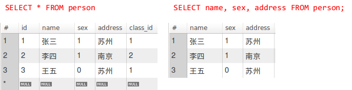

图7-12 Select语句的基本查询

**2、数据表条件查询**

```sql
# 查询性别值为1的数据
SELECT * FROM person WHERE sex = 1;

# 查询性别值为1，并且按照id的降序进行排列
SELECT * FROM person WHERE sex = 1 ORDER BY id DESC;
```

上面的SQL语句都是用于获取sex字段值为1的数据，而第二条SQL则是对这些数据按照id的降序进行排列，结果如图7-13所示。

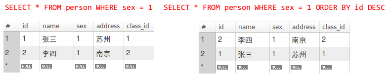

图7-13 带条件的Select语句查询

### 7.3.2 单数据表的条件查询

在单表查询中，其核心技术是如何灵活的使用“WHERE”关键字，在上一节已经初步了解了由“WHERE”组成的语句是查询语句中的条件语句。目前，“WHERE”关键字主要通过六类符号来组成各种查询条件，这六类符号分别是比较运算符、范围运算符、子集运算符、模糊匹配运算符、空值运算符和逻辑运算符，具体如表7-3所示。在具体使用中，这些符号可以根据具体业务的需求进行组合使用，从而获取正确的查询结果，但需要注意的是条件与条件之间一定要加上空格，具体的SQL结构如下。

```sql
SELECT 字段1,字段2,...,字段列表 FROM 数据表或者视图名称 WHERE 条件1 条件2 ... 条件N
```

表7-3 “WHERE”关键字的六类运算符

| 序号 | 类别 | 包含符号 |
| :-: | :-: | :- |
| 1 | 比较运算符 | =（相等）、<（小于）、<=或!>（小于等于或不大于）、>（大于）、>=或!<（大于等于或不小于）、!=或<>（不等） |
| 2 | 范围运算符 | BETWEEN 下界值 AND 上界值（在下界值至上界值之间）、NOT BETWEEN 下界值 AND 上界值（不在下界值至上界值之间） |
| 3 | 子数据集运算符 | IN（在子数据集中）、NOT IN（不在子数据集中） |
| 4 | 模糊匹配运算符 | LINK '字符串'（与字符串匹配）、NOT LIKE 字符串（与字符串不匹配） |
| 5 | 空值运算符 | IS NULL（为空）、IS NOT NULL（不为空） |
| 5 | 逻辑运算符 | AND（多个条件是且的关系）、OR（多个条件是或的关系） |

这六类查询条件符号中，比较运算符、空值运算符，以及逻辑运算符都是非常好理解的符号，这里就不再累述，下面将针对另外三种运算符进行详细说明。

**1、范围运算符**

该运算符主要用于查询并获取某个字段的值在指定范围内或不在指定范围内的所有数据。下面以检索指定范围内的生日作为典型案例进行说明，修改Person数据表，为该表添加一个DATETIME类型的birthday（生日）字段，并为每条数据完善生日信息。此时希望能查询生日日期在1月24日至5月20日之间的所有数据，具体SQL语句如下：

```sql
SELECT * FROM person WHERE DATE_FORMAT(birthday, '%m-%d') BETWEEN '01-24' AND '05-20';
```

在该语句中出现了一个MySQL的内置函数，即DATE_FORMAT()，该函数的主要作用是把日期数据转化为指定的数据格式，其中第一个参数是将要转化的数据，而第二个参数则为一个格式字符串，其函数原型如下。

```sql
DATE_FORMAT(date, 'formate')
```

在本次查询中首先利用DATE_FORMAT()把birthday字段中的值转化为只包含月份和日期的数据。然后利用“BETWEEN AND”关键字把传入的生日数据与指定范围内的上下界数据进行比较，从而得出处于该范围的所有数据。需要注意的是“BETWEEN AND”关键字中的上界值和下界值也包含在查询的范围内，即“>=下界值”和“<=上界值”，而“NOT BETWEEN AND”恰恰与“BETWEEN AND”关键字相反，即不在某个范围内，同时其上界和下界的值也不在查询范围内，即即“<下界值”和“>上界值”。本例的查询结果如图7-14所示。

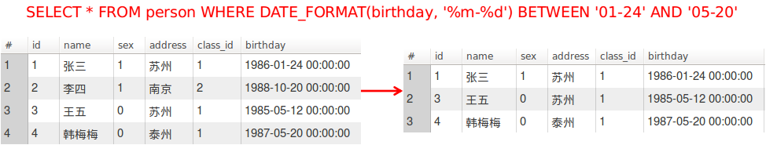

图7-14 “BETWEEN AND”关键字的使用

**2、子数据集运算符**

该运算符的核心在于子数据集的获取，通常子数据集的获取也是采用标准的查询语句，但是这里需要注意的是“IN”关键字只能处理一维数据，即如果子数据集中只能包含一个字段的数据，而如果包含了多个字段，那么SQL语句就无法进行正确处理。下面通过在一个子数据集中检索sex值为1的数据为案例进行说明，具体SQL语句如下：

```sql
SELECT * FROM person WHERE sex = 1 AND id IN (SELECT id FROM person WHERE class_id = 1)
```

在本案例中首先查询并生成class_id值为1的子数据集，但是该数据集只有一个字段，即id字段，然后通过“IN”关键在该子数据集中进行查询，并且还添加了一个sex值为1的条件。本例的查询结果如图7-15所示。

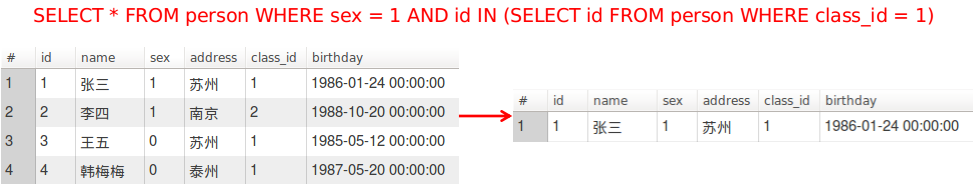

图7-14 “IN”关键字的使用

**3、模糊匹配运算符**

模糊匹配运算符主要用于字符串的匹配和模糊查询，其核心在用通配符的使用，在“LIKE”运算符中有两种通配符，分别是“%”和“_”。其中“%”表示匹配任意长度的字符串，例如“%三”就表示匹配以“三”结尾的所有字符串，而“\_”则表示匹配单个字符，例如"\_三"就表示匹配字符长度为2，并且以“三”结尾的所有字符串。下面通过对Person数据表中的名字进行模糊查询为案例进行说明，具体SQL语句如下：

```sql
SELECT * FROM person WHERE NAME LIKE '张_'
```

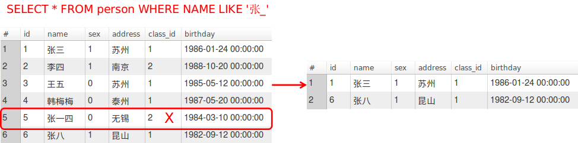

图7-15 “LIKE”关键字的使用

从上面的结果不难看出，在源数据表中其实有三条数据的name值是以“张”开头，但是因为SQL语句是以“_”作为模糊匹配符，即只匹配一个字符。因此最后结果只得到了两条数据。

### 7.3.3 集合函数与分组数据查询

在信息系统开发中经常会出现例如查询一个班级男生有多少人，女生有多少人这样的分类查询，最直观的方法是通过“SELECT...WHERE...”的方式获取每种分类的数据表，然后进行分别计算，从而得到相应的数量，这种方法固然能得到想要的结果，但是费时费力，甚至还有可能出现数据不全的现象。因此，针对这一类的查询，MySQL提供了标准的分组查询来简化这一操作。由于“GROUP BY”关键字的使用与“SELECT”有明显的区别，因此本节采用分层递进的方式进行说明，分组查询所使用的语法结构如下：

```sql
SELECT 字段名列表 FROM 数据表名 GROUP BY 分组字段名 [HAVING 分组查询条件表达式]
```

**1、阶段一：最简分组查询**

以Person表为例，按照sex字段名进行分组，获取班级中男生和女生各多少人，具体SQL语句如下：

```sql
SELECT * FROM person GROUP BY sex;
```

当在数据库中执行该语句时读者可能会碰到与笔者相同的指令执行失败的错误，并且在错误提示中有关键字”sql_mode=only_full_group_by“。这表示MySQL在执行”GROUP BY“语句时采用了严格模式，即只能在SELECT字段中填入受影响的字段，而其他字段不能填入。因此，需要把上面的SQL语句改成如下内容：

```sql
SELECT sex FROM person GROUP BY sex;
```

输入正确指令后得到了如图7-16的结果。在该结果其实看不出任何有用的信息，这是由于”GROUP BY“语句通常不会单独使用，而是与各类集合函数联合使用才能获取想要的结果。


图7-16 最简”GROUP BY“语句

**2、阶段二：集合函数COUNT()的使用**

”GROUP BY“语句结合最多的集合函数就是COUNT()，该函数的主要作用就是计算数据库中的所记录数据条数。在本例中就可以用于计算男生有多少人，女生有多少人，具体SQL语句如下：

```sql
SELECT sex, COUNT(sex) FROM person GROUP BY sex;
```

在MySQL中执行上面的语句，就可以得到如图7-17所示的结果，从结果可以看出通过COUNT()计算出了sex字段值为0的人数有2人，而字段值为1的人数有4人。此外，可以注意到在结果中保存数量的字段名为”COUNT(sex)“，这样的字段名在程序处理时不是很方便，因此需要用关键”as“为该字段去个别名，如count等，具体SQL语句如下：

```sql
SELECT sex, COUNT(sex) AS count FROM person GROUP BY sex;
```

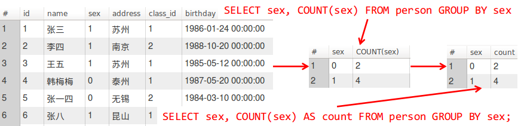

图7-17 集合函数COUNT()的使用

COUNT()函数除了能与”GROUP BY“语句结合外，还能够单独使用，即计算当前查询共获取多少条的数据，具体SQL语句如下：

```sql
SELECT COUNT(*) AS count FROM person;
```

**3、阶段三：集合函数SUM()的使用**

SUM()函数顾名思义就可以知道该函数的主要作用就是求和。本例通过新建一个成绩数据表（grade），并填入两位同学相应的课程成绩数据来进行说明，具体SQL语句如下：

```sql
CREATE TABLE grade (
  id INT NOT NULL AUTO_INCREMENT,
  course VARCHAR(45) NOT NULL,
  grade INT NOT NULL,
  person_id INT NOT NULL,

  PRIMARY KEY (`id`),
  INDEX `FK_GRADE_PERSON_idx` (`person_id` ASC),
  CONSTRAINT `FK_GRADE_PERSON` FOREIGN KEY (`person_id`) REFERENCES `test`.`person` (`id`));

INSERT INTO `grade` (`course`, `grade`, `person_id`) VALUES ('PHP程序设计', '77', '2');
INSERT INTO `grade` (`course`, `grade`, `person_id`) VALUES ('操作系统', '88', '1');
INSERT INTO `grade` (`course`, `grade`, `person_id`) VALUES ('数据结构', '78', '2');
INSERT INTO `grade` (`course`, `grade`, `person_id`) VALUES ('操作系统', '82', '2');
INSERT INTO `grade` (`course`, `grade`, `person_id`) VALUES ('数据结构', '85', '1');
INSERT INTO `grade` (`course`, `grade`, `person_id`) VALUES ('PHP程序设计', '90', '1');
```

需要注意的SUM()函数在使用时通常要与”GROUP BY“一起使用才能得到有意义的结果，因此在本例中要计算每位同学的课程总分可以使用如下SQL语句，并得到如图7-18所示的结果。

```sql
SELECT person_id, SUM(grade) FROM grade GROUP BY person_id;
```

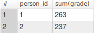

图7-18 集合函数SUM()的使用

从上图可以看出，首先对person_id进行分组，从而在MySQL内部得到每个person_id对应的一组数据，然后使用SUM()函数对这每组数据中的成绩数据进行求和计算，从而得到了每个person_id的成绩和。

**4、阶段四：集合函数AVG()的使用**

AVG()函数顾名思义就可以知道该函数的主要作用就是求平均值。与SUM()函数类似该函数的使用需要与”GROUP BY“一起使用才能得到有意义的结果，因此以计算每位同学的课程平均分为例展示AVG()函数的使用方法，具体SQL语句如下，结果如图7-19所示。

```sql
SELECT person_id, AVG(grade) FROM grade GROUP BY person_id;
```

从SQL语句可以看出，首先对person_id进行分组操作，在MySQL内部得到每个person_id对应的一组数据，然后使用AVG()函数对每组数据中的成绩进行求平均计算，从而得到每个person_id的平均成绩。

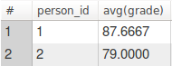

图7-19 集合函数AVG()的使用

**5、阶段五：集合函数MAX()和MIN()的使用**

MAX()和MIN()函数顾名思义就可以知道这两个函数的主要作用是获取最大值和最小值。并与其他聚合函数相同在使用该函数类时需要与”GROUP BY“一起使用才能得到有意义的结果，因此以计算每科成绩的最高分和最低分为例展示MAX()和MIN()函数的使用方法，具体SQL语句如下，结果如图7-20所示。

```sql
# 计算各科的最高分
SELECT course, MAX(grade) FROM grade GROUP BY course;
# 计算各科的最低分
SELECT course, MIN(grade) FROM grade GROUP BY course;
```

从SQL语句可以看出，首先对course进行分组操作，在MySQL内部得到每个course对应的一组数据，然后使用MAX()或MIN()函数对每组数据中的成绩进行计算，从而得到每个course的最高成绩和最低成绩。

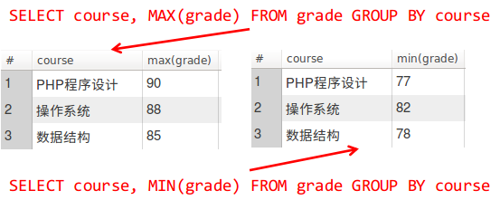

图7-20 集合函数MAX()和MIN()的使用

**6、阶段六：HAVING条件表达式的使用**

在使用HAVING条件表达式时特别要注意与WHERE条件表达式进行区分，WHERE条件表达式主要针对的是选择满足条件的数据纪录，而HAVING条件表达式则是针对的是满足条件的分组。因此，这里以Person数据表为例，查询学生所在地区大于等于2人的城市，具体SQL语句如下，结果如图7-21所示。

```sql
# 获取按照地址进行分组的数据
SELECT address FROM person GROUP BY address
# 获取按照地址进行分组后所在分组人数大于等于2的数据
SELECT address FROM person GROUP BY address HAVING COUNT(name) >= 2;
```

从SQL语句可以看出，首先对address进行分组操作，在MySQL内部得到每个address对应的一组数据，如第一条SQL得到的结果，然后使用HAVING条件表达式与COUNT()函数相结合从而对每组数据中的人数进行统计和计算，从而得到人数大于等于2的分组。

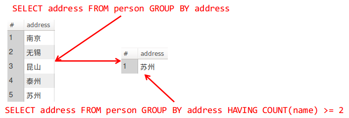

图7-21 HAVING条件表达式的使用

**7、阶段七：多字段的分组查询**

在上面的分组查询中，“GROUP BY”关键字后都只跟随一个字段，但是实际上“GROUP BY”可以跟随多个关键字，其逻辑为先匹配第一个字段，对整个数据表进行分组，然后再在前一个字段分组的基础上在每个组中进行分组，以此类推就是多字段分组的含义。下面还是以Person数据表为例，查询各个地方sex值为0和1的学生数量，具体SQL语句如下，结果如图7-22所示。

```sql
SELECT address, sex, COUNT(sex) AS count FROM person GROUP BY address, sex;
```

从SQL语句可以看出，首先对address字段进行分组，然后在其分组的基础上对sex进行分组，同时通过COUNT()函数计算分组后每组sex值的数量。

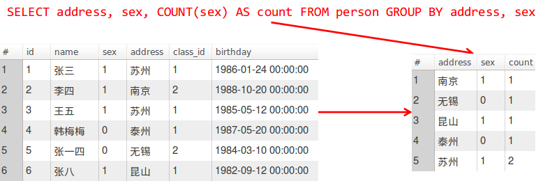

图7-22 多字段的分组查询使用

### 7.3.4 多数据表的联合查询

由于数据库在进行设计时会按照相关范式进行设计，使得数据库内的数据表都会向着最小不可分、无冗余数据的方向进行设计，所以在在实际的应用开发中，经常会在多张数据表之间通过构建主键和外键的方式把这些数据表进行关联，此时要获取完整的数据就需要通过多表联合查询的方式才能实现。在MySQL中多表联合查询有两种方式，分别是内连接查询、外链接查询，其中外链接又可以再分为左连接查询和右连接查询。本节将详细阐述这些查询具体的使用方法。

**1、内连接查询**

内连接查询是数据库多表查询中最为简单的一种方式，但需要读者特别注意的是内连接查询的实质是在求多表之间的交集，如图7-23所示，而求多表之间交集的纽带就是通过主键和外键来实现，内连接查询的SQL语法如下：

```sql
SELECT 字段列表 FROM 数据表1 INNER JOIN 数据表N ON 查询条件
```


图7-23 内连接查询的含义

下面以Person数据表和Class数据表为例讲解相关内容，在Person数据表中有一个外键字段class_id，该字段依赖于Class数据表中的主键字段id，此时要获得新的一张易于理解的学生数据表，该数据表特点是既包含了Person数据表中完整的数据信息，也包含了Class数据表中的信息，使得新数据表在获得class_id同时也能够获取对应class_name，具体SQL语句如下，结果如图7-24所示。

```sql
# 内连接查询（FROM ... INNER JOIN ... ON ...）
SELECT 
    person.id, 
    person.name, 
    person.sex, 
    person.address, 
    person.class_id, 
    class.name AS class_name, 
    person.birthday 
FROM person INNER JOIN class
ON person.class_id = class.id;

# 等价于（FROM ... WHERE ...）
SELECT 
    person.id, 
    person.name, 
    person.sex, 
    person.address, 
    person.class_id, 
    class.name AS class_name, 
    person.birthday 
FROM person, class
WHERE person.class_id = class.id;
```

从上面的代码可以看出内连接查询中新增加了两组关键字，分别是“INNER JOIN”和“ON”，前者用于关联多个数据表，而后者用于多表查询的条件。正如前面所说的内连接查询的本质是获取多个数据表之间的交集数据，因此在内连接查询中“FROM ... INNER JOIN ...”关键字与“FROM”关键字等价，“ON”关键字与“WHERE”关键字等价。

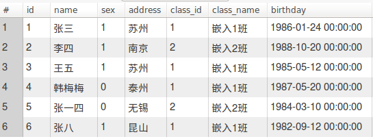

图7-24 内连接查询

**2、外连接查询**

在MySQL查询除了采用求交集计算的内连接查询外，还有采用求并集计算的外链接查询。采用外链接查询的结果中会把所查询的所有数据表中的一张表的内容全部展示，而另（1至N）张表则只显示有相关纪录的内容，而无相关记录的则显示为NULL，如图7-25所示。外连接查询的SQL语法如下：

```sql
SELECT 字段列表 FROM 数据表1 LEFT|RIGHT JOIN 数据表N ON 查询条件
```


图7-25 左、右连接查询

下面以Person数据表和Grade数据表为例讲解相关内容，在Grade数据表中有一个外键字段person_id，该字段依赖于Person数据表中的主键字段id，此时想要获得新的一张易于理解的所有学生成绩数据表，因此需要采用外链接查询的方式，这是因为并不一定每位同学都有成绩，所以如果采用内连接进行查询，那么查询结果极有可能出现学生人数不全的问题，而只有采用外链接查询的方式才能解决该问题，具体SQL语句如下，结果如图7-26所示。

```sql
# 内连接查询
select 
    person.id,
    person.name,
    person.sex,
    person.class_id,
    person.birthday,
    grade.id as grade_id,
    grade.course,
    grade.grade 
from person inner join grade 
on person.id = grade.person_id
order by id asc;

# 左连接查询
select 
    person.id,
    person.name,
    person.sex,
    person.class_id,
    person.birthday,
    grade.id as grade_id,
    grade.course,
    grade.grade 
from person left join grade 
on person.id = grade.person_id
order by id asc;
```

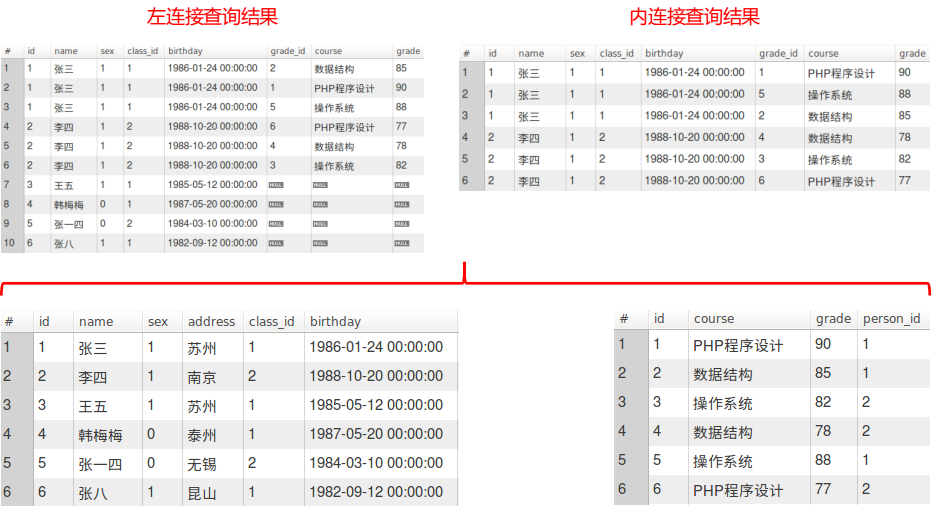

图7-26 左连接查询与内连接查询结果比较

从结果图不难看出，Grade数据表中只涉及到Person数据表中的两位学生，而其他四位学生都没有相关成绩，所以如果使用内连接查询时结果只会展示有交集的两位同学信息，而没有交集的同学信息则不会展示，因此要展示完整的信息就需要使用左连接查询，即能把所有同学信息都查询展出的同时，还把相关同学的成绩也一并展示。右链接查询与左连接查询类似，区别在于采用左连接查询时“LEFT JOIN”关键字左边的数据表会全部显示，右边数据表中无相关的数据就显示NULL，而采用右连接查询时“RIGHT JOIN”关键字右边的数据表会全部显示，左边数据表中无相关的数据就显示NULL。

### 7.3.5 子数据表查询

