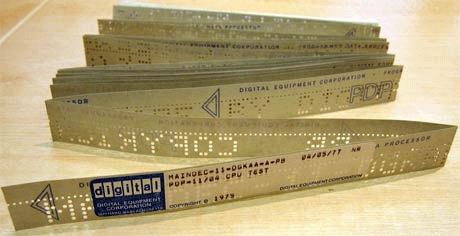

# 第七章 MySQL数据库的设计与查询

古人有云：“路漫漫其修远兮，吾将上下而求索”。这句话形容数据库的学习最为贴切，因为数据库开发的学习和编程语言的学习有着重要的区别，对于编程语言而言，只要软件稍有规模，例如大几千行或者上万行时，就可以通过不断的实验各种先进的编程思想和体系结构对软件系统进行不断的重构，从而使软件更具可读性和可扩展性，但是数据库则不同，在不同的用户环境下，相同的数据库设计可能带来截然不同的结果，例如在只有几十人或上百人使用的系统中，对于目前的数据库系统来说不需要任何的优化就可以实现很好的性能，但是对于上万人或几十万用户的系统来说，如果不对数据库系统进行任何的优化，那么将很难得到想要的性能，从而大幅降低系统的用户体验，而对于向双十一、春运等这类高并发应用来说，除了对现有数据库系统进行优化之外，可能还需要使用如分布式等更高级的数据库技术才能很好的实现用户体验。因此数据库的学习从来都不是一蹴而就，也不是通过看几本书就可以学会的，而是需要在有一定基础的情况下通过长时间的不断实践才能完成。

目前市场上常用的数据库主要包含IBM的DB2、甲骨文的Oracle、微软的SQL Server、加州大学伯克利分校计算机系开发的PostgreSQL，以及被Oracle收购的MySQL，其中DB2、Oracle、SQL Server都是商用软件，需要支付较高的费用，但也提供良好的服务。而PostgreSQL和MySQL都属于开源软件，同时其开源协议决定了这两个数据库软件都可以免费进行商用，虽然从性能上来说PostgreSQL和MySQL都兼顾了高性能和高稳定性，甚至在某些对稳定性要求非常高的应用中（如微信支付），PostgreSQL还略胜一筹，但是由于历史中的诸多巧合，以及MySQL迎合了市场快速开发的需求，因此MySQL成为目前中小型企业系统开发的首选。本章也将以MySQL为出发点，讲述MySQL中的各种常见的使用方法，从帮助读者从整体上了解MySQL的使用方法，为后续的进一步实践搭建良好的基础。

图7-1 MySQL的Logo

#### 本章内容

> * 数据存储的发展和技术构成
> * MySQL的数据类型与数据库、数据表的操作
> * 常用查询语句的使用
> * 数据项的插入、更新、删除，以及函数使用
> * 深入了解触发器和存储过程的使用

## 7.1 数据存储的发展和技术构成

对于普通用户来说，几乎平时接触不到数据库，以及相关概念，但是普通用户却会在电脑中经常保存一些重要的资料或者文档，随着电脑使用的时间越来越长，各种资料和文档也就越来越多，那么此时如果想要查找其中的某一个文档就显得十分困难，一台个人电脑尚且如此，如果是要在几十人或者上百人的人电脑里查找文件，那就像大海捞针一般困难。数据库的出现就是为了解决这个问题，提高数据检索的速度，提高整个系统的运行效率。本节将从应用角度介绍数据存储的发展，以及数据库的必要性，同时介绍构成数据库的几个最重要的技术。

### 7.1.1 数据存储的发展

在计算机出现以前，数据存储主要以文字的方式纪录在各种简单的物理介质中，如纸张、龟壳、竹简等。但是，随着整个社会的不断发展，要存储的数据越来越多，而这些采用传统保存数据保存下来的信息不仅容量有限，而且极易丢失和损坏，显然已经不能应对社会发展的要求。于是在1884年美国统计学家赫尔曼·何乐礼（制表机器公司创始人，IBM前身）根据1725年法国纺织专家巴索·魯修发明的用于保存印染布图案的卡片发明了“打孔卡片制表机”。通过在纸带上打上很小的圆孔来确认数据是0还是1，从而实现了数据的存储。虽然穿孔纸带所能存储的数据与今天相比小了很多，但是对于当时的存储方式已经有了质的飞跃，如图7-2所示。

图7-2 穿孔卡片

到了20世纪50年代，IBM公司第一次把盘式磁带用于数据存储，此时的一盘盘式磁带所携带的信息量是当时打孔卡片的1万倍，大大提高的存储容量。随后就出现了存储容量更大的磁鼓、软盘、硬盘和光盘，这些存储介质所能存储的数据甚至超越了全世界图书馆中存储文献之和。但是，随着信息存储内容的越来越多，数据的管理却越来越不方便，特别是对数据的移植、检索、修改、删除、增加等操作都已经无法靠人力来完成。因此，从20世纪50年代到60年代开始出现了各种数据处理系统，这些各式各样的系统其目的就是在把计算机中所存储的数据进行有机的组织，通过简单的文件名对文件进行检索、存、取操作，再利用存储器读写设备对存储在系统中数据进行修改，如图7-3所示，Linux的文件系统结构。

图7-3 Linux的文件系统结构

当时的文件系统已经和现在文件系统相类似，能够满足基本对数据操作的要求，但是要在这些数据中精确的找出某一个想要的数据还是相当困难。特别是随着计算机CPU的不断发展，其计算速度也在不断提高，相应的对于数据处理速度的要求和处理数据的规模都在不断提高，而此时的文件系统已经不能够满足这一要求。因此，在20世纪60年代后期，由于美国阿波罗计划的运行，需要进行大量航空数据的存储在计算机内部，于是IBM公司就着手开展对于“大型共享数据库的关系模型”的研究，由此出现了数据库（即Database）和关系模型的概念，并且数据库的雏形也逐渐显现，由此诞生了后续影响全世界的MySQL、Oracle等众多优秀的关系型数据库，如图7-4所示。虽然当时的数据库还只是雏形，但是其设计理念已经与文件系统大不相同，它不再针对某一个特定数据或者应用，而是针对所有的数据类型，全面的对各类数据进行组织和整理，使得数据更加具有结构性，从而减少数据的冗余，提高数据的复用性。同时，把后台数据和前台程序进行分离，使得数据库系统能够更加专注于数据的组织和管理，从而提高对数据进行增、删、改、查的效率，而开发人员不需要关心数据如何存储，只需要通过简单接口实现数据的访问即可，从而省去了原先复杂的业务逻辑带来前端应用和后端数据的高耦合性，影响了整个系统的移植性和高效性。

### 7.1.2 数据库范式与技术构成

自数据库诞生以来就伴随着各种技术的发展，不论是数据库的实现方式，还是数据库的应用领域都在变化，但是其中最核心的却是两个部分，一个是建立数据库的规则，即范式，另一个则是建立数据库所需的相关技术，如数据库引擎、SQL、数据库访问技术等。

**1、数据库范式的基本概念**

1970年，由美国著名的科学哲学家托马斯·库恩在其出版的专著《科学革命的结构》中提出了“范式”的概念，这个概念后来运用于多个领域，例如社会科学、计算机科学等。所谓范式，就是指常规科学赖以运作的理论基础和实践规范，是从事某一科学领域的研究者群体所共同遵从的世界观和行为方式，是一种公认的模型或者模式。同年，英国科学家埃德加·弗兰克·科德根据这一概念，提出了关系数据库模型，并对关系数据库的设计进行总结，从而提出了关系型数据库理论的理论基础，以及在设计数据库时必须要遵循的规则，即数据库范式。

目前数据库范式一共有八种，分别是第一范式（1NF）、第二范式（2NF）、第三范式（3NF）、巴斯-科德范式（BCNF）、第五范式（5NF）、DK范式（DKNF）、第六范式（6NF）。通常情况下，使用最多的就是1NF、2NF和3NF，下面对这三种范式进行详细说明。

1、第一范式（1NF）：所谓第一范式就是数据表中的每一个字段都是不可分割的原子。例如数据表中存储了电话字段，并且这个电话包括了公司电话和家庭电话，那么这个数据表就不符合第一范式，需要把电话字段再分为公司电话和家庭电话。需要注意的是，数据库设计只有满足了第一范式才能称为关系型数据库，否则就不能称为关系型数据库。

2、第二范式（2NF）：所谓第二范式，首先必须满足第一范式，然后为每张数据表添加一个主键，同时数据表中每个字段都依赖于主键。例如，对于主键为订单ID的数据表【订单详情】（订单ID，产品ID，单价，折扣，数量，产品名称）来说，虽然产品ID和订单ID共同构成了一个唯一的订单，但是单价，折扣，数量，产品名称等信息并不依赖于订单ID，而是依赖于产品ID。因此，这样的设计就不符合第二范式，而是应该把单价，折扣，数量，产品名称等信息单独列出一张表，通过产品ID作为主键和外键的方式进行关联。

3、第三范式（3NF）：所谓第三范式，首先必须满足第二范式，然后每张表中所有非主键字段都依赖于主键，并且不存在非主键字段依赖于非主键字段的问题。例如，对于主键为订单ID的数据表【订单表】（订单ID，下单日期，客户ID，客户名称，客户地址，客户所在城市）来说，虽然客户ID确实依赖于订单ID，从而实现客户名称、客户地址等信息依赖于订单ID，但是客户名称、客户地址等信息却不是直接依赖于主键订单ID，而是通过客户ID进行依赖传递，这样的数据表就不符合第三范式，而是应该把客户ID、客户名称、客户地址等信息单独拉成一张表，通过把客户ID作为主键和外键的方式进行两张表的关联。

**2、数据库引擎技术**

**3、数据库脚本技术SQL**

SQL是应用于数据库中的编程语言，与面向对象和面向过程的语言相比，这种语言的特点就是结构化。所谓结构化语言，其特点在于通过既定的规则或结构来实现对数据库操作，类似于数学公式的套用。SQL语句最早由IBM公司在上世纪70年代进行研发，用于最早的关系型数据库System R中进行数据的操作。到了80年代，美国国家标准局（ANSI）、国际标准化组织（ISO）先后发布了数据库语言美国标准和国际标准，也标志这SQL正式称为一个通用的数据库操作语言。SQL语句主要包含五个部分，分别是数据查询语句、数据操作语句、事务处理语句、数据定义语句、指针控制语句，具体如下：

1、数据查询语句：通过SELECT、WHERE、ORDER BY、GROUP BY和HAVING这些关键字来实现对数据库中数据的查询。

2、数据操作语句：通过INSERT、UPDATE和DELETE这些关键字来实现对数据库中数据的插入、升级和删除。

3、事务处理语句：通过BEGIN TRANSACTION、COMMIT和ROLLBACK这些关键字来实现对数据库中事件的处理。

4、数据定义语句：通过CREATE和DROP关键字实现数据库中数据表的创建和删除，以及索引等内容的加入。

5、指针控制语句：通过DECLARE CURSOR、FETCH INTO和UPDATE WHERE CURRENT来实现对一个或多个数据表的单独操作。

**4、数据库访问技术**

